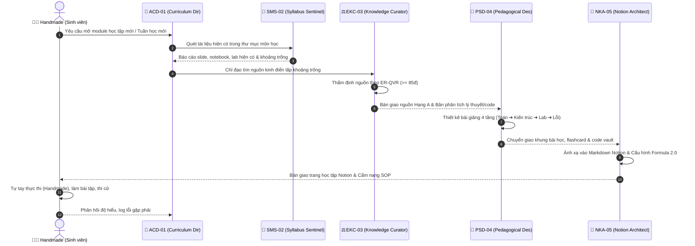

# 📜 GIAO THỨC VẬN HÀNH ĐỘI NGŨ HỌC THUẬT (ACADEMIC OPERATIONS PROTOCOL - AOP)

> **Phạm vi áp dụng:** Áp dụng cho toàn bộ các Trợ lý AI và Vai trò Handmade trong không gian `d:\User\7th\School`.  
> **Kế thừa từ:** Antigravity Agent Protocol (AAP) của PBL6.

---

## 1. MỤC ĐÍCH & Ý NGHĨA

Khi sinh viên bước vào học kỳ 7 với khối lượng kiến thức chuyên ngành đồ sộ (Thị giác máy tính, Học máy nâng cao, Quản trị hạ tầng mạng doanh nghiệp, An toàn mạng chuyên sâu, Tiếng Nhật N3, và Đồ án tốt nghiệp PBL6), sự phân tán tài liệu và thiếu vắng giáo trình thống nhất dễ dẫn đến quá tải và học lệch.

Giao thức này thiết lập một **Hành lang Vận hành Tự động & Chuẩn mực Sư phạm** giúp đội ngũ Agent phối hợp nhịp nhàng, liên tục cập nhật tài liệu và duy trì chất lượng tri thức ở mức cao nhất.

---

## 2. QUY TRÌNH CHUẨN 6 BƯỚC CHO MỖI PHIÊN LÀM VIỆC (SESSION SOP)

Mọi Agent khi được kích hoạt phải tuân thủ quy trình tuần tự:

```
1. PRE-FLIGHT CHECK (STEP-0)
   - Đọc ROLE.md của agent ➔ Xác định rõ giới hạn quyền hạn
   - Kiểm tra tài nguyên phiên làm việc (Context Budget, Token)
   - Kiểm tra tính bất biến của dữ liệu gốc (Raw Data Guard)

2. TƯƠNG TÁC NHIỆM VỤ (TASKS.MD)
   - Quét file TASKS.md của mình ➔ Tìm task chưa hoàn thành có status: [ ]
   - Đối chiếu với lộ trình tổng thể 15 tuần của ACD-01

3. THỰC HIỆN TÁC VỤ KỸ THUẬT & CHẮT LỌC
   - Nếu là săn tìm tài liệu: Áp dụng ER-QVR (100 điểm) để chấm điểm
   - Nếu là thiết kế giáo trình: Tuân thủ cấu trúc 4 tầng sư phạm
   - Nếu là code/lab: Kèm chú thích từng dòng và hướng dẫn tự kiểm chứng

4. KIỂM THỬ & ĐÁNH GIÁ (SANITY CHECK)
   - Chạy thử nghiệm / Kiểm tra cú pháp (Syntax Check)
   - Đối chiếu với chuẩn đầu ra ĐHBK Đà Nẵng (DUT)

5. CẬP NHẬT TRẠNG THÁI
   - Đánh dấu hoàn thành vào TASKS.md (chuyển [ ] ➔ [x])
   - Ghi chú phát hiện mới hoặc rủi ro vào REVIEW.md

6. XUẤT BẢN SESSION HANDOVER CARD
   - Tóm tắt công việc đã làm
   - Cung cấp hành động tiếp theo cho Role Handmade (Sinh viên)
```

---

## 3. MA TRẬN PHỐI HỢP LIÊN VAI TRÒ (COORDINATION MATRIX)



---

## 4. NGUYÊN TẮC BẢO VỆ DỮ LIỆU & AN TOÀN HỆ THỐNG

1. **Không can thiệp vào mã nguồn gốc của sinh viên**: Các notebook do sinh viên tự code hoặc bài tập nộp cho giảng viên không được phép tự ý ghi đè nếu chưa có yêu cầu cụ thể.
2. **Không nạp file rác**: Mọi tài liệu bên ngoài tải về phải được lưu trong thư mục tài liệu tham khảo hoặc trích xuất thành tệp tóm tắt Markdown sạch sẽ.
3. **Tuân thủ chuẩn Markdown GitHub Flavored**: Tất cả đường dẫn tệp phải sử dụng `file:///` scheme chính xác để có thể click trực tiếp trong IDE.
