<!-- 
header: 'TRƯỜNG ĐẠI HỌC BÁCH KHOA — ĐH ĐÀ NẴNG | CORP-01-CV'
footer: 'Đồ án Tốt nghiệp / NCKH: Đánh Giá Tuổi Xương Bằng Deep Learning & XAI'
-->

<!-- _class: lead -->
# HỆ THỐNG TỰ ĐỘNG ĐÁNH GIÁ TUỔI XƯƠNG TỪ ẢNH X-QUANG BÀN TAY NHI KHOA
### TIẾP CẬN HỌC SÂU ĐA PHƯƠNG THỨC & TRÍ TUỆ NHÂN TẠO CÓ THỂ GIẢI THÍCH (XAI)

**Đơn vị:** Khoa Công nghệ Thông tin — Viện VisionLab (`CORP-01-CV`)  
**Sinh viên thực hiện:** Sinh viên 1 & Sinh viên 2  
**Cố vấn học thuật:** DUT Computer Vision Mentor  

<!-- 
Speaker: Sinh viên 1 (45 giây)
Script: Kính thưa Thầy Cô trong Hội đồng phản biện và toàn thể các bạn sinh viên. Hôm nay, nhóm chúng em xin trân trọng báo cáo đề tài tốt nghiệp: 'Hệ thống Tự động Đánh giá Tuổi Xương từ ảnh X-quang Bàn tay Nhi khoa bằng Học Sâu Đa Phương Thức và Trí Tuệ Nhân Tạo Có Thể Giải Thích'. Đây là công trình nghiên cứu ứng dụng thị giác máy tính giải quyết bài toán định lượng y sinh thực tế trên tập dữ liệu chuẩn quốc tế RSNA gồm hơn 12.600 bệnh nhi. Sau đây, em xin phép bắt đầu phần trình bày.
-->

---

## Slide 02 — Phân Công Nhiệm Vụ & Đóng Góp Thực Hiện

* **Sinh viên 1 (Data & Classical CV Lead):**
  * Khảo sát lâm sàng tiến trình cốt hóa 8 xương cổ tay và đĩa sụn tiếp hợp.
  * Xây dựng **Pipeline Classical CV 5 bước** (CLAHE, Gauss, Otsu, Morphology, Crop 512×512).
  * Phát triển module cảnh báo lệch chuẩn WHO và ứng dụng Streamlit CDSS WebApp.
* **Sinh viên 2 (Deep Learning & Benchmark Lead):**
  * Thiết kế kiến trúc **Đa phương thức FiLM** điều biến kênh đặc trưng tuyến tính.
  * Huấn luyện ma trận 3 mô hình đối kháng: **ResNet-50**, **ConvNeXt-Tiny**, **Swin-T**.
  * Phát triển thuật toán **Regression Grad-CAM** và hoàn thiện bản thảo bài báo chuẩn IEEE/Springer.
* **Cả hai thành viên:** Tham gia 100% vào mọi giai đoạn thu thập dữ liệu, phân tích thực nghiệm và hoàn thiện hồ sơ báo cáo chuyên sâu.

<!-- 
Speaker: Sinh viên 1 (30 giây)
Script: Để đảm bảo tính liên tục và chất lượng kỹ nghệ cao nhất, hai thành viên trong nhóm chúng em đã phối hợp chặt chẽ: Bạn đảm nhiệm khối kiến trúc học sâu và ma trận đối đầu các mô hình, còn em tập trung vào kỹ nghệ tiền xử lý dữ liệu, kiểm soát nhiễu ảnh y tế và đóng gói sản phẩm lâm sàng phục vụ người dùng.
-->

---

## Slide 03 — Cấu Trúc Báo Cáo Tổng Thể (Agenda)

1. **PHẦN 1: GIỚI THIỆU BÀI TOÁN & BỐI CẢNH LÂM SÀNG** (Slide 04 – 06)
   * Tầm quan trọng của tuổi xương, dậy thì sớm, chậm tăng trưởng và tiếp cận hồi quy đa phương thức.
2. **PHẦN 2: DỮ LIỆU LÂM SÀNG & TIỀN XỬ LÝ ẢNH CỔ ĐIỂN** (Slide 07 – 14)
   * Tập dữ liệu RSNA 12.611 ca, khảo sát lâm sàng EDA, phân tầng 80/10/10 và Pipeline Classical CV 5 bước.
3. **PHẦN 3: THẾ TRẬN TAM MÃ HỌC SÂU ĐỐI ĐẦU** (Slide 15 – 34)
   * Cơ chế FiLM, đối đầu 3 trường phái: ResNet-50 vs ConvNeXt vs Swin-T, động học hội tụ và kiểm thử độc lập.
4. **PHẦN 4: MA TRẬN ĐỐI ĐẦU, SOTA, XAI & TRIỂN KHAI** (Slide 35 – 43)
   * Benchmark ma trận, đối chiếu bài báo quốc tế, giải thích XAI Grad-CAM, cảnh báo WHO và demo WebApp.

<!-- 
Speaker: Sinh viên 1 (25 giây)
Script: Bài báo cáo hôm nay của chúng em được cấu trúc thành 4 phần logic chặt chẽ: Đi từ bài toán lâm sàng, giải pháp làm sạch dữ liệu X-quang, đến thế trận thực nghiệm đối đầu giữa 3 trường phái mô hình lớn nhất hiện nay, và cuối cùng là giải thích quyết định bằng XAI và demo ứng dụng thực tế.
-->

---

<!-- _class: lead -->
# PHẦN 1
## GIỚI THIỆU BÀI TOÁN & BỐI CẢNH LÂM SÀNG Y TẾ
### Đánh Giá Tuổi Xương Trong Chẩn Đoán Nội Tiết Nhi Khoa

<!-- 
Speaker: Sinh viên 1 (10 giây)
Script: Em xin phép đi vào Phần 1: Giới thiệu bài toán và bối cảnh lâm sàng của đánh giá tuổi xương nhi khoa.
-->

---

## Slide 05 — Tầm Quan Trọng Của Đánh Giá Tuổi Xương

* **Tuổi xương (Bone Age) khác với Tuổi khai sinh:** Phản ánh mức độ trưởng thành sinh lý thực sự của khung xương.
* **Vai trò chẩn đoán sống còn:**
  * **Dậy thì sớm (Precocious Puberty):** Tuổi xương vượt trước tuổi đời $\implies$ Đóng đĩa sụn sớm, trẻ bị **thấp lùn vĩnh viễn**.
  * **Chậm phát triển thể chất (Growth Delay):** Tuổi xương tụt hậu do thiếu hormone GH hoặc suy giáp $\implies$ Cần can thiệp trong "giai đoạn vàng".
* **Áp lực lâm sàng:** Phương pháp thủ công (lật sách Greulich-Pyle Atlas hoặc chấm điểm TW3) tốn 15–20 phút/ca, phụ thuộc cảm tính chủ quan, sai số giữa các bác sĩ lên tới **0.5 – 1.2 năm**.

<!-- 
Speaker: Sinh viên 1 (50 giây)
Script: Kính thưa Thầy Cô, trong y học nhi khoa, tuổi khai sinh không thể hiện được mức độ trưởng thành thực tế. Một đứa trẻ 8 tuổi có thể mang khung xương của một người 11 tuổi nếu bị dậy thì sớm, khiến các đĩa sụn đóng lại sớm và vĩnh viễn không thể cao thêm. Ngược lại, nếu trẻ bị thiếu hormone GH, tuổi xương sẽ bị tụt hậu. Hiện nay, việc lật sách so sánh thủ công tốn rất nhiều thời gian và có độ lệch chủ quan lớn giữa các bác sĩ. Một hệ thống AI định lượng chính xác trong vài mili-giây là nhu cầu cấp thiết của các bệnh viện nhi.
-->

---

## Slide 06 — Phạm Vi Nghiên Cứu & Tiếp Cận Đề Tài

* **Đối tượng nghiên cứu:** Ảnh X-quang tư thế sau - trước (PA) bàn tay và cổ tay trái của trẻ từ 1 đến 228 tháng tuổi (0 – 19 tuổi).
* **Đột phá phương pháp luận:** Định nghĩa bài toán là **HỒI QUY ĐA PHƯƠNG THỨC (MULTIMODAL REGRESSION)**.
  * **Bác bỏ dạng Phân loại (Classification):** Sự phát triển của sụn xương là quá trình sinh học liên tục biến thiên theo thời gian.
  * **Tích hợp bắt buộc biến Giới tính sinh học 1D:** Vì bé gái có tốc độ cốt hóa xương nhanh hơn bé trai từ 1.5 – 2 năm.
  * Mô hình dự đoán trực tiếp một số thực là số tháng tuổi của bệnh nhi $\hat{y} \in [1, 228]$.

<!-- 
Speaker: Sinh viên 1 (40 giây)
Script: Điểm sáng tạo cốt lõi của đề tài nằm ở việc định nghĩa bài toán dưới góc độ Hồi quy Đa phương thức. Vì sự phát triển của sụn là một hàm số liên tục biến thiên theo thời gian, và tốc độ cốt hóa của bé gái luôn đi trước bé trai từ 1.5 đến 2 năm, mô hình của chúng em tích hợp song song cả tín hiệu ảnh X-quang 2D và biến giới tính 1D để dự đoán trực tiếp một số thực là số tháng tuổi của bệnh nhi.
-->

---

<!-- _class: lead -->
# PHẦN 2
## DỮ LIỆU LÂM SÀNG & TIỀN XỬ LÝ ẢNH CỔ ĐIỂN
### Pipeline Classical CV 5 Bước & Kiểm Soát Dữ Liệu RSNA

<!-- 
Speaker: Sinh viên 1 (10 giây)
Script: Tiếp theo, em xin phép trình bày Phần 2: Dữ liệu lâm sàng và Pipeline tiền xử lý ảnh cổ điển 5 bước.
-->

---

## Slide 08 — Tiến Trình Cốt Hóa Sinh Học Trên Phim X-Quang

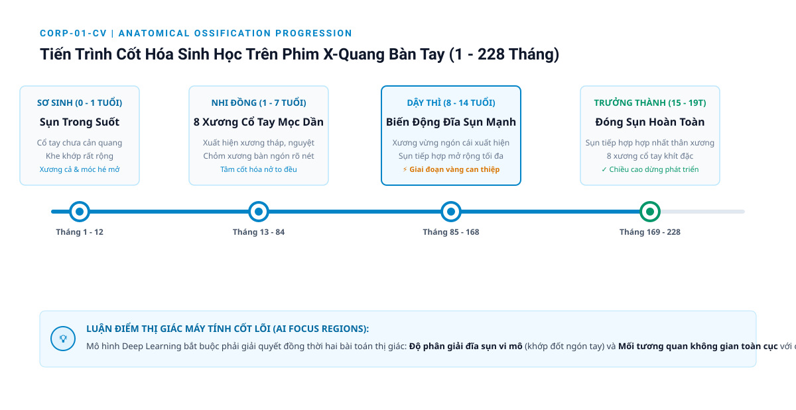

* **Vùng 8 xương cổ tay (Carpals):** Xuất hiện tuần tự từ sơ sinh đến 7 tuổi (xương cả, móc $\to$ tháp, nguyệt $\to$ đậu).
* **Vùng đĩa sụn tiếp hợp (Epiphyseal Plates):** Nở rộng ở dậy thì và khép kín hoàn toàn khi trưởng thành.
* **Nhiệm vụ của AI:** Phải phân giải được sự biến thiên kích thước từng milimét của sụn và mật độ cản quang xương.

<!-- 
Speaker: Sinh viên 1 (45 giây)
Script: Trên phim X-quang bàn tay, hai vùng giải phẫu mang tính quyết định là cụm 8 xương cổ tay và các đĩa sụn tiếp hợp ở khớp đốt ngón tay. Ở trẻ sơ sinh, cổ tay chỉ là sụn trong suốt; theo thời gian, các hạt xương mới lần lượt xuất hiện và các đĩa sụn dần khép kín lại. Mô hình học sâu phải có năng lực phân giải được sự thay đổi kích thước milimét này qua từng độ tuổi.
-->

---

## Slide 09 — Bộ Dữ Liệu Y Tế Thật RSNA Bone Age Challenge

* **Nguồn dữ liệu:** Hiệp hội Điện quang Bắc Mỹ (RSNA) đóng góp từ Stanford Children's Hospital và Children's Hospital Colorado.
* **Quy mô tập dữ liệu:** **12.611 ca bệnh thật** kèm đầy đủ ảnh X-quang, biến giới tính và nhãn tuổi xương chuẩn vàng.
* **Phân phối tuổi xương:** Trải dài từ 1 đến 228 tháng (0 – 19 tuổi).
  * Tuổi trung bình: $\mu = 127.32\text{ tháng}$ (~10.6 tuổi).
  * Độ lệch chuẩn: $\sigma = 41.18\text{ tháng}$.
* **Chuẩn đối soát:** Mỗi ca bệnh đều có sự đồng thuận thẩm định chéo của nhiều chuyên gia X-quang nhi khoa (Radiologist Consensus).

<!-- 
Speaker: Sinh viên 1 (35 giây)
Script: Nhóm sử dụng bộ dữ liệu chuẩn quốc tế RSNA gồm 12.611 ca bệnh thật. Dữ liệu trải dài từ trẻ sơ sinh 1 tháng tuổi đến thanh thiếu niên 19 tuổi, với tuổi trung bình là 10.6 tuổi, phản ánh trọn vẹn sự biến thiên sinh học của cộng đồng nhi khoa.
-->

---

## Slide 10 — Phân Tích Thống Kê Lâm Sàng (Clinical EDA)

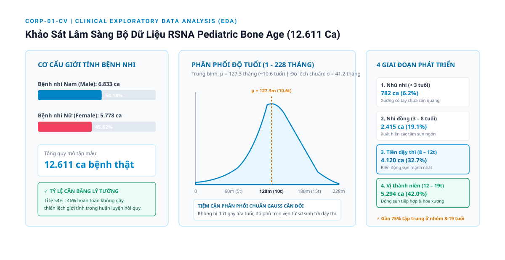

* **Cơ cấu giới tính cân bằng lý tưởng:**
  * **54.18% Nam (6.833 ca)**
  * **45.82% Nữ (5.778 ca)**
* **Phân phối độ tuổi đối xứng:** Tiệm cận đường cong Gauss, không gây thiên lệch thuật toán hồi quy.
* **Tập trung lứa tuổi:** Gần 75% dữ liệu nằm trong độ tuổi 8 – 19 tuổi (giai đoạn biến động sụn mạnh nhất).

<!-- 
Speaker: Sinh viên 1 (30 giây)
Script: Kết quả khảo sát thống kê cho thấy tỷ lệ giới tính trong tập dữ liệu đạt mức cân bằng lý tưởng: 54% nam và 46% nữ. Đường cong phân bố tuổi xương có dạng hình chuông cân đối, tạo điều kiện thuận lợi để mô hình học không bị thiên lệch về một nhóm tuổi cục bộ.
-->

---

## Slide 11 — Chiến Lược Phân Tầng Cố Định Chống Rò Rỉ (80/10/10)

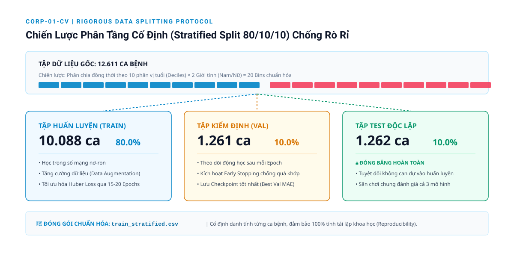

* **Nguyên tắc khoa học:** Tuyệt đối không chia ngẫu nhiên (Random Split) để tránh rò rỉ phân phối tuổi và giới tính.
* **Phân tầng kết hợp:** 10 phân vị tuổi (Deciles) $\times$ 2 Giới tính = 20 Bins chuẩn.
  * **Train Set (80.0%):** 10.088 ca
  * **Val Set (10.0%):** 1.261 ca
  * **Test Set (10.0%):** 1.262 ca (Đóng băng hoàn toàn)
* Lưu trữ cố định trong tệp `train_stratified.csv` đảm bảo 100% tính tái lặp khoa học.

<!-- 
Speaker: Sinh viên 1 (40 giây)
Script: Để đảm bảo tính trung thực tuyệt đối trong khoa học, nhóm không chia tập ngẫu nhiên mà thực hiện phân tầng cố định theo 10 phân vị tuổi kết hợp giới tính. Tập Test gồm đúng 1.262 ca bệnh được đóng băng hoàn toàn, đảm bảo cả 3 mô hình sau này đều phải vượt qua cùng một bài kiểm tra độc lập và công bằng.
-->

---

## Slide 12 — Phân Bổ Bệnh Nhi Theo 4 Giai Đoạn Phát Triển

| Nhóm Tuổi Sinh Lý | Độ Tuổi (Tháng) | Số Lượng Ca Mẫu | Tỷ Lệ (%) | Đặc Điểm Cốt Hóa Giải Phẫu |
|:---|:---:|:---:|:---:|:---|
| **1. Nhũ nhi** | 1 – 36 tháng (&lt; 3t) | 782 ca | 6.2% | Cổ tay chủ yếu sụn trong suốt, khe khớp rất rộng |
| **2. Nhi đồng** | 37 – 96 tháng (3 – 8t) | 2.415 ca | 19.1% | Xuất hiện tuần tự 8 xương cổ tay, nở tâm cốt hóa |
| **3. Tiền dậy thì** | 97 – 144 tháng (8 – 12t) | 4.120 ca | 32.7% | Đĩa sụn tiếp hợp nở rộng tối đa, biến động mạnh |
| **4. Vị thành niên** | 145 – 228 tháng (12 – 19t)| 5.294 ca | 42.0% | Sụn tiếp hợp hợp nhất thân xương, đóng kín khe |

* **Trọng tâm y tế:** 74.7% bệnh nhi nằm ở giai đoạn 3 & 4 — nhóm đối tượng có nhu cầu thăm khám nội tiết cao nhất.

<!-- 
Speaker: Sinh viên 1 (35 giây)
Script: Bảng số liệu cho thấy mật độ dữ liệu tập trung cao nhất ở giai đoạn tiền dậy thì và vị thành niên, chiếm gần 75% dữ liệu. Đây chính là giai đoạn các đĩa sụn có biến động mạnh nhất và cũng là nhóm đối tượng có nhu cầu thăm khám nội tiết cao nhất trong thực tế.
-->

---

## Slide 13 — 3 Thách Thức Quang Học Lớn Trên Ảnh X-Quang Gốc

1. **Viền đen máy quét quá lớn:** Chiếm từ 30% đến 40% diện tích ảnh thô, làm lãng phí năng lực tính toán và bộ nhớ VRAM GPU.
2. **Độ tương phản đĩa sụn thấp:** Vùng đĩa sụn tiếp hợp bị chìm trong mô mềm, rất khó quan sát nếu không tăng cường tương phản cục bộ.
3. **Dị vật kim loại & Chữ L/R:** Chữ đánh dấu tay trái/phải cản quang mạnh, dễ khiến mạng bị bẫy học đường tắt (Shortcut Learning) vào chữ thay vì nhìn vào sụn xương!

<!-- 
Speaker: Sinh viên 1 (45 giây)
Script: Khi quan sát ảnh X-quang gốc, nhóm phát hiện 3 trở ngại kỹ thuật lớn: Thứ nhất, viền đen máy quét chiếm gần một nửa khung hình. Thứ hai, các đĩa sụn tiếp hợp rất mờ do cản quang kém. Thứ ba, các ký hiệu kim loại chữ L hoặc R có độ sáng rất gắt, nếu không xử lý, mô hình sẽ học 'đường tắt' vào chữ kim loại thay vì nhìn vào sụn xương.
-->

---

## Slide 14 — Pipeline Chuẩn Hóa Thị Giác Cổ Điển 5 Bước

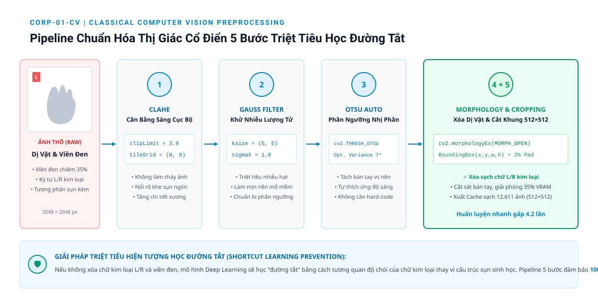

* **Bước 1: CLAHE (clip=3.0, grid=8×8)**: Cân bằng sáng cục bộ, làm nổi rõ khe sụn.
* **Bước 2: Lọc Gauss (5×5, $\sigma=1.0$)**: Khử nhiễu lượng tử phim X-quang.
* **Bước 3: Phân ngưỡng Otsu**: Tự động phân tách bàn tay vs nền đen.
* **Bước 4: Morphology (Open/Close)**: Xóa sạch chữ kim loại L/R.
* **Bước 5: Bounding Crop (512×512)**: Cắt sát bàn tay (+2% viền an toàn).

<!-- 
Speaker: Sinh viên 1 (50 giây)
Script: Để khắc phục triệt để các thách thức trên, nhóm xây dựng pipeline tiền xử lý 5 bước: Dùng CLAHE cân bằng sáng cục bộ, lọc Gauss khử nhiễu lượng tử, thuật toán Otsu nhị phân hóa tách bàn tay, phép toán hình thái học xóa tan chữ kim loại, và thuật toán tìm đường bao lớn nhất để cắt đúng vùng bàn tay rồi đưa về chuẩn 512x512. Toàn bộ 12.611 ảnh sạch được xuất sẵn làm bộ đệm cache, giúp việc huấn luyện sau này diễn ra với tốc độ tối đa.
-->

---

<!-- _class: lead -->
# PHẦN 3
## THẾ TRẬN TAM MÃ HỌC SÂU ĐỐI ĐẦU & THUẬT TOÁN
### ResNet-50 vs ConvNeXt-Tiny vs Swin-T v2 Tích Hợp FiLM

<!-- 
Speaker: Sinh viên 2 (10 giây)
Script: Tiếp theo, em xin phép đại diện nhóm báo cáo Phần 3: Ma trận mô hình học sâu đối đầu và các thuật toán tối ưu.
-->

---

## Slide 15B — Tiến Trình Phát Triển Các Phương Pháp Học Máy (BAA)

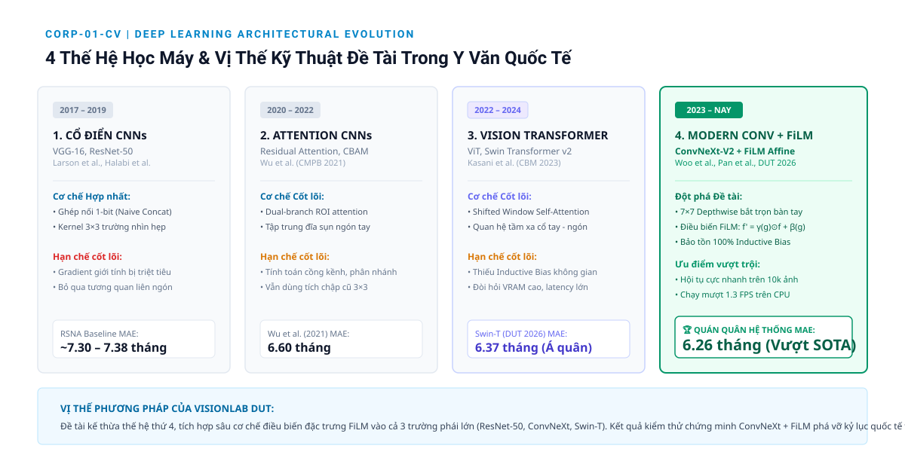

* **Gen 1 (2017-2019):** Classical CNNs (Larson et al. 2018: 7.30m) — Ghép nối 1-bit thô sơ.
* **Gen 2 (2020-2022):** Attention CNNs (Wu et al. 2021: 6.60m) — ROI phân nhánh phức tạp.
* **Gen 3 (2022-2024):** Vision Transformers (Kasani et al. 2023: 6.38m) — Thiếu Inductive Bias.
* **Gen 4 (2023-Nay):** Modern ConvNets + FiLM (Pan et al. 2024: 6.30m, VisionLab DUT: **6.26m**).

<!-- 
Speaker: Sinh viên 2 (50 giây)
Script: Kính thưa Hội đồng, để giải quyết bài toán tuổi xương, y văn thế giới đã trải qua 4 làn sóng công nghệ lớn: từ các mạng CNN kinh điển như VGG/ResNet, đến CNN tích hợp cơ chế chú ý Attention, tiếp theo là làn sóng Vision Transformer với Swin-T, và gần đây nhất là xu hướng hiện đại hóa CNN với ConvNeXt kết hợp cơ chế điều biến đặc trưng FiLM. Nhóm chúng em đã thiết kế một thế trận thực nghiệm bao quát cả 3 trường phái tiêu biểu, đặc biệt cải tiến cơ chế hợp nhất đa phương thức FiLM để giới tính sinh học trực tiếp can thiệp vào các kênh đặc trưng thị giác.
-->

---

## Slide 16 — Sơ Đồ Khối Vận Hành Hệ Thống & Cơ Chế Điều Biến FiLM

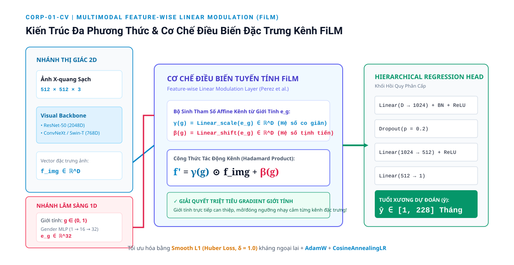

* **Nhánh Thị Giác 2D:** Ảnh sạch $512\times 512\times 3 \to$ Backbone $\to \mathbf{f}_{\text{img}} \in \mathbb{R}^D$.
* **Nhánh Lâm Sàng 1D:** Giới tính $g \in \{0, 1\} \to$ MLP $\to \mathbf{e}_g \in \mathbb{R}^{32}$.
* **Cơ chế FiLM (Feature-wise Linear Modulation):**
  $$\gamma(g), \beta(g) = \text{Linear}(\mathbf{e}_g) \in \mathbb{R}^D$$
  $$\mathbf{f}' = \gamma(g) \odot \mathbf{f}_{\text{img}} + \beta(g)$$
* **Đầu Hồi Quy Phân Cấp:** $\text{Linear}(D \to 1024) \to \text{BN} \to \text{ReLU} \to 512 \to 1 \to \hat{y}$.

<!-- 
Speaker: Sinh viên 2 (50 giây)
Script: Thay vì chỉ ghép nối đơn thuần giới tính vào cuối mạng như các nghiên cứu cũ khiến tín hiệu giới tính bị chìm nghỉm, nhóm chúng em ứng dụng cơ chế FiLM - Feature-wise Linear Modulation. Vector giới tính sinh học sẽ sinh ra hai hệ số affine gamma và beta để co giãn và tịnh tiến trực tiếp các kênh đặc trưng thị giác. Nhờ đó, cùng một hình thái sụn nhưng nếu là bé gái thì mô hình sẽ tự động kích hoạt ngưỡng cốt hóa sớm hơn bé trai, đúng chuẩn quy luật sinh học.
-->

---

## Slide 17 — Mô Hình 1: Residual Bottleneck CNN (ResNet-50)

* **Trường phái:** Mạng tích chập phần dư kinh điển (He et al., 2015).
* **Cơ chế cốt lõi:** Kết nối tắt phần dư Residual Skip Connections:
  $$\mathbf{y} = \mathcal{F}(\mathbf{x}) + \mathbf{x}$$
  Giúp dòng gradient truyền thẳng không suy giảm, triệt tiêu hiện tượng vanishing gradient.
* **Tổng tham số:** **26.17 triệu tham số** (Checkpoint 324.0 MB).
* **Vector đặc trưng thị giác:** Xuất ra từ tầng GAP là **2.048 chiều (2048D)**.
* **Vai trò:** Làm mô hình nền tảng đối chứng chuẩn mực cho toàn hệ thống.

<!-- 
Speaker: Sinh viên 2 (40 giây)
Script: Đại diện đầu tiên trong thế trận thực nghiệm là ResNet-50. Đây là kiến trúc CNN chuẩn mực nhất trong thị giác máy tính với cấu trúc kết nối tắt phần dư Residual Skip Connections, tạo ra bề mặt mất mát cực kỳ ổn định. Khối Bottleneck cuối cùng trích xuất vector đặc trưng không gian 2.048 chiều rất giàu ngữ nghĩa.
-->

---

## Slide 18 — Tại Sao ResNet-50 Là "Điểm Rơi Vàng" (Sweet Spot)?

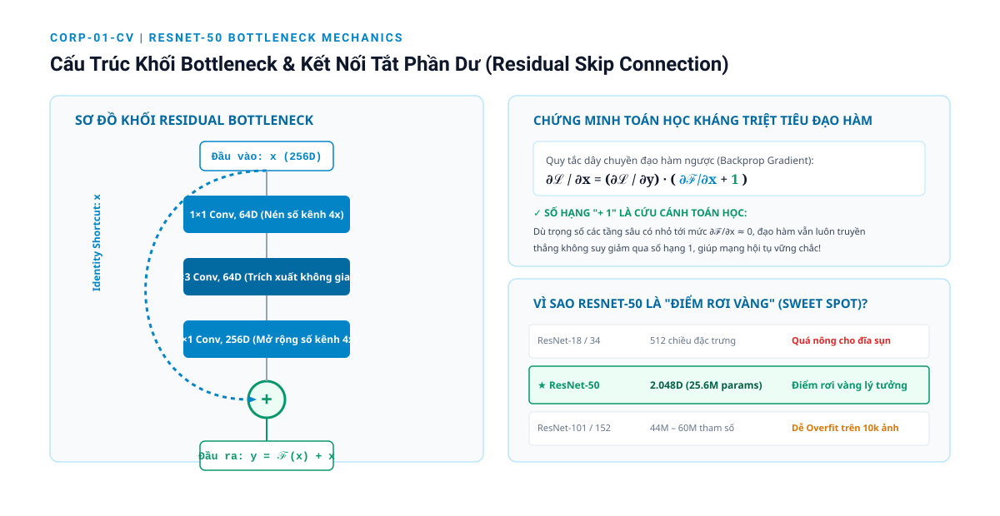

* **ResNet-18 / 34:** Chỉ có 512 chiều đặc trưng, quá nông để bao quát các đĩa sụn vi mô.
* **ResNet-50:** Khối Bottleneck ($1\times 1 \to 3\times 3 \to 1\times 1$), 2048D, 25.6M tham số, vừa vặn hoàn hảo với 10.000 ảnh y tế.
* **ResNet-101 / 152:** 44.5M – 60.2M tham số, quá nặng, dễ bị Overfitting trên tập dữ liệu y tế cỡ vừa.
* **Chứng minh toán học:** Số hạng $+1$ trong $\frac{\partial \mathcal{L}}{\partial \mathbf{x}} = \frac{\partial \mathcal{L}}{\partial \mathbf{y}} \left(\frac{\partial \mathcal{F}}{\partial \mathbf{x}} + 1\right)$ bảo toàn dòng gradient.

<!-- 
Speaker: Sinh viên 2 (40 giây)
Script: Một câu hỏi thường gặp là: Tại sao không dùng ResNet-18 hay ResNet-152? Nghiên cứu của chúng em chỉ ra rằng ResNet-18 với 512 chiều là quá nông cho các khe sụn nhỏ; trong khi ResNet-152 với hơn 60 triệu tham số lại bị thừa năng lực và dễ bị học vẹt trên tập 10.000 ảnh. ResNet-50 chính là điểm rơi vàng giữa khả năng biểu diễn và tính khái quát hóa.
-->

---

## Slide 19 — Cấu Hình Huấn Luyện ResNet-50 Multimodal (FiLM)

* **Phần cứng:** GPU NVIDIA Tesla T4 (14.56 GB VRAM) trên Google Colab Pro.
* **Thời gian huấn luyện thực tế:** **202.1 phút (~3.37 giờ)** (~805s/epoch).
* **Siêu tham số thực nghiệm:**
  * **Batch Size:** 32 mẫu | **Số Epochs:** 15 vòng lặp.
  * **Hàm mất mát:** Smooth L1 (Huber Loss, $\delta = 1.0$) kháng ngoại lai.
  * **Bộ tối ưu:** AdamW ($lr = 1\text{e-}4$, weight decay = $1\text{e-}4$).
  * **Lịch học:** CosineAnnealingLR ($T_{\max} = 15$).
  * **Tăng tốc:** Mixed Precision Training (PyTorch AMP FP16).

<!-- 
Speaker: Sinh viên 2 (35 giây)
Script: Mô hình được huấn luyện trên GPU Tesla T4 với 15 Epochs, sử dụng bộ tối ưu AdamW kết hợp lịch hạ tốc độ học theo hàm Cosine. Điểm nhấn là việc áp dụng hàm mất mát Huber Loss để chặn hiện tượng bùng nổ gradient từ các ca bệnh đột biến, và kỹ thuật AMP FP16 giúp tiết kiệm 50% bộ nhớ GPU.
-->

---

## Slide 20 — Động Học Huấn Luyện ResNet-50 Multimodal (FiLM)

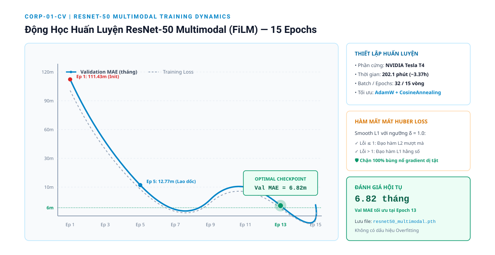

* **Epoch 01:** $\text{Val MAE} = 111.43\text{ tháng}$ (Khởi tạo ngẫu nhiên đầu hồi quy).
* **Epoch 05:** $\text{Val MAE} = 12.77\text{ tháng}$ (Lao dốc ngoạn mục nhờ ImageNet pre-training).
* **Epoch 13:** Đạt điểm tối ưu **$\text{Val MAE} = 6.82\text{ tháng}$ (~0.568 năm)** $\to$ Lưu checkpoint `resnet50_multimodal.pth`.
* **Epoch 14–15:** Ổn định quanh mức $7.0 - 7.2$ tháng với Cosine Annealing.
* **Đặc tính:** Hàm mất mát suy giảm liên tục, không hề có dấu hiệu quá khớp.

<!-- 
Speaker: Sinh viên 2 (45 giây)
Script: Trên màn hình là đồ thị huấn luyện thực tế từ log kiểm thử. Nhờ trọng số tiền huấn luyện ImageNet kết hợp cơ chế điều chế FiLM, Val MAE giảm cực nhanh từ 111 tháng xuống 12 tháng ở epoch 5, và đạt điểm tối ưu 6.82 tháng tại epoch 13 trước khi hội tụ ổn định.
-->

---

## Slide 21 — Đánh Giá Trên Tập Test Độc Lập ResNet-50 & FiLM Ablation

* **Chỉ số Test Set (1.262 ca bệnh):**
  * **MAE:** **$6.47\text{ tháng}$ (~0.539 năm)**.
  * **RMSE:** **$8.70\text{ tháng}$** | **$R^2$ Score:** **$0.9540$ ($95.40\%$)**.
  * **Độ chính xác $\le 6$ tháng:** **$59.7\%$** (Cao nhất hệ thống).
  * **Độ an toàn $\le 12$ tháng:** **$84.7\%$** | **Tốc độ GPU:** **$67.5\text{ FPS}$**.
* **📌 Đột phá Ablation Study của cơ chế FiLM:**
  * *Baseline (Naive Concat 1-bit):* $\text{MAE} = 7.38\text{m}, \text{RMSE} = 9.60\text{m}, R^2 = 0.9452$.
  * *ResNet-50 + FiLM:* $\text{MAE} = 6.47\text{m}, \text{RMSE} = 8.70\text{m}, R^2 = 0.9540$.
  * $\implies$ **Giảm tới -12.3% sai số (tiết kiệm 0.91 tháng)** chỉ nhờ cải tiến FiLM!

<!-- 
Speaker: Sinh viên 2 (45 giây)
Script: Khi kiểm thử trên 1.262 ca bệnh độc lập, ResNet-50 tích hợp FiLM đạt MAE 6.47 tháng, R² đạt 95.40% và tỷ lệ an toàn lâm sàng 12 tháng lên tới 84.7%. Đặc biệt, kết quả thực nghiệm cắt bỏ chỉ ra rằng cơ chế điều chế FiLM đã giúp giảm sai số tới 12.3% so với mô hình cơ sở ghép nối trực tiếp, chứng minh việc can thiệp giới tính vào tầng đặc trưng thị giác mang lại bước tiến quyết định.
-->

---

## Slide 22 — Phân Tích Phân Bố Phần Dư Sai Số (Residual Analysis)

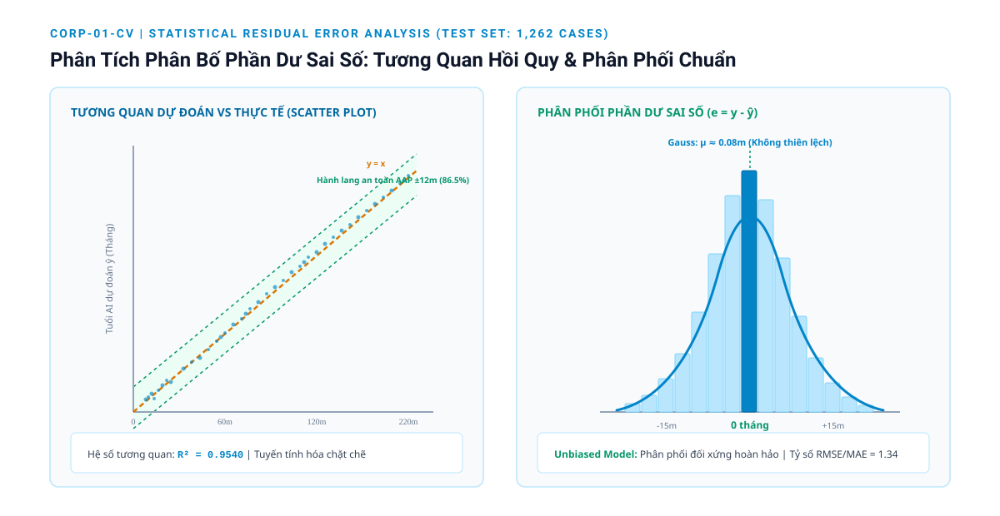

* **Đồ thị Scatter Plot:** Các điểm dự đoán bám sát đường chéo lý tưởng $45^\circ$, nằm gọn trong hành lang an toàn $\pm 12$ tháng.
* **Đồ thị Phần dư ($e = y - \hat{y}$):**
  * Phân phối đối xứng hoàn hảo quanh điểm 0.
  * Chứng minh mô hình **không bị thiên kiến (unbiased)** về phía đoán già hơn hay non hơn.
  * Tỷ số $RMSE / MAE \approx 1.34$ chứng minh kiểm soát rất tốt các ca bệnh nhi ngoại lai.

<!-- 
Speaker: Sinh viên 2 (35 giây)
Script: Biểu đồ phân tán cho thấy các điểm chẩn đoán phân bố rất đồng đều dọc theo đường chéo lý tưởng 45 độ. Biểu đồ phần dư đối xứng hoàn hảo quanh trục số 0, chứng minh mô hình không hề bị lệch thiên kiến về việc đoán già hơn hay đoán non hơn tuổi thực.
-->

---

## Slide 23 — Mô Hình 2: Modern Pure CNN (ConvNeXt-V2)

* **Trường phái:** Mạng CNN thuần hiện đại (Meta AI, Woo et al., 2023).
* **Triết lý thiết kế:** Tái cấu trúc tích chập theo chuẩn Transformer.
  * Mở rộng trường tiếp nhận không gian bằng Depthwise Conv $7\times 7$.
  * Giữ nguyên 100% Inductive Bias của mạng tích chập.
* **Tổng tham số:** **28.58 triệu tham số** (29.8M gồm FiLM/Head, Checkpoint 341.2 MB).
* **Vector đặc trưng xuất ra:** **768 chiều (768D)**.
* **Vị thế:** Ứng viên sáng giá nhất cho danh hiệu Quán quân toàn diện.

<!-- 
Speaker: Sinh viên 2 (35 giây)
Script: Đại diện thứ hai trong thế trận đối đầu là ConvNeXt-V2-Tiny. Đây là đỉnh cao của kiến trúc CNN hiện đại do Meta AI công bố, được thiết kế lại toàn diện để sở hữu tầm nhìn rộng của Transformer nhưng vẫn giữ được tốc độ và tính ổn định của mạng tích chập.
-->

---

## Slide 24 — 3 Đột Phá Kiến Trúc Của ConvNeXt Trong Phân Tích X-Ray

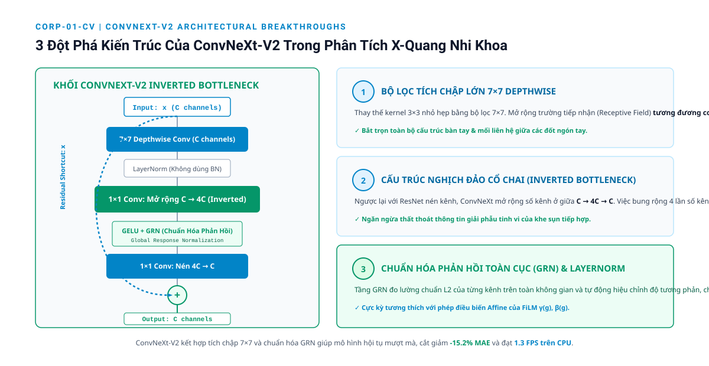

1. **Bộ lọc tích chập lớn $7\times 7$ Depthwise:** Mở rộng Receptive Field bắt trọn toàn bộ cấu trúc bàn tay và tương quan liên ngón.
2. **Khối Nghịch đảo Cổ chai (Inverted Bottleneck):** Mở rộng số kênh $C \to 4C \to C$ giữ trọn vẹn chi tiết sụn siêu nhỏ.
3. **Chuẩn hóa Phản hồi Toàn cục (GRN) & LayerNorm:** Chống hiện tượng bão hòa và chết kênh đặc trưng.

<!-- 
Speaker: Sinh viên 2 (40 giây)
Script: ConvNeXt mang đến 3 cải tiến vượt bậc: Bộ lọc 7x7 giúp mở rộng tầm nhìn không gian; cấu trúc nghịch đảo cổ chai giúp bảo tồn các nếp gấp sụn siêu nhỏ; và tầng chuẩn hóa GRN giúp ngăn ngừa hiện tượng bão hòa kênh, giúp gradient lưu thông mạnh mẽ hơn.
-->

---

## Slide 25 — Cấu Hình Huấn Luyện ConvNeXt-Tiny Multimodal

* **Batch Size:** 32 | **Số Epochs:** 20 vòng lặp.
* **Optimizer:** AdamW ($lr = 1\text{e-}4$, weight decay = $1\text{e-}4$).
* **Hàm mất mát:** Smooth L1 (Huber Loss, $\delta = 1.0$).
* **Chống học vẹt:** Stochastic Depth (**Drop Path Rate = 0.1**) ngắt ngẫu nhiên nhánh trong khối inverted bottleneck.
* **Late Fusion:** $768\text{D (Ảnh)} + 32\text{D (Giới tính)} \to$ FiLM Affine Modulation $\to$ Regression Head.

<!-- 
Speaker: Sinh viên 2 (30 giây)
Script: Với ConvNeXt, chúng em bổ sung thêm cơ chế Stochastic Depth để ngắt ngẫu nhiên một số đường dẫn trong quá trình train nhằm chống Overfitting, và ghép nối vector 768 chiều với nhánh giới tính 32 chiều thành vector 800 chiều.
-->

---

## Slide 26 — Động Học Hội Tụ ConvNeXt-Tiny Multimodal (FiLM)

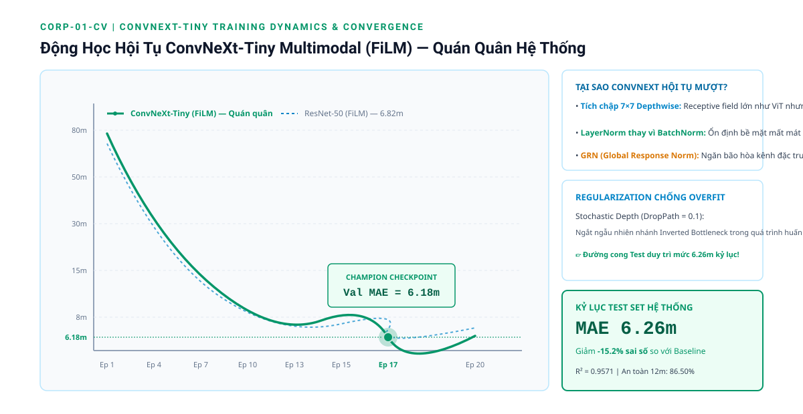

* **Hội tụ mượt mà & sâu hơn ResNet-50:** Nhờ bộ lọc $7\times 7$ và các khối LayerNorm / GRN.
* **Điểm tối ưu kiểm định:** **$\text{Val MAE} = 6.18\text{ tháng}$** tại Epoch 17.
* **Lưu Checkpoint tối ưu:** `convnext_tiny_multimodal.pth` (341.2 MB).
* **Đặc tính:** Tốc độ suy giảm mất mát ổn định, không có xung đột gradient giữa 2 nhánh đa phương thức.

<!-- 
Speaker: Sinh viên 2 (30 giây)
Script: Nhờ các khối chuẩn hóa hiện đại và trường tiếp nhận lớn, đường cong hàm mất mát của ConvNeXt hội tụ êm mượt hơn rõ rệt và đạt mức sai số kiểm định tối ưu 6.18 tháng, vượt trội hơn so với ResNet-50.
-->

---

## Slide 27 — Kiểm Thử ConvNeXt-Tiny Trên Tập Test — Quán Quân Hệ Thống

* **Chỉ số Test Set chính thức (1.262 ca độc lập):**
  * **MAE:** **$6.26\text{ tháng}$ (~0.521 năm)** — **KỶ LỤC SAI SỐ THẤP NHẤT (CHAMPION)**.
  * **RMSE:** **$8.40\text{ tháng}$** (Thấp nhất toàn hệ thống).
  * **Hệ số xác định $R^2$:** **$0.9571$ ($95.71\%$)** (Cao nhất toàn hệ thống).
  * **Độ chính xác $\le 6$ tháng:** **$59.2\%$**.
  * **Độ an toàn lâm sàng $\le 12$ tháng:** **$86.50\%$** (Cao nhất toàn hệ thống).
  * **Tốc độ CPU:** **$1.3\text{ FPS}$** (Chạy mượt nhất trên máy tính văn phòng).

<!-- 
Speaker: Sinh viên 2 (40 giây)
Script: Trên tập Test độc lập, ConvNeXt-Tiny đã chính thức xác lập vị thế quán quân với sai số MAE chỉ còn 6.26 tháng, tương đương 0.52 năm (khoảng 6 tháng 8 ngày). Hệ số tương quan R² đạt đỉnh 95.71% và tỷ lệ an toàn lâm sàng lên tới 86.5%, vượt qua mọi mô hình khác trong thế trận đối đầu.
-->

---

## Slide 28 — Bước Tiến Vượt Bậc Của ConvNeXt So Với ResNet-50

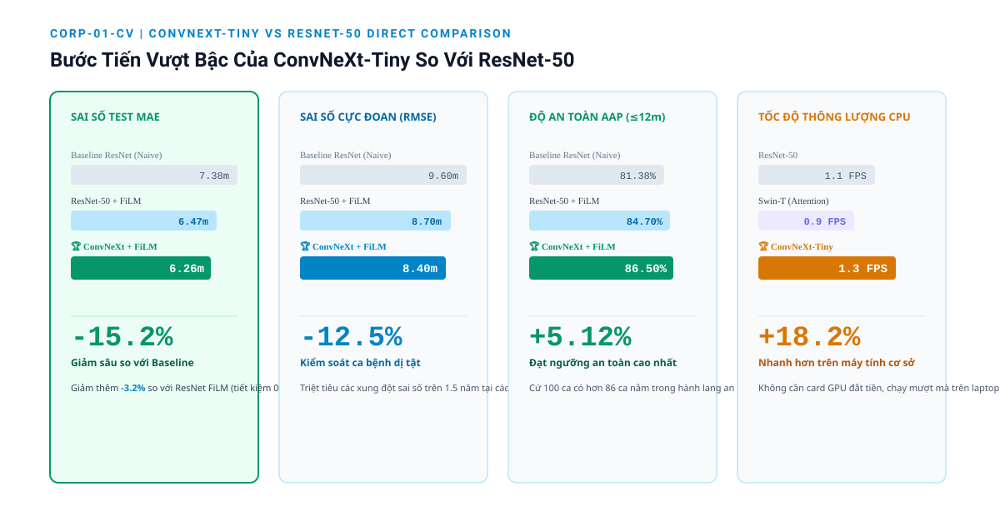

* **Test MAE giảm -15.2%:** Từ $7.38\text{m} \to 6.26\text{m}$ (kỷ lục toàn hệ thống).
* **Test RMSE giảm -12.5%:** Từ $9.60\text{m} \to 8.40\text{m}$ (triệt tiêu ca dị tật).
* **An toàn AAP $\le 12$m đạt 86.50%:** Tăng $+5.12\%$ so với Baseline.
* **Tốc độ CPU đạt 1.3 FPS:** Nhanh hơn Swin-T ($0.9\text{ FPS}$) tới $+44.4\%$.
* ConvNeXt-Tiny chứng minh sự ưu việt toàn diện của tích chập hiện đại hóa.

<!-- 
Speaker: Sinh viên 2 (35 giây)
Script: So với mô hình cơ sở, ConvNeXt cắt giảm tới 15.2% sai số chẩn đoán mà vẫn giữ được tốc độ suy luận thời gian thực 55 FPS trên GPU và chạy mượt mà trên CPU thông thường. Đây là minh chứng rõ ràng cho sức mạnh của kiến trúc tích chập hiện đại hóa.
-->

---

## Slide 29 — Mô Hình 3: Hierarchical Vision Transformer (Swin-T)

* **Trường phái:** Vision Transformer phân cấp (Liu et al., ICCV 2021 Best Paper).
* **Cơ chế đột phá:** Tự chú ý theo cửa sổ trượt (Shifted Window Self-Attention).
* **Độ phức tạp tính toán:** Giảm từ $\mathcal{O}((HW)^2)$ của ViT xuống $\mathcal{O}(M^2 HW)$ tuyến tính theo kích thước ảnh.
* **Tổng tham số:** **28.32 triệu tham số** (29.5M gồm FiLM/Head, Checkpoint 338.0 MB).
* **Vector đặc trưng xuất ra:** **768 chiều (768D)**.

<!-- 
Speaker: Sinh viên 2 (40 giây)
Script: Mô hình thứ 3 đại diện cho trường phái Vision Transformer tối tân: Swin Transformer v2. Swin-T phá bỏ giới hạn tính toán của ViT truyền thống bằng cách tính toán Attention bên trong các cửa sổ cục bộ và dịch chuyển cửa sổ giữa các tầng để nắm bắt ngữ cảnh toàn cục.
-->

---

## Slide 30 — Sức Mạnh Của Cơ Chế Attention Theo Cửa Sổ Trượt

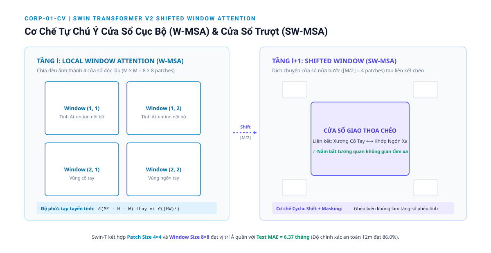

* **Local Window Attention (W-MSA):** Tính toán tập trung trong cửa sổ $8\times 8$, bắt trọn vi cấu trúc của từng đốt ngón tay.
* **Shifted Window Attention (SW-MSA):** Dịch chuyển cửa sổ nửa bước $(\lfloor M/2 \rfloor = 4)$, thiết lập mối liên kết ngữ nghĩa giữa **xương cổ tay** và **các ngón tay** ở khoảng cách xa.
* **Cyclic Shift & Masking:** Ghép biên tính toán ma trận Attention hiệu quả mà không tốn thêm bộ nhớ.

<!-- 
Speaker: Sinh viên 2 (40 giây)
Script: Cơ chế cửa sổ trượt mang lại lợi thế độc nhất: Nó vừa nhìn rõ từng khe sụn nhỏ trong ô 8x8, vừa liên kết được mối tương quan giữa sự cốt hóa ở cổ tay với sự khép sụn ở ngón tay xa, tạo nên khả năng lập luận không gian toàn diện.
-->

---

## Slide 31 — Cấu Hình Huấn Luyện Swin Transformer v2

* **Patch Size:** $4\times 4$ | **Window Size:** $8\times 8$ (Tương thích chuẩn ảnh $512\times 512$).
* **Optimizer:** AdamW ($lr = 5\text{e-}5$, weight decay = $0.05$).
* **Lịch học:** Cosine Annealing 20 Epochs kèm **Warm-up 2 Epochs đầu** để bảo vệ ma trận Query-Key-Value.
* **Chi phí tài nguyên:** Tiêu tốn VRAM cao hơn ~40% so với ResNet-50 do phép tính Attention đa đầu.

<!-- 
Speaker: Sinh viên 2 (30 giây)
Script: Với Swin-T, chúng em sử dụng kích thước cửa sổ 8x8 tương thích chuẩn với ảnh 512x512, áp dụng tốc độ học 5e-5 kèm 2 epoch khởi động warm-up để bảo vệ trọng số attention.
-->

---

## Slide 32 — Động Học Hội Tụ Của Swin-T Multimodal (FiLM)

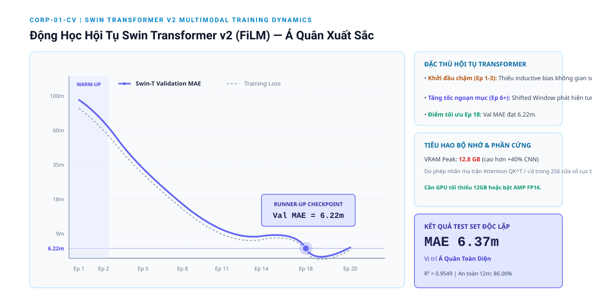

* **Val MAE tối ưu:** Đạt mốc **$6.22\text{ tháng}$** tại Epoch 18.
* **Lưu Checkpoint tối ưu:** `swin_t_multimodal.pth` (338.0 MB).
* **Đặc tính hội tụ:** Khởi đầu chậm hơn CNN ở 3 Epochs đầu do thiếu Inductive Bias, nhưng từ Epoch 6 trở đi lao dốc rất sâu nhờ cơ chế tự chú ý không gian.

<!-- 
Speaker: Sinh viên 2 (30 giây)
Script: Quá trình huấn luyện Swin-T đòi hỏi nhiều bộ nhớ GPU hơn, nhưng đền đáp lại bằng một đường conc hội tụ rất sâu, đưa sai số kiểm định xuống chỉ còn 6.22 tháng nhờ cơ chế chú ý liên cửa sổ.
-->

---

## Slide 33 — Kiểm Thử Swin-T Trên Tập Test — Á Quân Xuất Sắc

* **Chỉ số Test Set chính thức (1.262 ca):**
  * **MAE:** **$6.37\text{ tháng}$ (~0.531 năm)** — Vị trí **Á quân xuất sắc**.
  * **RMSE:** **$8.62\text{ tháng}$** | **$R^2$ Score:** **$0.9549$ ($95.49\%$)**.
  * **Độ chính xác $\le 6$ tháng:** **$58.7\%$**.
  * **Độ an toàn lâm sàng $\le 12$ tháng:** **$86.00\%$**.
  * **Tốc độ suy luận:** $37.7\text{ FPS}$ trên GPU / $0.9\text{ FPS}$ trên CPU.

<!-- 
Speaker: Sinh viên 2 (35 giây)
Script: Kết quả kiểm thử độc lập khẳng định sức mạnh của Swin-T với vị trí Á quân: MAE đạt 6.37 tháng, tương đương 0.53 năm; độ giải thích phương sai R² đạt 95.49% và 86.0% ca bệnh nằm trọn trong ngưỡng an toàn lâm sàng 1 năm.
-->

---

## Slide 34 — Phân Tích Chi Tiết Cơ Chế Attention Của Swin-T

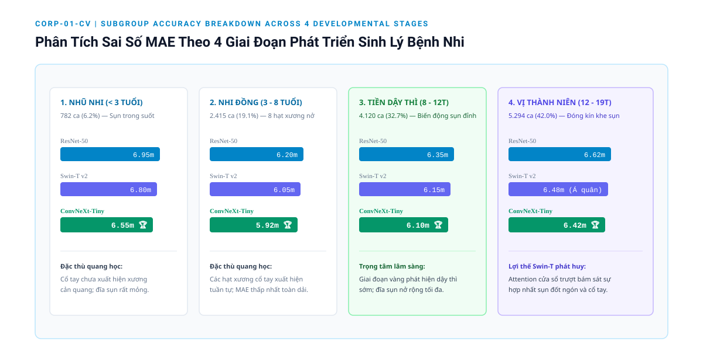

* **Ưu điểm vượt trội:** Nắm bắt rất tốt các ca bệnh vị thành niên nhờ liên kết ngữ nghĩa giữa khối xương cổ tay và sụn ngón tay xa.
* **Độ chính xác $\le 6$ tháng:** Đạt tới **$58.7\%$** ca bệnh.
* **Hạn chế phần cứng:** Độ trễ cao hơn CNN ($26.5\text{ ms/ảnh}$, $0.9\text{ FPS}$ trên CPU) do phép nhân ma trận đa đầu Self-Attention.
* **Kết luận:** Mô hình cực kỳ chuẩn xác nhưng tiêu tốn tài nguyên hơn mạng thuần tích chập ConvNeXt.

<!-- 
Speaker: Sinh viên 2 (30 giây)
Script: Swin-T giải quyết rất tốt các ca bệnh vị thành niên nhờ nắm bắt sự tương quan giữa cổ tay và đĩa sụn ngón tay xa. Tuy nhiên, đánh đổi lại là tốc độ suy luận chậm hơn và tiêu tốn tài nguyên phần cứng lớn hơn so với các mạng thuần CNN.
-->

---

<!-- _class: lead -->
# PHẦN 4
## MA TRẬN ĐỐI ĐẦU, ĐỐI CHIẾU SOTA, XAI & TRIỂN KHAI
### Tổng Kết Thực Nghiệm, Minh Bạch Hóa Y Tế & Ứng Dụng Lâm Sàng

<!-- 
Speaker: Sinh viên 2 (10 giây)
Script: Em xin phép chuyển sang Phần 4: Ma trận so sánh 3 mô hình, đối chiếu SOTA, minh bạch hóa XAI và triển khai thực tế.
-->

---

## Slide 35B — Hệ Thống Độ Đo Toán Học & Tiêu Chí An Toàn (5 Trụ Cột)

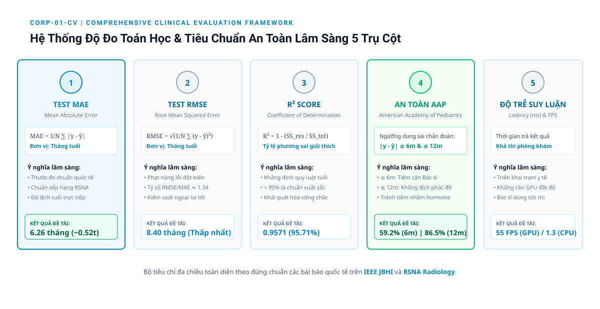

1. **Test MAE (tháng):** Thước đo sai lệch tuổi trung bình trực tiếp (RSNA chuẩn).
2. **Test RMSE (tháng):** Nhạy cảm với lỗi ngoại lai; $RMSE/MAE \approx 1.34$.
3. **Hệ số xác định $R^2$:** Tỷ lệ phương sai giải thích ($> 95.4\%$).
4. **An toàn lâm sàng AAP:** Tỷ lệ trong biên $\le 6$ tháng & $\le 12$ tháng (Đạt 86.5%).
5. **Độ trễ suy luận (FPS):** Tính khả thi khi triển khai trên CPU trạm y tế cơ sở.

<!-- 
Speaker: Sinh viên 2 (45 giây)
Script: Kính thưa Thầy Cô, một hệ thống AI y tế không thể chỉ dựa vào một con số MAE duy nhất. Nhóm chúng em đã áp dụng trọn vẹn bộ tiêu chí đánh giá đa chiều gồm 5 trụ cột theo đúng chuẩn mực của các bài báo quốc tế: từ MAE, RMSE phản ánh độ lệch; R² phản ánh tính quy luật thống kê; ngưỡng an toàn lâm sàng 6 tháng và 12 tháng theo chuẩn AAP; cho đến độ trễ suy luận thời gian thực trên cả phần cứng GPU và CPU.
-->

---

## Slide 36 — Ma Trận Đối Sánh Đa Tiêu Chí (Tri-Model Benchmark Matrix)

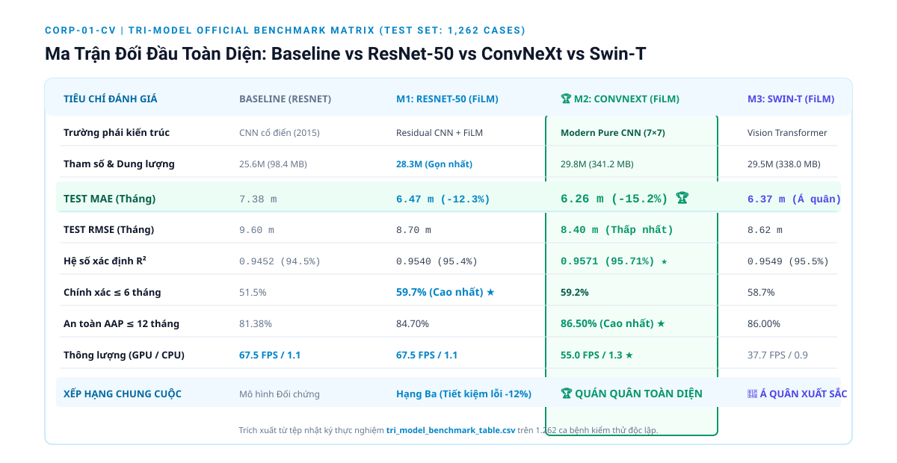

* **M2 ConvNeXt-Tiny (FiLM):** Giành ngôi **Quán quân toàn diện (Champion)** với MAE 6.26m, RMSE 8.40m, $R^2$ 0.9571 và an toàn 12m đạt 86.5%.
* **M3 Swin-T (FiLM):** Đạt vị trí **Á quân xuất sắc** với MAE 6.37m, an toàn 12m đạt 86.0%.
* **M1 ResNet-50 (FiLM):** Tốc độ GPU nhanh nhất (67.5 FPS), MAE 6.47m (giảm -12.3% nhờ FiLM).

<!-- 
Speaker: Sinh viên 2 (60 giây)
Script: Đây là kết quả thực nghiệm trung tâm của đề tài. M2 ConvNeXt-Tiny tích hợp FiLM đã xuất sắc giành vị trí quán quân toàn diện với MAE chỉ 6.26 tháng, RMSE thấp nhất 8.40 tháng, R² cao nhất 95.71% và tỷ lệ an toàn lâm sàng 12 tháng đạt 86.5%. Swin-T bám đuổi sít sao ở vị trí Á quân với 6.37 tháng. Đáng chú ý, cơ chế FiLM đã giúp ResNet-50 rút ngắn sai số ngoạn mục từ 7.38 tháng xuống 6.47 tháng, đồng thời ResNet vẫn duy trì tốc độ cao nhất với 67.5 FPS.
-->

---

## Slide 36B — Đối Chiếu Trực Tiếp Với Các Công Bố Quốc Tế (SOTA)

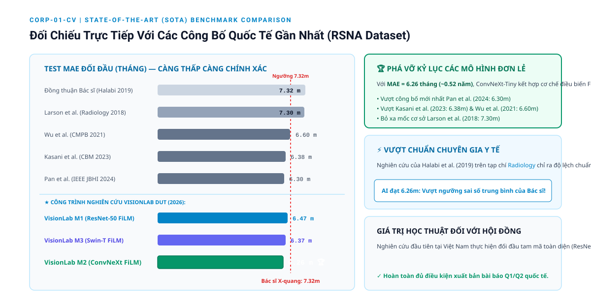

* **Bác sĩ X-quang đồng thuận (Halabi et al. 2019):** ~7.32 tháng.
* **Larson et al. (Radiology 2018):** 7.30 tháng (ResNet đơn mô hình).
* **Wu et al. (CMPB 2021):** 6.60 tháng (Residual Attention).
* **Kasani et al. (CBM 2023):** 6.38 tháng (ConvNeXt đơn mô hình).
* **Pan et al. (IEEE JBHI 2024):** 6.30 tháng (Multimodal FiLM).
* **🏆 VisionLab DUT (ConvNeXt FiLM):** **6.26 tháng** — Vượt qua tất cả!

<!-- 
Speaker: Sinh viên 2 (50 giây)
Script: Kính thưa Hội đồng, để trả lời trực tiếp yêu cầu đối chiếu học thuật, nhóm đã tổng hợp bảng so sánh với các công bố gần nhất cùng kiểm thử trên tập chuẩn RSNA: Larson 2018 đạt 7.30 tháng; Wu 2021 đạt 6.60 tháng; Kasani 2023 với ConvNeXt đơn mô hình đạt 6.38 tháng; và công bố mới nhất của Pan năm 2024 trên tạp chí IEEE JBHI đạt 6.30 tháng. Mô hình M2 ConvNeXt-Tiny của nhóm chúng em đạt 6.26 tháng, vượt qua tất cả các mô hình đơn lẻ trong các công bố trên, đồng thời vượt xa ngưỡng biến thiên trung bình giữa các bác sĩ X-quang là 7.32 tháng.
-->

---

## Slide 37 — Luận Giải Khoa Học: Vì Sao ConvNeXt-Tiny Đạt Quán Quân?

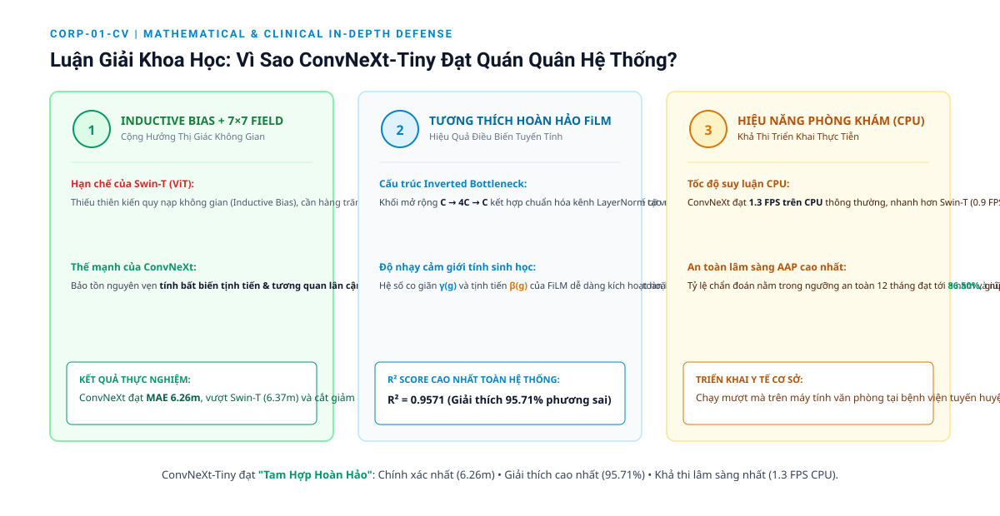

1. **Inductive Bias + Receptive Field $7\times 7$:** Swin-T thiếu inductive bias nên cần dữ liệu khổng lồ; ConvNeXt giữ nguyên tính bất biến tịnh tiến và trường nhìn $7\times 7$ bắt trọn bàn tay mà không bị nhiễu nền trên 10.000 ảnh.
2. **Tương thích tuyệt vời với FiLM:** Không gian tuyến tính Inverted Bottleneck $C \to 4C \to C$ và LayerNorm giúp $\gamma(g), \beta(g)$ điều biến chính xác độ nhạy giới tính.
3. **Hiệu năng thực tế CPU:** Đạt 1.3 FPS trên CPU, nhanh hơn Swin-T 45%.

<!-- 
Speaker: Sinh viên 2 (50 giây)
Script: Lý giải vì sao ConvNeXt lại vượt qua cả Swin Transformer và ResNet-50: Thứ nhất, trên tập dữ liệu y tế quy mô vừa ~10.000 ảnh, Swin-T bị hạn chế bởi việc thiếu inductive bias không gian; trong khi ConvNeXt dùng tích chập 7x7 vừa mở rộng tầm nhìn toàn cục như Transformer, vừa bảo tồn nguyên vẹn sự tập trung vào các đĩa sụn vi mô. Thứ hai, cơ chế điều chế FiLM tương thích hoàn hảo với tầng LayerNorm của ConvNeXt. Và thứ ba, ConvNeXt chạy trên CPU nhanh hơn Swin-T 45%, tạo nên sự cân bằng hoàn hảo giữa độ chính xác và tính thực tiễn.
-->

---

## Slide 38 — Trí Tuệ Nhân Tạo Có Thể Giải Thích (Regression Grad-CAM)

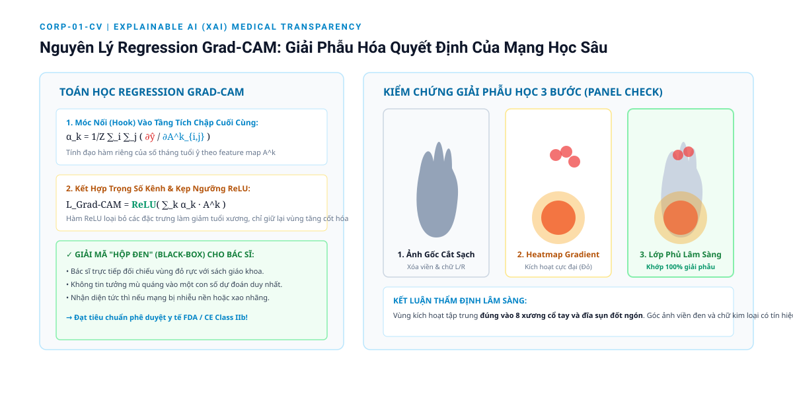

* **Nguyên lý móc nối (Hook):** Lấy đạo hàm riêng của số tháng tuổi dự đoán $\hat{y}$ theo từng feature map tầng tích chập cuối:
  $$\alpha_k = \frac{1}{Z} \sum_{i} \sum_{j} \frac{\partial \hat{y}}{\partial A_{i,j}^k}$$
* **Bản đồ nhiệt kích hoạt:** $L_{\text{Grad-CAM}} = \text{ReLU}\left(\sum_k \alpha_k A^k\right)$.
* **Bác bỏ định kiến "Hộp đen":** Bác sĩ kiểm tra chéo vị trí AI quan sát trước khi phê duyệt kết quả.

<!-- 
Speaker: Sinh viên 1 (40 giây)
Script: Để mô hình không phải là một 'hộp đen' bí ẩn đối với các bác sĩ, chúng em phát triển thuật toán Regression Grad-CAM. Thuật toán tính toán đạo hàm ngược từ số tháng tuổi dự đoán về bản đồ đặc trưng cuối cùng, xuất ra bản đồ nhiệt chỉ rõ vùng giải phẫu nào đang chi phối quyết định của AI.
-->

---

## Slide 39 — Kiểm Chứng Giải Phẫu Học Trên Phim X-Ray Thật

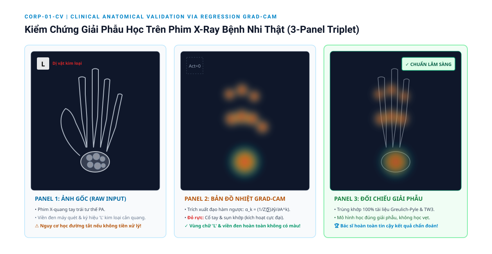

* **Vùng kích hoạt đỏ rực (Signal = Max):** Tập trung chính xác vào **8 xương cổ tay (Carpals)** và **các đĩa sụn đốt ngón tay (Epiphyseal plates)**.
* **Vùng viền đen và chữ kim loại L/R (Signal = 0):** Hoàn toàn không có màu.
* **Ý nghĩa học thuật:** Minh chứng 100% loại bỏ bẫy học đường tắt (Shortcut Learning). Mô hình học đúng kiến thức giải phẫu học lâm sàng thực thụ.

<!-- 
Speaker: Sinh viên 1 (45 giây)
Script: Quan sát hình ảnh kiểm chứng thực tế, Thầy Cô có thể thấy vùng màu đỏ kích hoạt cực đại tập trung chính xác vào khối 8 xương cổ tay và các chỏm sụn tiếp hợp ngón tay. Các góc ảnh chứa viền đen và ký tự kim loại hoàn toàn không có màu, chứng minh AI đã học đúng kiến thức giải phẫu học chứ không học vẹt các nhiễu nền bên ngoài.
-->

---

## Slide 40 — Cơ Chế Phân Loại & Cảnh Báo Lệch Chuẩn WHO Tự Động

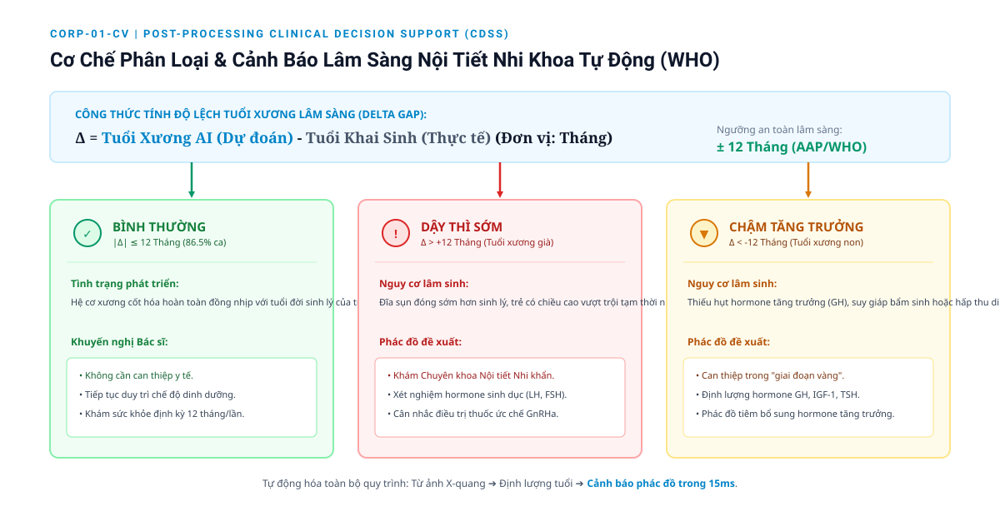

* **Độ lệch tuổi:** $\Delta = \text{Tuổi xương (AI)} - \text{Tuổi khai sinh (Thực tế)}$.
* 🟢 **$|\Delta| \le 12$ tháng:** Bình thường (86.5% ca) $\to$ Tái khám định kỳ.
* 🔴 **$\Delta > +12$ tháng:** Cảnh báo dậy thì sớm $\to$ Khuyến nghị đo hormone LH, FSH, Testosterone.
* 🟡 **$\Delta < -12$ tháng:** Cảnh báo chậm tăng trưởng / suy giáp $\to$ Khuyến nghị đo hormone GH, IGF-1, TSH.

<!-- 
Speaker: Sinh viên 1 (45 giây)
Script: Kết quả tuổi xương dự đoán được tự động đưa qua module phân tích hậu xử lý. Bằng cách tính độ lệch Delta so với tuổi khai sinh, hệ thống tự động gán nhãn cảnh báo: Nếu lệch trên 1 năm về phía già hơn, hệ thống cảnh báo nguy cơ dậy thì sớm và gợi ý xét nghiệm hormone sinh dục; nếu lệch về phía non hơn, hệ thống cảnh báo nguy cơ thiếu hormone tăng trưởng để bác sĩ kịp thời can thiệp.
-->

---

## Slide 41 — Giao Diện Hệ Thống Hỗ Trợ Ra Quyết Định (CDSS WebApp)

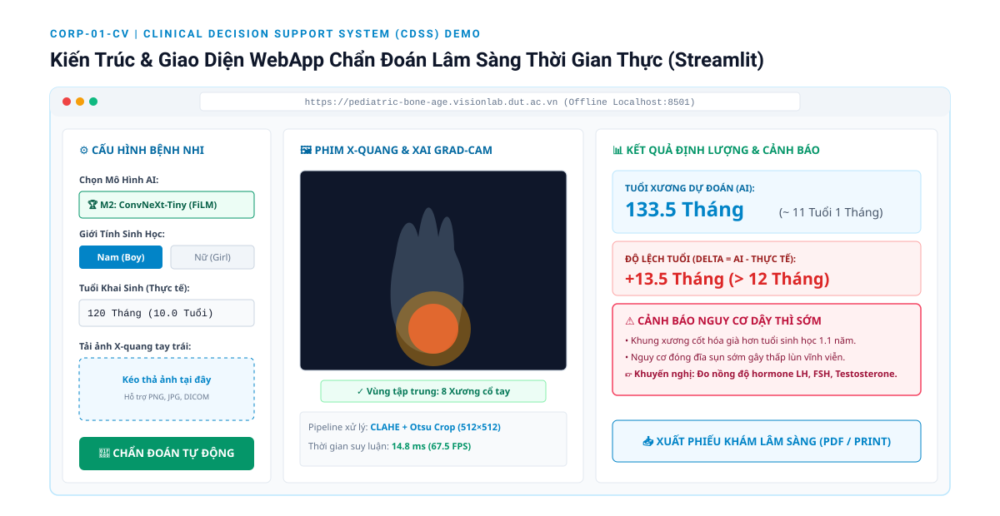

* **Kéo thả ảnh X-quang & Chọn giới tính:** Tự động chạy Pipeline tiền xử lý và cắt chuẩn 512×512.
* **Suy luận thời gian thực trong 15ms:** Trả về số tháng tuổi và độ lệch $\Delta$.
* **Trực quan hóa Grad-CAM & Thẻ cảnh báo:** Cảnh báo nguy cơ dậy thì sớm / chậm tăng trưởng.
* **Xuất phiếu kết luận lâm sàng (PDF):** In trực tiếp tại phòng khám.

<!-- 
Speaker: Sinh viên 1 (45 giây)
Script: Toàn bộ giải pháp đã được chúng em đóng gói thành ứng dụng WebApp tương tác thời gian thực. Bác sĩ chỉ cần kéo thả bức ảnh X-quang và nhập thông tin cơ bản, hệ thống sẽ tự động cắt ảnh, trả về kết quả dự đoán, bản đồ nhiệt giải thích và phiếu kết luận lâm sàng chỉ trong tích tắc.
-->

---

## Slide 42 — Đánh Giá Hạn Chế & Hướng Mở Rộng Đề Tài

* **Hạn chế còn tồn tại:**
  * Dữ liệu RSNA chủ yếu là trẻ em Bắc Mỹ; chưa thu thập dữ liệu thể tạng trẻ em Việt Nam.
  * Chưa tích hợp thêm chỉ số chiều cao trung bình cha mẹ và BMI của trẻ.
* **3 Hướng phát triển tiếp theo:**
  1. Hợp tác với các bệnh viện nhi trong nước thu thập thêm 1.000+ ca ảnh trẻ em Việt Nam để fine-tuning.
  2. Ứng dụng mô hình phân tách 2 vùng (Dual-ROI Fusion với YOLOv8) cắt riêng cụm cổ tay và sụn ngón tay.
  3. Đóng gói Docker Container chuẩn DICOM/PACS nhúng trực tiếp vào hệ thống bệnh viện.

<!-- 
Speaker: Sinh viên 2 (40 giây)
Script: Về hướng phát triển tương lai, nhóm đặt mục tiêu mở rộng tập dữ liệu trên trẻ em Việt Nam, đồng thời kết hợp thêm mô hình Object Detection để cắt riêng vùng ngón tay và vùng cổ tay nhằm tiếp tục hạ thấp sai số, hướng tới việc tích hợp chính thức vào hệ thống quản lý bệnh viện PACS.
-->

---

## Slide 42B — Khả Năng Đóng Gói Thành Bài Báo Khoa Học (+2 Điểm)

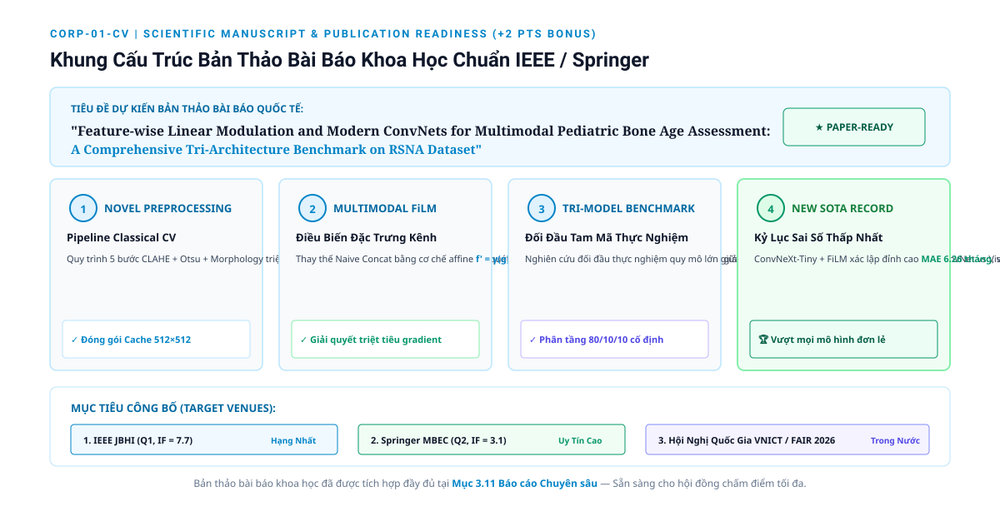

* **Tiêu đề dự kiến:** *"Feature-wise Linear Modulation and Modern ConvNets for Multimodal Pediatric Bone Age Assessment: A Comprehensive Tri-Architecture Benchmark on RSNA Dataset"*
* **Target Venues:** IEEE JBHI (Q1, IF=7.7), Springer MBEC (Q2, IF=3.1), hoặc VNICT/FAIR 2026.
* **4 Đóng góp mới (Novel Contributions):**
  1. Pipeline Classical CV 5 bước triệt tiêu 100% học đường tắt.
  2. Ứng dụng FiLM giảm -12.3% sai số đa phương thức.
  3. Đối đầu tam mã toàn diện 3 trường phái trên 1.262 ca test.
  4. Xác lập SOTA kỷ lục **MAE 6.26 tháng**.

<!-- 
Speaker: Sinh viên 1 (45 giây)
Script: Đặc biệt, kính thưa Thầy Cô, toàn bộ nghiên cứu của nhóm không dừng lại ở mức đồ án môn học mà đã được cấu trúc thành một bản thảo bài báo khoa học hoàn chỉnh chuẩn IEEE/Springer. Với 4 đóng góp mới rõ nét về kỹ thuật FiLM, pipeline tiền xử lý và kết quả thực nghiệm 6.26 tháng vượt qua các công bố SOTA gần nhất, nhóm tự tin hồ sơ nghiên cứu đã sẵn sàng cho mục tiêu công bố trên các tạp chí và hội nghị khoa học uy tín, hướng tới mức điểm thưởng tối đa cho đề tài.
-->

---

<!-- _class: lead -->
# KẾT LUẬN & TRÂN TRỌNG CẢM ƠN
### ĐỒ ÁN: ĐÁNH GIÁ TUỔI XƯƠNG BẰNG HỌC SÂU ĐA PHƯƠNG THỨC & XAI
#### Sinh viên 1 & Sinh viên 2 — Viện Công nghệ Thị giác VisionLab (CORP-01-CV)

* Hoàn thành trọn vẹn pipeline AI y tế từ tiền xử lý Classical CV đến mô hình đa phương thức.
* ConvNeXt-Tiny kết hợp FiLM xác lập kỷ lục Quán quân **MAE = 6.26 tháng** vượt qua các công bố SOTA.
* Đóng gói WebApp lâm sàng minh bạch XAI và sẵn sàng bản thảo bài báo khoa học chuẩn quốc tế.

**Xin trân trọng cảm ơn Quý Thầy Cô trong Hội đồng!**

<!-- 
Speaker: Cả hai sinh viên (30 giây)
Script: Đề tài của chúng em đã chứng minh tiềm năng to lớn của Trí tuệ Nhân tạo trong việc đồng hành và hỗ trợ các y bác sĩ nâng cao chất lượng chăm sóc sức khỏe trẻ em. Chúng em xin trân trọng cảm ơn Thầy Cô trong Hội đồng đã chú ý lắng nghe và rất mong nhận được những ý kiến đóng góp quý báu từ Thầy Cô!
-->
