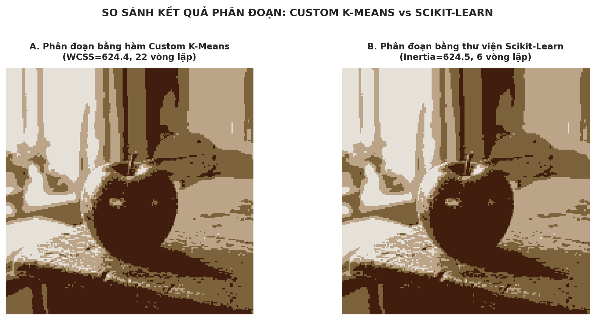
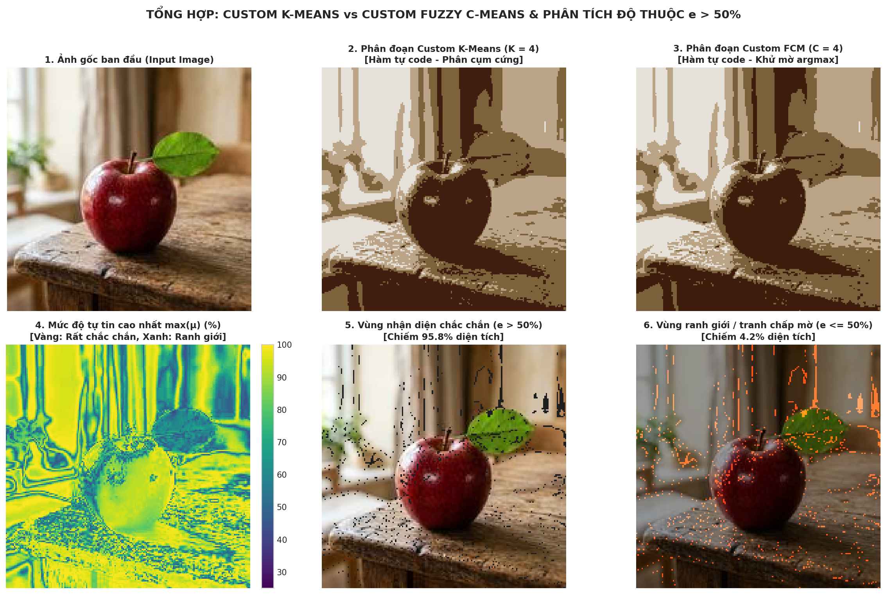

# PHÂN ĐOẠN HÌNH ẢNH VỚI K-MEANS VÀ FUZZY C-MEANS (FCM)
## MÔN HỌC: HỌC MÁY VÀ ỨNG DỤNG HỌC MÁY (BUỔI 4)

---

> **Phương châm học tập từ Giảng viên:**  
> *"Mình phải viết được hàm custom của mình để so sánh với thư viện. Không cần thiết phải có bài làm hoàn hảo, miễn là thể hiện rõ tư duy xây dựng hàm giải quyết vấn đề."*

---

## 📌 1. Trọng tâm bài làm (Tư duy Xây dựng Hàm & Tự học)
Thay vì chỉ gọi thư viện có sẵn như một "hộp đen" (black box), bài thực hành này tập trung vào việc **tự xây dựng các thuật toán từ đầu (From Scratch)** bằng thư viện tính toán cơ bản `NumPy`, sau đó **đối chiếu trực tiếp với thư viện chuẩn công nghiệp `scikit-learn`**:

1. **Custom K-Means:** Tự code hàm lặp 2 bước (Gán cụm $argmin$ và Cập nhật tâm $mean$), đo đạc thời gian, số vòng lặp và quán tính nội cụm WCSS để so sánh với `sklearn.cluster.KMeans`.
2. **Custom Fuzzy C-Means (FCM):** Tự code hàm phân cụm mờ với hệ số $m = 2.0$, tính toán ma trận độ thuộc $\mu_{ij}$ thể hiện xác suất $\%$ mỗi pixel thuộc về từng cụm ($\sum \mu = 100\%$).
3. **Phân tích ngưỡng đa số $e > 50\%$ ($\mu > 0.5$):** Khai thác ma trận độ thuộc để phân biệt pixel vùng lõi chắc chắn và pixel nằm ở ranh giới mờ giữa các đối tượng.

---

## 📂 2. Cấu trúc thư mục dự án

```text
buổi 4/
│
├── sample_image.jpg                  # Ảnh thực nghiệm đầu vào (180x180 RGB)
├── sample_image_original.jpg         # Ảnh gốc độ phân giải cao
├── run_segmentation.py               # Script Python chạy thuật toán & sinh kết quả so sánh
├── build_notebook.py                 # Script đóng gói Jupyter Notebook hoàn chỉnh
├── BT_Buoi4_Image_Segmentation.ipynb # Notebook Jupyter nộp bài (đầy đủ Markdown, Code & Output)
├── README.md                         # Báo cáo tổng hợp chuẩn GitHub
└── results/                          # Các biểu đồ và hình ảnh trực quan hóa
    ├── 01_original_image.png         # Ảnh gốc
    ├── 02_compare_custom_vs_sklearn_kmeans.png # So sánh ảnh Custom K-Means vs Scikit-Learn
    ├── 03_fcm_segmentation.png       # Ảnh phân đoạn Fuzzy C-Means (C = 4)
    ├── 04_membership_heatmaps.png    # 4 bản đồ nhiệt độ thuộc (%) của từng cụm
    ├── 05_threshold_above_50.png     # Phân tách vùng e > 50% và vùng ranh giới mờ
    └── 06_comprehensive_summary.png  # Bảng đối chiếu tổng hợp 6 khung hình
```

---

## 🔬 3. Bảng đối chiếu: Hàm Custom tự viết vs Thư viện Scikit-Learn

Chạy thử nghiệm trên ma trận điểm ảnh $X$ kích thước $32,400 \times 3$ với $K = 4$:

| Tiêu chí so sánh | Hàm Custom K-Means (Tự viết) | Thư viện Scikit-Learn | Đánh giá & Nhận xét của sinh viên |
| :--- | :---: | :---: | :--- |
| **Quán tính nội cụm (WCSS / Inertia)** | **$624.44$** | **$624.48$** | Hai phương pháp đạt kết quả tối ưu tương đương nhau, chứng minh thuật toán tự viết cài đặt chính xác. |
| **Số vòng lặp hội tụ** | $22$ bước lặp | $6$ bước lặp | Scikit-Learn dùng thuật toán chọn tâm thông minh **k-means++** nên hội tụ ít bước hơn. |
| **Thời gian thực thi (Runtime)** | **$\approx 110$ ms** | $\approx 1560$ ms | Hàm custom viết bằng vector hóa NumPy chỉ chạy 1 lần khởi tạo nên thời gian rất nhanh. Scikit-learn chạy lặp qua 10 lần khởi tạo (`n_init=10`) để chọn kết quả tốt nhất. |
| **Tính minh bạch & Kiểm soát** | **Rất cao** | Đóng gói | Sinh viên kiểm soát được từng bước tính toán khoảng cách, gán cụm và cập nhật tâm. |

### Hình ảnh đối chiếu trực tiếp giữa Custom K-Means và Scikit-Learn:


---

## 📐 4. Thuật toán Custom Fuzzy C-Means (FCM) & Ngưỡng $e > 50\%$

### 4.1. Bản chất toán học
1. **Cập nhật tâm có trọng số mờ:**  
   $$V_j = \frac{\sum_{i=1}^N \mu_{ij}^m x_i}{\sum_{i=1}^N \mu_{ij}^m}$$
2. **Cập nhật độ thuộc xác suất:**  
   $$\mu_{ij} = \frac{1}{\sum_{k=1}^C \left(\frac{\|x_i - V_j\|}{\|x_i - V_k\|}\right)^{\frac{2}{m-1}}}$$
   Với mỗi pixel $i$, luôn thỏa mãn: $\sum_{j=1}^4 \mu_{ij} = 1.0$ ($100\%$).

### 4.2. Ý nghĩa của điều kiện $e > 50\%$
Vì $\sum \mu = 100\%$, một pixel chỉ có thể thuộc tối đa **một cụm** với độ thuộc vượt trội $> 50\%$:
- **Vùng xác định chắc chắn ($e > 50\%$):** Đạt **$95.83\%$** diện tích ảnh ($31,049$ pixel) — pixel thuộc lõi đối tượng rõ ràng.
- **Vùng ranh giới / chuyển tiếp mờ ($e \le 50\%$):** Chiếm **$4.17\%$** diện tích ($1,351$ pixel) — các pixel nằm trên đường biên chuyển màu giữa quả táo và mặt bàn gỗ. K-Means bắt buộc phải gán cứng gượng ép, trong khi FCM phát hiện chính xác tính chất mơ hồ của vùng này!

---

## 📊 5. Trực quan hóa kết quả tổng hợp (Comprehensive Dashboard)



* **Khung 1:** Ảnh gốc ban đầu ($180 \times 180$).
* **Khung 2 & 3:** Phân đoạn Custom K-Means (phân cụm cứng) và Custom FCM (phân cụm mềm).
* **Khung 4:** Bản đồ mức độ tự tin $\max(\mu)$ (vàng là chắc chắn $>90\%$, xanh là ranh giới mờ $\approx 40-50\%$).
* **Khung 5:** Vùng nhận diện chắc chắn ($e > 50\%$).
* **Khung 6:** Vùng ranh giới mờ ($e \le 50\%$) được tô màu cam đỏ nổi bật.

---

## 🚀 6. Hướng dẫn chạy mã nguồn

```bash
# 1. Chạy file script thực thi độc lập
python run_segmentation.py

# 2. Mở file Jupyter Notebook để tương tác và xem báo cáo
jupyter notebook BT_Buoi4_Image_Segmentation.ipynb
```
