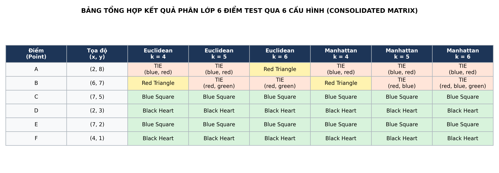
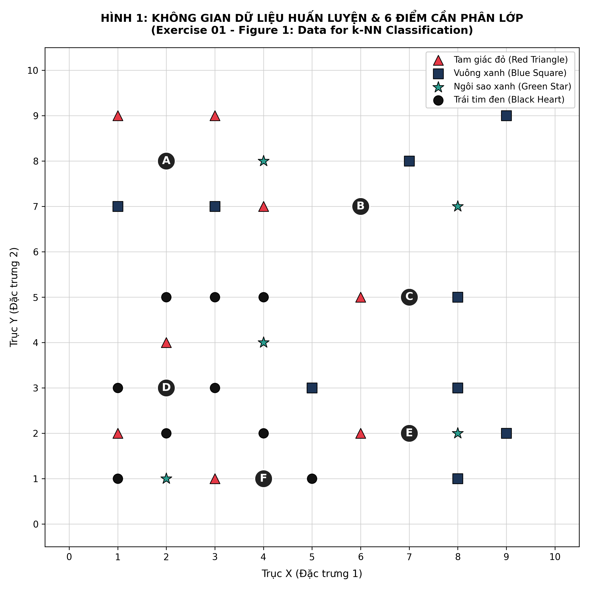
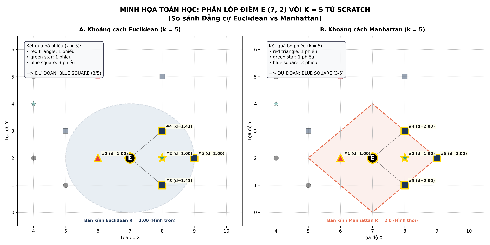
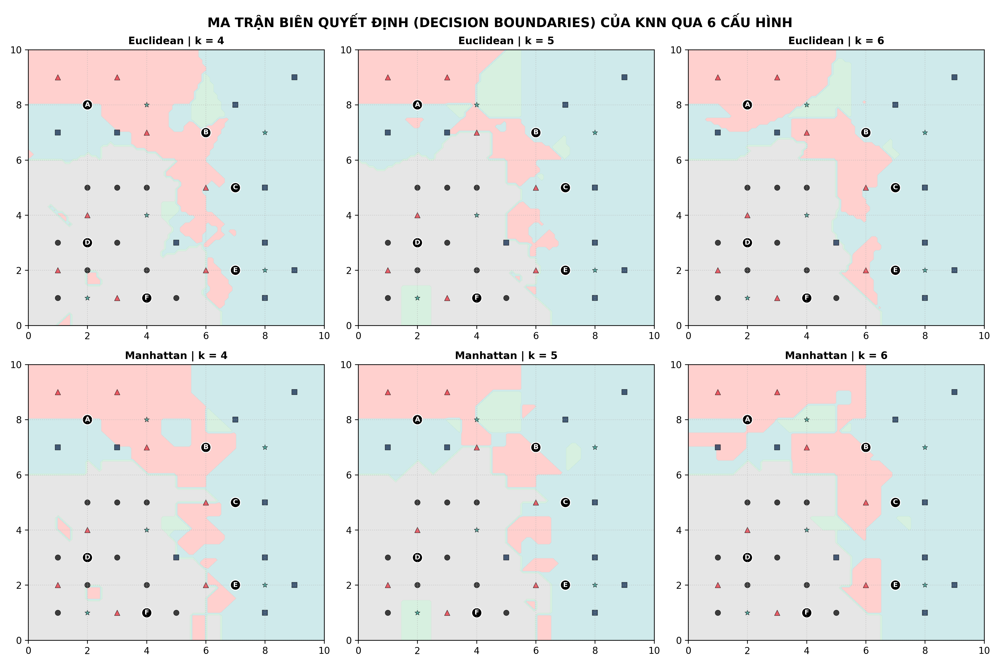

# PHÂN LỚP VỚI THUẬT TOÁN K-NEAREST NEIGHBORS (K-NN) TỪ SCRATCH
## MÔN HỌC: HỌC MÁY VÀ ỨNG DỤNG HỌC MÁY (BUỔI 5)
### Sinh viên: Nguyễn Trung Kiên | MSSV: 102230023
### Khoa Công nghệ Thông tin - Trường Đại học Bách khoa, ĐH Đà Nẵng (DUT)

---

> **Phương châm học tập từ Giảng viên:**  
> *"Hiểu thấu bản chất mêtric không gian và tự cài đặt thuật toán từ Scratch trước khi gọi thư viện. Không chỉ nhìn vào nhãn dự đoán mà phải phân tích ranh giới quyết định, hiện tượng hòa phiếu và sự đánh đổi Bias - Variance."*

---

## 📌 1. Trọng tâm bài làm (Tư duy Cài đặt Thuật toán & Tự học)
Thay vì chỉ gọi hàm thư viện đen `KNeighborsClassifier` từ `scikit-learn`, bài thực hành này tập trung vào việc giải quyết trọn vẹn **Exercise 01** trong tài liệu [[KNN_exercises.pdf](KNN_exercises.pdf)]:

1. **Số hóa & Khám phá Dữ liệu Figure 1:** Trích xuất chính xác 31 điểm huấn luyện thuộc 4 lớp:
   - 🔺 **red triangle (8 điểm)**
   - 🟦 **blue square (9 điểm)**
   - ⭐ **green star (5 điểm)**
   - ❤️ **black heart (9 điểm)**
   cùng 6 điểm kiểm thử chưa gán nhãn: $A(2, 8), B(6, 7), C(7, 5), D(2, 3), E(7, 2), F(4, 1)$.
2. **Cài đặt Custom KNN từ Scratch:** Tự code hàm đo khoảng cách Euclidean ($L_2$) và Manhattan ($L_1$), sắp xếp khoảng cách ổn định (stable sort) và cơ chế bỏ phiếu đa số (Majority Voting).
3. **Phân loại từng bước 6 Điểm qua 6 Cấu hình (Câu a):** Khảo sát $k \in \{4, 5, 6\}$ kết hợp với cả 2 độ đo khoảng cách.
4. **Phân tích so sánh đa chiều (Câu b):** Đánh giá chi tiết sự khác biệt về hình học đẳng cự (đường tròn vs hình thoi), tác động của việc mở rộng bán kính láng giềng $k$, và hiện tượng hòa phiếu (Ties).
5. **Thực thi minh họa Điểm E với $k = 5$ (Câu c):** In báo cáo console chi tiết các láng giềng, số phiếu bầu và nhãn dự đoán.

---

## 📂 2. Cấu trúc thư mục dự án

```text
Lab_03_KNN/
│
├── KNN_exercises.pdf                 # Đề bài tập thực hành gốc
├── Chap 4. Học có giám sát_p2_1.pdf   # Slide bài giảng lý thuyết K-NN
├── run_knn.py                        # Script Python thuần chạy thuật toán & sinh toàn bộ biểu đồ
├── build_notebook.py                 # Script tự động đóng gói Jupyter Notebook hoàn chỉnh
├── BT_Buoi5_KNN.ipynb                # Notebook Jupyter nộp bài (đầy đủ Markdown, Code & Output nhúng Base64)
├── 102230023_NguyenTrungKien.ipynb   # Bản sao định danh sinh viên nộp bài
├── knn_scratch_exercise.py           # Module KNN Scratch độc lập phục vụ kiểm thử
├── README.md                         # Báo cáo tổng hợp chuẩn GitHub / DUT
└── results/                          # Các biểu đồ và bảng trực quan hóa xuất độ phân giải cao
    ├── 01_dataset_visualization.png          # Không gian 31 điểm train & 6 điểm test (Figure 1)
    ├── 02_point_E_demo_k5.png                # Minh họa đẳng cự bán kính điểm E (k = 5)
    ├── 03_decision_boundary_comparison.png   # Ma trận 6 khung ranh giới quyết định (Decision Boundaries)
    └── 04_summary_classification_table.png   # Bảng ma trận tổng hợp kết quả phân lớp
```

---

## 🔬 3. Bảng Ma trận Tổng hợp Kết quả Phân lớp (Consolidated Matrix)

Kết quả phân lớp độc lập cho 6 điểm kiểm thử dưới 6 cấu hình (theo đúng nguyên tắc không dùng nhãn vừa phân loại để gán cho các điểm tiếp theo):

| Điểm | Tọa độ $(x, y)$ | Euclidean $k = 4$ | Euclidean $k = 5$ | Euclidean $k = 6$ | Manhattan $k = 4$ | Manhattan $k = 5$ | Manhattan $k = 6$ |
| :---: | :---: | :---: | :---: | :---: | :---: | :---: | :---: |
| **A** | $(2, 8)$ | *Tie (Blue/Red)* | *Tie (Blue/Red)* | **Red Triangle** | *Tie (Blue/Red)* | *Tie (Blue/Red)* | *Tie (Blue/Red)* |
| **B** | $(6, 7)$ | **Red Triangle** | *Tie (Red/Green)* | *Tie (Red/Green)* | **Red Triangle** | *Tie (Red/Blue)* | *Tie (3-way)* |
| **C** | $(7, 5)$ | **Blue Square** | **Blue Square** | **Blue Square** | **Blue Square** | **Blue Square** | **Blue Square** |
| **D** | $(2, 3)$ | **Black Heart** | **Black Heart** | **Black Heart** | **Black Heart** | **Black Heart** | **Black Heart** |
| **E** | $(7, 2)$ | **Blue Square** | **Blue Square** | **Blue Square** | **Blue Square** | **Blue Square** | **Blue Square** |
| **F** | $(4, 1)$ | **Black Heart** | **Black Heart** | **Black Heart** | **Black Heart** | **Black Heart** | **Black Heart** |

### Hình ảnh Bảng Tổng hợp Trực quan:


---

## 📐 4. Phân tích Toán học & Đánh giá Chuyên sâu (Câu b)

### 4.1. Tác động của kích thước láng giềng $k$ ($k = 4, 5, 6$)
1. **Các điểm vùng lõi mật độ cao ($C, D, E, F$):**
   - Hoàn toàn bất biến trước sự thay đổi của $k$. Mật độ tập trung của các điểm cùng lớp xung quanh chúng là quá lớn, đảm bảo dự đoán cực kỳ vững chắc (Robustness).
2. **Các điểm vùng biên giới ranh giới ($A, B$):**
   - Chịu ảnh hưởng rất lớn khi $k$ tăng.
   - **Điểm $A(2, 8)$:** Nằm đối xứng giữa cụm Red Triangle phía trên và Blue Square phía dưới. Tại $k=4, 5$, hai lớp hòa phiếu tỉ số $2 - 2$. Đến $k=6$ trong Euclidean, việc mở rộng bán kính thu nạp thêm điểm $(4, 7)$ giúp Red Triangle dẫn trước $3 - 2$.
   - **Điểm $B(6, 7)$:** Tại $k=4$, Red Triangle dẫn đầu với 2 phiếu. Khi mở rộng $k=5, 6$, các điểm Green Star và Blue Square xuất hiện làm phân tán phiếu bầu và gây hòa phiếu.
   - **Quy tắc chọn $k$:** Chọn $k$ chẵn trong bài toán phân lớp luôn tiềm ẩn nguy cơ hòa phiếu. Với bài toán đa lớp (4 lớp), $k$ lẻ vẫn có thể hòa phiếu nếu các lớp hàng đầu có số phiếu ngang nhau.

### 4.2. Tác động của độ đo khoảng cách (Euclidean vs. Manhattan)
1. **Hình học đẳng cự:**
   - **Euclidean ($L_2$ norm):** Đường đẳng cự là **hình tròn** $\sqrt{\Delta x^2 + \Delta y^2} = R$. Điểm chéo $(1, 1)$ có khoảng cách $\sqrt{2} \approx 1.4142 < 2.0$.
   - **Manhattan ($L_1$ norm):** Đường đẳng cự là **hình thoi (Diamond)** nghiêng $45^\circ$ $|\Delta x| + |\Delta y| = R$. Điểm chéo $(1, 1)$ có khoảng cách $1 + 1 = 2.0$, ngang bằng điểm thẳng hàng $(2, 0)$.
2. **Hệ quả xếp hạng láng giềng:**
   - Manhattan tạo ra rất nhiều láng giềng đồng khoảng cách (cùng bằng 2 hoặc cùng bằng 3), khiến việc chọn top $k$ phụ thuộc lớn vào thứ tự tie-break. Euclidean phân cấp khoảng cách mượt mà và chính xác hơn trên không gian liên tục.

---

## 📊 5. Trực quan hóa Kết quả Thực nghiệm

### 5.1. Không gian Dữ liệu 31 điểm Train & 6 điểm Test:


### 5.2. Minh họa Hình học Điểm E với $k = 5$ (Euclidean vs. Manhattan):


### 5.3. Ma trận Ranh giới Quyết định (Decision Boundaries) qua 6 Cấu hình:


---

## 🚀 6. Hướng dẫn Chạy Mã nguồn

```bash
# 1. Chạy script thực thi độc lập và sinh toàn bộ ảnh kết quả
python run_knn.py

# 2. Đóng gói Jupyter Notebook hoàn chỉnh (nhúng ảnh Base64)
python build_notebook.py

# 3. Chạy kiểm thử riêng lẻ thuật toán KNN Scratch
python knn_scratch_exercise.py

# 4. Mở Notebook tương tác nộp bài
jupyter notebook BT_Buoi5_KNN.ipynb
```
