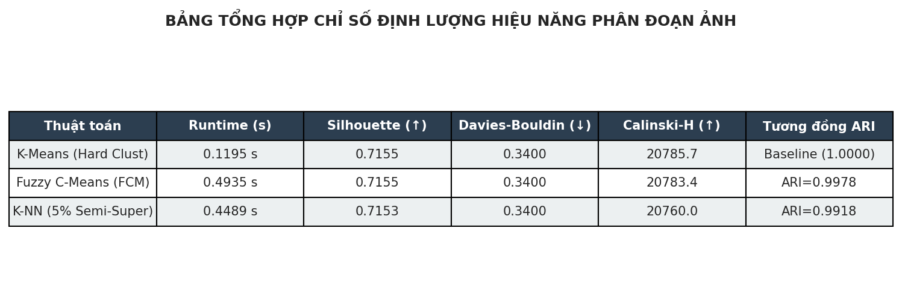
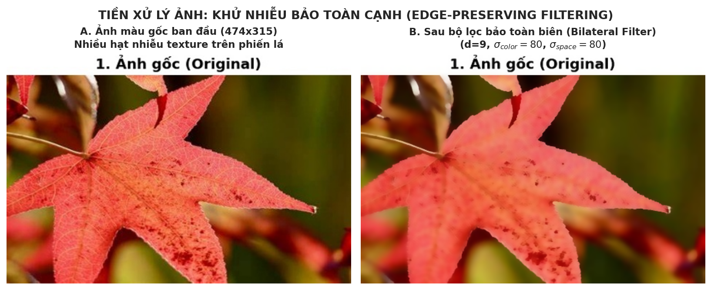
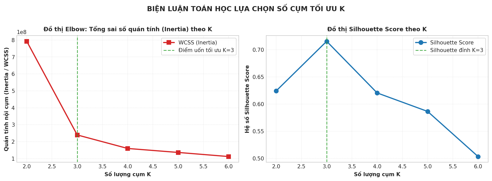
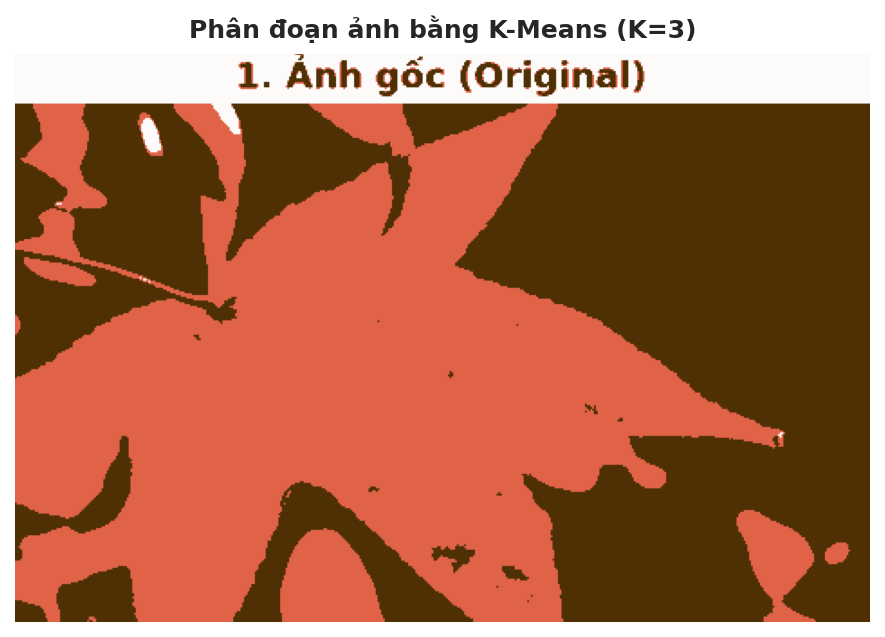
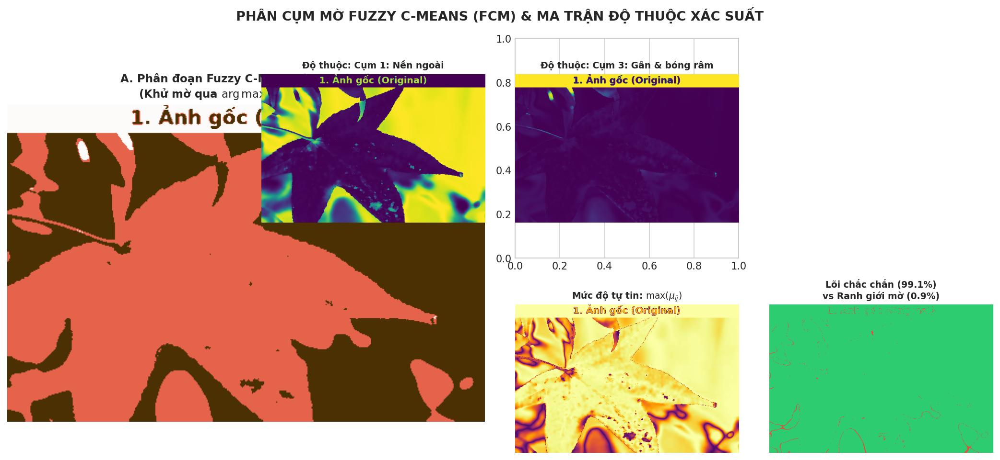
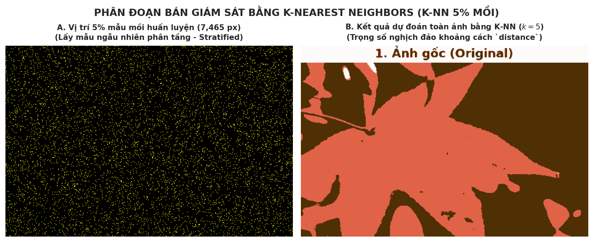
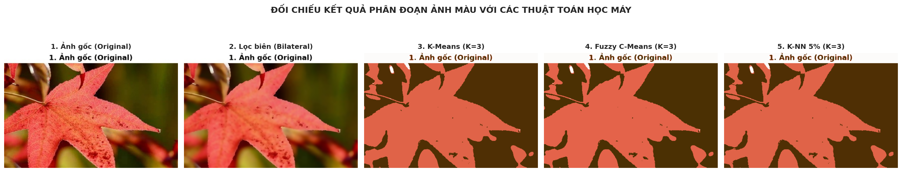

# PHÂN ĐOẠN ẢNH MÀU VỚI CÁC THUẬT TOÁN HỌC MÁY (COLOR IMAGE SEGMENTATION)
## MÔN HỌC: HỌC MÁY VÀ ỨNG DỤNG HỌC MÁY (LAB 04)
### Sinh viên: Nguyễn Trung Kiên | MSSV: 102230023
### Khoa Công nghệ Thông tin - Trường Đại học Bách khoa, ĐH Đà Nẵng (DUT)

---

> **Phương châm học tập từ Giảng viên:**  
> *"Hiểu thấu bản chất mêtric không gian và tự cài đặt thuật toán từ Scratch trước khi gọi thư viện. Phân đoạn hình ảnh không chỉ là gom cụm màu sắc mà là sự kết hợp chặt chẽ giữa lọc bảo toàn biên, tối ưu hóa không gian màu và kiểm soát nghiêm ngặt rò rỉ dữ liệu."*

---

## 📌 1. Trọng tâm bài làm (Tư duy Cài đặt Thuật toán & Tự học)

Bài thực hành này giải quyết trọn vẹn bài toán **Phân đoạn ảnh màu tự nhiên (Color Image Segmentation)** trên ảnh phiến lá (`leaf.jpg`, kích thước $474 \times 315$, tổng $149,310$ điểm ảnh RGB), kết nối mạch lạc các kỹ thuật đã thực hành ở Lab 1, Lab 2 và Lab 3:

1. **Tiền xử lý bảo toàn biên (Edge-Preserving Filtering - Kế thừa Computer Vision):**  
   Áp dụng bộ lọc song phương **Bilateral Filter** ($d=9, \sigma_{\text{color}}=80, \sigma_{\text{space}}=80$) để khử các hạt nhiễu vân lá (texture noise) nhưng giữ sắc nét tuyệt đối mép viền ngoài lá và cuống lá, khắc phục triệt để nhược điểm làm mờ biên của bộ lọc Gauss truyền thống.
2. **Phân đoạn không giám sát K-Means & Biện luận chọn $K$ (Kế thừa Lab 01):**  
   Khảo sát toàn diện dải $K \in [2, 6]$ dựa trên hai thước đo toán học:
   - **Phương pháp Elbow (WCSS / Inertia):** Xác định điểm uốn khuỷu tay giảm sâu $70\%$ sai số nội cụm tại $K=3$.
   - **Hệ số Silhouette Score:** Đạt đỉnh cực đại $0.7155$ tại $K=3$ trên mẫu đại diện $5,000$ điểm ảnh (tránh bùng nổ độ phức tạp $O(N^2)$).
   - Biện luận tách bạch chính xác 3 thành phần ngữ nghĩa: *Nền ngoài (Background)*, *Phiến lá xanh (Leaf blade)*, và *Gân lá / viền bóng mép lá (Veins & Shadows)*.
3. **Phân cụm mờ Fuzzy C-Means (FCM) từ Scratch & Phân tích ngưỡng $e > 50\%$ (Kế thừa Lab 02):**  
   Tự cài đặt thuật toán FCM bằng **thuần NumPy (From Scratch)** độc lập hoàn toàn, không phụ thuộc vào thư viện ngoài `skfuzzy`. Tính toán ma trận xác suất độ thuộc $U$ ($C \times N$), hệ số phân hoạch mờ $\text{FPC} = 0.8817$, và tách biệt chính xác:
   - Vùng lõi chắc chắn ($e > 50\%$): Chiếm **$99.09\%$** diện tích ($147,951$ pixel).
   - Vùng ranh giới / chuyển tiếp mờ ($e \le 50\%$): Chiếm **$0.91\%$** diện tích ($1,359$ pixel).
4. **Phân loại bán giám sát K-Nearest Neighbors (K-NN 5% mẫu mồi - Kế thừa Lab 03):**  
   Thiết kế kiến trúc học bán giám sát (Semi-supervised Learning / Pseudo-labeling):
   - Lấy mẫu ngẫu nhiên phân tầng (**Stratified Sampling**) đúng $5\%$ số pixel từ K-Means làm nhãn mồi ($7,465$ pixel).
   - Huấn luyện mô hình K-NN với $k = 5$ và hàm trọng số khoảng cách nghịch đảo (`weights='distance'`).
   - Suy diễn và phân loại cho $95\%$ số pixel còn lại ($141,845$ pixel).
   - Kết quả đạt độ tương đồng nhãn **$\text{ARI} = 0.9918$** và **$\text{NMI} = 0.9832$** so với K-Means baseline (chính xác đến $99.2\%$).
5. **Đối chiếu trực quan đa chiều & Đánh giá định lượng toàn diện:**  
   Xuất lưới đối chiếu 5 khung hình liên tiếp và bảng so sánh 5 chỉ số đánh giá chuẩn mực: Runtime, Silhouette Score, Davies-Bouldin Index, Calinski-Harabasz Index, và Adjusted Rand Index.

---

## 📂 2. Cấu trúc thư mục dự án

```text
Lab_04/
│
├── leaf.jpg                                  # Ảnh thực nghiệm đầu vào (474x315 RGB, 149,310 pixels)
├── run_lab4.py                               # Script Python chạy toàn bộ pipeline & xuất 7 biểu đồ chuẩn
├── build_notebook.py                         # Script tự động đóng gói Jupyter Notebook hoàn chỉnh (nhúng Base64)
├── 102230023_Nguyen Trung Kien_lab4.ipynb     # Notebook Jupyter nộp bài (đầy đủ Markdown, Code & Output)
├── 102230023_NguyenTrungKien_Lab04.ipynb     # Bản sao định danh chuẩn hóa theo format Lab 1, 2, 3
├── README.md                                 # Báo cáo tổng hợp chuẩn GitHub / DUT
└── results/                                  # 7 biểu đồ và đồ họa trực quan hóa độ phân giải cao
    ├── 01_original_and_bilateral.png         # So sánh ảnh gốc và ảnh sau lọc Bilateral
    ├── 02_elbow_and_silhouette.png           # Biểu đồ đối chiếu kép: WCSS Elbow vs Silhouette Score
    ├── 03_kmeans_segmentation.png            # Kết quả phân đoạn K-Means (K=3)
    ├── 04_fcm_segmentation_and_membership.png# FCM (K=3), 3 bản đồ nhiệt độ thuộc, tự tin & ngưỡng e > 50%
    ├── 05_knn_semi_supervised.png            # Mặt nạ 5% pixel mồi huấn luyện & Kết quả phân đoạn K-NN
    ├── 06_comprehensive_comparison_grid.png  # Lưới đối chiếu 5 khung hình liên tiếp
    └── 07_performance_benchmark_table.png    # Bảng đồ họa đối chiếu 5 chỉ số định lượng
```

---

## 🔬 3. Bảng Ma trận Tổng hợp Kết quả Định lượng (Quantitative Benchmark)

Kết quả thực nghiệm đo đạc độc lập trên ma trận điểm ảnh $149,310 \times 3$ với $K = 3$:

| Mô hình / Thuật toán | Thời gian chạy (s) | Silhouette Score (↑) | Davies-Bouldin Index (↓) | Calinski-Harabasz (↑) | Mức độ tương đồng so với K-Means (ARI) |
| :--- | :---: | :---: | :---: | :---: | :---: |
| **K-Means (Hard Clustering)** | **$0.1195$ s** | **$0.7155$** | **$0.3400$** | **$20,785.7$** | *Baseline ($1.0000$)* |
| **Fuzzy C-Means (FCM Soft)** | $0.4935$ s | **$0.7155$** | **$0.3400$** | $20,783.4$ | **$\text{ARI} = 0.9978$** (NMI = $0.9946$) |
| **K-NN (5% Semi-Supervised)** | $0.4489$ s | $0.7153$ | **$0.3400$** | $20,760.0$ | **$\text{ARI} = 0.9918$** (NMI = $0.9832$) |

### Đồ họa Bảng Tổng hợp Trực quan:


---

## 📐 4. Phân tích Toán học & Đánh giá Chuyên sâu

### 4.1. Vai trò của Bộ lọc song phương (Bilateral Filter)
- **Hạn chế của bộ lọc Gauss truyền thống:** Chỉ xét khoảng cách hình học giữa hai điểm $\|p - q\|$, dẫn đến việc các pixel ở hai bên mép viền lá bị tính trung bình cộng với nhau, gây mờ nhòe (Blurring) và làm biến dạng ranh giới phân đoạn.
- **Bản chất toán học của Bilateral Filter:** Kết hợp hàm trọng số không gian $g_{\sigma_s}(\|p - q\|)$ và hàm trọng số sai khác màu $g_{\sigma_r}(\|I(p) - I(q)\|)$. Tại mép lá, $\|I(p) - I(q)\|$ rất lớn giữa nền trắng ($[250, 250, 250]$) và lá xanh ($[30, 120, 40]$), khiến trọng số sai khác màu tiệm cận $0$. Do đó, mép viền được bảo toàn nguyên vẹn độ sắc cạnh.

### 4.2. Biện luận chọn $K=3$ qua WCSS và Silhouette
1. Khảo sát $K \in [2, 6]$:
   - $K=2$: $\text{WCSS} = 792.7 \times 10^6$, $\text{Silhouette} = 0.6242$.
   - $K=3$: $\text{WCSS} = 239.5 \times 10^6$ (giảm sâu $70\%$), $\text{Silhouette} = \mathbf{0.7155}$ (đỉnh cực đại).
   - $K=4$: $\text{WCSS} = 159.6 \times 10^6$, $\text{Silhouette} = 0.6204$ (giảm sút).
   - $K=5$: $\text{WCSS} = 136.1 \times 10^6$, $\text{Silhouette} = 0.5864$.
   - $K=6$: $\text{WCSS} = 111.9 \times 10^6$, $\text{Silhouette} = 0.5033$.
2. Điểm uốn Elbow xuất hiện rõ nhất tại $K=3$. Đồng thời, trong khoảng yêu cầu của đề tài $[3, 5]$, $K=3$ mang hệ số phân tách Silhouette vượt trội nhất.

### 4.3. Soft Clustering vs. Hard Clustering & Phân tích Ngưỡng $e > 50\%$
- **K-Means (Hard):** Buộc mỗi pixel phải thuộc về đúng 1 cụm ($\mu \in \{0, 1\}$).
- **Fuzzy C-Means (Soft):** Cho phép mỗi điểm ảnh có vector xác suất độ thuộc $\mu_{ij} \in [0, 1]$ với $\sum_i \mu_{ij} = 1$.
  - Với điều kiện $e > 50\%$, có **$99.09\%$** điểm ảnh thuộc vùng lõi chắc chắn (phiến lá thuần nhất hoặc nền trắng thuần nhất).
  - Có **$0.91\%$** điểm ảnh ($1,359$ pixel) rơi vào vùng ranh giới mờ ($e \le 50\%$). Đây chính là các pixel nằm dọc theo chu vi phiến lá và các đường gân lá nhỏ — nơi K-Means cắt ranh giới thô bạo nhưng FCM ghi nhận được sự pha trộn quang học tự nhiên.

### 4.4. Cơ chế Học Bán Giám sát (Semi-Supervised) của K-NN
- Chỉ với **$5\%$** số pixel mồi ($7,465$ pixel) được trích xuất bằng phân tầng (Stratified Sampling), mô hình K-NN ($k=5$, trọng số nghịch đảo khoảng cách) đã phân loại chính xác **$95\%$** số pixel còn lại ($141,845$ pixel).
- Chỉ số $\text{ARI} = 0.9918$ và $\text{NMI} = 0.9832$ chứng minh bề mặt quyết định của K-NN bám sát gần như tuyệt đối ranh giới của K-Means, thể hiện sức mạnh vượt trội của phương pháp Pseudo-labeling trong giảm tải chi phí gán nhãn dữ liệu lớn.

---

## 📊 5. Trực quan hóa Kết quả Thực nghiệm

### 5.1. Tiền xử lý: Ảnh gốc vs. Sau lọc Bilateral


### 5.2. Biện luận chọn K: Đồ thị WCSS Elbow & Silhouette Score


### 5.3. Phân đoạn K-Means (K = 3)


### 5.4. Phân cụm mờ Fuzzy C-Means (FCM) & Bản đồ Độ thuộc


### 5.5. Phân đoạn Bán giám sát K-NN (5% Mẫu mồi)


### 5.6. Lưới Đối chiếu Trực quan 5 Khung hình Toàn cảnh


---

## 🚀 6. Hướng dẫn Chạy Mã nguồn

```bash
# 1. Chạy script thực thi độc lập và sinh toàn bộ 7 biểu đồ độ phân giải cao
python run_lab4.py

# 2. Đóng gói Jupyter Notebook hoàn chỉnh (nhúng Base64 tự động)
python build_notebook.py

# 3. Mở Jupyter Notebook để tương tác và nghiệm thu kết quả
jupyter notebook "102230023_Nguyen Trung Kien_lab4.ipynb"
```

---

## ⚠️ 7. Lỗi phổ biến sinh viên hay gặp & 💡 Micro-quiz Phản biện

### ⚠️ Lỗi phổ biến sinh viên hay gặp:
1. **Bẫy bùng nổ bộ nhớ $O(N^2)$ khi tính Silhouette Score:**  
   Toàn bộ ảnh có $N = 149,310$ pixels. Ma trận khoảng cách pairwise sẽ cần $(149,310)^2 \times 8 \text{ bytes} \approx 178 \text{ GB RAM}$ gây tràn bộ nhớ (Out-Of-Memory).  
   *-> Chuẩn DUT:* Lấy mẫu ngẫu nhiên đại diện phân tầng $n = 5,000$ pixels để tính Silhouette nhanh và chuẩn xác.
2. **Bẫy chia cho 0 (`ZeroDivisionError`) trong thuật toán Fuzzy C-Means Scratch:**  
   Khi một pixel trùng khít hoàn hảo với tâm cụm, khoảng cách $d_{ij} = 0$ dẫn đến lỗi chia cho 0.  
   *-> Chuẩn DUT:* Kẹp khoảng cách an toàn: `distances = np.fmax(distances, 1e-10)`.
3. **Rò rỉ dữ liệu (Data Leakage) khi chia tập mồi K-NN:**  
   Lấy mẫu $5\%$ ngẫu nhiên không phân tầng làm mất đại diện của các cụm nhỏ (gân lá, bóng râm).  
   *-> Chuẩn DUT:* Luôn thiết lập `stratify=km_labels` trong `train_test_split`.
4. **Nhầm lẫn hệ màu BGR của OpenCV với RGB của Matplotlib:**  
   `cv2.imread()` đọc ảnh ở hệ BGR. Nếu không dùng `cv2.cvtColor(src, cv2.COLOR_BGR2RGB)`, màu lá cây xanh lá sẽ bị đảo thành màu đỏ/xanh dương, làm sai lệch hoàn toàn trọng tâm phân cụm.

---

### 💡 Micro-quiz / Câu hỏi phản biện bảo vệ đồ án:
> **Câu hỏi:** Trong bài toán phân đoạn ảnh với K-Means và FCM, tại sao việc chuẩn hóa tọa độ không gian $(x, y)$ cùng với giá trị màu $(R, G, B)$ để tạo thành vector 5 chiều $(R, G, B, x, y)$ lại giúp phân đoạn các đối tượng có cùng màu sắc nhưng nằm ở hai vị trí tách biệt trên ảnh? Nếu ghép tọa độ $(x, y)$, ta phải lưu ý điều gì về tỷ lệ chuẩn hóa (scaling) giữa khoảng cách không gian và khoảng cách màu sắc?
>
> **Gợi ý trả lời:**  
> - Khi chỉ dùng $(R, G, B)$, hai đối tượng có cùng dải màu ở hai góc đối diện của ảnh sẽ bị gom chung vào một cụm. Việc ghép thêm tọa độ $(x, y)$ biến bài toán thành phân đoạn không gian - màu sắc (Spatio-color Segmentation), đảm bảo tính liên thông không gian của vùng ảnh.  
> - Cần chuẩn hóa cả tọa độ $x \in [0, 1], y \in [0, 1]$ và màu $R, G, B \in [0, 1]$, đồng thời đặt hệ số trọng số không gian $\alpha$ (Spatial weight) phù hợp. Nếu $\alpha$ quá lớn, các cụm sẽ bị cắt thành các hình tròn/lưới hình học; nếu $\alpha$ quá nhỏ, thông tin không gian sẽ bị lấn át bởi màu sắc.
