# 🗺️ Lộ trình Đào tạo & Khung Chương trình: Quản trị mạng (NMA-DUT)

> **Mã học phần**: NMA-DUT  
> **Thời lượng**: 15 tuần (3 tín chỉ lý thuyết + 1.5 tín chỉ thực hành)  
> **Đối tượng**: Sinh viên khối ngành CNTT, Kỹ thuật Máy tính, Hệ thống Thông tin, Kỹ thuật Mạng & Viễn thông — Đại học Bách khoa – ĐH Đà Nẵng.

---

## 🎯 Chuẩn Đầu Ra Học Phần (Course Learning Outcomes - CLOs)

| Mã CLO | Mô tả Chuẩn đầu ra | Cấp độ Bloom |
| :--- | :--- | :--- |
| **CLO-1** | Hiểu và phân tích mô hình quản lý mạng chuẩn quốc tế **FCAPS** và kiến trúc mạng doanh nghiệp. | $C2 - C4$ |
| **CLO-2** | Thiết kế, chia subnet (VLSM/CIDR), cấu hình và kiểm thử các dịch vụ hạ tầng mạng cốt lõi: **VLAN, Inter-VLAN, DHCP, DNS**. | $C3 - C5$ |
| **CLO-3** | Triển khai và quản trị dịch vụ định danh tập trung: **Active Directory DS (Windows Server)**, **GPO**, **OpenLDAP / SAMBA (Linux)**. | $C3 - C5$ |
| **CLO-4** | Cấu hình, bảo mật và tối ưu các dịch vụ ứng dụng & lưu trữ: **Web (IIS/Nginx/Apache + SSL/TLS)**, **File Server (NTFS vs Share, Quota)**, **Mail Server (SMTP/IMAP/SPF/DKIM)**. | $C3 - C4$ |
| **CLO-5** | Thiết lập hệ thống giám sát (**SNMP, Syslog, Wireshark**), tường lửa (**iptables/ufw/Windows Firewall**), **VPN (IPsec/OpenVPN)** và chiến lược **Backup & Disaster Recovery**. | $C4 - C5$ |
| **CLO-6** | Năng lực chẩn đoán và khắc phục sự cố hệ thống mạng (**Troubleshooting & Root Cause Analysis**) theo phương pháp luận khoa học. | $C5 - C6$ |

---

## 📅 Ma trận Lộ trình 15 Tuần Học tập

```mermaid
gantt
    title LỘ TRÌNH 15 TUẦN HỌC PHẦN QUẢN TRỊ MẠNG (NMA-DUT)
    dateFormat  X
    axisFormat W%W
    
    section [Mod-1] Cơ sở & FCAPS
    W1 - Tổng quan & Môi trường Lab       :active, m1_1, 0, 1
    
    section [Mod-2] Hạ tầng Cốt lõi
    W2 - Subnetting, VLAN, Trunking       :m2_1, after m1_1, 1d
    W3 - Định tuyến liên VLAN & OSPF cơ bản:m2_2, after m2_1, 1d
    W4 - DHCP Server & DHCP Relay Agent   :m2_3, after m2_2, 1d
    W5 - DNS Server & Phân giải tên miền   :m2_4, after m2_3, 1d
    
    section [Mod-3] Định danh & Thư mục
    W6 - Active Directory DS & Domain Ctrl:m3_1, after m2_4, 1d
    W7 - Chính sách nhóm Group Policy (GPO):m3_2, after m3_1, 1d
    W8 - OpenLDAP & SAMBA Domain Linux    :m3_3, after m3_2, 1d
    W9 - ĐÁNH GIÁ THỰC HÀNH GIỮA KỲ        :crit, exam, after m3_3, 1d
    
    section [Mod-4] Dịch vụ & Lưu trữ
    W10 - Web Server & SSL/TLS (HTTPS)    :m4_1, after exam, 1d
    W11 - File Server, Phân quyền & Quota :m4_2, after m4_1, 1d
    W12 - Mail Server, MX, SPF, DKIM, DMARC:m4_3, after m4_2, 1d
    
    section [Mod-5] Giám sát & An ninh
    W13 - Giám sát SNMP, Syslog & Wireshark:m5_1, after m4_3, 1d
    W14 - Firewall (iptables/Windows) & VPN:m5_2, after m5_1, 1d
    W15 - Backup, Phục hồi & Báo cáo Đồ án:m5_3, after m5_2, 1d
```

---

## 📖 Chi tiết Nội dung & Bài học Từng Tuần

### 🔷 GIAI ĐOẠN 1: Cơ sở Quản trị & Hạ tầng Mạng Cốt lõi (Tuần 1 - Tuần 5)

#### 📌 Tuần 1: Tổng quan Quản trị Mạng, Mô hình FCAPS & Thiết lập Môi trường
- **Lý thuyết**:
  - Khái niệm Quản trị mạng; vai trò của Network Administrator / Sysadmin / DevOps trong doanh nghiệp.
  - Mô hình chuẩn quốc tế **FCAPS** (Fault, Configuration, Accounting, Performance, Security).
  - Khái niệm High Availability (HA), Redundancy, SLA, MTBF, MTTR.
- **Thực hành Lab 01**:
  - Cài đặt và chuẩn hóa môi trường: VMware Workstation / VirtualBox, Cisco Packet Tracer, GNS3/EVE-NG.
  - Chuẩn bị Template máy ảo: Windows Server 2022 và Ubuntu Server 22.04 LTS (cấu hình Network Adapter: Host-only, NAT, Bridged, Custom LAN Segments).
- **Mục tiêu đạt được**: Nắm vững kiến trúc mạng phòng Lab, biết cách tạo mạng cô lập để test dịch vụ an toàn.

#### 📌 Tuần 2: Thiết kế Địa chỉ IP (VLSM/CIDR), VLAN & 802.1Q Trunking
- **Lý thuyết**:
  - Kỹ thuật phân hoạch mạng con theo độ dài mặt nạ thay đổi (VLSM) và tối ưu hóa không gian IP.
  - Bản chất VLAN (Layer 2 Broadcast Domain Isolation), chuẩn đóng gói IEEE 802.1Q.
  - Access Port vs Trunk Port, Native VLAN, rủi ro VLAN Hopping.
- **Thực hành Lab 02**:
  - Thiết kế và cấu hình VLAN trên Cisco Switch (VLAN 10: IT, VLAN 20: Sales, VLAN 30: Guest).
  - Cấu hình Trunking và gán port Access.
- **Mục tiêu đạt được**: Phân tách luồng dữ liệu L2, kiểm soát miền quảng bá triệt để.

#### 📌 Tuần 3: Định tuyến Liên VLAN (Inter-VLAN Routing) & Static/Dynamic Routing
- **Lý thuyết**:
  - Cơ chế Router-on-a-Stick (Sub-interfaces) vs Layer 3 Switch SVI (Switched Virtual Interface).
  - So sánh hiệu năng: L2 Switch + Router vs L3 Multi-Layer Switch.
  - Định tuyến tĩnh (Static Route) & Giao thức OSPF cơ bản (Single Area 0).
- **Thực hành Lab 03**:
  - Cấu hình Inter-VLAN Routing bằng cả 2 phương pháp (Router-on-a-Stick và L3 Switch SVI).
  - Thiết lập Static Route và kiểm tra bảng định tuyến (`show ip route`, `traceroute`).
- **Mục tiêu đạt được**: Cho phép các phòng ban khác VLAN giao tiếp có kiểm soát.

#### 📌 Tuần 4: Dịch vụ Cấp phát IP Động (DHCP Server & DHCP Relay Agent)
- **Lý thuyết**:
  - Giao thức DHCP (UDP 67/68), tiến trình bắt tay 4 bước **DORA** (Discover, Offer, Request, Acknowledge).
  - Các tham số DHCP Options: Option 3 (Router/Gateway), Option 6 (DNS Server), Option 15 (Domain Name), Option 66/67 (PXE Boot).
  - Cơ chế DHCP Relay Agent (vấn đề Broadcast không thể qua Router/L3 boundary, chuyển đổi sang Unicast).
  - Kỹ thuật phân tải DHCP: Split Scope (quy tắc 80/20) và DHCP Failover (Hot Standby vs Load Sharing).
- **Thực hành Lab 04**:
  - Cài đặt DHCP Server trên Windows Server 2022 (Scope, Exclusion Range, Reservation).
  - Cài đặt DHCP Server trên Linux (isc-dhcp-server / kea).
  - Cấu hình `ip helper-address` trên Cisco Router / L3 Switch để làm Relay Agent.
- **Mục tiêu đạt được**: Tự động hóa cấp phát IP đa VLAN tập trung từ 1 máy chủ duy nhất.

#### 📌 Tuần 5: Dịch vụ Phân giải Tên miền (DNS Server)
- **Lý thuyết**:
  - Cây phân cấp DNS toàn cầu (Root `.` $\rightarrow$ TLD $\rightarrow$ Second-Level $\rightarrow$ Subdomain).
  - Đệ quy (Recursive Query) vs Lặp (Iterative Query).
  - Các loại Zone: Forward Lookup Zone, Reverse Lookup Zone, Primary, Secondary, Stub Zone.
  - Các loại bản ghi (Resource Records): `A`, `AAAA`, `CNAME`, `MX`, `NS`, `PTR`, `SOA`, `SRV`.
  - Cơ chế Root Hints, Forwarders, Conditional Forwarders, DNS Cache Poisoning và DNSSEC cơ bản.
- **Thực hành Lab 05**:
  - Dựng DNS Server trên Windows Server 2022 & Bind9 trên Ubuntu Server.
  - Tạo Domain nội bộ `dut.edu.vn`, tạo các bản ghi cho Web, Mail, FTP.
  - Cấu hình Zone Transfer giữa Primary DNS và Secondary DNS.
  - Kiểm tra bằng lệnh chuyên sâu: `nslookup`, `dig`, `resolve-dnsname`.
- **Mục tiêu đạt được**: Làm chủ hạ tầng định danh tên miền - linh hồn của toàn bộ dịch vụ mạng.

---

### 🔷 GIAI ĐOẠN 2: Dịch vụ Định danh & Thư mục Doanh nghiệp (Tuần 6 - Tuần 9)

#### 📌 Tuần 6: Active Directory Domain Services (AD DS) & Domain Controller (DC)
- **Lý thuyết**:
  - Khái niệm thư mục tập trung vs Workgroup; Lợi ích của Single Sign-On (SSO).
  - Kiến trúc AD DS: Logical (Forest, Tree, Domain, Organizational Unit - OU) vs Physical (Site, Subnet, Domain Controller).
  - 5 vai trò FSMO (Schema Master, Domain Naming, RID, PDC Emulator, Infrastructure Master).
  - Cơ chế xác thực Kerberos v5 (KDC, AS-REQ/AS-REP, TGS-REQ/TGS-REP) vs NTLM.
- **Thực hành Lab 06**:
  - Nâng cấp Windows Server thành Primary Domain Controller (`dut.local`).
  - Thiết kế cây cấu trúc OU chuẩn doanh nghiệp (BOD, IT, HR, Sales, Computers, ServiceAccounts).
  - Tạo User, Security Group, gán thuộc tính và gia nhập (Join Domain) cho máy Windows 10/11 Client.
- **Mục tiêu đạt được**: Xây dựng nền tảng quản trị tài nguyên và người dùng tập trung cho doanh nghiệp.

#### 📌 Tuần 7: Chính sách Nhóm Group Policy Objects (GPO)
- **Lý thuyết**:
  - Cơ chế thực thi GPO: Thứ tự **LSDOU** (Local $\rightarrow$ Site $\rightarrow$ Domain $\rightarrow$ OU).
  - Quy tắc ghi đè (Precedence), Kế thừa chính sách (Inheritance), Block Inheritance và Enforced (No Override).
  - Lọc chính sách: Security Filtering (theo User/Group) và WMI Filters (theo OS, phần cứng).
  - GPO Loopback Processing Mode (Replace vs Merge).
- **Thực hành Lab 07**:
  - Thiết lập chính sách mật khẩu và khóa tài khoản (Password Policy & Account Lockout).
  - Vô hiệu hóa USB, Control Panel, Task Manager cho phòng ban thường.
  - Tự động map ổ đĩa mạng (Drive Mapping) và triển khai cài đặt phần mềm từ xa (.msi) qua GPO.
  - Kiểm tra bằng `gpupdate /force`, `gpresult /r`, `RSOP.msc`.
- **Mục tiêu đạt được**: Áp đặt đồng loạt chính sách bảo mật và môi trường làm việc xuống hàng nghìn máy trạm.

#### 📌 Tuần 8: Dịch vụ Thư mục Linux (OpenLDAP) & Tích hợp SAMBA Domain
- **Lý thuyết**:
  - Giao thức LDAP (Lightweight Directory Access Protocol - TCP 389/636), định dạng ldif, Base DN, CN, OU, DC.
  - SAMBA: Cầu nối giữa thế giới Linux/Unix và Windows (giao thức SMB/CIFS).
  - Mô hình máy chủ Linux tham gia AD Domain (Realmd, SSSD, Kerberos, Winbind).
- **Thực hành Lab 08**:
  - Cài đặt và cấu hình OpenLDAP + phpLDAPadmin trên Ubuntu Server.
  - Cấu hình Ubuntu Server gia nhập Domain Active Directory của Windows Server qua `sssd` / `realmd`.
  - Đăng nhập vào máy Linux bằng tài khoản User thuộc Windows Domain.
- **Mục tiêu đạt được**: Vận hành môi trường mạng lai đa nền tảng (Heterogeneous Environment: Windows + Linux).

#### 📌 Tuần 9: Đánh giá Năng lực Thực hành Giữa kỳ (Midterm Exam)
- **Hình thức**: Thi thực hành trực tiếp trên máy ảo (Live Lab Exam) trong 90 phút.
- **Nội dung**: Thiết kế topo mạng đa VLAN $\rightarrow$ Định tuyến $\rightarrow$ Cấu hình DHCP + DNS $\rightarrow$ Dựng Domain Controller $\rightarrow$ Join Client $\rightarrow$ Áp chính sách GPO.

---

### 🔷 GIAI ĐOẠN 3: Dịch vụ Ứng dụng & Lưu trữ Doanh nghiệp (Tuần 10 - Tuần 12)

#### 📌 Tuần 10: Dịch vụ Web Server & Bảo mật SSL/TLS
- **Lý thuyết**:
  - So sánh kiến trúc: Microsoft IIS (Process Model), Apache (Multi-Processing Modules - MPM), Nginx (Event-driven, Asynchronous).
  - Kỹ thuật Virtual Hosting / Server Blocks (dựa trên Name, IP, Port).
  - Cơ chế Reverse Proxy, Load Balancing căn bản.
  - Mật mã học trong HTTPS: Chứng chỉ số X.509, CA (Certificate Authority), Public/Private Key, Quy trình bắt tay TLS 1.3 Handshake.
- **Thực hành Lab 09**:
  - Cấu hình Web Server IIS trên Windows Server và Nginx trên Ubuntu Server.
  - Triển khai nhiều Website trên cùng 1 IP (`web1.dut.edu.vn`, `web2.dut.edu.vn`).
  - Tự tạo chứng chỉ số CA nội bộ (Active Directory Certificate Services - AD CS hoặc OpenSSL) và cấu hình HTTPS cho website.
- **Mục tiêu đạt được**: Đảm bảo dịch vụ web nội bộ và public hoạt động an toàn, mã hóa đầu cuối.

#### 📌 Tuần 11: Dịch vụ Lưu trữ File & Phân quyền Truy cập Chuyên sâu
- **Lý thuyết**:
  - Giao thức chia sẻ File: SMB/CIFS (Windows/Linux) và NFS (Linux/Unix).
  - Ma trận phân quyền: **NTFS Permissions** (áp dụng cục bộ/tập tin) vs **Share Permissions** (áp dụng qua đường mạng) $\rightarrow$ Quy tắc tính quyền hiệu dụng (**Effective Permissions = Most Restrictive**).
  - Tính năng Access-Based Enumeration (ABE) - ẩn thư mục khi không có quyền xem.
  - Quản lý tài nguyên lưu trữ với **FSRM** (File Server Resource Manager): Hard/Soft Quota, File Screening (chặn file mp3, exe, avi,...).
- **Thực hành Lab 10**:
  - Cấu hình File Server trên Windows Server 2022: Tạo thư mục chia sẻ cho các phòng ban, phân quyền NTFS + Share chuẩn xác, bật ABE.
  - Thiết lập Quota giới hạn 5GB/phòng ban và chặn upload file định dạng lạ bằng FSRM.
  - Dựng NFS Server trên Linux chia sẻ thư mục cho máy trạm Linux mount tự động qua `/etc/fstab`.
- **Mục tiêu đạt được**: Thiết lập hệ thống lưu trữ tập trung an toàn, không bị tràn ổ đĩa và rò rỉ dữ liệu.

#### 📌 Tuần 12: Dịch vụ Thư điện tử (Mail Server) & Kỹ thuật Chống SPAM
- **Lý thuyết**:
  - Kiến trúc hệ thống Mail: MUA (Mail User Agent), MTA (Mail Transfer Agent), MDA (Mail Delivery Agent).
  - Các giao thức: SMTP (TCP 25, 587, 465), POP3 (TCP 110, 995), IMAP (TCP 143, 993).
  - Bộ 3 bản ghi DNS sống còn cho Mail Server: `MX Record`, `SPF` (Sender Policy Framework), `DKIM` (DomainKeys Identified Mail), `DMARC`.
  - Cơ chế Relay Mail và rủi ro Open Relay.
- **Thực hành Lab 11**:
  - Dựng Mail Server nội bộ bằng Postfix (MTA) + Dovecot (MDA) + Roundcube (Webmail) trên Ubuntu Server.
  - Khởi tạo bản ghi MX, PTR trên DNS Server nội bộ.
  - Gửi nhận email giữa các User trong Domain, kiểm tra Header email và phân tích mã lỗi SMTP.
- **Mục tiêu đạt được**: Nắm vững luồng đi của email và biết cách phòng chống giả mạo email doanh nghiệp.

---

### 🔷 GIAI ĐOẠN 4: Giám sát, Bảo mật & Vận hành Bền vững (Tuần 13 - Tuần 15)

#### 📌 Tuần 13: Giám sát Mạng (Network Monitoring), Syslog & Phân tích Gói tin (Wireshark)
- **Lý thuyết**:
  - Giao thức SNMP (UDP 161/162): Kiến trúc NMS - Agent, MIB (Management Information Base), OID (Object Identifier).
  - So sánh SNMPv1/v2c (bảo mật kém bằng Community String) vs SNMPv3 (xác thực `auth` + mã hóa `priv`).
  - Chuẩn ghi log tập trung Syslog (RFC 5424): Facility và 8 mức độ Severity (0: Emergency $\rightarrow$ 7: Debug).
  - Phân tích lưu lượng chuyên sâu với Wireshark: TCP 3-Way Handshake, TCP Window Size, TCP Retransmission, ICMP Type/Code.
- **Thực hành Lab 12**:
  - Cấu hình SNMP Agent trên Router Cisco và Linux Server; cài đặt Zabbix Server / PRTG để giám sát CPU, RAM, Interface Bandwidth.
  - Dựng Rsyslog Server tập trung nhận log từ các máy chủ và Switch trong mạng.
  - Sử dụng Wireshark bắt và phân tích gói tin trong các tình huống: Xin IP DHCP lỗi, tấn công SYN Flood, lỗi phân giải DNS.
- **Mục tiêu đạt được**: Làm chủ "mắt thần" của hệ thống, phát hiện bất thường trước khi người dùng phàn nàn.

#### 📌 Tuần 14: An ninh Mạng, Tường lửa (Firewall) & Mạng Riêng Ảo (VPN)
- **Lý thuyết**:
  - Phân loại tường lửa: Packet Filtering (Stateless) vs Stateful Packet Inspection (SPI) vs Next-Gen Firewall (NGFW).
  - Kiến trúc Netfilter/iptables trên Linux: Tables (Filter, NAT, Mangle) và Chains (INPUT, OUTPUT, FORWARD, PREROUTING, POSTROUTING).
  - Windows Defender Firewall with Advanced Security: Inbound Rules, Outbound Rules, Connection Security Rules.
  - Mạng riêng ảo (VPN): Site-to-Site vs Remote Access (Client-to-Site).
  - Khung bảo mật **IPsec**: IKEv1/v2, Phase 1 (ISAKMP SA), Phase 2 (IPsec SA), AH (Authentication Header) vs ESP (Encapsulating Security Payload), Tunnel Mode vs Transport Mode.
  - OpenVPN (SSL/TLS based).
- **Thực hành Lab 13**:
  - Cấu hình iptables/ufw trên Linux Server: Chỉ cho phép SSH từ IP quản trị, mở port Web 80/443, chặn ping ICMP flood, cấu hình NAT Masquerade.
  - Thiết lập Windows Firewall Rules cho Domain Profile.
  - Triển khai Remote Access VPN (OpenVPN hoặc L2TP/IPsec) cho nhân viên làm việc từ xa truy cập vào mạng nội bộ an toàn.
- **Mục tiêu đạt được**: Thiết lập ranh giới phòng thủ vững chắc và kết nối an toàn cho hạ tầng mạng.

#### 📌 Tuần 15: Sao lưu & Phục hồi Thảm họa (Backup & DR) - Báo cáo Đồ án Cuối kỳ
- **Lý thuyết**:
  - Quy tắc vàng sao lưu: **Chiến lược 3-2-1** (3 bản sao, 2 loại phương tiện, 1 bản lưu off-site).
  - Phân loại sao lưu: Full Backup, Differential Backup, Incremental Backup.
  - Các chỉ số phục hồi: **RPO** (Recovery Point Objective) và **RTO** (Recovery Time Objective).
  - Sao lưu trạng thái hệ thống Windows (System State Backup) và khôi phục Active Directory (Authoritative vs Non-Authoritative Restore).
- **Thực hành Lab 14**:
  - Lập lịch sao lưu tự động bằng Windows Server Backup và công cụ `rsync` + `crontab` trên Linux.
  - Thực hành kịch bản giả lập thảm họa: Xóa nhầm OU quan trọng trong Active Directory và tiến hành phục hồi.
- **Báo cáo Đồ án / Tổng kết**:
  - Sinh viên nghiệm thu Đồ án Thiết kế và Vận hành Hệ thống Mạng Doanh nghiệp Đa chi nhánh (Enterprise Multi-Site Infrastructure).
- **Mục tiêu đạt được**: Đảm bảo tính liên tục của hoạt động kinh doanh (Business Continuity) khi xảy ra sự cố nghiêm trọng.

---

## 📊 Cơ cấu Đánh giá & Tiêu chí Điểm số

| Thành phần Đánh giá | Trọng số | Hình thức & Tiêu chí |
| :--- | :--- | :--- |
| **Chuyên cần & Thái độ** | $10\%$ | Đi học đúng giờ, tham gia thảo luận, trả lời các câu hỏi Micro-quiz. |
| **Thực hành Lab định kỳ** | $20\%$ | Hoàn thành 12 bài Lab thực hành, nộp Báo cáo Lab kèm ảnh chụp Wireshark/Lệnh xác thực. |
| **Kiểm tra Giữa kỳ** | $20\%$ | Thi thực hành Live Lab 90 phút (Cấu hình mạng đa dịch vụ). |
| **Đồ án Môn học / Thi Cuối kỳ** | $50\%$ | **Đồ án Thiết kế Hệ thống Mạng Doanh nghiệp Toàn diện** (Báo cáo kỹ thuật + Demo bảo vệ trực tiếp trước Hội đồng giảng viên). |

---

## 🏆 Tiêu chuẩn Đồ án Cuối kỳ (Enterprise Capstone Project)

Sinh viên xây dựng hệ thống mạng hoàn chỉnh cho một doanh nghiệp giả định (quy mô 300 - 500 nhân sự, gồm 1 Trụ sở chính tại Đà Nẵng và 1 Chi nhánh tại TP.HCM/Hà Nội):
1. **Phần cứng & Ảo hóa**: Hoạt động đồng bộ trên VMware Workstation / EVE-NG.
2. **Hạ tầng mạng**: Chia VLAN theo phòng ban, Trunking 802.1Q, Inter-VLAN Routing, OSPF kết nối WAN, DHCP Relay.
3. **Quản trị định danh**: Cặp Domain Controller (Primary DC + Additional DC) đồng bộ hóa Active Directory, triển khai tối thiểu 5 chính sách GPO thiết thực.
4. **Dịch vụ mạng**: Web Server HTTPS (chứng chỉ CA nội bộ), File Server phân quyền chặt chẽ có Quota và ABE, Mail Server gửi nhận an toàn.
5. **Giám sát & Bảo mật**: Tường lửa đóng toàn bộ port thừa, Site-to-Site IPsec VPN kết nối 2 chi nhánh, hệ thống Zabbix/Syslog giám sát 24/7.
6. **Kế hoạch DR**: Bản kế hoạch sao lưu 3-2-1 tự động hóa hoàn toàn.
