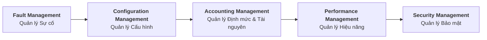
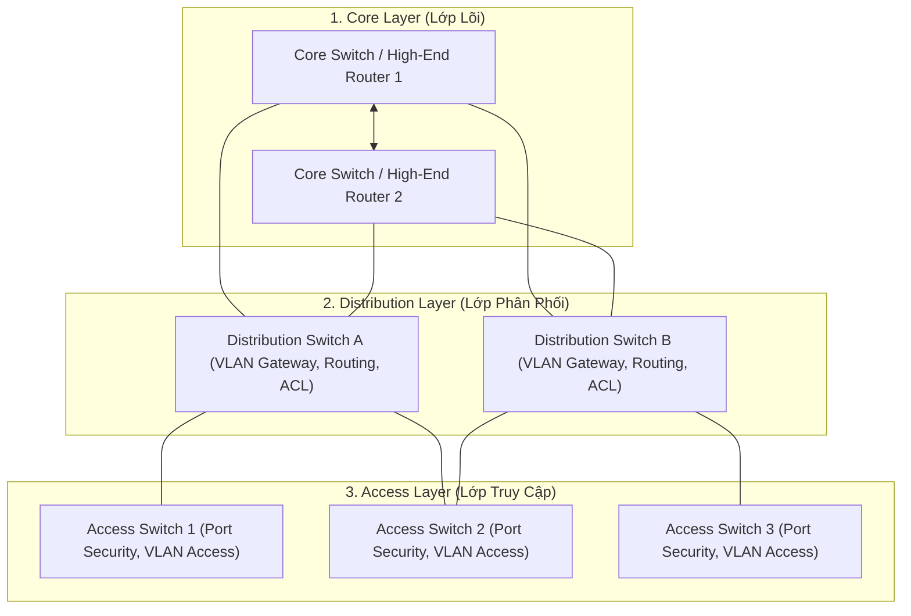

# 📘 [Mod-1] Cơ sở Quản trị Mạng & Mô hình FCAPS

> **Thuộc khung chương trình**: NMA-DUT (Quản trị mạng Đại học Bách khoa – ĐH Đà Nẵng)  
> **Mục tiêu**: Hiểu sâu tư duy quản trị mạng hiện đại, nắm vững 5 trụ cột FCAPS theo chuẩn ISO và các chỉ số sống còn của hệ thống (SLA, High Availability).

---

## 1. Bản chất của Quản trị Mạng (Network Administration)

Quản trị mạng không chỉ đơn thuần là "nối dây mạng và gõ lệnh cấu hình". Trong môi trường doanh nghiệp thực tế, Quản trị mạng là **nghệ thuật và khoa học duy trì tính toàn vẹn, tính sẵn sàng (Availability), hiệu năng (Performance) và tính an toàn (Security)** của toàn bộ dòng chảy dữ liệu tổ chức.

### 💡 Ẩn dụ Kỹ thuật
> Hãy hình dung hạ tầng mạng giống như **Hệ thống Giao thông Đô thị**:
> - Router/Switch là các vòng xuyến, ngã tư và đèn tín hiệu điều hướng xe cộ.
> - Băng thông (Bandwidth) là độ rộng của làn đường.
> - Giao thức (Protocols) là luật giao thông mà mọi phương tiện phải tuân thủ.
> - Người quản trị mạng (Network Admin) chính là **Trung tâm Điều hành Giao thông**: Không chỉ mở đường mà còn phải dự báo tắc nghẽn, xử lý tai nạn, ngăn chặn xe chở hàng cấm và nâng cấp làn đường mà không làm gián đoạn dòng xe đang chạy.

---

## 2. Mô hình Chuẩn Quốc tế FCAPS (ISO/ITU-T)

Mô hình **FCAPS** là kim chỉ nam phân loại mọi hoạt động quản trị hạ tầng mạng:

### Chi tiết 5 Trụ cột FCAPS:

| Thành phần FCAPS | Bản chất & Mục tiêu | Các tác vụ kỹ thuật điển hình | Công cụ / Giao thức sử dụng |
| :--- | :--- | :--- | :--- |
| **F - Fault Management** | Phát hiện, cô lập, chẩn đoán và khắc phục các sự cố phần cứng/phần mềm trước khi ảnh hưởng người dùng. | - Nhận cảnh báo SNMP Trap / Syslog. - Cô lập cổng switch bị loop mạng. - Phân tích Root Cause Analysis (RCA). | Syslog, SNMP Trap, Wireshark, Zabbix, Ping/Traceroute. |
| **C - Configuration Management** | Quản lý, theo dõi, sao lưu và kiểm soát phiên bản toàn bộ cấu hình thiết bị mạng và máy chủ. | - Sao lưu cấu hình Router/Switch (running-config). - Quản lý phiên bản hạ tầng qua Infrastructure as Code (IaC). - Cập nhật firmware/OS bản vá. | TFTP, SCP, Ansible, Git, Oxidized, Cisco Archive. |
| **A - Accounting Management** | Đo lường, phân bổ định mức tài nguyên và theo dõi mức độ sử dụng mạng của các phòng ban. | - Thống kê ai dùng bao nhiêu băng thông. - Đặt hạn ngạch dung lượng lưu trữ (Quota). - Tính toán chi phí IT cho từng đơn vị. | NetFlow, sFlow, IPFIX, RADIUS (AAA), FSRM Quota. |
| **P - Performance Management** | Đo lường các chỉ số vận hành để tối ưu hóa, đảm bảo mạng luôn hoạt động ở trạng thái tốt nhất. | - Giám sát CPU/RAM máy chủ. - Đo độ trễ (Latency), Rung pha (Jitter), Tỉ lệ rớt gói (Packet Loss), Throughput. - Cấu hình QoS ưu tiên gói tin Voice/Video. | SNMP Polling, Zabbix, Prometheus, Grafana, PRTG, iperf3. |
| **S - Security Management** | Kiểm soát quyền truy cập tài nguyên mạng, bảo vệ hệ thống trước các nguy cơ tấn công và rò rỉ dữ liệu. | - Thiết lập Tường lửa (Firewall), Access Control List (ACL). - Quản trị định danh (Active Directory, 802.1X). - Mã hóa đường truyền (VPN IPsec, SSL/TLS). | iptables, Windows Firewall, Snort/Suricata, OpenVPN, WPA3/802.1X. |

---

## 3. Các Chỉ số Vận hành Hệ thống Sống còn (Key Metrics)

Khi thiết kế và vận hành mạng theo chuẩn doanh nghiệp, sinh viên DUT cần nắm vững các công thức và chỉ số sau:

### 1. Tính Sẵn Sàng (High Availability - HA) & Định luật "Số 9"
Được tính bằng tỉ lệ phần trăm thời gian hệ thống hoạt động bình thường trên tổng thời gian:

$$\text{Availability (\%)} = \frac{\text{Uptime}}{\text{Uptime} + \text{Downtime}} \times 100\%$$

- **99% (Two Nines)**: Thời gian sập mạng cho phép $\approx 3.65$ ngày/năm (Không chấp nhận được trong doanh nghiệp).
- **99.9% (Three Nines)**: Sập mạng $\approx 8.76$ giờ/năm.
- **99.99% (Four Nines)**: Sập mạng $\approx 52.56$ phút/năm.
- **99.999% (Five Nines - Chuẩn Vàng Viễn thông)**: Sập mạng tối đa $\approx 5.26$ phút/năm!

### 2. MTBF vs MTTR
- **MTBF (Mean Time Between Failures)**: Thời gian trung bình giữa các lần gặp sự cố (Đo lường độ bền/độ tin cậy của hệ thống).
- **MTTR (Mean Time To Repair)**: Thời gian trung bình để phát hiện và khắc phục xong sự cố (Đo lường năng lực của đội ngũ quản trị mạng).

$$\text{Availability} = \frac{\text{MTBF}}{\text{MTBF} + \text{MTTR}}$$

> **Bài học rút ra**: Muốn tăng độ khả dụng, người quản trị có 2 cách: Tăng MTBF (dùng thiết bị tốt, nguồn kép, dự phòng đường truyền) hoặc Giảm MTTR (giám sát tự động, quy trình xử lý lỗi bài bản, có sẵn phụ tùng thay thế).

---

## 4. Kiến trúc Mạng Doanh nghiệp Phân tầng (Cisco Hierarchical Network Model)

Một hệ thống mạng doanh nghiệp chuẩn mực luôn được chia thành 3 lớp phân cấp rõ ràng:

1. **Lớp Core (Lõi)**: Nhiệm vụ duy nhất là chuyển mạch gói tin với tốc độ ánh sáng (High-speed packet switching). **Tuyệt đối không đặt ACL hay lọc gói tin phức tạp ở lớp này** vì sẽ gây nghẽn cổ chai.
2. **Lớp Distribution (Phân phối)**: Đóng vai trò cầu nối, thực thi chính sách bảo mật (ACL), định tuyến liên VLAN (Inter-VLAN Routing), QoS và gom lưu lượng từ lớp Access.
3. **Lớp Access (Truy cập)**: Điểm cắm trực tiếp của các thiết bị đầu cuối (PC, Laptop, IP Phone, AP). Thực thi Port Security, gán VLAN và bảo vệ lớp 2 (DHCP Snooping, DAI).

---

### ⚠️ Lỗi phổ biến sinh viên hay gặp
1. **Nhầm lẫn giữa Backup cấu hình và Backup dữ liệu**: Sinh viên thường chỉ sao lưu database/file mà quên sao lưu cấu hình thiết bị mạng (`startup-config`, rules tường lửa, file `/etc/network/interfaces`), dẫn đến khi thiết bị hỏng mất nhiều ngày mới dựng lại được topo.
2. **Triển khai kiến trúc mạng "phẳng" (Flat Network)**: Gom tất cả máy tính phòng ban, máy chủ và khách vào chung 1 dải IP và 1 VLAN, dẫn đến bão quảng bá (Broadcast Storm) và rủi ro bảo mật cực lớn.
3. **Bỏ qua ghi nhận tài liệu (Documentation)**: Cấu hình xong nhưng không lập bảng IP và sơ đồ topo; khi có sự cố không nhớ cổng nào nối với thiết bị nào.

---

### 💡 Câu hỏi gợi mở / Micro-quiz
> **Tình huống**: Doanh nghiệp của bạn yêu cầu SLA đạt mức $99.9\%$ Uptime mỗi năm. Trong năm qua, hệ thống xảy ra 3 lần đứt cáp quang biển, mỗi lần mất đúng 4 tiếng để khắc phục xong.
> 
> **Hỏi**: Hệ thống của bạn có đạt chuẩn SLA cam kết hay không? Với vai trò Quản trị viên mạng, giải pháp kiến trúc nào giúp triệt tiêu hoàn toàn thời gian chết do đứt cáp quang biển?
