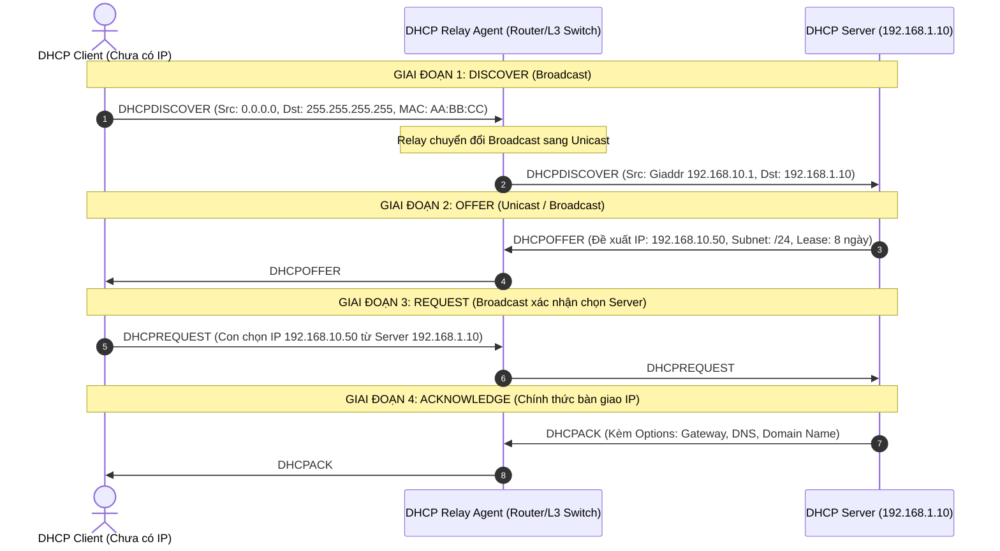
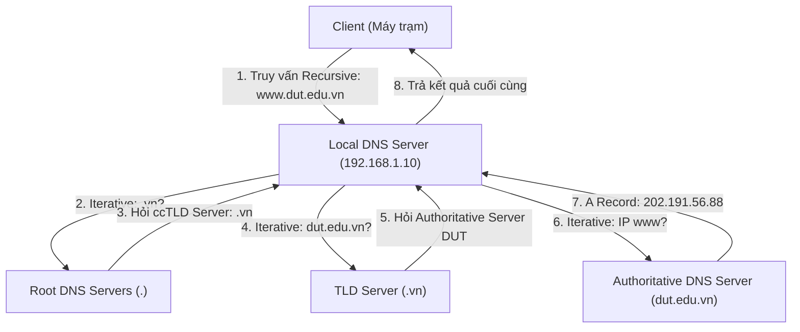
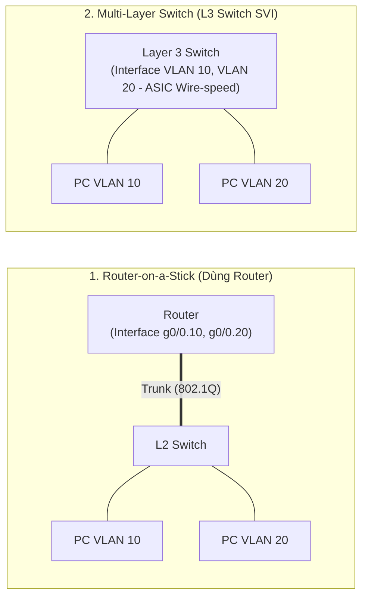

# 📘 [Mod-2] Hạ Tầng Cốt Lõi: DHCP, DNS, IP Routing & VLANs

> **Thuộc khung chương trình**: NMA-DUT (Quản trị mạng Đại học Bách khoa – ĐH Đà Nẵng)  
> **Mục tiêu**: Nắm vững nguyên lý hoạt động, cấu hình chuẩn xác và làm chủ phương pháp troubleshooting các dịch vụ hạ tầng nền tảng mạng: DHCP, DNS, VLAN và Định tuyến.

---

## 1. Dịch Vụ Cấp Phát IP Tự Động (DHCP - Dynamic Host Configuration Protocol)

### 💡 Bản chất Giao thức & Quy trình Bắt tay DORA
DHCP hoạt động ở tầng Ứng dụng (Application Layer), sử dụng giao thức truyền vận **UDP với Port 67 (Server) và Port 68 (Client)**.



### Các DHCP Options Sống còn
- **Option 3**: Router / Default Gateway.
- **Option 6**: Domain Name Server (DNS IP).
- **Option 15**: Domain Name (VD: `dut.edu.vn`).
- **Option 66 / 67**: TFTP Boot Server & Bootfile Name (phục vụ cài Windows/Linux qua mạng - PXE Boot).

### Cơ chế DHCP Relay Agent
- **Vấn đề cốt lõi**: Gói tin `DHCPDISCOVER` ban đầu là gói **Broadcast Lớp 2 (Destination MAC `FF:FF:FF:FF:FF:FF`)** và **Broadcast Lớp 3 (Destination IP `255.255.255.255`)**. Theo nguyên lý định tuyến, **Router mặc định chặn hoàn toàn các gói Broadcast**.
- **Giải pháp**: Thiết bị Gateway (Router/L3 Switch) tại mỗi VLAN được cấu hình làm **DHCP Relay Agent** (Cisco IOS dùng lệnh `ip helper-address <DHCP_Server_IP>`). Khi nhận gói Broadcast, Relay Agent sẽ đóng gói lại thành gói **Unicast**, chèn địa chỉ IP của interface nhận vào trường `giaddr` (Gateway IP Address) rồi chuyển tiếp thẳng tới DHCP Server tập trung.

---

## 2. Dịch Vụ Phân Giải Tên Miền (DNS - Domain Name System)

DNS hoạt động trên **UDP Port 53** (cho các truy vấn thông thường) và **TCP Port 53** (cho việc Zone Transfer hoặc gói tin trả về $> 512$ bytes/DNSSEC).



### Các Loại Bản Ghi DNS (Resource Records) Cần Thuộc Lòng

| Loại Bản ghi | Ý nghĩa & Cú pháp | Ví dụ thực tế |
| :--- | :--- | :--- |
| **A** | Ánh xạ Hostname $\rightarrow$ Địa chỉ IPv4. | `web01.dut.edu.vn IN A 192.168.1.50` |
| **AAAA** | Ánh xạ Hostname $\rightarrow$ Địa chỉ IPv6. | `web01.dut.edu.vn IN AAAA 2001:db8::1` |
| **CNAME** | Tên định danh bí danh (Alias) trỏ về tên chính thức (Canonical). | `www.dut.edu.vn IN CNAME web01.dut.edu.vn` |
| **MX** | Chỉ định máy chủ nhận thư điện tử (kèm độ ưu tiên Priority - số càng nhỏ ưu tiên càng cao). | `dut.edu.vn IN MX 10 mail.dut.edu.vn` |
| **PTR** | Bản ghi con trỏ (Reverse DNS): Ánh xạ IP $\rightarrow$ Hostname (dùng cho phân giải ngược và chống spam mail). | `50.1.168.192.in-addr.arpa IN PTR web01.dut.edu.vn` |
| **NS** | Chỉ định máy chủ DNS quản lý có thẩm quyền (Authoritative) cho Zone. | `dut.edu.vn IN NS ns1.dut.edu.vn` |
| **SOA** | Start of Authority: Chứa thông tin quản trị zone, Serial Number, Refresh/Retry/Expire timers. | `dut.edu.vn IN SOA ns1.dut.edu.vn admin.dut.edu.vn (...)` |
| **SRV** | Định vị dịch vụ (Cực kỳ quan trọng cho Active Directory để tìm Domain Controller, Kerberos, LDAP). | `_ldap._tcp.dut.local IN SRV 0 100 389 dc01.dut.local` |

---

## 3. VLAN & Định Tuyến Liên VLAN (Inter-VLAN Routing)

### So sánh 2 Phương pháp Định tuyến Liên VLAN



| Tiêu chí | Router-on-a-Stick (RoAS) | Layer 3 Switch (SVI) |
| :--- | :--- | :--- |
| **Phần cứng yêu cầu** | 1 Router vật lý + 1 Switch L2. | 1 Switch Layer 3 (Multilayer Switch). |
| **Giao diện Gateway** | Sub-interfaces ảo (`g0/0.10`, `g0/0.20`). | Switched Virtual Interfaces (`interface Vlan10`). |
| **Hiệu năng & Độ trễ** | Dễ nghẽn cổ chai tại đường Trunk vật lý; chuyển mạch bằng CPU Router. | Tốc độ dây dẫn phần cứng (ASIC Hardware Switching), thông lượng Gbps/Tbps. |
| **Môi trường phù hợp** | Chi nhánh nhỏ, ngân sách thấp. | Core/Distribution mạng doanh nghiệp lớn, Data Center. |

---

## 4. Hướng Dẫn Cấu Hình Mẫu Chuẩn Xác

### Kịch bản Topo Thử Nghiệm:
- **DHCP/DNS Server (Windows Server 2022)**: IP `192.168.1.10/24`, Gateway `192.168.1.1` (VLAN 1).
- **Cisco Switch L3**:
  - VLAN 10 (SinhVien): Subnet `192.168.10.0/24`, Gateway SVI `192.168.10.1`.
  - VLAN 20 (GiangVien): Subnet `192.168.20.0/24`, Gateway SVI `192.168.20.1`.

#### A. Cấu hình Cisco L3 Switch (VLAN, SVI & DHCP Relay)
```cisco
! 1. Bật tính năng định tuyến IP trên L3 Switch
Switch(config)# ip routing

! 2. Tạo VLAN
Switch(config)# vlan 10
Switch(config-vlan)# name SinhVien
Switch(config)# vlan 20
Switch(config-vlan)# name GiangVien
Switch(config)# exit

! 3. Cấu hình SVI Gateway & DHCP Relay Agent (ip helper-address)
Switch(config)# interface vlan 10
Switch(config-if)# ip address 192.168.10.1 255.255.255.0
Switch(config-if)# ip helper-address 192.168.1.10
Switch(config-if)# no shutdown

Switch(config)# interface vlan 20
Switch(config-if)# ip address 192.168.20.1 255.255.255.0
Switch(config-if)# ip helper-address 192.168.1.10
Switch(config-if)# no shutdown

! 4. Gán cổng cho Client
Switch(config)# interface range fa0/1 - 10
Switch(config-if-range)# switchport mode access
Switch(config-if-range)# switchport access vlan 10
Switch(config-if-range)# spanning-tree portfast
```

#### B. Cấu hình DHCP Server bằng PowerShell (Windows Server 2022)
```powershell
# 1. Cài đặt DHCP Server Role
Install-WindowsFeature -Name DHCP -IncludeManagementTools

# 2. Tạo Scope cấp phát IP cho VLAN 10 (SinhVien)
Add-DhcpServerv4Scope -Name "VLAN10_SinhVien" `
    -StartRange 192.168.10.50 `
    -EndRange 192.168.10.200 `
    -SubnetMask 255.255.255.0 `
    -State Active

# 3. Cấu hình DHCP Options (Gateway & DNS) cho Scope VLAN 10
Set-DhcpServerv4OptionValue -ScopeId 192.168.10.0 `
    -Router 192.168.10.1 `
    -DnsServer 192.168.1.10 `
    -DnsDomain "dut.local"
```

#### C. Cấu hình BIND9 DNS Server trên Ubuntu Server 22.04 LTS
```bash
# 1. Cài đặt BIND9
sudo apt update && sudo apt install -y bind9 bind9utils bind9-doc

# 2. Khai báo Zone Forward trong /etc/bind/named.conf.local
# sudo nano /etc/bind/named.conf.local
zone "dut.edu.vn" {
    type master;
    file "/etc/bind/zones/db.dut.edu.vn";
};

# 3. Tạo Zone file chi tiết
sudo mkdir -p /etc/bind/zones
sudo cp /etc/bind/db.local /etc/bind/zones/db.dut.edu.vn
```
*Nội dung file `/etc/bind/zones/db.dut.edu.vn`:*
```text
$TTL    604800
@       IN      SOA     ns1.dut.edu.vn. admin.dut.edu.vn. (
                              2         ; Serial
                         604800         ; Refresh
                          86400         ; Retry
                        2419200         ; Expire
                         604800 )       ; Negative Cache TTL
;
@       IN      NS      ns1.dut.edu.vn.
ns1     IN      A       192.168.1.10
web01   IN      A       192.168.1.50
www     IN      CNAME   web01.dut.edu.vn.
mail    IN      A       192.168.1.60
@       IN      MX 10   mail.dut.edu.vn.
```

---

## 5. Quy Trình Kiểm Thử & Xác Nhận (Verification)

```bash
# 1. Kiểm tra phân giải tên miền chuẩn xác từ Client
nslookup www.dut.edu.vn 192.168.1.10

# 2. Truy vấn chi tiết bằng dig trên Linux
dig @192.168.1.10 dut.edu.vn MX +short

# 3. Kiểm tra thông tin IP nhận được từ DHCP trên Client
ipconfig /all      # Trên Windows
ip a               # Trên Linux

# 4. Kiểm tra gói tin DHCP trên máy chủ bằng tcpdump
sudo tcpdump -i eth0 -n port 67 or port 68
```

---

### ⚠️ Lỗi phổ biến sinh viên hay gặp
1. **Quên cấu hình `ip helper-address`**: Sinh viên tạo DHCP Scope cho VLAN 10 và VLAN 20 trên máy chủ ở VLAN 1, nhưng máy client ở VLAN 10 không nhận được IP vì Router/Switch L3 chặn broadcast mà không có Relay Agent.
2. **Quên bật `ip routing` trên Switch L3 Cisco**: Cấu hình SVI đầy đủ nhưng các VLAN không thể ping tới nhau vì Switch chưa kích hoạt routing engine.
3. **Thiếu dấu chấm (`.`) ở cuối FQDN trong Zone file DNS Bind9**: Nếu viết `ns1.dut.edu.vn` thay vì `ns1.dut.edu.vn.`, Bind9 sẽ tự động nối thêm tên zone thành `ns1.dut.edu.vn.dut.edu.vn` gây lỗi phân giải.

---

### 💡 Câu hỏi gợi mở / Micro-quiz
> **Tình huống**: Một máy tính tại phòng máy DUT khởi động lên và nhận được địa chỉ IP `169.254.45.12`. Máy tính này không vào được mạng nội bộ lẫn Internet.
> 
> **Hỏi**: Dải địa chỉ IP này là gì (gọi tên cơ chế)? Hãy chỉ ra chính xác 3 nguyên nhân khả dĩ nhất ở tầng hạ tầng dẫn đến tình trạng trên.
