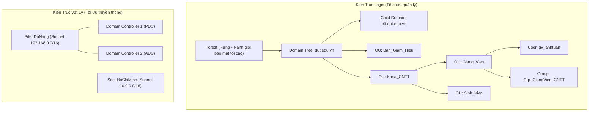
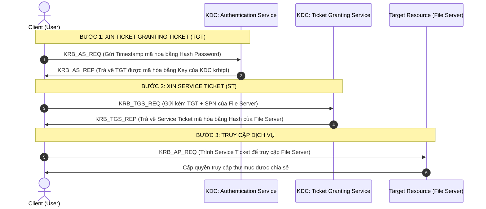

# 📘 [Mod-3] Định Danh & Thư Mục Doanh Nghiệp: Active Directory DS, GPO & OpenLDAP

> **Thuộc khung chương trình**: NMA-DUT (Quản trị mạng Đại học Bách khoa – ĐH Đà Nẵng)  
> **Mục tiêu**: Làm chủ kiến trúc thư mục tập trung Microsoft Active Directory Domain Services, cơ chế chính sách nhóm GPO, và tích hợp dịch vụ thư mục đa nền tảng Linux (OpenLDAP/SAMBA).

---

## 1. Kiến Trúc Active Directory Domain Services (AD DS)

### 💡 Bản chất của Dịch vụ Thư mục (Directory Service)
Dịch vụ thư mục là cơ sở dữ liệu phân tán, có cấu trúc phân cấp, được tối ưu hóa cho **tác vụ đọc (Read-heavy) và tra cứu danh bạ** người dùng, máy tính, máy in, nhóm quyền hạn trong toàn doanh nghiệp.



### 2. Bộ 5 Vai Trò FSMO (Flexible Single Master Operation)

Trong Active Directory, hầu hết các tác vụ ghi đều là **Multi-Master Replication** (sửa ở DC nào cũng được đồng bộ sang các DC khác). Tuy nhiên, có **5 vai trò độc quyền (FSMO Roles)** chỉ được phép tồn tại trên đúng 1 máy DC tại một thời điểm:

| Cấp độ Phạm vi | Tên vai trò FSMO | Chức năng Kỹ thuật | Hậu quả nếu DC giữ vai trò bị sập |
| :--- | :--- | :--- | :--- |
| **Forest-Wide** *(1 role/Forest)* | **1. Schema Master** | Quản lý việc sửa đổi, mở rộng cấu trúc cơ sở dữ liệu AD (Schema - thêm thuộc tính, class mới). | Không thể cài Exchange, nâng cấp Forest functional level. Hoạt động thường ngày không ảnh hưởng. |
| **Forest-Wide** *(1 role/Forest)* | **2. Domain Naming Master** | Kiểm soát việc thêm, xóa hoặc đổi tên Domain trong toàn bộ Forest. | Không thể tạo thêm Child Domain mới. |
| **Domain-Wide** *(1 role/Domain)* | **3. RID Master** (Relative ID) | Cấp phát các khối SID (Pool of RIDs) cho các DC để gán định danh duy nhất cho User/Group mới tạo. | Khi hết kho RID đã cấp, không thể tạo thêm User/Group/Computer mới trên Domain. |
| **Domain-Wide** *(1 role/Domain)* | **4. PDC Emulator** | Đồng bộ thời gian (Time Sync NTP), xử lý thay đổi mật khẩu tức thì, quản lý khóa tài khoản và tương thích cũ. | **Cực kỳ nghiêm trọng**: Lệch giờ hệ thống khiến Kerberos sập, trễ đổi mật khẩu, xung đột tài khoản. |
| **Domain-Wide** *(1 role/Domain)* | **5. Infrastructure Master** | Cập nhật và ánh xạ tham chiếu chéo giữa các Object thuộc các Domain khác nhau. | Tên hiển thị của User thuộc Group ở Domain khác có thể bị chậm cập nhật. |

---

## 3. Cơ Chế Xác Thực Kerberos v5

Active Directory sử dụng **Kerberos v5** làm giao thức xác thực mặc định (an toàn hơn rất nhiều so với NTLM truyền thống):



---

## 4. Quản Trị Chính Sách Nhóm (Group Policy Objects - GPO)

### 📌 Thứ Tự Ưu Tiên Áp Dụng (Quy tắc LSDOU)
Khi có sự xung đột về cấu hình giữa các chính sách, chính sách được áp dụng **sau cùng sẽ ghi đè lên các chính sách trước**:

$$\text{Local Policy (1)} \longrightarrow \text{Site GPO (2)} \longrightarrow \text{Domain GPO (3)} \longrightarrow \text{OU GPO (4 - Ưu tiên cao nhất)}$$

### Các Cơ chế Điều phối GPO Đặc biệt:
- **Block Inheritance**: Ngăn chặn OU con thừa hưởng chính sách từ OU cha / Domain cấp trên.
- **Enforced (No Override)**: Chính sách cấp trên có đóng dấu Enforced thì **bắt buộc áp dụng**, xuyên thủng mọi lệnh Block Inheritance ở cấp dưới.
- **Security Filtering**: Chỉ áp dụng GPO cho các User/Group được chỉ định cụ thể thay vì toàn bộ OU.
- **WMI Filtering**: Dùng câu truy vấn WMI để lọc thiết bị (Ví dụ: Chỉ áp dụng GPO nếu OS là Windows 11 `Select * from Win32_OperatingSystem where Caption like '%Windows 11%'`).

---

## 5. Hướng Dẫn Cấu Hình Triển Khai Thực Tế

### A. Nâng Cấp Máy Chủ Thành Primary Domain Controller (PowerShell)
```powershell
# 1. Cài đặt vai trò Active Directory Domain Services
Install-WindowsFeature -Name AD-Domain-Services -IncludeManagementTools

# 2. Khởi tạo một Forest và Domain mới mang tên dut.local
Install-ADDSForest `
    -DomainName "dut.local" `
    -DomainNetbiosName "DUT" `
    -CreateDnsDelegation:$false `
    -DatabasePath "C:\Windows\NTDS" `
    -LogPath "C:\Windows\NTDS" `
    -SysvolPath "C:\Windows\SYSVOL" `
    -InstallDns:$true `
    -Force:$true
```

### B. Tự Động Hóa Quản Trị User/OU Bằng PowerShell Script
```powershell
# Tạo cấu trúc Organizational Unit (OU) chuẩn
New-ADOrganizationalUnit -Name "CNTT" -Path "DC=dut,DC=local"
New-ADOrganizationalUnit -Name "GiangVien" -Path "OU=CNTT,DC=dut,DC=local"

# Tạo User Giảng viên mới
$Password = ConvertTo-SecureString "P@ssw0rdDUT2026!" -AsPlainText -Force
New-ADUser -Name "Nguyen Van A" `
    -SamAccountName "anguyen" `
    -UserPrincipalName "anguyen@dut.local" `
    -Path "OU=GiangVien,OU=CNTT,DC=dut,DC=local" `
    -AccountPassword $Password `
    -Enabled $true `
    -PasswordNeverExpires $true

# Kiểm tra vị trí 5 vai trò FSMO trong Domain
Get-ADDomain | Select-Object InfrastructureMaster, PDCEmulator, RIDMaster
Get-ADForest | Select-Object DomainNamingMaster, SchemaMaster
```

### C. Gia Nhập Máy Chủ Ubuntu Server 22.04 Vào Domain Active Directory
```bash
# 1. Cài đặt các gói phần mềm cần thiết (realmd, sssd, samba, kerberos)
sudo apt update && sudo apt install -y realmd sssd sssd-tools libnss-sss libpam-sss adcli samba-common-bin packagekit

# 2. Khám phá Domain và kiểm tra cấu hình DNS
sudo realm discover dut.local

# 3. Gia nhập vào Active Directory với tài khoản Administrator
sudo realm join -U Administrator dut.local

# 4. Cấu hình tự động tạo thư mục Home khi User Domain đăng nhập lần đầu
sudo pam-auth-update --enable mkhomedir

# 5. Xác thực User Domain trên Linux
id anguyen@dut.local
```

---

## 6. Quy Trình Kiểm Thử & Chẩn Đoán (Verification)

```cmd
:: 1. Kiểm tra trạng thái đồng bộ và sức khỏe Domain Controller
dcdiag /v /c

:: 2. Kiểm tra các bản ghi SRV quan trọng của Active Directory trên DNS
nslookup -type=srv _ldap._tcp.dc._msdcs.dut.local

:: 3. Ép cập nhật Group Policy và xuất báo cáo kết quả áp dụng
gpupdate /force
gpresult /h C:\gpreport.html
```

---

### ⚠️ Lỗi phổ biến sinh viên hay gặp
1. **Lệch giờ hệ thống giữa Client và Domain Controller $> 5$ phút**: Giao thức Kerberos yêu cầu độ lệch đồng hồ (Clock Skew) không quá 5 phút để chống tấn công Replay Attack. Lệch giờ sẽ khiến Client không thể đăng nhập hoặc join domain.
2. **Cấu hình sai DNS trên máy Client**: Đặt DNS của Client trỏ ra Router/Google (`8.8.8.8`) thay vì trỏ về IP của Domain Controller. Khi đó máy Client sẽ báo lỗi `An Active Directory Domain Controller for the domain could not be contacted` vì không tìm thấy các bản ghi `SRV`.
3. **Nhầm lẫn cơ chế áp dụng GPO giữa Computer Configuration và User Configuration**: Đặt chính sách khóa Desktop vào Computer Configuration nhưng lại gán vào OU chỉ chứa User Objects, khiến chính sách không bao giờ có hiệu lực.

---

### 💡 Câu hỏi gợi mở / Micro-quiz
> **Tình huống**: Giả sử máy chủ Domain Controller đóng vai trò **PDC Emulator** bị mất nguồn đột ngột trong 3 ngày. Trong thời gian này, các nhân viên trong công ty có thể đăng nhập vào máy tính và truy cập các thư mục chia sẻ bình thường được không? Tác vụ cụ thể nào sẽ bị ảnh hưởng trực tiếp đầu tiên?
