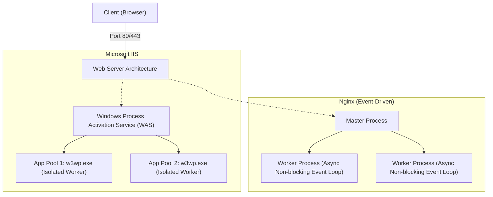
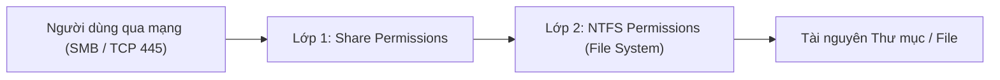
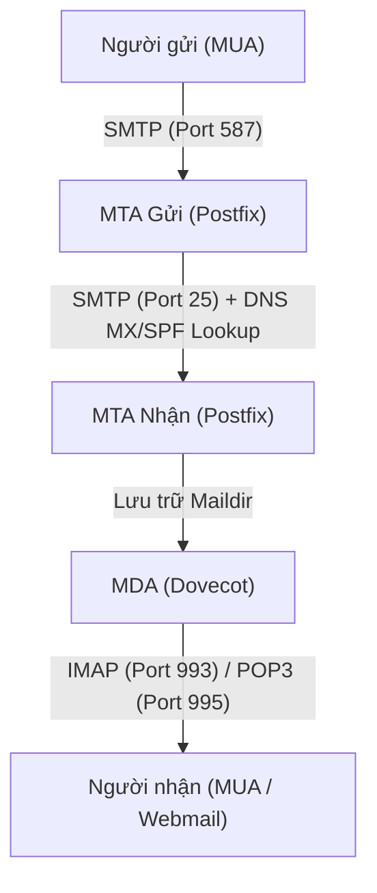

# 📘 [Mod-4] Dịch Vụ Ứng Dụng & Lưu Trữ Doanh Nghiệp: Web, File & Mail Server

> **Thuộc khung chương trình**: NMA-DUT (Quản trị mạng Đại học Bách khoa – ĐH Đà Nẵng)  
> **Mục tiêu**: Làm chủ thiết kế, cấu hình tối ưu và bảo mật các dịch vụ ứng dụng thiết yếu: Web Server (IIS/Nginx + HTTPS TLS 1.3), File Server (Ma trận phân quyền NTFS vs Share, Quota FSRM) và Hệ thống Thư điện tử (Mail Server + SPF/DKIM/DMARC).

---

## 1. Dịch Vụ Web Server & Bảo Mật SSL/TLS (HTTPS)

### So sánh Kiến Trúc: IIS vs Apache vs Nginx



| Tiêu chí | Microsoft IIS (Windows) | Apache HTTP Server (Linux) | Nginx (Linux) |
| :--- | :--- | :--- | :--- |
| **Mô hình kiến trúc** | Process-per-App-Pool (Worker Processes `w3wp.exe`). | Multi-Processing Modules (MPM: Prefork, Worker, Event). | Asynchronous, Non-blocking Event-Driven Architecture. |
| **Xử lý kết nối đồng thời** | Tốt, tối ưu hóa sâu cho stack .NET / ASP.NET. | Trung bình khi tải cực lớn (tiêu tốn nhiều RAM trên mỗi process). | **Cực kỳ xuất sắc** (10,000+ kết nối đồng thời với RAM cực thấp). |
| **Kịch bản tối ưu** | Doanh nghiệp chạy Active Directory, ASP.NET Core, Windows Enterprise. | Web động chạy PHP truyền thống (`.htaccess` linh hoạt). | Reverse Proxy, Load Balancer, High-traffic Web API, Static Content. |

### Quy trình Bắt tay TLS 1.3 Handshake (Mã hóa HTTPS)
TLS 1.3 rút ngắn thời gian bắt tay xuống chỉ còn **1-RTT (Round Trip Time)**:
1. **ClientHello**: Gửi danh sách Cipher Suites hỗ trợ + Khóa công khai tạm thời (Key Share).
2. **ServerHello**: Chọn Cipher Suite + Gửi Key Share của Server + Chứng chỉ số X.509 (Certificate) + Chữ ký số xác thực.
3. Cả hai bên tự tính toán ra **Shared Symmetric Encryption Key (AES-256-GCM)** và bắt đầu truyền dữ liệu mã hóa ngay lập tức.

---

## 2. Dịch Vụ Lưu Trữ & Phân Quyền File Server Chuyên Sâu

### 📌 Ma Trận Tính Quyền Hiệu Dụng (Effective Access Calculation)

Khi truy cập thư mục chia sẻ qua mạng, người dùng chịu sự kiểm soát đồng thời của 2 lớp hàng rào:

$$\text{Quyền Hiệu Dụng (Effective Permission)} = \mathbf{MIN}(\text{Share Permission}, \text{NTFS Permission})$$

*(Nghĩa là: Lấy quyền nào **chặt chẽ và hạn chế hơn - Most Restrictive Rule**)*



#### Bảng Tra Cứu Quyền Thực Tế:
| Share Permission | NTFS Permission | Quyền Hiệu Dụng Cuối Cùng | Giải thích |
| :--- | :--- | :--- | :--- |
| **Read** | **Full Control** | **Read** | Bị Share Permission chặn lại ở mức Read. |
| **Full Control** | **Modify** | **Modify** | Bị NTFS Permission chặn lại ở mức Modify. |
| **Full Control** | **Read** | **Read** | Bị NTFS Permission chặn lại ở mức Read. |
| **Full Control** | **Full Control** | **Full Control** | Cả 2 tầng đều mở tối đa. |
| *Bất kỳ quyền nào* | **Explicit DENY** | **NO ACCESS (Cấm tuyệt đối)** | **Deny luôn luôn có mức ưu tiên cao nhất**, đè bẹp mọi quyền Allow. |

> **Quy chuẩn Quản trị Doanh nghiệp Tốt nhất (Best Practice)**:  
> Đặt Share Permission cho nhóm `Authenticated Users` là **Full Control** (hoặc Modify), sau đó **kiểm soát phân quyền chi tiết toàn bộ ở tầng NTFS Permissions**.

### File Server Resource Manager (FSRM)
- **Hard Quota**: Chặn cứng khi User đạt dung lượng tối đa (không cho phép ghi thêm bất kỳ byte nào).
- **Soft Quota**: Cho phép ghi vượt mức nhưng gửi email cảnh báo cho Admin và ghi log Syslog.
- **File Screening**: Chặn lưu trữ các tệp tin nguy hiểm hoặc giải trí (`*.mp3`, `*.avi`, `*.exe`, `*.torrent`, `*.iso`).
- **Access-Based Enumeration (ABE)**: Tính năng bảo mật thông minh — Người dùng chỉ nhìn thấy các thư mục/tập tin mà họ có quyền đọc; các thư mục không có quyền sẽ tự động bị ẩn đi hoàn toàn.

---

## 3. Dịch Vụ Thư Điện Tử (Mail Server) & Bộ 3 Chống SPAM/Giả Mạo



### Bộ 3 Bản ghi DNS Xác thực Chống Giả Mạo Tên Miền

| Bản ghi DNS | Mục đích Kỹ thuật | Cú pháp cấu hình mẫu |
| :--- | :--- | :--- |
| **SPF (Sender Policy Framework)** | Bản ghi `TXT` định rõ danh sách các IP máy chủ được phép gửi email đại diện cho Domain. | `dut.edu.vn IN TXT "v=spf1 ip4:192.168.1.60 -all"` |
| **DKIM (DomainKeys Identified Mail)** | Ký chữ ký số bằng Private Key vào Header của email; Server nhận sẽ tra cứu Public Key trên DNS để xác thực thư không bị chỉnh sửa trên đường truyền. | `default._domainkey.dut.edu.vn IN TXT "v=DKIM1; k=rsa; p=MIGfMA0GCSqGSI..."` |
| **DMARC** | Chỉ định hành động máy chủ nhận cần thực hiện khi email không vượt qua được kiểm tra SPF hoặc DKIM (None, Quarantine, Reject). | `_dmarc.dut.edu.vn IN TXT "v=DMARC1; p=reject; rua=mailto:dmarc-reports@dut.edu.vn"` |

---

## 4. Hướng Dẫn Cấu Hình Triển Khai Thực Tế

### A. Cấu hình Nginx Virtual Host & SSL trên Ubuntu Server 22.04
```bash
# 1. Cài đặt Nginx
sudo apt update && sudo apt install -y nginx

# 2. Tạo thư mục chứa mã nguồn Web
sudo mkdir -p /var/www/dut_portal/html
sudo chown -R www-data:www-data /var/www/dut_portal/html

# 3. Tạo cấu hình Server Block (/etc/nginx/sites-available/dut_portal.conf)
sudo tee /etc/nginx/sites-available/dut_portal.conf << 'EOF'
server {
    listen 80;
    server_name portal.dut.edu.vn;
    return 301 https://$host$request_uri; # Tự động chuyển hướng HTTP sang HTTPS
}

server {
    listen 443 ssl http2;
    server_name portal.dut.edu.vn;

    ssl_certificate /etc/ssl/certs/dut_cert.pem;
    ssl_certificate_key /etc/ssl/private/dut_key.pem;
    ssl_protocols TLSv1.2 TLSv1.3;
    ssl_ciphers HIGH:!aNULL:!MD5;

    root /var/www/dut_portal/html;
    index index.html;

    location / {
        try_files $uri $uri/ =404;
    }
}
EOF

# 4. Kích hoạt Virtual Host và Khởi động lại Nginx
sudo ln -s /etc/nginx/sites-available/dut_portal.conf /etc/nginx/sites-enabled/
sudo nginx -t && sudo systemctl reload nginx
```

### B. Cấu hình File Server Chia Sẻ & Phân Quyền Bằng PowerShell (Windows Server)
```powershell
# 1. Tạo thư mục vật lý trên ổ đĩa
New-Item -Path "D:\Shares\Khoa_CNTT" -ItemType Directory -Force

# 2. Tạo SMB Share và cấp quyền Full Control cho nhóm Authenticated Users ở tầng Share
New-SmbShare -Name "Khoa_CNTT" `
    -Path "D:\Shares\Khoa_CNTT" `
    -FullAccess "Authenticated Users" `
    -FolderEnumerationMode AccessBased   # Kích hoạt tính năng ABE (Ẩn file không có quyền)

# 3. Phân quyền chi tiết ở tầng NTFS Permissions (Bỏ kế thừa & gán quyền cụ thể)
$Acl = Get-Acl "D:\Shares\Khoa_CNTT"
$Acl.SetAccessRuleProtection($true, $false) # Bỏ kế thừa từ thư mục cha

# Cấp quyền cho Admin và Giảng viên
$AdminRule = New-Object System.Security.AccessControl.FileSystemAccessRule("DUT\Domain Admins", "FullControl", "ContainerInherit,ObjectInherit", "None", "Allow")
$GvRule = New-Object System.Security.AccessControl.FileSystemAccessRule("DUT\Grp_GiangVien_CNTT", "Modify", "ContainerInherit,ObjectInherit", "None", "Allow")

$Acl.AddAccessRule($AdminRule)
$Acl.AddAccessRule($GvRule)
Set-Acl -Path "D:\Shares\Khoa_CNTT" -AclObject $Acl
```

---

## 5. Quy Trình Kiểm Thử & Chẩn Đoán (Verification)

```bash
# 1. Kiểm tra chứng chỉ SSL/TLS và giao thức bắt tay của Web Server
openssl s_client -connect portal.dut.edu.vn:443 -tls1_3

# 2. Kiểm tra bản ghi SPF & MX của Mail Server qua DNS
dig @192.168.1.10 dut.edu.vn TXT
dig @192.168.1.10 dut.edu.vn MX

# 3. Kiểm tra kết nối SMB File Server từ máy trạm
Test-NetConnection -ComputerName 192.168.1.10 -Port 445
```

---

### ⚠️ Lỗi phổ biến sinh viên hay gặp
1. **Lỗi `Access Denied` do xung đột NTFS và Share Permissions**: Sinh viên phân quyền NTFS là `Full Control` cho user, nhưng ở Share Permission lại để mặc định là `Everyone: Read`. Kết quả là user vẫn không thể tạo hay sửa file qua mạng.
2. **Cấu hình Open Relay trên Mail Server**: Quên cấu hình ràng buộc `mynetworks` và xác thực `smtpd_sasl_auth_enable`, khiến máy chủ Mail trở thành "bàn đạp" cho hacker gửi hàng triệu email rác đi khắp thế giới và bị IP Blacklist toàn cầu.
3. **Quên mở port Firewall trên Linux/Windows**: Triển khai Nginx/Apache hoặc File Server xong nhưng máy trạm không truy cập được vì tường lửa (`ufw` hoặc `Windows Defender Firewall`) đang chặn port `80`, `443`, hoặc `445`.

---

### 💡 Câu hỏi gợi mở / Micro-quiz
> **Tình huống**: Một nhân viên thuộc phòng Kế toán vô tình bị gán vào đồng thời 2 nhóm trên Active Directory: Nhóm **Grp_KeToan** (có quyền NTFS: `Modify` trên thư mục `D:\BaoCao`) và Nhóm **Grp_TamNghiViec** (có quyền NTFS: `Deny Write` trên thư mục `D:\BaoCao`).
> 
> **Hỏi**: Khi nhân viên này truy cập thư mục `D:\BaoCao` qua mạng, họ có thể chỉnh sửa file báo cáo hay không? Hãy giải thích nguyên lý phân định quyền hạn của hệ điều hành Windows Server.
