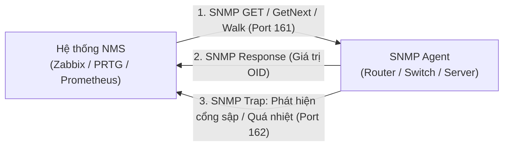
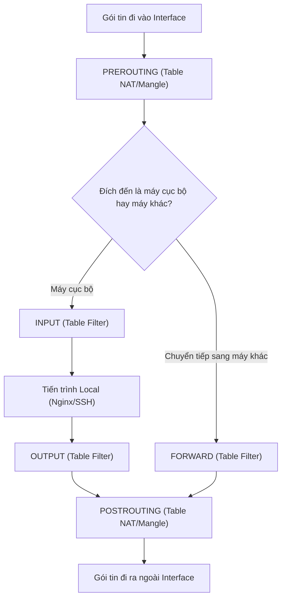
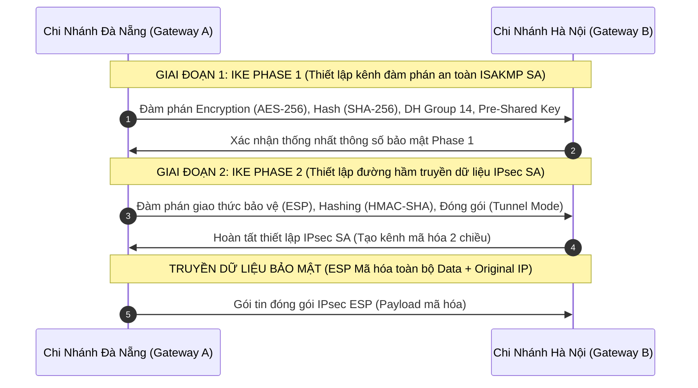
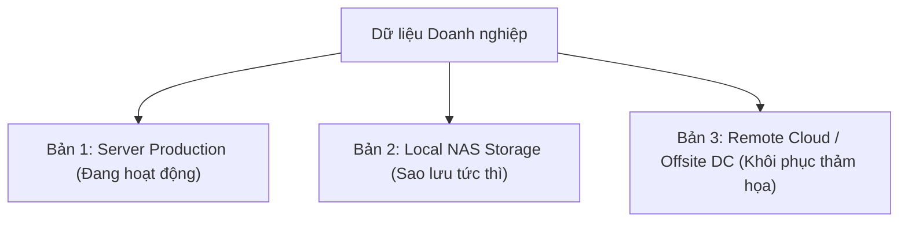

# 📘 [Mod-5] Giám Sát, Bảo Mật, VPN & Phục Hồi Thảm Họa (Backup & DR)

> **Thuộc khung chương trình**: NMA-DUT (Quản trị mạng Đại học Bách khoa – ĐH Đà Nẵng)  
> **Mục tiêu**: Làm chủ "mắt thần" giám sát mạng (SNMPv3, Syslog, Wireshark), thiết lập lá chắn bảo mật (iptables, Windows Firewall, IPsec/OpenVPN) và xây dựng chiến lược sao lưu phục hồi thảm họa bền vững (3-2-1 Backup Rule).

---

## 1. Giám Sát Mạng Tập Trung: SNMP & Syslog

### 💡 Giao thức SNMP (Simple Network Management Protocol)
SNMP hoạt động trên **UDP Port 161 (Polling/Get/Set)** và **UDP Port 162 (SNMP Trap/Informs)**.



#### Cấu trúc Cây OID (Object Identifier) & MIB:
- Dữ liệu giám sát được phân cấp như một cây danh mục (Ví dụ: `1.3.6.1.2.1.2.2.1.10.1` là OID đo lường số Octets nhận vào trên cổng Interface số 1).
- **So sánh các phiên bản SNMP**:
  - **SNMPv1 / SNMPv2c**: Xác thực cực kỳ lỏng lẻo bằng chuỗi văn bản thuần (Community String: `public` / `private`), dễ bị nghe lén gói tin.
  - **SNMPv3**: Chuẩn an toàn tuyệt đối với 3 cấp độ bảo mật:
    1. `noAuthNoPriv`: Không xác thực, không mã hóa.
    2. `authNoPriv`: Xác thực bằng HMAC (MD5/SHA), dữ liệu không mã hóa.
    3. `authPriv`: **Xác thực (SHA-256) + Mã hóa toàn diện (AES-256)**.

---

### Chuẩn Ghi Log Hệ Thống Syslog (RFC 5424)
Syslog gửi bản tin log qua **UDP/TCP Port 514**. Mỗi thông điệp log gồm **Facility** (nguồn tạo log: auth, cron, daemon, local0-7) và **8 mức độ nghiêm trọng (Severity)**:

| Mức Severity | Tên Mức (Code) | Ý nghĩa Kỹ thuật | Ví dụ thực tế |
| :---: | :--- | :--- | :--- |
| **0** | **Emergency** | Hệ thống hoàn toàn không thể sử dụng được nữa (Panic). | Kernel sập, mất toàn bộ ổ đĩa RAID. |
| **1** | **Alert** | Cần hành động can thiệp ngay lập tức. | Cơ sở dữ liệu chính bị hỏng. |
| **2** | **Critical** | Trạng thái nguy kịch của phần cứng/phần mềm. | Nguồn phụ PSU bị hỏng, nhiệt độ CPU $> 95^\circ\text{C}$. |
| **3** | **Error** | Có lỗi xảy ra làm gián đoạn một chức năng. | Dịch vụ Nginx không khởi động được do sai cú pháp. |
| **4** | **Warning** | Cảnh báo nguy cơ tiềm ẩn. | Dung lượng ổ đĩa `/var/log` đạt $90\%$. |
| **5** | **Notice** | Trạng thái bình thường nhưng đáng lưu ý. | Cổng Interface vừa chuyển trạng thái `UP`. |
| **6** | **Informational** | Thông tin hoạt động bình thường. | User Administrator vừa đăng nhập thành công. |
| **7** | **Debug** | Thông tin chi tiết phục vụ lập trình viên gỡ lỗi. | Chi tiết luồng xử lý gói tin bắt tay TLS. |

---

## 2. Phân Tích Gói Tin Chuyên Sâu với Wireshark

Wireshark là công cụ "chụp X-quang" dòng chảy dữ liệu trên đường truyền.

### Các Bộ Lọc Cần Nằm Lòng Khi Troubleshooting:
- **Lọc DHCP**: `bootp` hoặc `dhcp`
- **Lọc DNS**: `dns.flags.response == 0` (truy vấn) hoặc `dns.flags.rcode != 0` (truy vấn bị lỗi)
- **Lọc TCP Bất thường**:
  - `tcp.flags.reset == 1`: Bắt các gói tin TCP RST (kết nối bị từ chối hoặc bị tường lửa ngắt).
  - `tcp.analysis.retransmission`: Bắt các gói tin truyền lại (dấu hiệu tắc nghẽn hoặc rớt mạng).
  - `tcp.analysis.zero_window`: Máy nhận bị tràn bộ đệm, yêu cầu dừng gửi dữ liệu.

---

## 3. Tường Lửa & An Ninh Biên Mạng (Firewall)

### Mô hình Netfilter / iptables trên Linux
Dòng chảy gói tin đi qua 3 Table cốt lõi: **Mangle** (chỉnh sửa header/QoS), **NAT** (dịch địa chỉ IP), **Filter** (cho phép/chặn gói tin).



---

## 4. Mạng Riêng Ảo: Khung Bảo Mật IPsec (IP Security)

IPsec hoạt động ở **Layer 3 (Network Layer)**, cung cấp cơ chế mã hóa và xác thực toàn bộ gói IP.



### So sánh Cốt lõi trong IPsec:
- **AH (Authentication Header)**: Xác thực nguồn gốc và toàn vẹn dữ liệu, **KHÔNG mã hóa dữ liệu** (không bảo vệ tính bí mật).
- **ESP (Encapsulating Security Payload)**: **Vừa mã hóa dữ liệu (Confidentiality) vừa xác thực toàn vẹn (Integrity)** $\rightarrow$ Chuẩn mực sử dụng thực tế.
- **Tunnel Mode**: Mã hóa toàn bộ gói tin gốc (cả Header IP gốc và Payload), gắn thêm New IP Header ngoài cùng (Dùng cho Site-to-Site VPN).
- **Transport Mode**: Chỉ mã hóa Payload, giữ nguyên Header IP gốc (Dùng cho Host-to-Host nội bộ).

---

## 5. Chiến Lược Sao Lưu & Phục Hồi Thảm Họa (Backup & DR)

### 📌 Quy Tắc Vàng Sao Lưu 3-2-1
- **3 bản sao dữ liệu** (1 bản chính đang chạy + 2 bản sao lưu).
- **2 loại phương tiện lưu trữ khác nhau** (Ví dụ: 1 bản trên NAS/SAN nội bộ + 1 bản trên Băng từ/Ổ cứng ngoài).
- **1 bản lưu trữ ở địa điểm khác (Off-site / Cloud Storage)**: Đề phòng hỏa hoạn, ngập lụt, trộm cắp tại Data Center chính.



---

## 6. Hướng Dẫn Cấu Hình Triển Khai Thực Tế

### A. Cấu hình Tường lửa Netfilter / iptables trên Linux Server
```bash
# 1. Xóa sạch các rule cũ
sudo iptables -F
sudo iptables -X

# 2. Thiết lập chính sách mặc định (Default Policy: Chặn toàn bộ)
sudo iptables -P INPUT DROP
sudo iptables -P FORWARD DROP
sudo iptables -P OUTPUT ACCEPT

# 3. Cho phép Loopback (Nội bộ máy)
sudo iptables -A INPUT -i lo -j ACCEPT

# 4. Cho phép các kết nối đã thiết lập từ trước (Stateful Inspection)
sudo iptables -A INPUT -m conntrack --ctstate ESTABLISHED,RELATED -j ACCEPT

# 5. Mở cổng SSH (22), Web HTTP (80), HTTPS (443)
sudo iptables -A INPUT -p tcp --dport 22 -s 192.168.1.0/24 -j ACCEPT  # Chỉ cho phép SSH từ dải IT
sudo iptables -A INPUT -p tcp --dport 80 -j ACCEPT
sudo iptables -A INPUT -p tcp --dport 443 -j ACCEPT

# 6. Giới hạn chống tấn công Ping Flood (ICMP Rate Limiting)
sudo iptables -A INPUT -p icmp --icmp-type echo-request -m limit --limit 1/s --limit-burst 4 -j ACCEPT
```

### B. Cấu hình Site-to-Site IPsec VPN trên Router Cisco (CLI)
```cisco
! 1. Cấu hình IKE Phase 1 (ISAKMP Policy)
crypto isakmp policy 10
 encr aes 256
 hash sha256
 authentication pre-share
 group 14
 lifetime 86400
exit

! Khai báo Pre-Shared Key cho Gateway đối tác
crypto isakmp key DUT_Secret_Key_2026! address 203.0.113.2

! 2. Cấu hình IKE Phase 2 (Transform Set)
crypto ipsec transform-set DUT_TRANSFORM esp-aes 256 esp-sha256-hmac
 mode tunnel
exit

! 3. Tạo Crypto ACL định nghĩa luồng dữ liệu cần mã hóa (Interesting Traffic)
access-list 105 permit ip 192.168.10.0 0.0.0.255 192.168.20.0 0.0.0.255

! 4. Tạo Crypto Map và gán vào cổng WAN
crypto map DUT_MAP 10 ipsec-isakmp
 set peer 203.0.113.2
 set transform-set DUT_TRANSFORM
 match address 105
exit

interface GigabitEthernet0/0
 crypto map DUT_MAP
```

---

## 7. Quy Trình Kiểm Thử & Chẩn Đoán (Verification)

```bash
# 1. Kiểm tra trạng thái đường hầm IPsec VPN trên Cisco
show crypto isakmp sa    # Phase 1: Phải ở trạng thái QM_IDLE
show crypto ipsec sa     # Phase 2: Phải thấy gói tin encaps/decaps tăng dần

# 2. Truy vấn thông tin SNMPv3 từ Linux
snmpwalk -v3 -l authPriv -u admin_snmp -a SHA -A "AuthPass123" -x AES -X "PrivPass123" 192.168.1.1 1.3.6.1.2.1.1.1.0

# 3. Theo dõi file log Syslog thời gian thực
sudo tail -f /var/log/syslog | grep -i "error"
```

---

### ⚠️ Lỗi phổ biến sinh viên hay gặp
1. **Lệch thông số đàm phán IPsec giữa 2 chi nhánh**: Chỉ cần một thông số nhỏ ở Phase 1 (Encryption, Hash, Diffie-Hellman Group, Lifetime, Pre-shared Key) hoặc Phase 2 (Transform-set, Subnet trong ACL) không khớp nhau, đường hầm VPN sẽ không bao giờ đứng lên được (`MM_NO_STATE`).
2. **Khóa nhầm chính mình khi cấu hình Tường lửa**: Thiết lập lệnh `iptables -P INPUT DROP` trước khi mở port SSH (22), dẫn đến bị mất kết nối vĩnh viễn tới Server từ xa.
3. **Quên kiểm tra tính toàn vẹn của bản Backup**: Định kỳ tạo backup nhưng không bao giờ thực hành khôi phục thử (Restore drill). Đến khi có sự cố mới phát hiện file backup bị lỗi (Corrupted).

---

### 💡 Câu hỏi gợi mở / Micro-quiz
> **Tình huống**: Bạn đang triển khai đường hầm Site-to-Site IPsec VPN giữa 2 văn phòng. Quá trình kiểm tra lệnh `show crypto isakmp sa` báo trạng thái `MM_KEY_EXCH`. Tuy nhiên các máy tính ở 2 chi nhánh không thể ping thấy nhau và `show crypto ipsec sa` không thấy số gói tin mã hóa tăng lên.
> 
> **Hỏi**: Sự cố đang nằm ở Phase 1 hay Phase 2 của IPsec? Hãy chỉ ra 2 nguyên nhân kỹ thuật cụ thể nhất gây ra tình trạng đứng ở trạng thái này.
