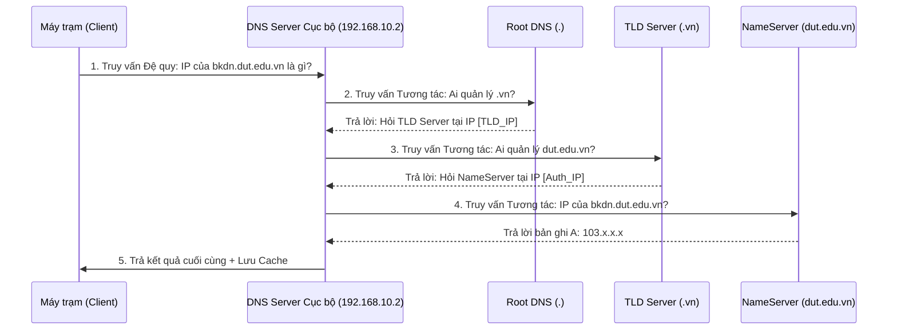

# 📜 ĐIỀU LỆ PHÒNG BÀI GIẢNG CHUYÊN ĐỀ & TƯ LIỆU (LECTURES & SPECIAL TOPICS DEPT)
## Phòng 02 — Công Ty Hạ Tầng & Quản Trị Mạng Doanh Nghiệp (CORP-03-NMA)

> **Mã Phòng Ban:** `NMA-DEPT-02`  
> **Trưởng phòng phụ trách:** Agent `SMS-02` (Syllabus & Material Sentinel) & Thư Ký Học Thuật Hệ Thống  
> **Cấp bậc quản trị:** Cấp 2 — Tiếp nhận, thẩm định và chuẩn hóa tài liệu 5 chuyên đề cốt lõi môn Quản trị mạng

---

## 1. CHỨC NĂNG & NHIỆM VỤ (FUNCTION & MANDATE)
Phòng `NMA-DEPT-02` chịu trách nhiệm lưu trữ, chuẩn hóa và kiểm định toàn bộ tài liệu lý thuyết, chuyên đề học phần Quản trị Mạng:
1. **Quản lý 5 chuyên đề lý thuyết cốt lõi**:
   - Chuyên đề 1: Mô hình quản trị FCAPS & Quy hoạch địa chỉ IP (IPv4/IPv6, CIDR, VLSM).
   - Chuyên đề 2: Hạ tầng dịch vụ mạng lõi (DHCP DORA, DNS Hierarchical Trees, Dynamic Routing OSPF/BGP).
   - Chuyên đề 3: Quản trị định danh tập trung (Active Directory Domain Services, LDAP, Kerberos, Group Policy Objects).
   - Chuyên đề 4: Máy chủ ứng dụng & Lưu trữ (IIS, Nginx, Apache, FTP, NFS, Samba, RAID, iSCSI).
   - Chuyên đề 5: Giám sát & An toàn hạ tầng (SNMP v2c/v3, MIB, Syslog, Wireshark Packet Analysis, Statefull Firewall).
2. **Thẩm định nguồn tài liệu quốc tế**: Đối chiếu với tài liệu CCNA Enterprise (Cisco Press), tài liệu Windows Server Administration (Microsoft Press), và Linux Network Administrator's Guide (O'Reilly).
3. **Lưu trữ đề án kỹ thuật thực tế**: Quản lý báo cáo thiết kế mạng WiFi doanh nghiệp, giải pháp cân bằng tải và phương án dự phòng nóng (High Availability).

---

## 2. BỘ QUY TẮC BẤT BIẾN (CURATION INVARIANTS & HARD CONSTRAINTS)
1. **Nguyên tắc Chuẩn Hóa Theo Mô Hình OSI & TCP/IP**: Mọi phân tích giao thức bắt buộc phải định danh rõ: Layer hoạt động, số cổng (Port Number), giao thức tầng truyền vận (TCP hay UDP), và định dạng gói tin (Packet Header Format).
2. **Nguyên tắc Sơ Đồ Bắt Buộc Trong Chuyên Đề**: Mọi chuyên đề đều phải có sơ đồ khối minh họa (Mermaid hoặc ASCII diagram) về luồng bắt tay giao thức (ví dụ: luồng phân giải DNS đệ quy, luồng cấp phát DHCP 4 bước).
3. **Nguyên tắc Thẩm định ER-QVR $\ge 85/100$**: Các nguồn tư liệu bổ sung phải được đối chiếu từ tài liệu hãng (Cisco, Microsoft, Linux Foundation) hoặc sách chuẩn quốc tế.
4. **Nguyên tắc Không Commit File Đĩa Ảo Quá Khổ**: Cấm tuyệt đối commit file OVA, VMDK, ISO hoặc installer phần mềm vào git. Chỉ lưu trữ tài liệu markdown hướng dẫn tải và cấu hình.

---

## 3. BỘ LỆNH & TOOLCHAIN XỬ LÝ HỌC LIỆU (TOOLCHAIN & INGESTION PIPELINE)
```bash
# 1. Trích xuất sơ đồ và bảng IP từ các tệp chuyên đề Markdown
grep -rn "### Bảng phân bổ IP" ./
grep -rn "```mermaid" ./

# 2. Kiểm tra dung lượng thư mục để loại bỏ file rác hoặc binary nén
ls -lhS | head -n 10

# 3. Kiểm tra tính toàn vẹn của tất cả liên kết nội bộ trong thư mục bài giảng
python -c "import re, os; links = [m for f in os.listdir('.') if f.endswith('.md') for m in re.findall(r'\[.*?\]\((.*?)\)', open(f, encoding='utf-8').read())]; print(f'Total Links: {len(links)}')"
```

---

## 4. CẤU TRÚC THƯ MỤC & TÀI SẢN PHÒNG BAN (DEPARTMENT ASSETS)
```
02_Lectures_and_Raw_Materials/
├── DEPARTMENT_CHARTER.md                                  # Điều lệ phòng ban 7 tầng chuẩn hóa
├── 01_co_so_va_fcaps.md                                  # Chuyên đề 1: FCAPS & Quy hoạch IP
├── 02_ha_tang_cot_loi_dhcp_dns_routing.md                # Chuyên đề 2: Dịch vụ mạng lõi
├── 03_dinh_danh_active_directory_ldap.md                 # Chuyên đề 3: Định danh AD DS & LDAP
├── 04_dich_vu_ung_dung_va_luu_tru.md                     # Chuyên đề 4: Máy chủ ứng dụng & Lưu trữ
├── 05_giam_sat_va_bao_mat.md                             # Chuyên đề 5: SNMP, Syslog & An toàn mạng
└── bai_trinh_bay_yeu_cau_1_phu_song_wifi.md              # Báo cáo thực tế phủ sóng WiFi
```

---

## 5. MẪU TƯ LIỆU CHUYÊN ĐỀ CHUẨN ER-QVR (GOLD MASTER BLUEPRINT)

### Trích Đoạn Chuyên Đề Phân Tích Bản Chất Giao Thức DNS Đệ Quy (`02_ha_tang_cot_loi_dhcp_dns_routing.md`)
```markdown
# 🌐 CHUYÊN ĐỀ: BẢN CHẤT GIAO THỨC DNS & TIẾN TRÌNH PHÂN GIẢI TÊN MIỀN
> **Tiêu chuẩn học thuật**: RFC 1034 & RFC 1035 | Điểm ER-QVR: 96/100

## 1. Cấu Trúc Thứ Bậc Cây Tên Miền (DNS Hierarchy)
Không gian tên miền DNS được tổ chức theo cấu trúc cây phân cấp ngược:
- Root Domain (`.`): Quản lý bởi 13 cụm máy chủ gốc toàn cầu (từ a.root-servers.net đến m.root-servers.net).
- Top-Level Domain (TLD): Phân chia theo mã quốc gia (.vn, .jp) hoặc mục đích (.edu, .com, .org).
- Second-Level Domain: Tên miền của tổ chức (dut.edu.vn).
- Subdomain / Host: Tên máy chủ cụ thể (dc01.corp.dut.edu.vn).

## 2. Luồng Phân Giải DNS Đệ Quy (Recursive vs Iterative Resolution)

```

---

## 6. TIÊU CHÍ NGHIỆM THU (DEFINITION OF DONE - DOD)
- [x] **Đầy đủ 5 chuyên đề cốt lõi**: Toàn bộ 5 chuyên đề đều có file Markdown hoàn chỉnh, có giải thích lý thuyết sâu.
- [x] **Bắt buộc có sơ đồ trực quan**: Mỗi chuyên đề có tối thiểu 1 sơ đồ Sequence hoặc Topo minh họa luồng gói tin.
- [x] **Tích hợp RFC chuẩn quốc tế**: Trích dẫn chính xác RFC quy định giao thức (ví dụ RFC 2131 cho DHCP, RFC 1035 cho DNS, RFC 1157 cho SNMP).
- [x] **Auditor thông qua**: Điểm kiểm định Schema đạt 100% không cảnh báo.

---

## 7. QUY TRÌNH XỬ LÝ SỰ CỐ TÀI LIỆU (RUNBOOK & TROUBLESHOOTING)

### Sự cố 1: Slide bài giảng có mâu thuẫn về số cổng hoặc giao thức tầng Transport
- **Hiện tượng**: Tài liệu ghi DNS chỉ chạy UDP 53, trong khi sinh viên thấy DNS dùng cả TCP 53.
- **Quy trình xử lý**:
  1. Đính chính học thuật: DNS sử dụng UDP 53 cho các truy vấn thông thường (< 512 bytes), nhưng bắt buộc sử dụng TCP 53 cho thao tác chuyển vùng vùng (Zone Transfer - AXFR/IXFR) và khi phản hồi vượt quá 512 bytes (DNSSEC).
  2. Bổ sung ghi chú kỹ thuật vào tệp `02_ha_tang_cot_loi_dhcp_dns_routing.md`.

### Sự cố 2: Sinh viên nhầm lẫn giữa Forest, Tree và Domain trong Active Directory
- **Hiện tượng**: Không hiểu ranh giới bảo mật giữa Domain và Forest.
- **Quy trình xử lý**:
  1. Trực quan hóa ranh giới: Domain là ranh giới quản trị chính sách (Replication & Policy boundary); Forest mới là ranh giới an toàn thông tin thực sự (True Security boundary).
  2. Cung cấp bài tập tình huống so sánh Domain Trust vs Forest Trust.
