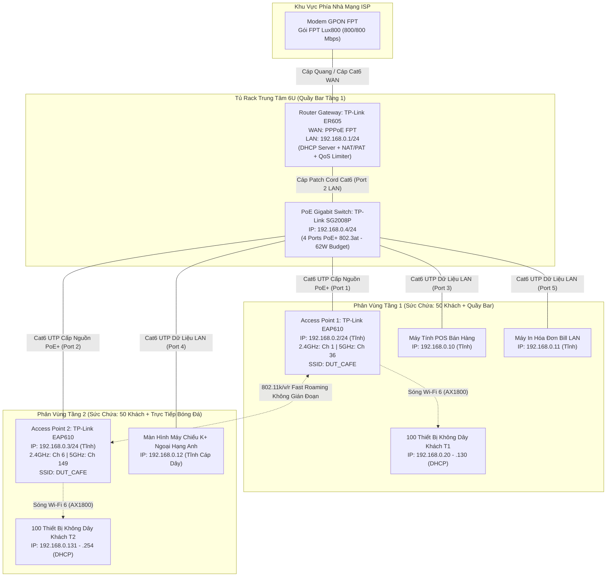

# ☕ HỒ SƠ THIẾT KẾ KỸ THUẬT & PHƯƠNG ÁN THI CÔNG HỆ THỐNG MẠNG CAFE WI-FI CHUYÊN DỤNG (HIGH-DENSITY CAFE WI-FI)

> **Cơ quan chủ quản**: NetAdmin Holdings — Trường Đại học Bách khoa – ĐH Đà Nẵng (DUT)  
> **Mã công ty / Phòng ban**: CORP-03-NMA (NetAdmin Corp / Bộ phận Kỹ thuật Hạ tầng & Mạng Không dây)  
> **Mã hồ sơ thiết kế**: `NMA-LAB01-CAFEWIFI-PRO`  
> **Dự án**: Thiết kế, Triển khai & Quản trị Hệ thống Mạng Không Dây Chịu Tải Cao Quán Cà Phê 2 Tầng DUT Coffee  
> **Phiên bản thiết kế**: Enterprise Release v2.0 (Official Standard)  
> **Chủ nhiệm thiết kế**: DUT Network Admin Mentor  

---

## 📑 MỤC LỤC BẢN THIẾT KẾ

1. [Chương 1: Khảo Sát Hiện Trạng Không Gian & Xác Định Nhu Cầu Kỹ Thuật](#chương-1-khảo-sát-hiện-trạng-không-gian--xác-định-nhu-cầu-kỹ-thuật)
2. [Chương 2: Tính Toán Vùng Phủ Sóng Vô Tuyến & Lựa Chọn Chuẩn Wi-Fi](#chương-2-tính-toán-vùng-phủ-sóng-vô-tuyến--lựa-chọn-chuẩn-wi-fi)
3. [Chương 3: Quy Hoạch Không Gian Địa Chỉ IP & Thiết Kế DHCP Scope Tối Ưu](#chương-3-quy-hoạch-không-gian-địa-chỉ-ip--thiết-kế-dhcp-scope-tối-ưu)
4. [Chương 4: Kế Hoạch Phân Bổ Kênh Tần Số & Kỹ Thuật Chống Can Nhiễu Vô Tuyến (RF Planning)](#chương-4-kế-hoạch-phân-bổ-kênh-tần-số--kỹ-thuật-chống-can-nhiễu-vô-tuyến-rf-planning)
5. [Chương 5: Mô Hình Tính Toán Băng Thông Internet & Lựa Chọn Gói Cước](#chương-5-mô-hình-tính-toán-băng-thông-internet--lựa-chọn-gói-cước)
6. [Chương 6: Danh Mục Thiết Bị Phần Cứng & Hạ Tầng Truyền Dẫn](#chương-6-danh-mục-thiết-bị-phần-cứng--hạ-tầng-truyền-dẫn)
7. [Chương 7: Thiết Kế Thông Số Cấu Hình Vô Tuyến & Cơ Chế Bảo Mật](#chương-7-thiết-kế-thông-số-cấu-hình-vô-tuyến--cơ-chế-bảo-mật)
8. [Chương 8: Bóc Tách Khối Lượng Dự Toán & Ngân Sách Đầu Tư Hoàn Chỉnh (BoQ)](#chương-8-bóc-tách-khối-lượng-dự-toán--ngân-sách-đầu-tư-hoàn-chỉnh-boq)
9. [Chương 9: Sơ Đồ Topo Kiến Trúc Mạng & Bảng Phân Bổ Địa Chỉ IP Chuẩn Hóa](#chương-9-sơ-đồ-topo-kiến-trúc-mạng--bảng-phân-bổ-địa-chỉ-ip-chuẩn-hóa)
10. [Chương 10: Hướng Dẫn Triển Khai & Lệnh Cấu Hình Chi Tiết (Cisco Packet Tracer & Thiết Bị Thực Tế)](#chương-10-hướng-dẫn-triển-khai--lệnh-cấu-hình-chi-tiết)
11. [Chương 11: Quy Trình Đo Kiểm, Bắt Gói Tin & Nghiệm Thu Bàn Giao](#chương-11-quy-trình-đo-kiểm-bắt-gói-tin--nghiệm-thu-bàn-giao)
12. [Chương 12: ⚠️ Cảnh Báo Bẫy Kỹ Thuật & Khắc Phục Sự Cố Thực Tế](#chương-12-️-cảnh-báo-bẫy-kỹ-thuật--khắc-phục-sự-cố-thực-tế)
13. [Chương 13: 💡 Bộ Câu Hỏi Gợi Mở & Phản Biện Chuyên Sâu (Micro-Quiz)](#chương-13--bộ-câu-hỏi-gợi-mở--phản-biện-chuyên-sâu-micro-quiz)

---

## CHƯƠNG 1: KHẢO SÁT HIỆN TRẠNG KHÔNG GIAN & XÁC ĐỊNH NHU CẦU KỸ THUẬT

### 1.1. Hiện trạng mặt bằng kiến trúc
- **Loại hình công trình**: Nhà phố kinh doanh thương mại 2 tầng liền kề phục vụ ẩm thực cà phê kết hợp giải trí trực tiếp các giải thể thao đỉnh cao (Ngoại hạng Anh, UEFA Champions League).
- **Thông số hình học chuẩn hóa**:
  - Chiều dài mặt bằng ($L$): **$23.0\text{ m}$**
  - Chiều rộng mặt bằng ($W$): **$9.0\text{ m}$** *(Lưu ý: Mặt bằng chuẩn là $9\text{m}$, diện tích $23\text{m} \times 9\text{m} = 207\text{ m}^2/\text{tầng}$)*
  - Chiều cao thông thủy trần ($H$): **$3.2\text{ m}$** (Trần bê tông có ốp trần thạch cao giật cấp trang trí cách sàn $2.8\text{ m}$).
  - Tổng diện tích sàn sử dụng 2 tầng: $207\text{ m}^2 \times 2 = \mathbf{414\text{ m}^2}$.
- **Đặc tính vật liệu & suy hao vô tuyến**:
  - Sàn ngăn cách giữa Tầng 1 và Tầng 2 là sàn bê tông cốt thép dày $20\text{ cm}$ $\implies$ Suy hao tín hiệu xuyên sàn rất lớn (**khoảng $18 - 22\text{ dBm}$** ở dải 2.4 GHz và **$> 28\text{ dBm}$** ở dải 5 GHz).
  - Vách ngăn: Chủ yếu là không gian mở (Open Space), có một số cột trụ bê tông nhỏ và quầy pha chế / thu ngân bằng gỗ công nghiệp kết hợp kính cường lực (độ suy hao nhẹ $2 - 4\text{ dBm}$).

```
+-------------------------------------------------------------------------+
|                                TẦNG 2                                   |
|   [Khu Bàn Khách]          [AP 2: Treo Trần]         [Máy Chiếu 4K]     |
|   (Dài: 23m - Rộng: 9m - Cao: 3.2m - Sàn: 207m2)                        |
+=========================================================================+  <-- Sàn Bê Tông Cốt Thép (Suy hao ~20dBm)
|                                TẦNG 1                                   |
|   [Quầy Bar / POS]         [AP 1: Treo Trần]         [Tủ Rack Mạng 6U]  |
|   (Dài: 23m - Rộng: 9m - Cao: 3.2m - Sàn: 207m2)                        |
+-------------------------------------------------------------------------+
```

### 1.2. Mật độ thiết bị và hành vi sử dụng cao điểm
- **Mật độ khách hàng**:
  - Sức chứa tối đa: $50\text{ người/tầng} \times 2\text{ tầng} = 100\text{ khách hàng}$.
  - Chỉ số thiết bị trên mỗi người dùng (Device-per-user ratio): Mỗi khách hàng mang trung bình 2 thiết bị không dây (1 Smartphone + 1 Laptop/Tablet) $\implies$ $100\text{ thiết bị không dây/tầng}$.
  - Tổng số lượng thiết bị khách truy cập đồng thời tối đa: **200 thiết bị không dây**.
- **Thiết bị cố định và hạ tầng nội bộ quán**:
  - 01 Máy tính tính tiền thu ngân quầy Bar (POS Terminal - kết nối dây Cat6).
  - 01 Máy in hóa đơn thanh toán (Network Bill Printer - kết nối dây Cat6).
  - 01 Màn hình Smart TV / Máy chiếu phát trực tiếp bóng đá Ngoại Hạng Anh Tầng 2 (kết nối dây Cat6).
  - 01 Hệ thống Camera quan sát IP giám sát an ninh (kết nối Switch PoE).
  - 02 Thiết bị phát sóng Access Point chuyên dụng (AP1, AP2).
  - 01 Thiết bị Switch cấp nguồn PoE Gigabit.
  - 01 Thiết bị Router cân bằng tải chuyên dụng.
  - ~10 Smartphone của nhân viên phục vụ và quản lý quán.
- **Tổng dung lượng địa chỉ IP cần phục vụ đồng thời**: $\approx \mathbf{215 - 220\text{ thiết bị}}$.

---

## CHƯƠNG 2: TÍNH TOÁN VÙNG PHỦ SÓNG VÔ TUYẾN & LỰA CHỌN CHUẨN WI-FI

### 2.1. Tính toán bán kính vùng phủ sóng hình học ($R$)
Để tối ưu hóa bức xạ sóng vô tuyến và hạn chế vật cản, vị trí lắp đặt lý tưởng là **treo trần thạch cao (Ceiling-Mount) tại tâm hình học của mỗi tầng**:
- Tọa độ tâm đặt AP: $x_0 = \frac{L}{2} = 11.5\text{ m}$, $y_0 = \frac{W}{2} = 4.5\text{ m}$.
- Khoảng cách hình học từ vị trí AP tới 4 góc xa nhất của sàn:
  $$d_{\text{corner}} = \sqrt{(11.5)^2 + (4.5)^2} = \sqrt{132.25 + 20.25} = \sqrt{152.5} \approx \mathbf{12.35\text{ m}}$$
- Trong kịch bản dự phòng khi phải lắp lệch tâm do vướng hệ thống đèn chùm trang trí (khoảng cách tối đa từ AP đến góc đối diện):
  $$d_{\text{worst-case}} = \sqrt{L^2 + W^2} = \sqrt{23^2 + 9^2} = \sqrt{529 + 81} = \sqrt{610} \approx \mathbf{24.7\text{ m}}$$
- Bán kính vùng phủ sóng hiệu dụng yêu cầu: $R_{\text{coverage}} \approx \mathbf{20 - 25\text{ m}}$.

### 2.2. Đánh giá suy hao đường truyền (Indoor Path Loss Model)
Áp dụng mô hình suy hao trong nhà ITU-R P.1238 đối với tần số 5 GHz:
$$\text{PL}(d) [\text{dB}] = 20\log_{10}(f_{[\text{MHz}]}) + N\log_{10}(d_{[\text{m}]}) + L_f(n) - 28$$
- Với $f = 5200\text{ MHz}$, hệ số suy hao khoảng cách $N = 30$ (môi trường có người và bàn ghế), khoảng cách xa nhất $d = 12.35\text{ m}$:
  $$\text{PL} = 20\log_{10}(5200) + 30\log_{10}(12.35) - 28 \approx 74.3 + 32.8 - 28 = \mathbf{79.1\text{ dB}}$$
- Cường độ tín hiệu nhận được tại máy khách (Received Signal Strength Indicator - RSSI):
  $$\text{RSSI} = P_{\text{Tx}} + G_{\text{Tx}} - \text{PL} + G_{\text{Rx}} = 22\text{ dBm} + 4\text{ dBi} - 79.1\text{ dB} + 1\text{ dBi} = \mathbf{-52.1\text{ dBm}}$$
- **Kết luận kỹ thuật**: Mức tín hiệu $-52.1\text{ dBm}$ vượt xa ngưỡng tiêu chuẩn tối ưu ($-65\text{ dBm}$), đảm bảo tốc độ truyền dữ liệu cao nhất (Data Rate MCS 11) cho toàn bộ không gian quán.

### 2.3. Luận chứng lựa chọn chuẩn Wi-Fi: Tại sao chọn Wi-Fi 6 (802.11ax)?

```
   Chuẩn Wi-Fi 5 (802.11ac)                 Chuẩn Wi-Fi 6 (802.11ax) [ĐƯỢC CHỌN]
+-------------------------------+       +-----------------------------------------------+
| OFDM: 1 người dùng chiếm trọn |       | OFDMA: Chia nhỏ phổ tần thành nhiều RU        |
| kênh tại 1 thời điểm          |  -->  | (Resource Units), truyền đồng thời cho nhiều  |
| -> Dễ nghẽn (Bufferbloat)     |       | thiết bị -> Giảm độ trễ tới 75%               |
+-------------------------------+       +-----------------------------------------------+
```

1. **Công nghệ OFDMA (Orthogonal Frequency Division Multiple Access)**: Khác với Wi-Fi 5 chỉ phục vụ 1 máy tại 1 thời điểm (gây ra tình trạng xếp hàng chờ gói tin khi 200 máy cùng kết nối), Wi-Fi 6 chia nhỏ kênh thành các sóng con (Resource Units), cho phép AP gửi dữ liệu đồng thời tới hàng chục smartphone trong cùng một khung thời gian.
2. **Kỹ thuật điều chế 1024-QAM**: Tăng mật độ dữ liệu thêm 25% so với 256-QAM của Wi-Fi 5, giúp tốc độ tải video 4K/FullHD tức thì.
3. **BSS Coloring (Gắn màu nhận diện)**: Giúp thiết bị tự động phân biệt tín hiệu của AP Tầng 1 và AP Tầng 2, triệt tiêu xung đột tín hiệu không gian.
4. **Hiệu quả đầu tư (Cost-Performance Ratio)**: Thiết bị Wi-Fi 7 hiện tại có giá quá đắt đỏ ($> 7.000.000\text{ VNĐ/AP}$) và đại đa số điện thoại của khách hàng chưa có chip Wi-Fi 7; trong khi Wi-Fi 5 đã lỗi thời và dễ quá tải. **Wi-Fi 6 là sự lựa chọn hoàn hảo nhất về mặt kỹ thuật và tài chính.**

---

## CHƯƠNG 3: QUY HOẠCH KHÔNG GIAN ĐỊA CHỈ IP & THIẾT KẾ DHCP SCOPE TỐI ƯU

### 3.1. Phân tích Subnetting & Không gian địa chỉ
- **Tổng số thiết bị cần cấp phát**: $\approx 215$ thiết bị.
- **Lựa chọn Subnet Mask**: Classless Inter-Domain Routing (CIDR) tiền tố **/24** (`255.255.255.0`):
  $$\text{Số lượng IP khả dụng} = 2^{32 - 24} - 2 = 2^8 - 2 = \mathbf{254\text{ Host}}$$
- Dải mạng tổng thể: **`192.168.0.0/24`**
  - Địa chỉ mạng (Network ID): `192.168.0.0`
  - Địa chỉ quảng bá (Broadcast ID): `192.168.0.255`
  - Mặt nạ mạng (Subnet Mask): `255.255.255.0`
  - Cổng mặc định (Default Gateway): `192.168.0.1`

### 3.2. Bảng phân vùng không gian địa chỉ chi tiết

```
192.168.0.0/24 Subnet Space:
[0] ........... [1 - 6] .......... [7 - 19] ........... [20 --------------- 254] .......... [255]
Network ID   Hạ Tầng Core        Thiết Bị Cố Định       Dải DHCP Scope Cấp Phát Cho Khách   Broadcast
             (Router/AP/SW)      (POS/Bill/Projector)   (235 Địa chỉ - Lease Time: 2h)
```

| Phân đoạn địa chỉ | Dải địa chỉ IP | Số lượng | Hình thức cấp phát | Mục đích sử dụng |
| :--- | :--- | :---: | :--- | :--- |
| **Hạ tầng mạng cốt lõi** | `192.168.0.1` – `192.168.0.6` | 6 | IP Tĩnh (Static IP) | Gateway Router (`.1`), AP1 (`.2`), AP2 (`.3`), Switch PoE (`.4`), Dư phòng (`.5-.6`) |
| **Thiết bị cố định quán** | `192.168.0.7` – `192.168.0.19` | 13 | Static / Reservation | Máy tính POS (`.10`), Máy in Bill (`.11`), Máy chiếu bóng đá (`.12`), Camera (`.13`) |
| **DHCP Pool Khách & NV**| `192.168.0.20` – `192.168.0.254`| **235** | DHCP Dynamic | Cấp phát tự động cho Smartphone, Tablet, Laptop của khách hàng và nhân viên |

### 3.3. Cấu hình DHCP Lease Time chống cạn kiệt IP (DHCP Exhaustion)
- **Vấn đề thực tế**: Quán cafe có tốc độ luân chuyển khách hàng (Customer Churn Rate) cao. Khách ngồi uống nước trung bình $1.5 - 2\text{ giờ}$. Nếu để Lease Time mặc định của nhà sản xuất ($24\text{ giờ}$ hoặc $72\text{ giờ}$), các khách buổi sáng dù đã về nhưng IP của họ vẫn bị giam giữ trong bảng cấp phát của Router. Đến giờ chiếu bóng đá buổi tối, Router sẽ không còn IP trống để cấp cho khách mới.
- **Giải pháp kỹ thuật của NetAdmin Corp**: 
  - Thiết lập **DHCP Lease Time = 120 phút (02 giờ)**.
  - Bật cơ chế **Ping before Assign**: Router sẽ gửi gói tin ICMP Echo Request trước khi cấp phát IP để chắc chắn không trùng lặp địa chỉ.

---

## CHƯƠNG 4: KẾ HOẠCH PHÂN BỔ KÊNH TẦN SỐ & KỸ THUẬT CHỐNG CAN NHIỄU VÔ TUYẾN (RF PLANNING)

### 4.1. Quy hoạch kênh sóng dải tần 2.4 GHz
- Dải tần 2.4 GHz có tính chất truyền xa và xuyên vật cản tốt, nhưng độ rộng dải tần hẹp. Trong dải 2.4 GHz tiêu chuẩn, chỉ có đúng **3 kênh không bị chồng lấn phổ tín hiệu (Non-overlapping channels)** với độ rộng kênh $20\text{ MHz}$ là **Kênh 1 (2412 MHz)**, **Kênh 6 (2437 MHz)** và **Kênh 11 (2462 MHz)**.
- **Phân bổ kênh cho tòa nhà 2 tầng**:
  - **AP 1 (Tầng 1)**: Cố định phát **Kênh 1** (Tần số trung tâm 2412 MHz), Bandwidth: $20\text{ MHz}$.
  - **AP 2 (Tầng 2)**: Cố định phát **Kênh 6** (Tần số trung tâm 2437 MHz), Bandwidth: $20\text{ MHz}$.
  - **Kênh 11**: Dành làm kênh dự phòng nếu bổ sung AP ngoài trời hoặc AP nội bộ cho nhân viên nhà bếp.
- **Cách ly can nhiễu**: Sự chênh lệch tần số giữa Kênh 1 và Kênh 6 là $25\text{ MHz}$ kết hợp sàn bê tông cốt thép dày $20\text{ cm}$ làm suy hao sóng $\sim 20\text{ dBm}$ sẽ triệt tiêu hoàn toàn hiện tượng **Nhiễu đồng kênh (Co-Channel Interference - CCI)** và **Nhiễu kênh kề (Adjacent Channel Interference - ACI)** giữa Tầng 1 và Tầng 2.

```
[ TẦNG 2 ] ===> AP 2 (Channel 6 @ 2.4GHz | Channel 149 @ 5GHz)
     ||
  [ SÀN BÊ TÔNG DÀY 20CM - ĐỘ SUY HAO TÍN HIỆU SÀN: ~20 dBm ]
     ||
[ TẦNG 1 ] ===> AP 1 (Channel 1 @ 2.4GHz | Channel 36 @ 5GHz)
```

### 4.2. Quy hoạch kênh sóng dải tần 5 GHz
- Băng tần 5 GHz cung cấp độ rộng kênh lớn ($80\text{ MHz}$) mang lại băng thông siêu tốc:
  - **AP 1 (Tầng 1)**: Hoạt động ở dải **UNII-1**, Kênh **36** (5180 MHz), Channel Width $80\text{ MHz}$.
  - **AP 2 (Tầng 2)**: Hoạt động ở dải **UNII-3**, Kênh **149** (5745 MHz), Channel Width $80\text{ MHz}$.
- Hai dải tần UNII-1 và UNII-3 cách xa nhau hàng trăm MHz, đảm bảo truyền tải dữ liệu Full Tốc độ mà không hề suy hao lẫn nhau.

### 4.3. Điều chỉnh công suất phát (Tx Power Tuning) & Band Steering
- **Chống "bẫy" máy khách bám sóng (Sticky Client)**: Điều chỉnh công suất phát (Transmission Power) của 2 AP:
  - Băng tần 2.4 GHz: Đặt ở mức **Medium (14 - 16 dBm)** để sóng không tràn lọt quá mạnh sang tầng khác.
  - Băng tần 5 GHz: Đặt ở mức **High (20 - 22 dBm)** để khuyến khích thiết bị kết nối vào sóng 5 GHz tốc độ cao.
- **Band Steering**: Kích hoạt trên bộ điều khiển tập trung để tự động "đẩy" các thiết bị đời mới sang băng tần 5 GHz, giữ cho băng tần 2.4 GHz thông thoáng cho các thiết bị cũ.

---

## CHƯƠNG 5: MÔ HÌNH TÍNH TOÁN BĂNG THÔNG INTERNET & LỰA CHỌN GÓI CƯỚC

### 5.1. Nhu cầu lưu lượng theo ứng dụng thực tế
1. **Video Streaming YouTube Full HD 60fps**:
   - Yêu cầu bitrate trung bình từ máy chủ CDN YouTube: **$10 - 12\text{ Mbps/thiết bị}$**.
2. **Luồng phát trực tiếp bóng đá K+ / FPT Play 4K trên Máy chiếu lớn**:
   - Bitrate luồng phát thời gian thực chất lượng cao: **$50\text{ Mbps}$**.
3. **Lưu lượng cực đại lý thuyết (Theoretical Maximum Bandwidth)**:
   Nếu toàn bộ 200 thiết bị của khách đồng loạt phát video 1080p60 tại cùng một giây:
   $$B_{\text{peak}} = (200 \times 12\text{ Mbps}) + 50\text{ Mbps} = 2400 + 50 = \mathbf{2450\text{ Mbps}} \approx \mathbf{2.45\text{ Gbps}}$$

### 5.2. Áp dụng hệ số đồng thời (Erlang Concurrency Factor)
Trong thực tế thiết kế viễn thông doanh nghiệp:
- Người dùng quán cafe không bao giờ 100% cùng xem video độ phân giải cao tại cùng một khoảnh khắc.
- Theo thống kê lưu lượng thực tế, tỷ lệ người dùng sử dụng tác vụ nặng đồng thời chỉ chiếm khoảng **$\alpha = 35\%$**; còn lại $65\%$ người dùng chỉ lướt web tĩnh, chat ứng dụng Zalo/Messenger (tiêu thụ $\sim 0.5\text{ Mbps}$) hoặc thiết bị để ở chế độ chạy nền.
- **Công thức tính băng thông thiết kế tối ưu**:
  $$B_{\text{design}} = (\alpha \times 200 \times 12\text{ Mbps}) + ((1 - \alpha) \times 200 \times 0.5\text{ Mbps}) + 50\text{ Mbps}$$
  $$B_{\text{design}} = (0.35 \times 200 \times 12) + (0.65 \times 200 \times 0.5) + 50 = 840 + 65 + 50 = \mathbf{955\text{ Mbps}}$$

### 5.3. Quyết định lựa chọn gói cước Internet: FPT Lux800 Doanh Nghiệp
- **Tên gói dịch vụ**: **FPT Lux800** (Dòng sản phẩm chuyên dụng doanh nghiệp F&B của FPT Telecom).
- **Thông số kỹ thuật đường truyền**:
  - Băng thông tải xuống (Download): **$800\text{ Mbps}$**.
  - Băng thông tải lên (Upload): **$800\text{ Mbps}$** (Đường truyền đối xứng).
  - Khả năng kết nối cam kết: Lên đến 160 thiết bị trực tiếp trên modem và hàng trăm thiết bị qua hệ thống Router Gateway phụ tải.
  - Công nghệ trang bị: Đường truyền cáp quang quang học AON/GPON đi kèm công nghệ Wi-Fi 6.
- **Chi phí thuê bao hàng tháng**: **$1.000.000\text{ VNĐ/tháng}$** (Đã tối ưu hóa chi phí vận hành cho quán).

---

## CHƯƠNG 6: DANH MỤC THIẾT BỊ PHẦN CỨNG & HẠ TẦNG TRUYỀN DẪN

Hệ thống được thiết kế đồng bộ theo chuẩn **Enterprise SDN của TP-Link Omada**, mang lại khả năng quản trị tập trung và tương thích hoàn hảo:

```
[ISP Fiber GPON]
       |
[Router Gateway ER605]
       | (Gigabit Uplink Cat6)
[Switch PoE SG2008P]
   |--- (PoE+ Cat6: 12.8W) ---> [AP 1: EAP610 Tầng 1]
   |--- (PoE+ Cat6: 12.8W) ---> [AP 2: EAP610 Tầng 2]
   |--- (Cat6 Data) ----------> [POS Thu Ngân]
   |--- (Cat6 Data) ----------> [Máy Chiếu 4K Tầng 2]
```

### 6.1. Thiết bị định tuyến biên (Router): TP-Link Omada ER605
- **Vai trò**: Trạm cổng Gateway điều phối toàn bộ lưu lượng, thực hiện quay số PPPoE, cấp phát DHCP, NAT/PAT, tường lửa và điều tiết băng thông (QoS).
- **Cấu hình phần cứng**:
  - 5 cổng Gigabit Ethernet (1 cổng WAN cố định, 2 cổng WAN/LAN tùy biến, 2 cổng LAN cố định).
  - Khả năng định tuyến NAT đồng thời: 25.000 Concurrent Sessions.
  - Tích hợp công nghệ bảo mật: SPI Firewall, DoS Defense, IP/MAC/URL Filtering.

### 6.2. Thiết bị phát sóng không dây (Access Point): 02x TP-Link Omada EAP610
- **Vai trò**: Đảm nhiệm phát sóng vô tuyến Wi-Fi 6 tốc độ cao tại Tầng 1 và Tầng 2.
- **Cấu hình phần cứng**:
  - Chuẩn kết nối: Wi-Fi 6 (IEEE 802.11ax/ac/n/g/b/a).
  - Tốc độ truyền tải danh định: 574 Mbps trên dải 2.4 GHz + 1201 Mbps trên dải 5 GHz (Tổng tốc độ AX1800 đạt 1775 Mbps).
  - Khả năng chịu tải công bố: **150+ người dùng đồng thời trên mỗi AP**.
  - Ăng-ten ngầm đa hướng (Omnidirectional) độ lợi cao ($4\text{ dBi}$ cho 2.4 GHz và $5\text{ dBi}$ cho 5 GHz).
  - Hỗ trợ cấp nguồn qua mạng: Chuẩn công nghiệp 802.3at PoE+ (Công suất tiêu thụ tối đa: $12.8\text{ W}$).

### 6.3. Thiết bị chuyển mạch cấp nguồn (PoE Switch): TP-Link Omada SG2008P
- **Vai trò**: Cung cấp đường truyền tốc độ cao Gigabit kết nối Router với các AP, máy tính POS, máy chiếu; đồng thời truyền tải nguồn điện trực tiếp qua dây cáp mạng nuôi 2 AP.
- **Kiểm toán công suất nguồn (PoE Power Budget Audit)**:
  - Tổng công suất nguồn PoE Switch cung cấp: **$62\text{ W}$**.
  - Công suất tiêu thụ của 2 AP EAP610: $12.8\text{ W} \times 2 = \mathbf{25.6\text{ W}}$.
  - Hệ số an toàn công suất:
    $$\text{Tỷ lệ tải nguồn} = \frac{25.6\text{ W}}{62\text{ W}} \approx 41.3\% \quad (\text{Cực kỳ an toàn, Switch mát mẻ và bền bỉ})$$

### 6.4. Hạ tầng truyền dẫn cáp mạng & phụ kiện đấu nối
- **Cáp trục chính**: Cuộn cáp **AMTAKO Cat6 UTP 305m** lõi đồng nguyên chất đường kính $0.57\text{ mm}$, có lõi chữ thập chịu lực và chống suy hao, băng thông đáp ứng $250\text{ MHz}$.
- **Dây nhảy kết nối (Patch Cord)**: 20 sợi **Ugreen Cat6** đúc sẵn đầu bấm từ nhà máy với chân tiếp xúc mạ vàng 24K, đảm bảo không suy hao tín hiệu tiếp xúc.

---

## CHƯƠNG 7: THIẾT KẾ THÔNG SỐ CẤU HÌNH VÔ TUYẾN & CƠ CHẾ BẢO MẬT

### 7.1. Bảng thiết lập thông số sóng vô tuyến (Wireless Profile)

| Thuộc tính cấu hình | Giá trị thiết lập AP 1 (Tầng 1) | Giá trị thiết lập AP 2 (Tầng 2) | Mục đích kỹ thuật |
| :--- | :--- | :--- | :--- |
| **Tên mạng không dây (SSID)** | **`DUT_CAFE`** | **`DUT_CAFE`** | Đồng nhất 1 tên duy nhất cho toàn bộ quán để tự động chuyển vùng |
| **Chuẩn xác thực bảo mật** | `WPA2-Personal (AES)` | `WPA2-Personal (AES)` | Mã hóa cấp cao, tương thích 100% tất cả thiết bị của khách hàng |
| **Mật khẩu truy cập (PSK)** | `dutwibu67` | `dutwibu67` | Đồng nhất mật khẩu để máy khách không phải nhập lại |
| **Băng tần 2.4 GHz - Kênh** | **Channel 1** (2412 MHz) | **Channel 6** (2437 MHz) | Loại bỏ hoàn toàn nhiễu sóng đồng kênh giữa 2 tầng |
| **Băng tần 2.4 GHz - Bề rộng**| `20 MHz` | `20 MHz` | Chống can nhiễu và mở rộng độ nhạy thu tín hiệu |
| **Băng tần 2.4 GHz - Tx Power**| `Medium (15 dBm)` | `Medium (15 dBm)` | Ngăn chặn hiện tượng bám sóng yếu khi đi lên tầng |
| **Băng tần 5 GHz - Kênh** | **Channel 36** (5180 MHz) | **Channel 149** (5745 MHz) | Phân tách dải UNII-1 và UNII-3 không giao thoa |
| **Băng tần 5 GHz - Bề rộng** | `80 MHz` | `80 MHz` | Đạt tốc độ cực đại $1201\text{ Mbps}$ cho video Full HD / 4K |
| **Băng tần 5 GHz - Tx Power** | `High (22 dBm)` | `High (22 dBm)` | Tối đa hóa phạm vi phủ sóng tốc độ cao |

### 7.2. Kích hoạt tính năng chuyển vùng nhanh (Fast Roaming 802.11k/v/r)
Khi khách hàng cầm điện thoại di chuyển từ quầy thu ngân Tầng 1 bước lên Tầng 2 để xem bóng đá, hệ thống áp dụng cơ chế điều phối chuyển vùng chủ động:
1. **Chuẩn 802.11k (Radio Resource Measurement)**: AP1 chủ động gửi danh sách các tần số của AP2 cho điện thoại, điện thoại không mất thời gian dò quét lại từ đầu.
2. **Chuẩn 802.11v (BSS Transition Management)**: Khi cường độ tín hiệu của điện thoại với AP1 giảm xuống dưới **$-75\text{ dBm}$**, AP1 phát thông điệp yêu cầu điện thoại chuyển sang bắt sóng AP2.
3. **Chuẩn 802.11r (Fast Transition)**: Bỏ qua quá trình xác thực 4 bước WPA2 tốn thời gian, điện thoại kết nối vào AP2 với thời gian trễ chỉ **$< 30\text{ ms}$**, không hề gián đoạn video livestream.

---

## CHƯƠNG 8: BÓC TÁCH KHỐI LƯỢNG DỰ TOÁN & NGÂN SÁCH ĐẦU TƯ HOÀN CHỈNH (BoQ)

Bảng tổng hợp ngân sách dự án chính thức của **NetAdmin Corp** cho công trình Quán Cafe DUT:

```
TỔNG MỨC ĐẦU TƯ: 18.288.000 VNĐ
[========= 60.2% Thiết Bị Chính =========][= 13.3% Phụ Kiện =][= 10.1% Thi Công =][= 8.2% Cấu Hình =][= 5.5% Cước =][= 2.7% Khảo Sát =]
```

### BẢNG BÓC TÁCH CHI TIẾT TỪNG HẠNG MỤC (BoQ)

| STT | Mã Hiệu / Tên Hạng Mục Công Việc | Quy Cách Kỹ Thuật Chi Tiết | Đơn Vị | Số Lượng | Đơn Giá (VNĐ) | Thành Tiền (VNĐ) |
|:---:|:---|:---|:---:|:---:|:---:|:---:|
| **I** | **THIẾT BỊ MẠNG CHÍNH** | | | | | **11.008.000** |
| 1 | Router Cân bằng tải Gigabit | TP-Link Omada ER605 (5x GbE Ports, Multi-WAN, NAT) | Bộ | 1 | 1.450.000 | 1.450.000 |
| 2 | Access Point Wi-Fi 6 Treo Trần | TP-Link Omada EAP610 (AX1800, PoE 802.3at, Chịu tải 150+) | Bộ | 2 | 2.029.000 | 4.058.000 |
| 3 | Switch PoE Gigabit Quản Trị | TP-Link Omada SG2008P (8 cổng GbE, 4 cổng PoE+ 62W) | Bộ | 1 | 3.800.000 | 3.800.000 |
| 4 | Cáp mạng xoắn đôi Cat6 | AMTAKO Cat6 UTP Cuộn 305m (Đồng nguyên chất, 250MHz) | Cuộn | 1 | 900.000 | 900.000 |
| 5 | Dây nhảy mạng Cat6 Patch Cord | Ugreen Cat6 đúc sẵn chống nhiễu chiều dài 1.5m | Sợi | 20 | 40.000 | 800.000 |
| **II**| **VẬT TƯ PHỤ & TỦ RACK TRUNG TÂM**| | | | | **2.430.000** |
| 6 | Nẹp nhựa luồn dây chống cháy | Nẹp vuông 25x14mm hoặc ống ruột gà bảo vệ cáp âm trần | Cây (2m) | 30 | 25.000 | 750.000 |
| 7 | Hạt mạng RJ45 Cat6 chuyên dụng | Hộp hạt mạng Cat6 mạ kim chống oxy hóa (Dintek/Commscope)| Hộp | 1 | 300.000 | 300.000 |
| 8 | Đầu chụp cao su bảo vệ RJ45 | Chụp cao su bảo vệ ngàm bấm cáp chống gãy | Bịch (50c)| 1 | 50.000 | 50.000 |
| 9 | Bộ Faceplate & Nhân mạng | Mặt nạ âm tường 2 cổng + Nhân mạng Modular Jack Cat6 | Bộ | 4 | 70.000 | 280.000 |
| 10 | Tủ Rack treo tường 6U | Tủ Wallmount sơn tĩnh điện cửa lưới chứa Switch/Router | Cái | 1 | 650.000 | 650.000 |
| 11 | Thanh nguồn PDU 6 cổng | Thanh phân phối nguồn PDU 6 ổ cắm có Aptomat chống giật| Cái | 1 | 250.000 | 250.000 |
| 12 | Vật tư phụ trợ cơ khí | Vít nở thạch cao, ốc bắn bê tông, dây thít nilon, băng keo | Gói | 1 | 150.000 | 150.000 |
| **III**| **NHÂN CÔNG THI CÔNG & LẮP ĐẶT** | | | | | **1.850.000** |
| 13 | Kéo rải cáp mạng luồn nẹp | Đi tuyến cáp thẩm mỹ từ tủ Rack đến AP1, AP2, POS, TV | Mét | ~150 m | 8.000 | 1.200.000 |
| 14 | Gá lắp tủ Rack & Bắn trần AP | Định vị khoan bắt tủ Rack 6U, treo trần thạch cao 2 AP | Điểm | 3 điểm | 150.000 | 450.000 |
| 15 | Bấm đầu mạng & Đo thông tuyến | Bấm đầu hạt RJ45, bấm nhân keystone, đo kiểm máy Fluke | Đầu | 10 đầu | 20.000 | 200.000 |
| **IV**| **DỊCH VỤ CẤU HÌNH HỆ THỐNG MẠNG**| | | | | **1.500.000** |
| 16 | Cấu hình Router Gateway ER605 | Cấu hình PPPoE, NAT, DHCP Server (Lease 2h), QoS giới hạn tải | Gói | 1 | 500.000 | 500.000 |
| 17 | Cấu hình Switch PoE SG2008P | Phân tách VLAN, cấu hình Trunking/Access, Port Security | Gói | 1 | 400.000 | 400.000 |
| 18 | Tối ưu hóa Roaming & AP | Cài đặt Omada Controller, cấu hình 802.11k/v/r, tinh chỉnh Tx | Gói | 1 | 600.000 | 600.000 |
| **V** | **CƯỚC VIỄN THÔNG & KHẢO SÁT** | | | | | **1.500.000** |
| 19 | Cước Internet tháng đầu tiên | Gói Doanh nghiệp FPT Lux800 (800 Mbps đối xứng Download/Up)| Tháng | 1 | 1.000.000 | 1.000.000 |
| 20 | Khảo sát công trình & Đo sóng | Đo kiểm cường độ sóng RSSI thực địa, lập bản đồ nhiệt sóng | Lần | 1 | 500.000 | 500.000 |
| | **TỔNG CỘNG ĐẦU TƯ DỰ ÁN** | | | | | **18.288.000 VNĐ** |

*(Bằng chữ: Mười tám triệu hai trăm tám mươi tám nghìn đồng chẵn).*

---

## CHƯƠNG 9: SƠ ĐỒ TOPO KIẾN TRÚC MẠNG & BẢNG PHÂN BỔ ĐỊA CHỈ IP CHUẨN HÓA

### 9.1. Sơ đồ Topo Mạng Tổng Thể (Mermaid Topology)



---

### 9.2. Bảng Phân Bổ Địa Chỉ IP Chuẩn Hóa (IP Addressing Table)

| Tên Thiết Bị | Giao Diện Mạng | Địa Chỉ IP / Prefix | Default Gateway | Subnet Mask | Cơ Chế Cấp Phát | Chức Năng & Vị Trí Lắp Đặt |
| :--- | :--- | :--- | :--- | :--- | :--- | :--- |
| **Router ER605** | `WAN1` | *PPPoE Public IP* | IP Gateway ISP | Theo ISP | Dynamic (FPT) | Cổng kết nối dịch vụ Internet ngoài |
| **Router ER605** | `LAN (Port 2)` | `192.168.0.1/24` | N/A | `255.255.255.0` | Tĩnh (Cố định) | Gateway mặc định cho toàn hệ thống |
| **AP 1 (Tầng 1)** | `Ethernet PoE` | `192.168.0.2/24` | `192.168.0.1` | `255.255.255.0` | Tĩnh (Cố định) | Trạm phát Wi-Fi 6 Tầng 1 (Kênh 1 & 36) |
| **AP 2 (Tầng 2)** | `Ethernet PoE` | `192.168.0.3/24` | `192.168.0.1` | `255.255.255.0` | Tĩnh (Cố định) | Trạm phát Wi-Fi 6 Tầng 2 (Kênh 6 & 149) |
| **Switch SG2008P** | `VLAN 1 Admin` | `192.168.0.4/24` | `192.168.0.1` | `255.255.255.0` | Tĩnh (Cố định) | Quản trị thiết bị Switch qua Web UI |
| **Máy tính POS** | `Ethernet LAN` | `192.168.0.10/24`| `192.168.0.1` | `255.255.255.0` | Reservation MAC | Máy thu ngân thanh toán quầy Bar T1 |
| **Máy in Bill** | `Ethernet LAN` | `192.168.0.11/24`| `192.168.0.1` | `255.255.255.0` | Reservation MAC | Máy in hóa đơn bán hàng qua mạng LAN |
| **Máy chiếu TV** | `Ethernet LAN` | `192.168.0.12/24`| `192.168.0.1` | `255.255.255.0` | Reservation MAC | Máy chiếu phát bóng đá K+ Tầng 2 |
| **Thiết bị Khách** | `Wireless Link` | `192.168.0.20` đến `192.168.0.254` | `192.168.0.1` | `255.255.255.0` | DHCP Pool (Lease 2h) | Tối đa 235 Smartphone/Laptop đồng thời |

---

## CHƯƠNG 10: HƯỚNG DẪN TRIỂN KHAI & LỆNH CẤU HÌNH CHI TIẾT

### 10.1. Cấu hình mô phỏng Cisco Packet Tracer (`Lab 1-Café Wifi.pkt`)

Trong môi trường thực hành Cisco Packet Tracer, ta sử dụng **01 Router Cisco 2911**, **01 Switch Cisco 2960**, **02 AccessPoint-PT** và các thiết bị đầu cuối.

#### A. Khối lệnh CLI cấu hình Router Cisco 2911:
```cisco
! ==============================================================================
! CẤU HÌNH ROUTER BIÊN GATEWAY & DỊCH VỤ DHCP/NAT (CISCO 2911)
! ==============================================================================
enable
configure terminal
hostname ROUTER_CAFE_GATEWAY

! 1. CẤU HÌNH CỔNG WAN KẾT NỐI VỀ PHÍA ISP INTERNET
interface GigabitEthernet0/0
 description DUONG_TRUYEN_INTERNET_FPT_LUX800
 ip address 203.162.0.2 255.255.255.252   ! Địa chỉ IP WAN Public giả lập
 ip nat outside                            ! Đánh dấu cổng NAT Outside
 no shutdown                               ! Kích hoạt cổng vật lý
exit

! 2. CẤU HÌNH CỔNG LAN KẾT NỐI XUỐNG SWITCH TRUNG TÂM
interface GigabitEthernet0/1
 description MANG_NOI_BO_CAFE_LAN
 ip address 192.168.0.1 255.255.255.0      ! Địa chỉ Default Gateway chuẩn
 ip nat inside                             ! Đánh dấu cổng NAT Inside
 no shutdown                               ! Kích hoạt cổng vật lý
exit

! 3. CẤU HÌNH LOẠI TRỪ DẢI IP TĨNH CỦA ROUTER, AP, SWITCH, THU NGÂN, MÁY CHIẾU
ip dhcp excluded-address 192.168.0.1 192.168.0.6
ip dhcp excluded-address 192.168.0.10 192.168.0.19

! 4. KHỞI TẠO DỊCH VỤ DHCP SERVER VỚI LEASE TIME 2 GIỜ
ip dhcp pool POOL_KHACH_CAFE
 network 192.168.0.0 255.255.255.0        ! Cấp trọn dải mạng Class C /24
 default-router 192.168.0.1                ! Trỏ Gateway về Router
 dns-server 8.8.8.8 1.1.1.1                ! Máy chủ phân giải tên miền tốc độ cao
 lease 0 2 0                               ! Thời gian thuê IP: 0 ngày 2 giờ 0 phút
exit

! 5. CẤU HÌNH BIÊN DỊCH ĐỊA CHỈ MẠNG NAT OVERLOAD (PAT)
access-list 1 permit 192.168.0.0 0.0.255.255
ip nat inside source list 1 interface GigabitEthernet0/0 overload

! 6. CẤU HÌNH TUYẾN ĐỊNH TUYẾN MẶC ĐỊNH (DEFAULT ROUTE) RA INTERNET
ip route 0.0.0.0 0.0.0.0 203.162.0.1
exit
write memory
```

#### B. Khối lệnh CLI cấu hình Switch Cisco 2960:
```cisco
! ==============================================================================
! CẤU HÌNH SWITCH TRUNG TÂM & IP QUẢN TRỊ (CISCO 2960)
! ==============================================================================
enable
configure terminal
hostname SWITCH_POE_CENTRAL

! Kích hoạt PortFast giúp các cổng cắm AP và PC chuyển trạng thái tức thì
interface range FastEthernet0/1 - 10
 switchport mode access                    ! Chế độ truy cập thiết bị đầu cuối
 spanning-tree portfast                    ! Chuyển trạng thái Forwarding bỏ qua Listening/Learning
 no shutdown
exit

! Cấu hình địa chỉ IP quản trị Switch tại VLAN 1
interface Vlan1
 description IP_QUAN_TRI_THIET_BI_SWITCH
 ip address 192.168.0.4 255.255.255.0      ! Địa chỉ IP đúng theo thiết kế
 no shutdown
exit

! Khai báo Default Gateway của Switch
ip default-gateway 192.168.0.1
exit
write memory
```

#### C. Thao tác giao diện cấu hình AP trên Packet Tracer:
1. **`AP1_Tang1`**:
   - Tab **Config** $\rightarrow$ **Port 1** (Wireless):
     - **SSID**: `DUT_CAFE`
     - **Channel**: `1 - 2.412GHz`
     - **Authentication**: Chọn `WPA2 - PSK`
     - **PSK Pass Phrase**: `dutwibu67`
     - **Encryption**: Chọn `AES`
2. **`AP2_Tang2`**:
   - Tab **Config** $\rightarrow$ **Port 1** (Wireless):
     - **SSID**: `DUT_CAFE` *(Giữ nguyên cùng tên SSID)*
     - **Channel**: `6 - 2.437GHz` *(Bắt buộc chọn Kênh 6 để chống nhiễu với Tầng 1)*
     - **Authentication**: `WPA2 - PSK`
     - **PSK Pass Phrase**: `dutwibu67`
     - **Encryption**: `AES`

---

### 10.2. Cấu hình thực tế trên thiết bị phần cứng (TP-Link Omada)

1. **Cấu hình Router ER605**:
   - Kết nối máy tính vào cổng LAN, truy cập Web GUI `https://192.168.0.1`.
   - **Network $\rightarrow$ WAN**: Chọn loại kết nối `PPPoE`, nhập tài khoản/mật khẩu FPT Lux800.
   - **Network $\rightarrow$ LAN**: Cấu hình IP `192.168.0.1`, Subnet Mask `255.255.255.0`.
   - Bật **DHCP Server**: Dải cấp phát `192.168.0.20` - `192.168.0.254`. Điền **Lease Time: 120 minutes**.
   - **Transmission $\rightarrow$ Bandwidth Control (QoS)**: Kích hoạt giới hạn tốc độ tối đa cho mỗi thiết bị khách là $50\text{ Mbps}$ Download / $20\text{ Mbps}$ Upload; dành riêng băng thông ưu tiên $60\text{ Mbps}$ cho địa chỉ IP `192.168.0.12` của máy chiếu bóng đá.
2. **Cấu hình Quản trị tập trung AP qua Omada Controller**:
   - Tải và khởi chạy phần mềm **Omada Software Controller**.
   - Controller tự động phát hiện 2 thiết bị `EAP610_T1` và `EAP610_T2` $\implies$ Nhấn **Adopt**.
   - **Settings $\rightarrow$ Wireless Networks**:
     - Tạo mới SSID: `DUT_CAFE`, bảo mật `WPA-Personal` (WPA2-PSK AES), Password: `dutwibu67`.
     - Tích chọn đồng thời cả 2 băng tần `2.4 GHz` và `5 GHz`.
     - Tích chọn **Fast Roaming (802.11k/v/r)**.
     - Tích chọn **Guest Network / SSID Isolation** (Cách ly người dùng khách).
   - **Settings $\rightarrow$ Radio**:
     - AP Tầng 1: 2.4 GHz cố định **Channel 1** (Tx Power: Medium), 5 GHz cố định **Channel 36** (Tx Power: High).
     - AP Tầng 2: 2.4 GHz cố định **Channel 6** (Tx Power: Medium), 5 GHz cố định **Channel 149** (Tx Power: High).

---

## CHƯƠNG 11: QUY TRÌNH ĐO KIỂM, BẮT GÓI TIN & NGHIỆM THU BÀN GIAO

### 11.1. Lệnh kiểm tra xác thực trạng thái hệ thống (Verification Commands)
Trên giao diện dòng lệnh Router Cisco:
```cisco
! 1. Kiểm tra bảng cấp phát địa chỉ IP DHCP đang cho thuê
show ip dhcp binding

! 2. Kiểm tra xung đột IP nếu có
show ip dhcp conflict

! 3. Kiểm tra bảng biên dịch NAT đang chuyển đổi phiên truyền của khách
show ip nat translations

! 4. Kiểm tra lưu lượng gói tin đi qua các cổng mạng
show ip interface brief
```

Trên thiết bị máy trạm Client:
```cmd
:: Kiểm tra đầy đủ thông số card mạng
ipconfig /all

:: Kiểm tra độ trễ tới Gateway nội bộ (Yêu cầu: < 2ms)
ping 192.168.0.1 -t

:: Kiểm tra định tuyến ra ngoài Internet
tracert 8.8.8.8
```

### 11.2. Phân tích gói tin giao thức Wireshark (Protocol Validation)

#### A. Phân tích tiến trình cấp phát IP động (DHCP DORA Process):
Sinh viên dùng phần mềm Wireshark bắt gói tin trên cổng Switch và lọc bộ lọc `bootp` hoặc `dhcp`:
1. **DHCP Discover**: Gói tin Broadcast ($0.0.0.0 \rightarrow 255.255.255.255$, UDP port $68 \rightarrow 67$) từ smartphone yêu cầu tìm DHCP Server.
2. **DHCP Offer**: Router Gateway phản hồi gói tin đề xuất cấp IP (ví dụ `192.168.0.25`), thông báo Subnet Mask `255.255.255.0`, Gateway `192.168.0.1` và **Option 51 (IP Address Lease Time = 7200s / 2 giờ)**.
3. **DHCP Request**: Smartphone gửi xác nhận chấp nhận địa chỉ IP trên.
4. **DHCP ACK**: Router xác nhận hoàn tất tiến trình, ghi vào bảng DHCP Binding.

#### B. Phân tích bắt tay 4 bước bảo mật Wi-Fi (WPA2 4-Way Handshake):
Lọc bộ lọc `eapol` để kiểm chứng quá trình mã hóa:
- **Message 1 (AP $\rightarrow$ Client)**: Gửi số ngẫu nhiên của Authenticator (`ANonce`).
- **Message 2 (Client $\rightarrow$ AP)**: Client tính toán khóa phiên `PTK` từ Passphrase `dutwibu67`, gửi số ngẫu nhiên `SNonce` kèm mã kiểm tra toàn vẹn `MIC`.
- **Message 3 (AP $\rightarrow$ Client)**: AP gửi khóa nhóm mã hóa multicast/broadcast `GTK`.
- **Message 4 (Client $\rightarrow$ AP)**: Client xác nhận cài đặt khóa hoàn tất. Toàn bộ phiên truyền chuyển sang mã hóa AES-CCMP.

---

## CHƯƠNG 12: ⚠️ CẢNH BÁO BẪY KỸ THUẬT & KHẮC PHỤC SỰ CỐ THỰC TẾ

1. **Bẫy cạn kiệt IP do giữ thời gian thuê quá dài (DHCP Pool Exhaustion Trap)**:
   - *Hiện tượng*: Quán đông khách lúc 20h đêm xem trận chung kết Cúp C1, khách mới tới kêu trời vì điện thoại cứ báo *"Đang nhận địa chỉ IP..."* hoặc *"Không thể kết nối vào mạng"*.
   - *Nguyên nhân*: Do kỹ thuật viên sơ suất để Lease Time mặc định của Router ($24\text{ giờ}$ đến $72\text{ giờ}$). Toàn bộ 235 IP đã bị gán cho các khách uống cafe buổi sáng và buổi chiều, dù họ đã rời quán từ 8 tiếng trước.
   - *Biện pháp chuẩn của Mentor*: Bắt buộc thiết lập `Lease Time = 120 phút (2 giờ)`. Cứ sau 2 giờ, nếu điện thoại không gửi bản tin gia hạn, Router lập tức thu hồi IP về kho để tái cấp phát.
2. **Bẫy nhiễu đồng kênh giữa hai tầng (Co-Channel Interference - CCI)**:
   - *Hiện tượng*: Đo kiểm khi quán vắng thì ping rất đẹp ($< 2\text{ ms}$), nhưng khi quán đông khách xem bóng đá thì mạng bị lag giật, rớt gói (Packet Loss $> 15\%$).
   - *Nguyên nhân*: Cả 2 AP ở Tầng 1 và Tầng 2 để chế độ tự động chọn kênh (Auto Channel) và hệ thống vô tình chọn cùng Channel 1 (hoặc Channel 6). Sóng 2.4 GHz xuyên qua giếng trời cầu thang khiến 2 AP liên tục va chạm khung truyền 802.11 với nhau.
   - *Biện pháp chuẩn của Mentor*: Cố định cứng AP1 dùng Kênh 1, AP2 dùng Kênh 6. Hạ công suất phát dải 2.4 GHz xuống mức `Medium`.
3. **Hiểm họa an ninh khi không bật cô lập mạng khách (Client Isolation)**:
   - *Hiện tượng*: Khách hàng ngồi uống cafe sử dụng ứng dụng quét mạng nội bộ (như Fing, Angry IP Scanner) phát hiện ra địa chỉ IP của máy tính thu ngân POS và máy in hóa đơn.
   - *Nguy cơ*: Bị nghe lén dữ liệu qua tấn công ARP Spoofing hoặc gửi lệnh in phá hoại máy in bill.
   - *Biện pháp chuẩn của Mentor*: Luôn kích hoạt tính năng **Guest Network / SSID Isolation** trên bộ điều khiển Omada để các máy khách Wi-Fi hoàn toàn không thể nhìn thấy nhau và không thể giao tiếp với các thiết bị mạng dây nội bộ.

---

## CHƯƠNG 13: 💡 BỘ CÂU HỎI GỢI MỞ & PHẢN BIỆN CHUYÊN SÂU (MICRO-QUIZ)

### ❓ Câu hỏi 1 (Về Tần số vô tuyến & Quy hoạch phổ sóng):
> **Hỏi**: *"Tại sao trong dải tần 2.4 GHz chuẩn 802.11b/g/n, người ta chỉ chọn 3 kênh 1, 6 và 11 để phát sóng mà không bao giờ chọn các kênh liền kề như kênh 1 và kênh 2?"*
* **Đáp án chuẩn DUT Network Admin Mentor**: Độ rộng phổ tín hiệu của một kênh Wi-Fi 2.4 GHz là $20\text{ MHz}$ (hoặc $22\text{ MHz}$ với chuẩn b). Tuy nhiên, khoảng cách tần số giữa các số kênh liền kề (ví dụ Kênh 1 là $2412\text{ MHz}$ và Kênh 2 là $2417\text{ MHz}$) chỉ cách nhau vỏn vẹn $5\text{ MHz}$. Nếu đặt Kênh 1 và Kênh 2 cạnh nhau, phổ tín hiệu của chúng sẽ đè lên nhau tới **$75\%$**, tạo ra hiện tượng **Nhiễu kênh kề (Adjacent Channel Interference - ACI)** cực kỳ nặng nề, làm méo dạng tín hiệu và tăng tỷ lệ lỗi bit (BER). Chỉ có các kênh cách nhau tối thiểu 5 số như **Kênh 1 ($2412\text{ MHz}$), Kênh 6 ($2437\text{ MHz}$) và Kênh 11 ($2462\text{ MHz}$)** mới hoàn toàn không giao thoa dải biên tín hiệu lên nhau.

### ❓ Câu hỏi 2 (Về Giao thức Chuyển vùng Roaming & Giữ phiên kết nối):
> **Hỏi**: *"Một khách hàng đang cầm điện thoại xem trực tiếp trận bóng đá K+ ở Tầng 1 và đi bộ lên Tầng 2. Những yếu tố kỹ thuật nào đảm bảo điện thoại tự động chuyển sang bắt sóng AP Tầng 2 mà video không hề bị giật hay dừng hình?"*
* **Đáp án chuẩn DUT Network Admin Mentor**: 
  1. Cả 2 AP phải được cấu hình **cùng một tên SSID** (`DUT_CAFE`), **cùng một chuẩn bảo mật và mật khẩu** (WPA2-PSK `dutwibu67`), và nằm chung trên **cùng một Broadcast Domain/Subnet** (`192.168.0.0/24`) để khi chuyển AP, điện thoại không phải gửi yêu cầu xin cấp lại địa chỉ IP mới (tránh ngắt phiên TCP).
  2. Bật bộ ba tiêu chuẩn **Fast Roaming (802.11k/v/r)** trên bộ điều khiển trung tâm:
     - **802.11k**: Giúp điện thoại biết trước danh sách kênh phát của AP2 mà không cần quét toàn dải tần.
     - **802.11v**: Chủ động ra lệnh ngắt kết nối khi tín hiệu với AP1 giảm dưới $-75\text{ dBm}$.
     - **802.11r**: Lưu trữ trước khóa mã hóa phiên truyền (PMK Caching), rút ngắn thời gian bắt tay chuyển vùng xuống dưới **$30\text{ ms}$**, mắt người hoàn toàn không cảm nhận được gián đoạn.

### ❓ Câu hỏi 3 (Về Kiến trúc & Khả năng Mở rộng Quy mô tương lai):
> **Hỏi**: *"Sau 1 năm kinh doanh phát đạt, chủ quán DUT Coffee quyết định mở rộng thêm Tầng 3 và khu sân thượng ngoài trời, nâng tổng số lượng khách hàng cao điểm lên 350 người (tương đương $\approx 700$ thiết bị không dây). Kiến trúc mạng hiện tại (`192.168.0.0/24`) sẽ gặp bế tắc gì và kỹ sư NetAdmin Corp sẽ tái thiết kế hệ thống như thế nào?"*
* **Đáp án chuẩn DUT Network Admin Mentor**:
  - *Điểm nghẽn*: Dải `/24` chỉ có tối đa 254 IP, chắc chắn sẽ bị sập hoàn toàn vì thiếu hụt trầm trọng địa chỉ IP cho 700 thiết bị. Đồng thời, một miền quảng bá (Broadcast Domain) chứa 700 thiết bị không dây sẽ tạo ra bão Broadcast (Broadcast Storm), làm cạn kiệt băng thông vô tuyến (Airtime).
  - *Giải pháp nâng cấp của NetAdmin Corp*:
    1. **Nâng cấp địa chỉ mạng với kỹ thuật VLSM**: Chuyển đổi sang subnet lớn hơn với tiền tố **/22** (Mặt nạ `255.255.252.0`), cung cấp tới **$1022\text{ địa chỉ IP khả dụng}$** (Ví dụ dải `172.16.0.0/22`).
    2. **Phân đoạn mạng theo VLAN chuyên nghiệp (VLAN Segmentation)**:
       - `VLAN 10`: Khách hàng Tầng 1 (`172.16.0.0/24`)
       - `VLAN 20`: Khách hàng Tầng 2 (`172.16.1.0/24`)
       - `VLAN 30`: Khách hàng Tầng 3 & Sân Thượng (`172.16.2.0/24`)
       - `VLAN 99`: Nội bộ Thu ngân POS, Máy in, Camera (`172.16.3.0/24`)
    3. Cấu hình **Inter-VLAN Routing** trên Router ER605 và chặn hoàn toàn các VLAN khách hàng không được truy cập vào VLAN 99 nội bộ, đảm bảo hệ thống mở rộng an toàn và ổn định tuyệt đối.
