# 🛠️ Cẩm Nang Xử Lý Sự Cố & Bẫy Kỹ Thuật (Troubleshooting & Common Pitfalls)

> **Dành riêng cho sinh viên học phần**: Quản trị Mạng (NMA-DUT)  
> **Mục tiêu**: Nâng cao tư duy chẩn đoán lỗi (Root Cause Analysis), tránh 50 lỗi kinh điển trong phòng Lab và rút ngắn thời gian sửa lỗi từ hàng giờ xuống vài phút.

---

## 🧭 Phương Pháp Luận Chẩn Đoán Sự Cố Mạng Chuẩn Mực

Khi gặp sự cố hệ thống, người quản trị chuyên nghiệp **tuyệt đối không đoán mò hay chỉnh sửa cấu hình bừa bãi**. Hãy áp dụng 1 trong 3 chiến lược sau:

```mermaid
graph TD
    subgraph S1["1. Bottom-Up Approach (Từ dưới lên)"]
        L1["Layer 1: Physical (Cáp, Link UP/DOWN)"] --> L2["Layer 2: Data Link (VLAN, MAC, Trunk)"]
        L2 --> L3["Layer 3: Network (IP, Ping Gateway)"]
        L3 --> L4["Layer 4: Transport (TCP/UDP Ports)"]
        L4 --> L7["Layer 7: Application (DNS, HTTP, AD DS)"]
    end
    
    subgraph S2["2. Top-Down Approach (Từ trên xuống)"]
        T7["Kiểm tra Ứng dụng & Cấu hình dịch vụ"] --> T4["Kiểm tra Port lắng nghe (netstat/ss)"]
        T4 --> T3["Kiểm tra Định tuyến & Tường lửa"]
        T3 --> T1["Kiểm tra Vật lý / Cáp"]
    end

    subgraph S3["3. Divide-and-Conquer (Chia để trị - Khuyên dùng)"]
        DC3["Bắt đầu từ Layer 3: Ping Default Gateway"]
        DC3 -->|"Thành công"| DC7["Kiểm tra Layer 4 & Layer 7 (Port/DNS/App)"]
        DC3 -->|"Thất bại"| DCL1["Kiểm tra Layer 1 & Layer 2 (Link/VLAN/Trunk)"]
    end
```



---

## 📋 Bảng Tra Cứu Sự Cố Nhanh (Quick Diagnostic Triage Table)

| Hiện tượng / Triệu chứng (Symptom) | Tầng lỗi khả dĩ | Lệnh chẩn đoán nhanh | Nguyên nhân gốc rễ & Cách khắc phục |
| :--- | :--- | :--- | :--- |
| **Máy nhận IP `169.254.x.x` (APIPA)** | Layer 2/3 (DHCP) | `ipconfig /all`<br/>`tcpdump -i eth0 port 67` | 1. Thiếu `ip helper-address` trên L3 Switch/Router.<br/>2. Hết IP trong DHCP Scope (Scope Exhaustion).<br/>3. Quên kết nối máy ảo vào đúng card mạng (VMnet). |
| **Ping IP được nhưng không gõ Web theo tên miền được** | Layer 7 (DNS) | `nslookup web.dut.local`<br/>`Resolve-DnsName web.dut.local` | 1. DNS Server chưa tạo bản ghi A tương ứng.<br/>2. Client đang trỏ DNS ra Google (`8.8.8.8`) thay vì DNS nội bộ.<br/>3. Dịch vụ DNS trên server bị dừng (`systemctl status named`). |
| **Không gia nhập được Domain (`Active Directory could not be contacted`)** | Layer 7 (DNS) / Layer 3 | `nltest /dsgetdc:dut.local`<br/>`ping dut.local` | 1. Client chưa trỏ DNS về IP của Domain Controller.<br/>2. Lệch đồng hồ hệ thống giữa Client và DC $> 5$ phút khiến Kerberos từ chối.<br/>3. Tường lửa trên DC đang chặn các port AD (TCP 88, 389, 53, 135, 445). |
| **`Access is Denied` khi truy cập Folder chia sẻ qua mạng** | Layer 7 (File Server Permissions) | `Get-SmbShareAccess -Name <ShareName>`<br/>`icacls <FolderPath>` | 1. Xung đột giữa Share Permission và NTFS Permission (Share đang để Read).<br/>2. Người dùng thuộc một nhóm bị dính quyền **Explicit Deny**.<br/>3. Quên cấp quyền `Modify` ở tầng NTFS. |
| **GPO cấu hình xong nhưng máy Client không có tác dụng** | Layer 7 (GPO Processing) | `gpupdate /force`<br/>`gpresult /r` | 1. GPO chưa được liên kết (Link) vào đúng OU chứa đối tượng User/Computer.<br/>2. OU con bị kích hoạt tính năng **Block Inheritance** mà GPO cấp trên chưa đánh dấu **Enforced**.<br/>3. Đối tượng máy tính/người dùng bị loại trừ trong **Security Filtering**. |
| **IPsec VPN Phase 1 đứng ở trạng thái `MM_NO_STATE` hoặc `MM_KEY_EXCH`** | Layer 3/4 (IPsec IKE) | `show crypto isakmp sa`<br/>`show crypto ipsec sa` | 1. Sai Pre-Shared Key giữa 2 đầu Gateway.<br/>2. Không khớp một trong các thông số IKE Phase 1 (Encryption, Hash, Diffie-Hellman Group, Lifetime).<br/>3. Nhà mạng / Firewall trung gian chặn gói tin UDP 500 / UDP 4500. |

---

## 💣 Top 15 Bẫy Kỹ Thuật "Chết Người" Sinh Viên DUT Hay Mắc Nhất

### 1. Bẫy Mạng & Định Tuyến (Networking & Routing)
- ❌ **Quên bật định tuyến**: Cấu hình đầy đủ SVI trên Switch L3 Cisco nhưng quên gõ lệnh `ip routing`. Kết quả: Switch hoạt động như switch L2 thông thường, các VLAN không thể nói chuyện với nhau.
- ❌ **Sai Native VLAN trên đường Trunk**: Đặt Native VLAN ở Switch A là VLAN 1, nhưng Switch B lại là VLAN 99. Hiện tượng này dẫn đến lỗi **Native VLAN Mismatch CDP error**, làm rò rỉ gói tin giữa các VLAN khác nhau.
- ❌ **Đặt Default Gateway trỏ về chính mình**: Cấu hình tĩnh IP cho máy chủ là `192.168.1.10/24` nhưng lại gõ Gateway là `192.168.1.10` thay vì IP của Router `192.168.1.1`.

### 2. Bẫy Dịch Vụ Cốt Lõi (DHCP & DNS)
- ❌ **Thiếu dấu chấm (`.`) trong cơ sở dữ liệu DNS BIND9**: Viết `mail.dut.edu.vn` thay vì `mail.dut.edu.vn.` khiến máy chủ DNS hiểu là `mail.dut.edu.vn.dut.edu.vn`.
- ❌ **Cấu hình Scope DHCP trùng dải IP với các Server tĩnh**: Không tạo dải loại trừ (**Exclusion Range**), dẫn đến việc DHCP Server cấp phát địa chỉ IP của chính Domain Controller hoặc Gateway cho một máy trạm khác $\rightarrow$ Gây xung đột IP (IP Address Conflict) làm tê liệt toàn mạng.

### 3. Bẫy Active Directory & GPO
- ❌ **Chỉnh sửa trực tiếp trên "Default Domain Policy"**: Thay vì tạo các GPO chuyên biệt cho từng mục đích, sinh viên dồn tất cả cấu hình vào Default Domain Policy. Khi xảy ra lỗi, không thể cô lập nguyên nhân và làm hỏng toàn bộ chính sách gốc của hệ thống.
- ❌ **Tạo User trong Container `Users` mặc định thay vì trong OU**: Container `Users` và `Computers` mặc định của Windows Server **không phải là Organizational Unit (OU)**, do đó không thể gán chính sách GPO trực tiếp vào đây.

### 4. Bẫy Phân Quyền File Server & Bảo Mật
- ❌ **Lạm dụng quyền "Everyone: Full Control"**: Để lười phân quyền, sinh viên mở toang quyền truy cập cho nhóm `Everyone`, tạo ra lỗ hổng bảo mật nghiêm trọng có thể bị virus Ransomware mã hóa toàn bộ dữ liệu máy chủ trong vài phút.
- ❌ **Khóa cổng SSH bằng iptables trước khi tạo rule cho phép**: Chạy lệnh `iptables -P INPUT DROP` khi chưa có dòng `iptables -A INPUT -p tcp --dport 22 -j ACCEPT`, tự cô lập mình ra khỏi máy chủ từ xa.

---

## 🛠️ Bộ Lệnh Cứu Hộ & Chẩn Đoán Toàn Diện (Toolkit)

### 🔹 Trên Hệ Điều Hành Windows Server / Client:
```powershell
# 1. Làm mới IP và xóa sạch bộ đệm DNS cục bộ
ipconfig /release
ipconfig /renew
ipconfig /flushdns

# 2. Kiểm tra chi tiết các cổng mạng đang lắng nghe (Listening Ports)
netstat -ano | findstr "LISTENING"
Get-NetTCPConnection -State Listen | Select-Object LocalAddress, LocalPort, OwningProcess

# 3. Kiểm tra kiểm định sức khỏe toàn diện Active Directory
dcdiag /test:DNS /e /v
repadmin /showrepl   # Kiểm tra tình trạng đồng bộ giữa các Domain Controller

# 4. Kiểm tra quyền hiệu dụng của một User trên file cụ thể
icacls "D:\Shares\Khoa_CNTT" /t
```

### 🔹 Trên Hệ Điều Hành Linux (Ubuntu Server 22.04 LTS):
```bash
# 1. Kiểm tra trạng thái và log chi tiết của dịch vụ
sudo systemctl status bind9
sudo journalctl -u nginx.service -n 50 --no-pager

# 2. Kiểm tra cổng mạng đang mở bằng lệnh hiện đại ss
sudo ss -tulpn

# 3. Bắt gói tin thời gian thực để chẩn đoán bắt tay mạng
sudo tcpdump -i any -nn -v "port 53 or port 67 or port 80"

# 4. Kiểm tra quy tắc tường lửa iptables kèm số thứ tự và lưu lượng qua từng rule
sudo iptables -L -n -v --line-numbers
```

---

### 💡 Câu hỏi gợi mở / Micro-quiz
> **Tình huống**: Bạn vừa cài đặt xong dịch vụ Web Server Apache trên Ubuntu Server (`IP: 192.168.1.50`). Đứng tại máy chủ, bạn gõ `curl http://localhost` thì trang web hiện ra bình thường. Tuy nhiên, đứng tại máy tính của giảng viên (`IP: 192.168.1.100`), mở trình duyệt truy cập `http://192.168.1.50` thì báo lỗi `Connection Timed Out`. Lệnh `ping 192.168.1.50` vẫn trả về `Reply from 192.168.1.50: bytes=32 time<1ms TTL=64`.
> 
> **Hỏi**: Dựa trên quy trình chẩn đoán Divide-and-Conquer, lỗi chắc chắn nằm ở tầng nào trong mô hình OSI? Hãy chỉ ra đúng 2 nguyên nhân kỹ thuật khả dĩ nhất và lệnh CLI kiểm tra ngay lập tức.
