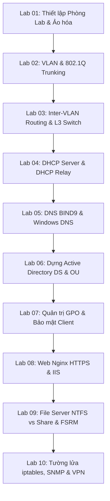

# 🧪 Cẩm Nang Thực Hành & Khung Bài Tập Lab Chuẩn: Quản Trị Mạng (NMA-DUT)

> **Mục tiêu**: Chuẩn hóa quy trình làm bài thực hành Lab cho sinh viên Đại học Bách khoa – ĐH Đà Nẵng, cung cấp 10 bài Lab cốt lõi với sơ đồ topo mạng và bảng phân bổ địa chỉ IP mẫu.

---

## 📐 Quy Chuẩn Bắt Buộc Khi Làm Bài Thực Hành Lab

Mỗi bài Lab của sinh viên DUT khi báo cáo hoặc nhờ Mentor hướng dẫn bắt buộc phải tuân theo 4 bước:
1. **Sơ đồ Topo Mạng (Network Topology)**: Vẽ rõ ràng các thiết bị, cổng kết nối (Interface), và phân đoạn VLAN.
2. **Bảng Phân Bổ Địa Chỉ IP (IP Addressing Table)**: Liệt kê đầy đủ mọi thông số giao diện.
3. **Trình tự Logic Triển khai**: Thực hiện từ Layer 1/2 $\rightarrow$ Layer 3 $\rightarrow$ Dịch vụ $\rightarrow$ Bảo mật.
4. **Bằng chứng Xác thực (Verification Output)**: Lệnh `ping`, `nslookup`, `dcdiag`, `systemctl status`, ảnh chụp gói tin Wireshark.

### Mẫu Bảng Phân Bổ IP Chuẩn:
| Thiết bị (Device) | Giao diện (Interface) | Địa chỉ IP / Subnet | Default Gateway | VLAN ID / Subnet Name | Vai trò / Dịch vụ đảm nhiệm |
| :--- | :--- | :--- | :--- | :--- | :--- |
| **DC-SRV01** | `Ethernet0` | `192.168.1.10/24` | `192.168.1.1` | VLAN 10 (Server Farm) | Domain Controller, Primary DNS, DHCP |
| **WEB-SRV01** | `ens33` | `192.168.1.20/24` | `192.168.1.1` | VLAN 10 (Server Farm) | Nginx Web Server, SSL/TLS |
| **L3-SW01** | `Vlan10` | `192.168.1.1/24` | N/A | VLAN 10 (Server Farm) | Gateway VLAN 10 |
| **L3-SW01** | `Vlan20` | `192.168.20.1/24` | N/A | VLAN 20 (Phong May A) | Gateway VLAN 20, DHCP Relay |
| **CLIENT-01** | `Ethernet0` | *DHCP Assigned* | `192.168.20.1` | VLAN 20 (Phong May A) | Windows 10/11 Domain Client |

---

## 📑 Danh Mục 10 Bài Lab Cốt Lõi (Core Lab Assignments)

---

### 🔬 LAB 01: Xây Dựng Môi Trường Mạng Ảo Hóa Cô Lập (Virtual Isolated Network)
- **Công cụ**: VMware Workstation Pro / Oracle VirtualBox.
- **Yêu cầu kỹ thuật**:
  - Tạo 3 mạng ảo biệt lập (`VMnet10_Server`, `VMnet20_Client`, `VMnet30_DMZ`) bằng tính năng **LAN Segments / Host-Only**.
  - Cài đặt máy ảo Template Windows Server 2022 và Ubuntu Server 22.04 LTS.
  - Tối ưu hóa tài nguyên phần cứng (RAM, CPU core) và tắt các dịch vụ không cần thiết.

---

### 🔬 LAB 02: Phân Tách Miền Quảng Bá với VLAN & 802.1Q Trunking
- **Công cụ**: Cisco Packet Tracer / GNS3.
- **Mục tiêu**:
  - Khởi tạo VLAN 10 (IT), VLAN 20 (KeToan), VLAN 30 (KinhDoanh), VLAN 99 (Management).
  - Cấu hình đường Trunking 802.1Q giữa 2 Switch Cisco, đổi Native VLAN sang VLAN 99 để phòng chống tấn công VLAN Hopping.
  - Kiểm tra tính cô lập: Máy cùng VLAN ping được nhau, khác VLAN không thể giao tiếp.

---

### 🔬 LAB 03: Định Tuyến Liên VLAN Bằng L3 Switch SVI & Router-on-a-Stick
- **Mục tiêu**:
  - Triển khai định tuyến Router-on-a-Stick trên Router Cisco (giao diện phụ `g0/0.10`, `g0/0.20` kèm lệnh `encapsulation dot1Q`).
  - Triển khai giải pháp thay thế trên Switch Layer 3 với SVI (`interface Vlan10`, `interface Vlan20`) và kích hoạt `ip routing`.
  - Phân tích độ trễ và thông lượng giữa 2 giải pháp bằng Wireshark.

---

### 🔬 LAB 04: Cấp Phát IP Động Đa Mạng Con (DHCP Server + DHCP Relay Agent)
- **Topo**: 1 Máy chủ DHCP Windows Server 2022 đặt tại VLAN 10; các máy Client nằm tại VLAN 20 và VLAN 30.
- **Mục tiêu**:
  - Tạo 2 Scope cấp phát IP trên Windows Server: Scope 20 (`192.168.20.0/24`) và Scope 30 (`192.168.30.0/24`).
  - Đặt dải Exclusion Range (loại trừ các IP tĩnh của máy in/server).
  - Cấu hình lệnh `ip helper-address 192.168.10.10` trên Switch L3 tại interface VLAN 20 và VLAN 30.
  - Dùng Wireshark bắt và phân tích gói tin chuyển đổi từ Broadcast sang Unicast của Relay Agent.

---

### 🔬 LAB 05: Phân Giải Tên Miền Đa Nền Tảng (DNS BIND9 & Windows DNS)
- **Mục tiêu**:
  - Thiết lập Primary DNS trên Ubuntu Server (BIND9) cho tên miền `dut.edu.vn`.
  - Thiết lập Secondary DNS trên Windows Server và thực hiện chuyển giao vùng (Zone Transfer).
  - Tạo các bản ghi: `A`, `AAAA`, `CNAME`, `MX` (độ ưu tiên 10 và 20), `PTR` cho Reverse Zone `1.168.192.in-addr.arpa`.
  - Kiểm tra tính chịu lỗi: Tắt Primary DNS, đảm bảo Client vẫn phân giải được qua Secondary DNS.

---

### 🔬 LAB 06: Thiết Kế & Triển Khai Active Directory DS Chuẩn Doanh Nghiệp
- **Mục tiêu**:
  - Nâng cấp Windows Server thành Primary Domain Controller quản lý domain `dut.local`.
  - Thiết kế cây cấu trúc OU 3 tầng: `DUT` $\rightarrow$ `PhongBan` $\rightarrow$ `User/Computer/Groups`.
  - Tạo kịch bản PowerShell tự động import danh sách 50 sinh viên từ file CSV vào đúng OU tương ứng.
  - Thực hiện gia nhập Domain (Join Domain) cho máy trạm Windows 10/11.

---

### 🔬 LAB 07: Áp Đặt Chính Sách An Toàn Thông Tin Qua GPO
- **Mục tiêu**:
  - **Password Policy**: Yêu cầu độ dài tối thiểu 10 ký tự, độ phức tạp cao, khóa tài khoản sau 5 lần nhập sai trong 15 phút.
  - **Desktop Restriction**: Chặn truy cập Control Panel, ẩn biểu tượng CMD và Task Manager đối với sinh viên.
  - **Drive Mapping GPO**: Tự động ánh xạ ổ đĩa mạng `Z:` trỏ về thư mục chia sẻ của từng phòng ban khi người dùng đăng nhập.
  - **Deploy Software**: Tự động cài đặt phần mềm 7-Zip (`.msi`) xuống các máy trạm qua GPO.

---

### 🔬 LAB 08: Triển Khai Web Server Nginx Bảo Mật Với HTTPS (TLS 1.3)
- **Mục tiêu**:
  - Triển khai 2 Virtual Host trên cùng 1 server Nginx: `portal.dut.edu.vn` và `elearning.dut.edu.vn`.
  - Tự tạo Root CA nội bộ bằng OpenSSL và phát hành chứng chỉ số SSL cho 2 tên miền trên.
  - Cấu hình Nginx bắt buộc chuyển hướng toàn bộ HTTP (Port 80) sang HTTPS (Port 443).
  - Đạt điểm đánh giá bảo mật cao: Tắt SSLv3, TLS 1.0, TLS 1.1; chỉ kích hoạt TLS 1.2 và TLS 1.3.

---

### 🔬 LAB 09: Thiết Lập File Server Doanh Nghiệp Phân Quyền Chặt Chẽ & Quota
- **Mục tiêu**:
  - Tạo cấu trúc thư mục dữ liệu trên Windows Server: `D:\CongTy\BanGiamDoc`, `D:\CongTy\KeToan`, `D:\CongTy\Public`.
  - Thiết lập phân quyền phối hợp **Share Permissions (Full Control cho Authenticated Users)** và **NTFS Permissions (Chi tiết từng OU)**.
  - Bật tính năng **Access-Based Enumeration (ABE)**.
  - Cấu hình **FSRM Quota**: Giới hạn mỗi nhân viên Kế toán chỉ được lưu trữ tối đa 2GB; chặn hoàn toàn các tệp tin đuôi `.mp3`, `.mp4`, `.exe`, `.iso`.

---

### 🔬 LAB 10: Giám Sát Tập Trung (SNMP/Syslog) & Tường Lửa Bảo Vệ Mạng
- **Mục tiêu**:
  - Cấu hình SNMPv3 trên Router/Switch và máy chủ Linux; kết nối vào Zabbix Server để vẽ đồ thị băng thông và hiệu năng CPU/RAM thời gian thực.
  - Cấu hình Rsyslog Server tập trung ghi nhận mọi thông điệp bảo mật từ các thiết bị mạng.
  - Thiết lập Tường lửa `iptables`: Chặn toàn bộ kết nối trái phép, chỉ cho phép quản trị SSH từ đúng IP của người quản trị, mở cổng dịch vụ Web/DNS, cấu hình NAT Masquerade ra ngoài Internet.
