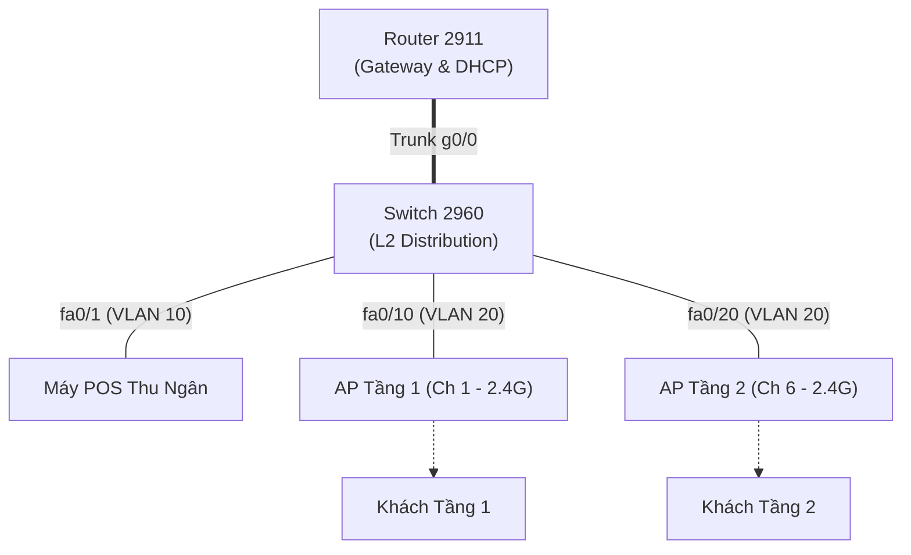

# 📘 NOTION MASTER WORKSPACE: QUẢN TRỊ MẠNG (NMA-DUT)
## ☕ CHUYÊN ĐỀ: THIẾT KẾ, TRIỂN KHAI & QUẢN TRỊ CAFE WI-FI HIGH-DENSITY

> **Học phần**: Quản trị Mạng (Code: NMA-DUT) — Đại học Bách khoa – ĐH Đà Nẵng  
> **Chủ đề buổi học hôm nay**: Thiết kế mạng Wi-Fi chịu tải cao cho Quán Cafe 2 tầng (High-Density RF Planning, Subnetting /23, DHCP Tuning, Bandwidth Shaping & WPA2-PSK).

---

## 📊 I. HỆ THỐNG MASTER DATABASES (CHUẨN HÓA CHO QUẢN TRỊ MẠNG)

### 1. Database 1: `[DB] NMA: Flashcard & Kiến Thức Cốt Lõi (Active Recall & Spaced Repetition)`

*Các thuộc tính chuyên dụng tích hợp:*
- `Tầng OSI / Giao thức` (Select): *Layer 1 (Physical/RF), Layer 2 (Data Link/VLAN), Layer 3 (Network/IP), Layer 4 (Transport), Layer 7 (Application).*
- `Lệnh CLI / Công thức` (Text / Code): *Cú pháp Cisco IOS, Linux Bash, PowerShell hoặc Công thức toán mạng.*

| Tên Thuật Ngữ / Khái Niệm | Tầng OSI / Giao thức | Mức Độ (Bloom) | Mức Độ Ưu Tiên (80/20) | Trạng Thái Thuộc Bài | Lần Ôn Gần Nhất | Khoảng Cách (Ngày) | Cần Ôn Hôm Nay? | Lệnh CLI / Công thức Cốt Lõi |
| :--- | :--- | :--- | :--- | :--- | :--- | :--- | :--- | :--- |
| **OFDMA trong Wi-Fi 6 (802.11ax)** | Layer 1/2 (RF/MAC) | Mức 2 (Hiểu) | 🔥 Trọng tâm (80%) | 🔴 Chưa thuộc | 2026-08-11 | 1 | ⚠️ Cần ôn | Chia kênh thành các Resource Units (RU) |
| **Kênh không chồng lấn 2.4GHz (1, 6, 11)** | Layer 1 (Physical/RF)| Mức 3 (Vận dụng) | 🔥 Trọng tâm (80%) | 🔴 Chưa thuộc | 2026-08-11 | 1 | ⚠️ Cần ôn | Băng thông $20\text{MHz}$, cách nhau $25\text{MHz}$ |
| **Chia Subnet `/23` & DHCP Lease Time** | Layer 3/7 (IP/DHCP) | Mức 3 (Vận dụng) | 🔥 Trọng tâm (80%) | 🟡 Tạm thuộc | 2026-08-11 | 2 | 🟢 Chưa tới lịch | `lease 0 2 0` (2 giờ), Mask `255.255.254.0` |
| **Tính toán Băng thông YouTube 1080p** | Layer 4/7 (QoS/Perf) | Mức 3 (Vận dụng) | 🔥 Trọng tâm (80%) | 🟡 Tạm thuộc | 2026-08-11 | 2 | 🟢 Chưa tới lịch | $BW = 5\text{ Mbps} \times N_{\text{video}} + 1\text{ Mbps} \times N_{\text{web}}$ |
| **Bảo mật WPA2-Personal (AES-CCMP)** | Layer 2 (Security) | Mức 2 (Hiểu) | 🔥 Trọng tâm (80%) | 🟢 Thành thạo | 2026-08-08 | 5 | 🟢 Chưa tới lịch | 4-Way Handshake (PMK $\rightarrow$ PTK/GTK) |
| **Inter-VLAN Sub-interface (802.1Q)** | Layer 3 (Routing) | Mức 3 (Vận dụng) | ⚡ Phụ (20%) | 🟢 Thành thạo | 2026-08-05 | 7 | 🟢 Chưa tới lịch | `encapsulation dot1Q <vlan-id>` |
| **Cơ chế Captive Portal (AAA)** | Layer 7 (HTTP/Auth) | Mức 3 (Vận dụng) | ⚡ Phụ (20%) | 🔴 Chưa thuộc | 2026-08-11 | 1 | ⚠️ Cần ôn | HTTP Redirect Port 80 $\rightarrow$ Splash Page |

> 💡 **Công thức Notion Formula 2.0 cho cột `[Cần Ôn Hôm Nay?]`:**
> ```javascript
> if(empty(prop("Lần Ôn Gần Nhất")), true, dateAdd(prop("Lần Ôn Gần Nhất"), prop("Khoảng Cách (Ngày)"), "days") <= now())
> ```

---

### 2. Database 2: `[DB] NMA: Nhật Ký Lỗi Sai Thực Hành (Reverse Engineering - Network Lab)`

| Mã Sự Cố / Bài Lab | Nguồn / Thiết bị | Tầng OSI Lỗi | Nguyên Nhân Gốc Rễ (Root Cause) | Cấu Hình Đã Làm (Sai) | Cấu Hình Chuẩn (Đúng) | Mức Độ Nghiêm Trọng | Khái Niệm Liên Quan |
| :--- | :--- | :--- | :--- | :--- | :--- | :--- | :--- |
| **Lab Cafe - Lỗi 01: Mạng Wi-Fi rớt gói 40%** | AP-Tang1 & AP-Tang2 | Layer 1 (RF) | Nhiễu đồng kênh (Co-Channel Interference) | Cả 2 AP đều để Channel 1 | AP1: Ch 1 (2.4G) / Ch 36 (5G)<br/>AP2: Ch 6 (2.4G) / Ch 149 (5G) | 🚨 Cực kỳ nguy hiểm | Kênh 1, 6, 11 (DB1) |
| **Lab Cafe - Lỗi 02: Kẹt "Obtaining IP..."** | Router DHCP Server | Layer 7 (DHCP) | Cạn kiệt IP do đặt Lease Time quá dài | Dùng `/24` (254 IP) + Lease 8 ngày | Dùng `/23` (510 IP) + Lease 2 giờ | 🚨 Cực kỳ nguy hiểm | Subnetting & DHCP (DB1) |
| **Lab Cafe - Lỗi 03: Khách scan thấy máy POS** | Cisco Switch 2960 | Layer 2 (VLAN) | Không phân tách mạng Khách và Nội bộ | Cắm tất cả vào VLAN 1 mặc định | POS: VLAN 10 (Access)<br/>AP Wi-Fi: VLAN 20 (Access) | 🚨 Lỗ hổng bảo mật | Inter-VLAN (DB1) |
| **Lab Cafe - Lỗi 04: 1 Khách kéo IDM sập mạng** | Router 2911 (QoS) | Layer 4/7 (Perf) | Không cấu hình giới hạn tốc độ người dùng | Mở không giới hạn băng thông | Giới hạn Per-IP: Down 6M / Up 2M | ⚠️ Ảnh hưởng vận hành | YouTube 1080p Bandwidth |

---

## 📖 II. MASTER KNOWLEDGE BASE: CHUYÊN ĐỀ CAFE WI-FI (FEYNMAN STYLE)

### 📍 Module: Thiết Kế & Tối Ưu Mạng Không Dây Mật Độ Cao (High-Density Wi-Fi)

<details>
<summary><b>1.1 Bản chất Sóng RF, Bán kính Phủ sóng & Chuẩn Wi-Fi 6 (Feynman Style)</b></summary>

- **Giải thích bằng ẩn dụ đời thực:**
  - **Wi-Fi 5 (OFDM cũ) giống như dịch vụ xe buýt chỉ chở 1 người/chuyến**: Mỗi lần phát sóng, toàn bộ kênh truyền chỉ phục vụ đúng 1 máy điện thoại, dù máy đó chỉ gửi 1 tin nhắn Zalo bé tí. Các máy khác phải xếp hàng chờ $\rightarrow$ Khi quán đông 100 người, hàng chờ quá dài làm mạng bị đơ.
  - **Wi-Fi 6 (OFDMA mới) giống như xe tải gom hàng nhiều ngăn**: Một khung truyền sóng được chia thành nhiều ngăn nhỏ (Resource Units - RU), cùng lúc chở dữ liệu cho 10-20 máy điện thoại khác nhau $\rightarrow$ Triệt tiêu hàng đợi, xem video mượt mà.
- **Quy luật Suy hao Sóng (Attenuation):**
  - Sóng 5GHz truyền tốc độ cao nhưng khả năng đâm xuyên cực kém. Sàn bê tông cốt thép giữa tầng 1 và tầng 2 làm suy hao $\approx 20\text{dB}$ (mất $99\%$ năng lượng sóng).
  - *Kết luận*: **Không bao giờ dùng 1 AP phát xuyên tầng bê tông trong quán cafe! Bắt buộc mỗi tầng 1 AP.**
</details>

<details>
<summary><b>1.2 Các Quy Tắc & Công Thức Tính Toán Cốt Lõi (80/20 Math)</b></summary>

1. **Công thức Bán kính Vùng Phủ Sóng Hình Chữ Nhật:**
   $$R = \sqrt{\left(\frac{L}{2}\right)^2 + \left(\frac{W}{2}\right)^2} = \sqrt{\left(\frac{15}{2}\right)^2 + \left(\frac{8}{2}\right)^2} \approx 8.54\text{ m}$$
2. **Công thức Tính Số IP Khả Dụng (Subnetting):**
   $$\text{Số Host} = 2^{(32 - \text{Prefix})} - 2 \xrightarrow{\text{Subnet } /23} 2^{(32 - 23)} - 2 = 2^9 - 2 = \mathbf{510 \text{ IPs}}$$
3. **Công thức Băng thông Đường truyền Internet Tổng:**
   $$BW_{\text{Total}} = (N_{\text{Clients}} \times \%_{\text{Video}} \times BW_{\text{1080p}}) + (N_{\text{Clients}} \times \%_{\text{Web}} \times BW_{\text{Web}}) + BW_{\text{Máy chiếu}}$$
   $$BW_{\text{Total}} = (240 \times 20\% \times 5\text{ Mbps}) + (240 \times 80\% \times 1\text{ Mbps}) + 15\text{ Mbps} = \mathbf{447 \text{ Mbps}}$$
4. **Quy tắc Kênh Không Chồng Lấn 2.4GHz:**
   - Chỉ sử dụng bộ 3 kênh: **Channel 1, Channel 6, Channel 11** (Độ rộng $20\text{MHz}$).
</details>

<details>
<summary><b>1.3 Quy Trình 4 Bước Triển Khai Thực Tế Chuẩn Doanh Nghiệp</b></summary>

- **Bước 1 (Vật lý & RF)**: Đo đạc mặt bằng $\rightarrow$ Xác định vị trí gắn trần trung tâm cho từng AP $\rightarrow$ Gán kênh RF so le (Tầng 1: Ch 1/36; Tầng 2: Ch 6/149).
- **Bước 2 (Phân hoạch L2/L3)**: Tạo VLAN 10 (Nội bộ/POS) và VLAN 20 (Wi-Fi Khách) $\rightarrow$ Cấu hình Subnet `/23` cho VLAN 20.
- **Bước 3 (Dịch vụ Mạng)**: Cấu hình DHCP Server trên Router với thời hạn mượn IP (Lease Time) ngắn ($2\text{ giờ}$).
- **Bước 4 (Bảo mật & Kiểm thử)**: Đặt bảo mật WPA2-Personal (AES) $\rightarrow$ Đo thông lượng và kiểm tra chuyển vùng (Roaming test).
</details>

---

## 🧮 III. LAB THỰC HÀNH PACKET TRACER (CISCO CLI TEMPLATE)

### 🔬 Bài Lab: Triển Khai Hệ Thống Wi-Fi Quán Cafe 2 Tầng



#### 1. Cấu hình Cisco Router 2911 (Inter-VLAN & DHCP /23)
```cisco
Router> enable
Router# configure terminal
Router(config)# hostname Router-DUT-Coffee

! 1. Khởi động cổng vật lý
Router-DUT-Coffee(config)# interface g0/0
Router-DUT-Coffee(config-if)# no shutdown
Router-DUT-Coffee(config-if)# exit

! 2. VLAN 10 (Nội bộ & POS)
Router-DUT-Coffee(config)# interface g0/0.10
Router-DUT-Coffee(config-subif)# encapsulation dot1Q 10
Router-DUT-Coffee(config-subif)# ip address 192.168.10.1 255.255.255.0
Router-DUT-Coffee(config-subif)# exit

! 3. VLAN 20 (Wi-Fi Khách Subnet /23)
Router-DUT-Coffee(config)# interface g0/0.20
Router-DUT-Coffee(config-subif)# encapsulation dot1Q 20
Router-DUT-Coffee(config-subif)# ip address 192.168.20.1 255.255.254.0
Router-DUT-Coffee(config-subif)# exit

! 4. Cấu hình DHCP Server cho Khách (Lease Time: 2 giờ)
Router-DUT-Coffee(config)# ip dhcp excluded-address 192.168.20.1 192.168.20.10
Router-DUT-Coffee(config)# ip dhcp pool GUEST_WIFI_POOL
Router-DUT-Coffee(dhcp-config)# network 192.168.20.0 255.255.254.0
Router-DUT-Coffee(dhcp-config)# default-router 192.168.20.1
Router-DUT-Coffee(dhcp-config)# dns-server 8.8.8.8 1.1.1.1
Router-DUT-Coffee(dhcp-config)# lease 0 2 0
Router-DUT-Coffee(dhcp-config)# exit
```

#### 2. Cấu hình Cisco Switch 2960 (VLAN & Portfast)
```cisco
Switch> enable
Switch# configure terminal
Switch(config)# hostname Switch-DUT-Coffee

! Khởi tạo VLAN
Switch-DUT-Coffee(config)# vlan 10
Switch-DUT-Coffee(config-vlan)# name POS_Internal
Switch-DUT-Coffee(config)# vlan 20
Switch-DUT-Coffee(config-vlan)# name Guest_Wifi
Switch-DUT-Coffee(config)# exit

! Cấu hình cổng Trunk nối Router
Switch-DUT-Coffee(config)# interface g0/1
Switch-DUT-Coffee(config-if)# switchport mode trunk
Switch-DUT-Coffee(config-if)# exit

! Cổng máy POS
Switch-DUT-Coffee(config)# interface fa0/1
Switch-DUT-Coffee(config-if)# switchport mode access
Switch-DUT-Coffee(config-if)# switchport access vlan 10
Switch-DUT-Coffee(config-if)# spanning-tree portfast
Switch-DUT-Coffee(config-if)# exit

! Cổng nối 2 AP (VLAN 20)
Switch-DUT-Coffee(config)# interface range fa0/10, fa0/20
Switch-DUT-Coffee(config-if-range)# switchport mode access
Switch-DUT-Coffee(config-if-range)# switchport access vlan 20
Switch-DUT-Coffee(config-if-range)# spanning-tree portfast
Switch-DUT-Coffee(config-if-range)# exit
```

---

## 🎯 IV. TEMPLATE PHÂN TÍCH LỖI SAI (REVERSE ENGINEERING NMA)

*Sử dụng template này cho Database 2 mỗi khi gặp sự cố khi làm bài:*

```markdown
### ❌ [SỰ CỐ LAB] - [Tên Dịch Vụ / Bài Tập]
- ❓ Hiện tượng / Triệu chứng: [Khách không nhận IP / Ping rớt gói / Không join domain]
- 🔴 Cách cấu hình / Suy đoán ban đầu (Sai): 
- 🟢 Cách xử lý chuẩn (Đúng): 

- 🔍 PHÂN TÍCH GỐC RỄ (ROOT CAUSE ANALYSIS):
  * Tầng OSI bị lỗi: [Layer 1 / Layer 2 / Layer 3 / Layer 4 / Layer 7]
  * Tại sao cách cũ lại gây lỗi: [Ví dụ: Do Router chặn broadcast DHCP mà thiếu ip helper-address]
  * Lệnh CLI dùng để phát hiện lỗi nhanh nhất: [tcpdump / show ip dhcp binding / nslookup]

- 💡 Nguyên tắc khắc cốt ghi tâm: [1 câu quy tắc hành động]
```

---

## 🗓️ V. QUY TRÌNH HỌC HÀNG NGÀY (DAILY SOP FOR NMA-DUT)

> 🌅 **BƯỚC 1: SÁNG (15 Phút) - ACTIVE RECALL FLASHCARD**
> - Mở Notion Database 1, lọc theo `[Cần Ôn Hôm Nay? = true]`.
> - Tự trả lời các câu hỏi về: *Cơ chế DORA, Các record DNS, 5 vai trò FSMO, Kênh 1-6-11*.
> - Cập nhật ngày ôn tập để Spaced Repetition tự động tính chu kỳ tiếp theo.

> 🌤️ **BƯỚC 2: CHIỀU/TỐI (60 Phút) - THỰC HÀNH PACKET TRACER & LAB**
> - Mở bài thực hành tại **Mục III**, kéo thả thiết bị và cấu hình CLI từng dòng lệnh.
> - Bắt buộc dùng `ping` và `show` để kiểm tra thông tuyến.

> 🌃 **BƯỚC 3: ĐÊM (15 Phút) - GHI NHẬT KÝ REVERSE ENGINEERING**
> - Mọi lỗi gặp phải trong lúc làm Lab (quên `no shutdown`, sai mask `/23`, trùng kênh RF) phải được nhập ngay vào Database 2 để không bao giờ lặp lại trong bài thi.
