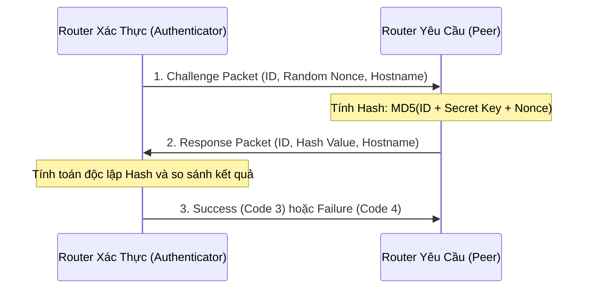

# 📜 ĐIỀU LỆ PHÒNG TƯ LIỆU & TÀI LIỆU GỐC (LECTURES & RAW MATERIALS DEPT)
## Phòng 02 — Công Ty An Toàn Thông Tin & Tác Chiến Mạng (CORP-04-SEC)

> **Mã Phòng Ban:** `SEC-DEPT-02`  
> **Trưởng phòng phụ trách:** Agent `SMS-02` (Syllabus & Material Sentinel) & Thư Ký Học Thuật An Toàn Mạng  
> **Cấp bậc quản trị:** Cấp 2 — Thu thập, phân rã, thẩm định ER-QVR và số hóa tài liệu gốc về an toàn bảo mật mạng

---

## 1. CHỨC NĂNG & NHIỆM VỤ (FUNCTION & MANDATE)
Phòng `SEC-DEPT-02` chịu trách nhiệm lưu trữ, chuẩn hóa và kiểm định toàn bộ tài liệu lý thuyết, slide bài giảng và hướng dẫn thực hành gốc của bộ môn An Toàn Mạng tại ĐHBK Đà Nẵng:
1. **Lưu Trữ & Phân Rã Slide Bài Giảng Chuyên Đề**:
   - Access Control Lists: Standard ACL, Extended ACL, Named ACL, Time-based ACL.
   - Routing Protocol Authentication: Xác thực gói tin OSPFv2 (MD5/HMAC-SHA), EIGRP, RIPv2.
   - Point-to-Point Protocol (PPP): So sánh cơ chế xác thực bản rõ PAP vs bắt tay 3 bước thách thức CHAP (Challenge Handshake Authentication Protocol).
2. **Quản Lý Video & Hướng Dẫn Mô Phỏng**: Lưu trữ video hướng dẫn thực hành trên môi trường GNS3 và bắt gói tin Wireshark.
3. **Thẩm Định Tri Thức ER-QVR**: Đối chiếu các hướng dẫn cấu hình với khuyến nghị bảo mật từ CIS Cisco IOS Benchmark và NIST SP 800-77.

---

## 2. BỘ QUY TẮC BẤT BIẾN (CURATION INVARIANTS & HARD CONSTRAINTS)
1. **Nguyên tắc Quản Lý Video & Binary Lớn**: File video hướng dẫn (`.mp4`, `.mkv`) và tài liệu đa phương tiện nặng vượt quá 50MB bắt buộc phải đưa vào `.gitignore`. Cung cấp file `README.md` lưu trữ liên kết Google Drive / YouTube Unlisted nội bộ kèm mã hash SHA-256.
2. **Nguyên tắc Thẩm Định Bảo Mật Giao Thức (Security Deprecation Invariant)**: Mọi tài liệu có đề cập đến các cơ chế xác thực yếu (như PAP truyền mật khẩu bản rõ, hoặc khóa MD5 cũ) bắt buộc phải gắn cảnh báo đỏ và hướng dẫn giải pháp thay thế hiện đại (ví dụ: CHAP, OSPFv3 IPSec, HMAC-SHA-256).
3. **Nguyên tắc Tính Toàn Vẹn Tài Liệu (Cryptographic Verification)**: Mọi tài liệu PDF hoặc bài lab được đưa vào hệ thống phải ghi rõ nguồn cấp (Giảng viên bộ môn nào, năm học nào) và kiểm tra mã băm SHA-256 để chống can thiệp trái phép.
4. **Nguyên tắc Ngăn Chặn Lộ Thông Tin Nhạy Cảm (No Hardcoded Credentials)**: Trong tài liệu và bài giảng mẫu, cấm tuyệt đối sử dụng mật khẩu thực tế, khóa bí mật riêng (Private Key) của hệ thống trường hoặc doanh nghiệp đối tác.

---

## 3. BỘ LỆNH & TOOLCHAIN XỬ LÝ HỌC LIỆU (TOOLCHAIN & INGESTION PIPELINE)
```bash
# 1. Tạo mã băm SHA-256 xác thực toàn vẹn các tài liệu PDF bài giảng
sha256sum *.pdf > checksums.sha256

# 2. Kiểm tra tính toàn vẹn của tệp dựa trên danh sách hash đã lưu
sha256sum -c checksums.sha256

# 3. Trích xuất bảng tóm tắt ACL từ file PDF
pdfgrep -n -C 3 "access-list" *.pdf

# 4. Kiểm tra các liên kết Markdown trong thư mục tài liệu
markdown-link-check DEPARTMENT_CHARTER.md
```

---

## 4. CẤU TRÚC THƯ MỤC & TÀI SẢN PHÒNG BAN (DEPARTMENT ASSETS)
```
02_Lectures_and_Raw_Materials/
├── DEPARTMENT_CHARTER.md                  # Điều lệ phòng ban 7 tầng chuẩn hóa
├── ACL Samples.pdf                       # Hướng dẫn mẫu cấu hình ACL chuẩn Cisco
├── Authentication OSPF.pdf               # Kịch bản xác thực OSPF bằng khóa bảo mật
├── Authentication EIGRP.pdf              # Kịch bản cấu hình xác thực EIGRP
├── Authentication RIPv2.pdf              # Kịch bản cấu hình xác thực RIPv2
├── PPP.pdf                               # Tài liệu lý thuyết giao thức PPP & CHAP/PAP
├── README_VIDEO_LABS.md                  # Hướng dẫn tải video GNS3 & Wireshark
└── summaries/                            # Bản tóm tắt học thuật Markdown chuẩn ER-QVR
    ├── SUMMARY_ACL_ARCHITECTURE.md
    └── SUMMARY_ROUTING_AUTH_PROTOCOLS.md
```

---

## 5. MẪU TƯ LIỆU HỌC THUẬT CHUẨN ER-QVR (GOLD MASTER BLUEPRINT)

### Bản Tóm Tắt So Sánh Cơ Chế Xác Thực PAP vs CHAP Trong Giao Thức PPP (`SUMMARY_ROUTING_AUTH_PROTOCOLS.md`)
```markdown
# 🛡️ TÓM TẮT HỌC THUẬT: CƠ CHẾ XÁC THỰC PAP VS CHAP (RFC 1994)
> **Tiêu chuẩn học thuật**: IETF RFC 1334 (PAP) & RFC 1994 (CHAP) | Điểm ER-QVR: 95/100

## 1. Bảng So Sánh Cơ Chế Hoạt Động
| Tiêu chí | Password Authentication Protocol (PAP) | Challenge Handshake Authentication Protocol (CHAP) |
|:---|:---|:---|
| **Số bước bắt tay** | 2 bước (Request / Acknowledge) | 3 bước (Challenge / Response / Success-Failure) |
| **Mức độ an toàn** | 🔴 Kém (Mật khẩu truyền dạng bản rõ - Cleartext) | 🟢 Cao (Không bao giờ truyền mật khẩu qua đường truyền) |
| **Hàm băm sử dụng** | Không sử dụng | MD5 (One-way Hash function) |
| **Chống tấn công Replay**| 🔴 Không (Dễ bị Sniffing và phát lại) | 🟢 Có (Sử dụng giá trị ngẫu nhiên Challenge Id + Nonce) |
| **Tần suất xác thực** | Chỉ xác thực 1 lần duy nhất khi thiết lập link | Xác thực định kỳ lặp lại trong suốt phiên kết nối |

## 2. Luồng Bắt Tay 3 Bước Của CHAP (Three-Way Handshake)

```

---

## 6. TIÊU CHÍ NGHIỆM THU (DEFINITION OF DONE - DOD)
- [x] **Không có file video quá khổ trong Git**: File video lớn đã được chuyển hướng sang `README_VIDEO_LABS.md` kèm checksum.
- [x] **Có bảng tóm tắt chuẩn hóa**: Các tài liệu PDF đều có bản tóm tắt nguyên lý và bảng so sánh trực quan.
- [x] **Kiểm tra mã băm toàn vẹn**: File `checksums.sha256` được cập nhật đầy đủ cho các file tư liệu.
- [x] **Auditor thông qua**: Điểm kiểm định Schema đạt 100% không cảnh báo.

---

## 7. QUY TRÌNH XỬ LÝ SỰ CỐ TÀI LIỆU (RUNBOOK & TROUBLESHOOTING)

### Sự cố 1: Sinh viên cấu hình xác thực OSPF nhưng các Router không thiết lập kề cận (Neighbor Down)
- **Hiện tượng**: Lệnh `show ip ospf neighbor` trả về kết quả rỗng.
- **Nguyên nhân**: Mâu thuẫn giữa hai đầu router: Khác Key ID, khác chuỗi mật khẩu Secret Key, hoặc một bên cấu hình Message-Digest (MD5) còn một bên dùng Simple Password.
- **Quy trình xử lý**:
  1. Kiểm tra interface cấu hình: `show ip ospf interface <interface_id>`.
  2. Bắt gói tin OSPF Hello trên Wireshark kiểm tra Authentication Type (Type 2: Cryptographic).
  3. Đồng bộ lại `ip ospf message-digest-key <id> md5 <secret_key>` trên cả hai đầu interface.

### Sự cố 2: Video hướng dẫn GNS3 không chạy được do thiếu Codec
- **Hiện tượng**: Trình phát video báo lỗi không hỗ trợ định dạng MP4 H.265.
- **Cách khắc phục**: Chuyển đổi video sang định dạng chuẩn H.264 / AAC bằng ffmpeg:
  ```bash
  ffmpeg -i input.mp4 -vcodec libx264 -crf 23 -acodec aac output_standard.mp4
  ```
