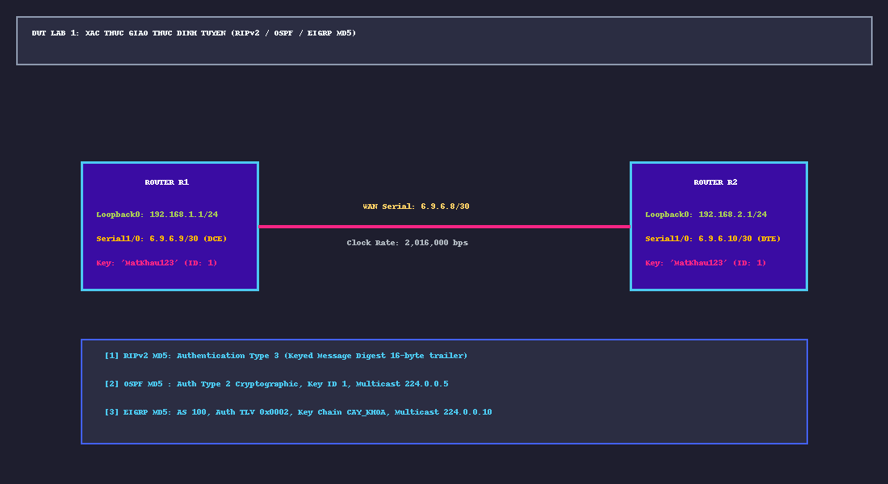

# 📖 TỔNG QUAN LAB 1: XÁC THỰC GIAO THỨC ĐỊNH TUYẾN (RIPv2 / OSPF / EIGRP MD5)

---

## 🎯 1. MỤC TIÊU BÀI THỰC HÀNH
1. **Bảo mật cơ sở hạ tầng định tuyến**: Ngăn chặn kẻ tấn công (Attacker) tiêm các tuyến đường giả mạo (Route Injection / Blackhole Attack) vào bảng định tuyến của hệ thống mạng.
2. **Hiểu rõ bản chất 2 cơ chế xác thực**:
   - **Xác thực văn bản rõ (Simple / Plaintext Password)**: Mật khẩu truyền trực tiếp trong gói tin, bị Wireshark bắt trọn 100%.
   - **Xác thực băm mật mã (Cryptographic / Keyed Message Digest MD5)**: Mật khẩu không bao giờ truyền trên dây cáp mạng; hai bên tính toán giá trị băm HMAC-MD5 16-byte kèm Sequence Number chống tấn công phát lại (Replay Attack).
3. **Làm chủ 3 giao thức định tuyến động tiêu biểu**: RIPv2 (RFC 2082), OSPFv2 (RFC 2328), EIGRP (RFC 7868).

---

## 🗺️ 2. TOPOLOGY VÀ BẢNG PHÂN BỔ ĐỊA CHỈ IP

### Bảng Phân Bổ Địa Chỉ IP & Tham Số Mạng
| Thiết bị | Interface | Địa chỉ IP / Subnet Mask | Vai trò mạng | Ghi chú phần cứng |
|:---|:---|:---|:---|:---|
| **R1** | `Serial1/0` | `6.9.6.9 /30` (`255.255.255.252`) | WAN liên Router nối sang R2 | DCE (Clock rate: `2016000`) |
| **R1** | `Loopback0` | `192.168.1.1 /24` (`255.255.255.0`) | Đại diện mạng LAN 1 nội bộ R1 | Logical Interface |
| **R2** | `Serial1/0` | `6.9.6.10 /30` (`255.255.255.252`) | WAN liên Router nối sang R1 | DTE |
| **R2** | `Loopback0` | `192.168.2.1 /24` (`255.255.255.0`) | Đại diện mạng LAN 2 nội bộ R2 | Logical Interface |

---

## 🔐 3. BẢNG THAM SỐ XÁC THỰC MẬT MÃ DÙNG CHUNG
- **Tên Key Chain**: `CAY_KHOA`
- **Key ID**: `1`
- **Key-String (Mật khẩu bí mật)**: `MatKhau123`
- **Thuật toán băm**: HMAC-MD5 (128 bits $\rightarrow$ 16 bytes Digest)

| Giao thức | Loại địa chỉ gửi gói tin | Vị trí áp dụng lệnh | Cú pháp Cisco IOS đặc trưng |
|:---|:---|:---|:---|
| **RIPv2** | Multicast `224.0.0.9` (UDP 520) | Interface `Serial1/0` | `ip rip authentication mode md5` `ip rip authentication key-chain CAY_KHOA` |
| **OSPFv2** | Multicast `224.0.0.5` (Protocol 89) | Interface `Serial1/0` | `ip ospf authentication message-digest` `ip ospf message-digest-key 1 md5 MatKhau123` |
| **EIGRP** | Multicast `224.0.0.10` (Protocol 88) | Interface `Serial1/0` | `ip authentication mode eigrp 100 md5` `ip authentication key-chain eigrp 100 CAY_KHOA` |

---

## 📁 4. DANH MỤC CÁC TỆP TIN TIÊU CHUẨN CỦA LAB 1
1. [`day1/day1.gns3`](day1/day1.gns3): Đồ án GNS3 hoàn chỉnh, nạp sẵn 2 Router c3725, cáp Serial1/0 và nhãn sơ đồ trực quan.
2. [`R1_startup-config.cfg`](R1_startup-config.cfg): File cấu hình chuẩn của Router R1.
3. [`R2_startup-config.cfg`](R2_startup-config.cfg): File cấu hình chuẩn của Router R2.
4. [`sodo_lab1_routing_auth.png`](sodo_lab1_routing_auth.png): Sơ đồ mạng GNS3 trực quan hóa độ phân giải cao.
5. [`LAB1_BAN_THIET_KE_TINH_TOAN_SINH_VIEN.md`](LAB1_BAN_THIET_KE_TINH_TOAN_SINH_VIEN.md): Bản nháp tính toán thông số mạng, chia IP và phân tích cơ chế MD5 kiểu sinh viên làm bài thi.
6. [`LAB1_HUONG_DAN_KIEM_TRA_CHI_TIET.md`](LAB1_HUONG_DAN_KIEM_TRA_CHI_TIET.md): Cẩm nang hướng dẫn kiểm tra CLI, bảng định tuyến, neighbor và debug.
7. [`LAB1_WIRESHARK_PCAPNG_ANALYSIS_GUIDE.md`](LAB1_WIRESHARK_PCAPNG_ANALYSIS_GUIDE.md): Hướng dẫn lọc và phân tích từng trường gói tin trên các file `rip.pcapng`, `ospf.pcapng`, `eigrp.pcapng`.
