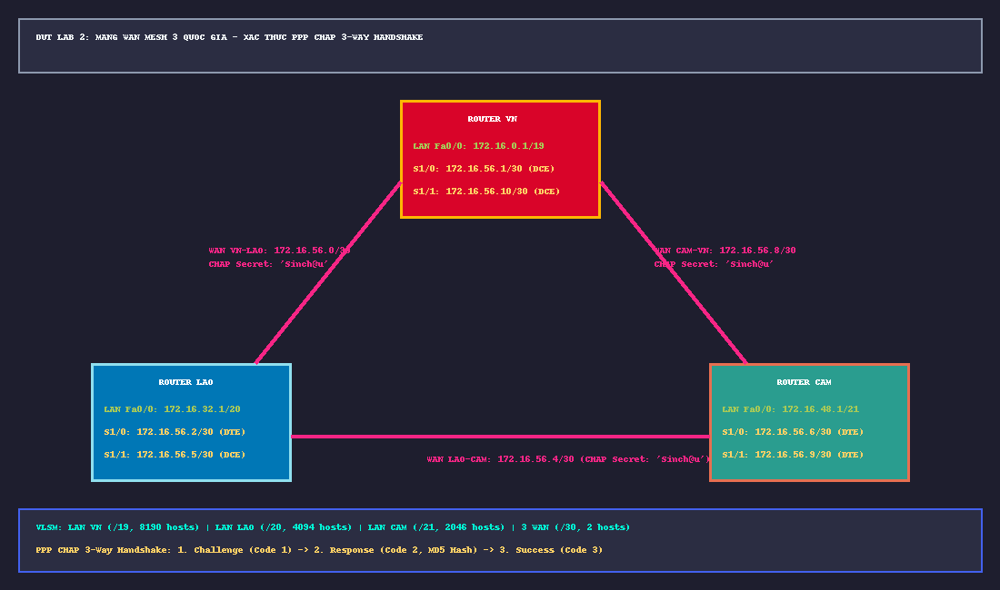

# 📖 TỔNG QUAN LAB 2: XÁC THỰC MẬT MÃ PPP CHAP MẠNG WAN TAM GIÁC (VN - LAO - CAM)

---

## 🎯 1. MỤC TIÊU BÀI THỰC HÀNH
1. **Thiết kế không gian địa chỉ VLSM (Variable Length Subnet Masking)**: Từ dải mạng gốc `172.16.0.0/16`, tính toán chia thành 6 mạng con tối ưu số lượng Host cho 3 mạng LAN quốc gia và 3 tuyến WAN kết nối Mesh.
2. **Triển khai đóng gói giao thức điểm - điểm PPP (Point-to-Point Protocol)**: Thay thế giao thức mặc định Cisco HDLC bằng PPP trên các đường truyền cáp Serial WAN.
3. **Bảo mật đường truyền bằng xác thực CHAP 3-way handshake (RFC 1994)**:
   - So sánh vượt trội so với giao thức PAP (Password Authentication Protocol - truyền plaintext mật khẩu).
   - Vận hành quy trình xác thực 3 bước: **Challenge (0x01) $\rightarrow$ Response (0x02, MD5) $\rightarrow$ Success (0x03)**.
   - Thiết lập mô hình xác thực chéo hai chiều (Mutual Authentication) giữa 3 Router VN, LAO và CAM.

---

## 🗺️ 2. TOPOLOGY VÀ BẢNG PHÂN BỔ ĐỊA CHỈ IP (VLSM)

### Bảng Phân Bổ Mạng Con (VLSM 6 Subnets)
| Mạng con | Dải mạng / Prefix | Subnet Mask | Interface & Địa chỉ IP gán | Số lượng Host tối đa |
|:---|:---|:---|:---|:---|
| **LAN Việt Nam** | `172.16.0.0 /19` | `255.255.224.0` | `VN Fa0/0`: `172.16.0.1` | **8,190 hosts** |
| **LAN Lào** | `172.16.32.0 /20` | `255.255.240.0` | `LAO Fa0/0`: `172.16.32.1` | **4,094 hosts** |
| **LAN Campuchia** | `172.16.48.0 /21` | `255.255.248.0` | `CAM Fa0/0`: `172.16.48.1` | **2,046 hosts** |
| **WAN VN - LAO** | `172.16.56.0 /30` | `255.255.255.252` | `VN S1/0` (`172.16.56.1`) $\leftrightarrow$ `LAO S1/0` (`172.16.56.2`) | **2 hosts** |
| **WAN LAO - CAM** | `172.16.56.4 /30` | `255.255.255.252` | `LAO S1/1` (`172.16.56.5`) $\leftrightarrow$ `CAM S1/0` (`172.16.56.6`) | **2 hosts** |
| **WAN CAM - VN** | `172.16.56.8 /30` | `255.255.255.252` | `CAM S1/1` (`172.16.56.9`) $\leftrightarrow$ `VN S1/1` (`172.16.56.10`)| **2 hosts** |

---

## 🔐 3. MA TRẬN TÀI KHOẢN XÁC THỰC CHAP
* **Mật khẩu dùng chung (Shared Secret)**: `Sinch@u`

| Router thực hiện cấu hình | Hostname đối tác cần xác thực | Câu lệnh Cisco IOS tương ứng |
|:---|:---|:---|
| **Router VN** | LAO & CAM | `username LAO password Sinch@u` `username CAM password Sinch@u` |
| **Router LAO** | VN & CAM | `username VN password Sinch@u` `username CAM password Sinch@u` |
| **Router CAM** | VN & LAO | `username VN password Sinch@u` `username LAO password Sinch@u` |

---

## 📁 4. DANH MỤC CÁC TỆP TIN TIÊU CHUẨN CỦA LAB 2
1. [`VN_startup-config.cfg`](VN_startup-config.cfg): File cấu hình chuẩn của Router VN.
2. [`LAO_startup-config.cfg`](LAO_startup-config.cfg): File cấu hình chuẩn của Router LAO.
3. [`CAM_startup-config.cfg`](CAM_startup-config.cfg): File cấu hình chuẩn của Router CAM.
4. [`sodo_lab2_ppp_chap.png`](sodo_lab2_ppp_chap.png): Sơ đồ mạng GNS3 trực quan hóa mô hình tam giác 3 quốc gia.
5. [`LAB2_BAN_THIET_KE_TINH_TOAN_SINH_VIEN.md`](LAB2_BAN_THIET_KE_TINH_TOAN_SINH_VIEN.md): Bản nháp tính toán chia mạng VLSM từng bit và ma trận CHAP.
6. [`LAB2_HUONG_DAN_KIEM_TRA_CHI_TIET.md`](LAB2_HUONG_DAN_KIEM_TRA_CHI_TIET.md): Quy trình kiểm tra 6 subnet trên bảng định tuyến và debug PPP.
7. [`LAB2_WIRESHARK_PCAPNG_ANALYSIS_GUIDE.md`](LAB2_WIRESHARK_PCAPNG_ANALYSIS_GUIDE.md): Hướng dẫn phân tích bắt gói tin CHAP Challenge, Response, Success trên `VN-LAO.pcapng`, `LAO-CAM.pcapng`, `VN-CAM.pcapng`.
