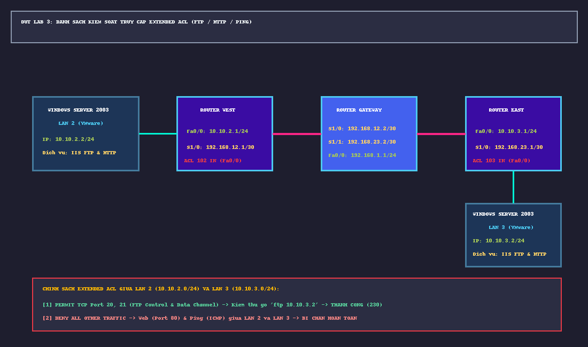

# 📖 TỔNG QUAN LAB 3: DANH SÁCH KIỂM SOÁT TRUY CẬP MỞ RỘNG (EXTENDED ACL)

---

## 🎯 1. MỤC TIÊU BÀI THỰC HÀNH
1. **Làm chủ nguyên lý Extended ACL (100 - 199)**:
   - Cho phép lọc lưu lượng chi tiết dựa trên cả: Địa chỉ IP nguồn (Source IP), Địa chỉ IP đích (Destination IP), Giao thức tầng 4 (TCP, UDP, ICMP), và Cổng dịch vụ (Port number: 20, 21, 80...).
   - Khác biệt bản chất với Standard ACL (1 - 99) vốn chỉ lọc được duy nhất Source IP.
2. **Chiến lược đặt ACL tối ưu (Placement Strategy)**:
   - **Extended ACL**: Đặt **CÀNG GẦN NGUỒN CÀNG TỐT** (*As close to the source as possible*) để drop gói tin ngay tại cửa ngõ vào của mạng, tránh lãng phí băng thông của các liên kết WAN đắt đỏ.
3. **Thực thi chính sách bảo mật theo yêu cầu giảng viên (Thầy Lý - DUT)**:
   - **Cho phép dịch vụ FTP** giữa LAN 2 (`10.10.2.0/24`) và LAN 3 (`10.10.3.0/24`) (cả kênh điều khiển Port 21 và kênh truyền file Port 20).
   - **Chặn toàn bộ các dịch vụ khác** giữa LAN 2 và LAN 3 (tiêu biểu là Ping ICMP và Web HTTP Port 80).
   - **Cho phép các kết nối khác** đi Internet hoặc sang các vùng mạng khác bình thường.

---

## 🗺️ 2. TOPOLOGY VÀ BẢNG PHÂN BỔ ĐỊA CHỈ IP

### Bảng Phân Bổ Mạng & Gán Cổng Thiết Bị
| Thiết bị | Interface | Địa chỉ IP / Prefix | Vai trò trong hệ thống |
|:---|:---|:---|:---|
| **Server LAN 2** | `vEthernet` | `10.10.2.2 /24` (GW: `10.10.2.1`) | Windows Server 2003 (IIS Web & FTP Service) trên VMware |
| **Router West** | `Fa0/0` `S1/0` | `10.10.2.1 /24` `192.168.12.1 /30` | Gateway LAN 2 (Áp dụng ACL 102 Inbound) Nối WAN sang Gateway |
| **Router Gateway**| `S1/0` `S1/1` `Fa0/0` `Fa0/1` | `192.168.12.2 /30` `192.168.23.2 /30` `10.10.1.1 /24` `200.200.200.1 /30` | Nối WAN sang West Nối WAN sang East LAN 1 nội bộ Nối sang Router Internet |
| **Router East** | `Fa0/0` `S1/0` | `10.10.3.1 /24` `192.168.23.1 /30` | Gateway LAN 3 (Áp dụng ACL 103 Inbound) Nối WAN sang Gateway |
| **Server LAN 3** | `vEthernet` | `10.10.3.2 /24` (GW: `10.10.3.1`) | Windows Server 2003 (IIS Web & FTP Service) trên VMware |
| **Router Internet** | `Fa0/0` `Loopback0`| `200.200.200.2 /30` `8.8.8.8 /24` | Cổng WAN Internet Đại diện máy chủ DNS công cộng |

---

## 🔐 3. BẢNG PHÂN TÍCH CHÍNH SÁCH EXTENDED ACL 102
Áp dụng trên Router West: `interface FastEthernet0/0` $\rightarrow$ `ip access-group 102 in`

| STT Dòng lệnh | Cú pháp Cisco IOS | Giải thích chức năng kỹ thuật |
|:---:|:---|:---|
| **1** | `access-list 102 permit tcp 10.10.2.0 0.0.0.255 10.10.3.0 0.0.0.255 eq ftp` | Cho phép thiết lập kênh điều khiển FTP Control (TCP port 21). |
| **2** | `access-list 102 permit tcp 10.10.2.0 0.0.0.255 10.10.3.0 0.0.0.255 eq ftp-data` | Cho phép truyền file qua kênh dữ liệu FTP Data (TCP port 20). |
| **3** | `access-list 102 permit tcp 10.10.2.0 0.0.0.255 eq ftp-data 10.10.3.0 0.0.0.255` | Cho phép Active FTP khi Server chủ động mở kết nối data ngược lại. |
| **4** | `access-list 102 permit tcp 10.10.2.0 0.0.0.255 10.10.3.0 0.0.0.255 established` | Cho phép các gói tin ACK/RST của phiên TCP đã được bắt tay hợp lệ. |
| **5** | `access-list 102 deny ip 10.10.2.0 0.0.0.255 10.10.3.0 0.0.0.255` | **Chặn toàn bộ IP còn lại** giữa LAN 2 và LAN 3 (bao gồm HTTP port 80 và Ping ICMP). |
| **6** | `access-list 102 permit ip any any` | Cho phép tất cả các lưu lượng khác (LAN 2 ra Internet 8.8.8.8, truy cập LAN 1...). |

---

## 📁 4. DANH MỤC CÁC TỆP TIN TIÊU CHUẨN CỦA LAB 3
1. [`West_startup-config.cfg`](West_startup-config.cfg): File cấu hình Router West (chứa ACL 102).
2. [`East_startup-config.cfg`](East_startup-config.cfg): File cấu hình Router East (chứa ACL 103).
3. [`Gateway_startup-config.cfg`](Gateway_startup-config.cfg): File cấu hình Router Gateway.
4. [`Internet_startup-config.cfg`](Internet_startup-config.cfg): File cấu hình Router Internet.
5. [`sodo_lab3_extended_acl.png`](sodo_lab3_extended_acl.png): Sơ đồ mạng GNS3 độ phân giải cao.
6. [`LAB3_BAN_THIET_KE_TINH_TOAN_SINH_VIEN.md`](LAB3_BAN_THIET_KE_TINH_TOAN_SINH_VIEN.md): Bản nháp tính Wildcard Mask, ma trận quy tắc lọc ACL kiểu sinh viên làm bài thi.
7. [`LAB3_HUONG_DAN_KIEM_TRA_CHI_TIET.md`](LAB3_HUONG_DAN_KIEM_TRA_CHI_TIET.md): Quy trình kiểm tra 3 dịch vụ: Ping blocked, Web blocked, FTP permit (lệnh dir, get).
8. [`LAB3_WIRESHARK_PCAPNG_ANALYSIS_GUIDE.md`](LAB3_WIRESHARK_PCAPNG_ANALYSIS_GUIDE.md): Hướng dẫn phân tích gói tin kiểm tra trên `lab3_extended_acl_traffic.pcapng`.
