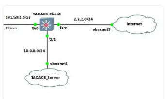
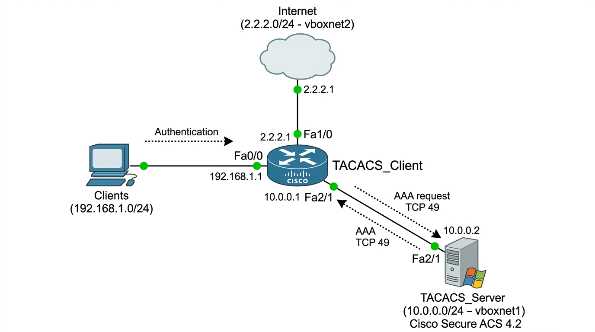
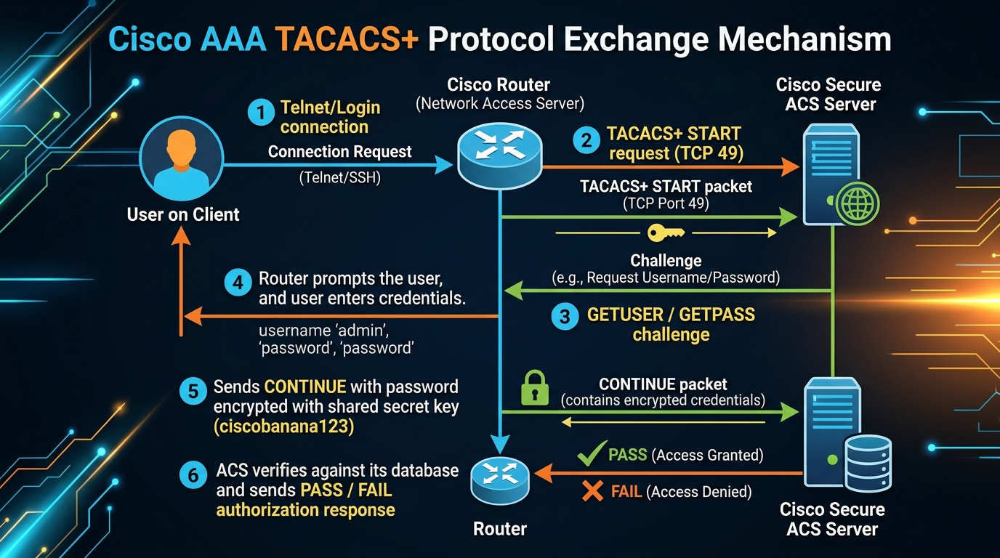

# 🍌 CẨM NANG MASTER LAB 4: TRIỂN KHAI HẠ TẦNG AAA (TACACS+) CHO CÔNG TY BANANA (A - Z)
## Học Phần: An Toàn Mạng & Mật Mã Học Ứng Dụng (`CORP-04-SEC`)
> **Tác giả:** DUT Cyber Security Mentor — CyberDefense & Cryptography Corp  
> **Đơn vị áp dụng:** Doanh nghiệp Banana Corp  
> **Mục tiêu:** Kiểm soát tập trung việc nhân viên truy cập Internet thông qua xác thực (Authentication) và cấp quyền (Authorization) bằng hệ thống Cisco Secure ACS 4.2 trên Windows Server 2003.

---

## 📑 MỤC LỤC
1. [Sơ Đồ Kiến Trúc & Bảng Phân Bổ IP Mạng Banana Corp](#1-sơ-đồ-kiến-trúc--bảng-phân-bổ-ip-mạng-banana-corp)
2. [Giai Đoạn 1: Nhân Bản (Clone) Máy Ảo Windows Server 2003 Mới](#giai-đoạn-1-nhân-bản-clone-máy-ảo-windows-server-2003-mới)
3. [Giai Đoạn 2: Khởi Tạo Project GNS3 Cho Lab 4 & Cắm Dây](#giai-đoạn-2-khởi-tạo-project-gns3-cho-lab-4--cắm-dây)
4. [Giai Đoạn 3: Cài Đặt Bộ 3 Ứng Dụng TACACS+ Trên Windows Server 2003](#giai-đoạn-3-cài-đặt-bộ-3-ứng-dụng-tacacs-trên-windows-server-2003)
5. [Giai Đoạn 4: Cấu Hình Quản Trị Trên Giao Diện Web Cisco Secure ACS 4.2](#giai-đoạn-4-cấu-hình-quản-trị-trên-giao-diện-web-cisco-secure-acs-42)
6. [Giai Đoạn 5: Cấu Hình Toàn Bộ CLI Cho Router TACACS_Client](#giai-đoạn-5-cấu-hình-toàn-bộ-cli-cho-router-tacacs_client)
7. [Giai Đoạn 6: Kịch Bản Nghiệm Thu & Kiểm Thử AAA (Đạt Điểm 10/10)](#giai-đoạn-6-kịch-bản-nghiệm-thu--kiểm-thử-aaa-đạt-điểm-1010)

---

## 1. SƠ ĐỒ KIẾN TRÚC & BẢNG PHÂN BỔ IP MẠNG BANANA CORP

### 1.1. Sơ đồ chính thức từ Giảng viên (Thầy Nguyễn Thế Xuân Ly)


### 1.2. Sơ đồ kết nối chi tiết hệ thống (Full IPs, Interfaces & VirtualBox Mapping)


### 1.3. Sơ đồ luồng trao đổi gói tin AAA TACACS+ (TCP Port 49)


```
           ┌───────────────────────────┐
           │        CLIENTS LAN        │ (Nhân viên Banana Corp)
           │     (192.168.1.0/24)      │
           └─────────────┬─────────────┘
                         │
                         ▼ Fa0/0: 192.168.1.1
           ┌───────────────────────────┐ Fa1/0: 2.2.2.1     ┌─────────────────┐
           │       TACACS_CLIENT       ├───────────────────►│    INTERNET     │
           │      (Router Cisco)       │ (2.2.2.0/24)       │  (Cloud/vboxnet2)
           └─────────────┬─────────────┘                    └─────────────────┘
                         │ Fa2/1: 10.0.0.1
                         ▼ (10.0.0.0/24)
           ┌───────────────────────────┐
           │       TACACS_SERVER       │
           │   (Windows Server 2003)   │ (VM: TACAS_Server)
           │      IP: 10.0.0.100       │ (vboxnet1 Host-Only)
           │  (Cisco Secure ACS v4.2)  │
           └───────────────────────────┘
```

### Bảng phân bổ IP chi tiết:
| Thiết bị / Node | Cổng giao tiếp | Địa chỉ IP / Prefix | Default Gateway | Vai trò mạng |
| :--- | :--- | :--- | :--- | :--- |
| **TACACS_Client** | `Fa0/0` | `192.168.1.1/24` | - | Gateway cho mạng Clients nội bộ |
| **TACACS_Client** | `Fa1/0` | `2.2.2.1/24` | - | Cổng kết nối ra mạng ngoài Internet |
| **TACACS_Client** | `Fa2/1` | `10.0.0.1/24` | - | Gateway nối sang máy chủ TACACS |
| **TACACS_Server** | `Ethernet0` | `10.0.0.100/24` | `10.0.0.1` | Máy chủ chạy Cisco Secure ACS 4.2 |
| **Client PC** | `Ethernet0` | `192.168.1.10/24` | `192.168.1.1` | Máy trạm nhân viên muốn ra Internet |

---

## GIAI ĐOẠN 1: NHÂN BẢN (CLONE) MÁY ẢO WINDOWS SERVER 2003 MỚI

Để **bảo vệ nguyên vẹn bài Lab 3** đã làm xong và có một môi trường sạch hoàn toàn cho Lab 4:

1. Mở cửa sổ chính **Oracle VirtualBox**.
2. Chuột phải vào máy ảo `Server_LAN3` (hoặc `Server_LAN2` vừa chỉnh card mạng chuẩn):
   - Chọn **`Clone...`**.
3. Thiết lập thông số bản sao:
   - **Name**: Đặt tên là **`TACACS_Server`**.
   - **MAC Address Policy**: Chọn **`Generate new MAC addresses for all network adapters`** (Bắt buộc để tránh xung đột IP/MAC).
   - **Clone type**: Chọn **`Full clone`** $\rightarrow$ Bấm **`Clone`**.
4. Kiểm tra cấu hình card mạng của máy `TACACS_Server`:
   - Bấm vào `Settings` của máy `TACACS_Server` $\rightarrow$ `Network` $\rightarrow$ `Adapter 1`:
     - Tích chọn: **`Enable Network Adapter`**.
     - Attached to: Chọn **`Not attached`**.
     - Advanced: Adapter Type giữ nguyên **`PCnet-FAST III`** hoặc **`Intel PRO/1000 MT Desktop`** (như bạn vừa sửa).
   - Bấm **`OK`**.

---

## GIAI ĐOẠN 2: KHỞI TẠO PROJECT GNS3 CHO LAB 4 & CẮM DÂY

1. **Lưu Project Lab 3**:
   - Trong GNS3, bấm `File` $\rightarrow$ `Save Project` để đóng băng Lab 3 an toàn.
2. **Tạo Project mới cho Lab 4**:
   - Bấm `File` $\rightarrow$ `New blank project`:
   - Name: `Lab4_AAA_TACACS_Banana`.
   - Location: Lưu vào thư mục `D:\User\7th\School\04_Company_Network_Security_SEC\03_Engineering_Labs_and_Code\Day4 - TACAS`.
3. **Đăng ký máy ảo `TACACS_Server` vào GNS3**:
   - Vào `Edit` $\rightarrow$ `Preferences...` $\rightarrow$ `VirtualBox VMs` $\rightarrow$ Nhấn **New**.
   - Chọn VM: **`TACACS_Server`** $\rightarrow$ Finish.
   - Nhấn **Edit** $\rightarrow$ Tab **Network** $\rightarrow$ Tích chọn:  
     ☑ **Allow GNS3 to use any configured VirtualBox adapter** $\rightarrow$ OK $\rightarrow$ Apply.
4. **Cấu hình Router TACACS_Client có đủ 3 cổng FastEthernet**:
   - Vào `Edit` $\rightarrow$ `Preferences` $\rightarrow$ `Dynamips` $\rightarrow$ `IOS routers` $\rightarrow$ Edit Router c3725 (hoặc c7200).
   - Tab **Slots**:
     - `slot 0`: `GT96100-FE` (có Fa0/0, Fa0/1).
     - `slot 1`: `NM-1FE-TX` hoặc `NM-16ESW` (hoặc c7200 có đủ các cổng Fa1/0, Fa2/1).
5. **Kéo thiết bị và cắm dây theo sơ đồ**:
   - 1 Router c3725/c7200 đặt tên: **`TACACS_Client`**.
   - 1 Máy ảo VirtualBox: **`TACACS_Server`**.
   - 1 Máy trạm VPCS đặt tên: **`Clients`**.
   - 1 Node **Cloud** hoặc **NAT** đặt tên: **`Internet`**.
   - Nối dây cáp:
     - `TACACS_Client` (`Fa0/0`) nối sang `Clients` (`Ethernet0`).
     - `TACACS_Client` (`Fa2/1`) nối sang `TACACS_Server` (`Ethernet0`).
     - `TACACS_Client` (`Fa1/0`) nối sang `Internet`.

---

## GIAI ĐOẠN 3: CÀI ĐẶT BỘ 3 ỨNG DỤNG TACACS+ TRÊN WINDOWS SERVER 2003

Khởi động máy ảo `TACACS_Server` lên, cấu hình IP tĩnh:
- **IP**: `10.0.0.100` | **Subnet mask**: `255.255.255.0` | **Gateway**: `10.0.0.1`.
- Tắt Windows Firewall: `Off`.

Tiếp theo, mở thư mục chứa bộ cài đặt TACACS do Thầy Ly cung cấp (hoặc copy vào máy ảo) và cài đặt **đúng thứ tự 3 bước**:

### Bước 1: Cài đặt Java Runtime
* Chạy file: **`jre-6u13-windows-i586-p-s.exe`**.
* Nhấn Next $\rightarrow$ Cài đặt theo mặc định đến khi báo hoàn tất.

### Bước 2: Cài đặt Cisco Secure ACS v4.2
* Giải nén file: **`ACSv4.2.124 FULL-K9.zip`**.
* Chạy file **`setup.exe`**:
  - Chọn cơ sở dữ liệu: **`Local Database`**.
  - Tại bước yêu cầu nhập khóa bí mật (TACACS+ Shared Secret): Điền **`ciscobanana123`**.
  - Kết thúc cài đặt, máy chủ kích hoạt service tự động chạy nền.

### Bước 3: Cài đặt Mozilla Firefox 2.0
* Chạy file: **`Firefox Setup 2.0.0.20.exe`**.
* Cài đặt chế độ Standard.

---

## GIAI ĐOẠN 4: CẤU HÌNH TRÊN GIAO DIỆN WEB CISCO SECURE ACS 4.2

1. Mở **Firefox 2.0** trên máy ảo `TACACS_Server`.
2. Truy cập địa chỉ: **`http://127.0.0.1:2002`** (hoặc `http://10.0.0.100:2002`).
3. **Khai báo Router làm AAA Client**:
   - Ở menu bên trái, click vào **`Network Configuration`**.
   - Tại mục **AAA Clients**, bấm nút **`Add Entry`**:
     - **AAA Client Hostname**: `TACACS_Client`
     - **AAA Client IP Address**: `10.0.0.1` (IP cổng Fa2/1 của Router nối về Server)
     - **Key**: `ciscobanana123`
     - **Authenticate Using**: Chọn tích vào ô **`TACACS+ (Cisco IOS)`**.
     - Bấm **`Submit + Restart`**.
4. **Tạo tài khoản người dùng cho nhân viên Banana Corp**:
   - Ở menu bên trái, click vào **`User Setup`**.
   - Gõ tên User: `nhanvien` $\rightarrow$ bấm **`Add/Edit`**:
     - Password Authentication: Chọn **`ACS Internal Database`**.
     - Nhập mật khẩu: `123456` (nhập 2 lần).
     - Bấm **`Submit`**.

---

## GIAI ĐOẠN 5: CẤU HÌNH TOÀN BỘ CLI CHO ROUTER TACACS_CLIENT

Mở Console của Router `TACACS_Client` trên GNS3 và dán khối lệnh chuẩn sau:

```cisco
enable
configure terminal
hostname TACACS_Client

! --- 1. CẤU HÌNH ĐỊA CHỈ IP TRÊN CÁC CỔNG GIAO TIẾP ---
interface FastEthernet0/0
 ip address 192.168.1.1 255.255.255.0
 no shutdown
exit

interface FastEthernet1/0
 ip address 2.2.2.1 255.255.255.0
 no shutdown
exit

interface FastEthernet2/1
 ip address 10.0.0.1 255.255.255.0
 no shutdown
exit

! --- 2. CẤU HÌNH KÍCH HOẠT MÔ HÌNH BẢO MẬT AAA MỚI ---
aaa new-model

! --- 3. KHAI BÁO MÁY CHỦ TACACS+ VÀ KHÓA DÙNG CHUNG ---
tacacs-server host 10.0.0.100
tacacs-server key ciscobanana123

! --- 4. CẤU HÌNH XÁC THỰC ĐĂNG NHẬP (AUTHENTICATION) ---
! Ưu tiên hỏi Server TACACS+ trước; nếu Server sập thì dùng tài khoản Local dự phòng
aaa authentication login default group tacacs+ local
aaa authentication enable default group tacacs+ enable

! --- 5. CẤU HÌNH CẤP QUYỀN THỰC THI (AUTHORIZATION) ---
aaa authorization exec default group tacacs+ local
aaa authorization network default group tacacs+ local

! --- 6. TẠO TÀI KHOẢN CỤC BỘ DỰ PHÒNG (BẮT BUỘC TRÁNH KHÓA ROUTER) ---
username admin privilege 15 secret AdminSecureBackupPass!

! --- 7. ÁP DỤNG CHÍNH SÁCH AAA LÊN CONSOLE VÀ CỔNG VTY (TELNET/SSH) ---
line con 0
 login authentication default
line vty 0 4
 login authentication default
exit

end
write memory
```

---

## GIAI ĐOẠN 6: KỊCH BẢN NGHIỆM THU & KIỂM THỬ AAA (ĐẠT ĐIỂM 10/10)

1. **Test 1: Đăng nhập Router qua cơ chế TACACS+**:
   - Mở cửa sổ CMD từ máy trạm `Clients`: `telnet 192.168.1.1`.
   - Nhập Username: `nhanvien`.
   - Nhập Password: `123456`.
   - Kết quả: Đăng nhập thành công vào Router `TACACS_Client>`.
2. **Test 2: Kiểm tra nhật ký trên Cisco ACS**:
   - Trên trình duyệt Firefox máy ảo, vào mục **`Reports and Activity`** $\rightarrow$ **`Passed Authentications`**.
   - Kết quả: Thấy dòng ghi nhận đăng nhập thành công của User `nhanvien` với IP Client `192.168.1.10`.
3. **Test 3: Kiểm tra tính năng Fallback Local**:
   - Tạm dừng (Pause) máy ảo `TACACS_Server`.
   - Đăng nhập Telnet bằng tài khoản dự phòng: `admin` / `AdminSecureBackupPass!`.
   - Kết quả: Đăng nhập thành công ngay cả khi Server TACACS bị mất kết nối!
