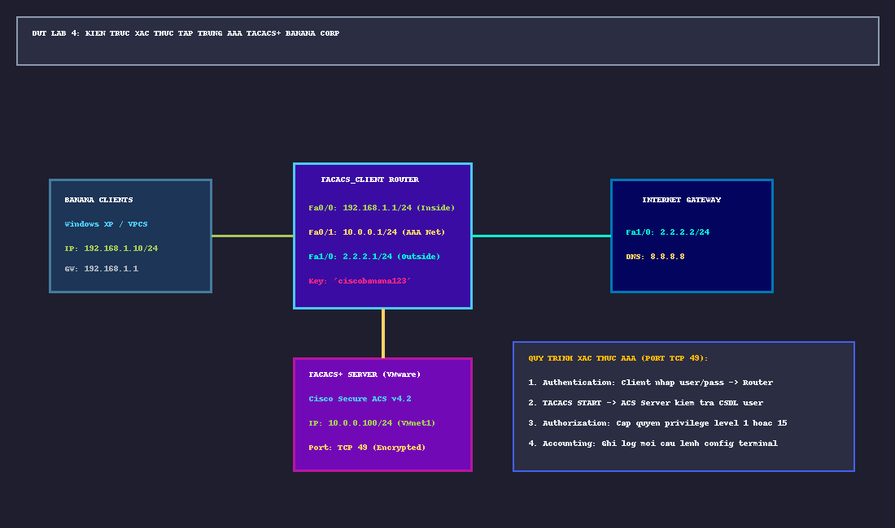

# 📖 TỔNG QUAN LAB 4: HẠ TẦNG XÁC THỰC TẬP TRUNG AAA TACACS+ (DOANH NGHIỆP BANANA CORP)

---

## 🎯 1. MỤC TIÊU BÀI THỰC HÀNH
1. **Làm chủ kiến trúc bảo mật AAA**:
   - **Authentication (Xác thực)**: Xác minh danh tính của người dùng (*"Bạn là ai?"*).
   - **Authorization (Cấp quyền)**: Xác định quyền hạn và lệnh người dùng được phép thực thi (*"Bạn được làm những gì?"*).
   - **Accounting (Ghi nhật ký kiểm toán)**: Lưu vết toàn bộ hành vi, thời gian bắt đầu/kết thúc và các câu lệnh đã chạy (*"Bạn đã làm gì và khi nào?"*).
2. **Hiểu rõ bản chất giao thức TACACS+ (Terminal Access Controller Access-Control System Plus)**:
   - Chạy trên nền tảng hướng kết nối tin cậy **TCP Port 49**.
   - **Mã hóa toàn bộ Payload gói tin** (Username, Password, Command, Attributes) bằng MD5 XOR stream cipher, chỉ để lộ Header 12-byte.
   - Tách biệt độc lập 3 chức năng Authentication, Authorization và Accounting (vượt trội so với RADIUS vốn gộp Authentication & Authorization và chỉ mã hóa trường Password).
3. **Triển khai máy chủ xác thực tập trung**:
   - Tích hợp thiết bị mạng Cisco IOS (làm **TACACS Client**) với máy chủ **Cisco Secure ACS v4.2** chạy trên nền tảng ảo hóa **VMware Workstation Pro**.

---

## 🗺️ 2. TOPOLOGY VÀ BẢNG PHÂN BỔ ĐỊA CHỈ IP

### Bảng Phân Bổ Mạng & Gán Cổng Thiết Bị
| Thiết bị | Interface | Địa chỉ IP / Prefix | Vai trò trong hệ thống |
|:---|:---|:---|:---|
| **Banana Clients** | `Ethernet0` | `192.168.1.10 /24` (GW: `192.168.1.1`) | Máy trạm nhân viên Banana Corp (VPCS hoặc Windows XP) |
| **TACACS_Client** | `Fa0/0` `Fa0/1` `Fa1/0` | `192.168.1.1 /24` `10.0.0.1 /24` `2.2.2.1 /24` | Cổng Inside nối LAN Banana Cổng nối mạng quản trị AAA Server Cổng Outside nối WAN Internet |
| **TACACS+ Server** | `vEthernet` | `10.0.0.100 /24` (GW: `10.0.0.1`) | Máy chủ Windows Server 2003 chạy Cisco Secure ACS 4.2 trên VMware (`VMnet1`) |
| **Internet Gateway**| `Fa1/0` `Loopback0`| `2.2.2.2 /24` `8.8.8.8 /24` | Cổng WAN Internet của nhà mạng ISP Máy chủ DNS Google giả lập |

---

## 🔐 3. BẢNG THAM SỐ CẤU HÌNH BẢO MẬT AAA
* **Khóa bí mật chia sẻ (Shared Secret Key)**: `ciscobanana123`
* **Cổng dịch vụ**: `TCP 49`
* **Chính sách dự phòng chống khóa ngoài (Fallback Policy)**: `group tacacs+ local`
  *(Nếu máy chủ ACS bị lỗi hoặc mất kết nối mạng, Router tự động fallback về tài khoản cục bộ `admin / AdminBackupPass!`)*

### Bảng phân quyền người dùng (User Role Matrix trên ACS):
| Nhóm / Tài khoản | Password | Privilege Level | Phạm vi quyền hạn được cấp |
|:---|:---|:---:|:---|
| **`banana_admin`** | `AdminBanana!@#` | **Level 15** | Toàn quyền quản trị: Vào Privileged EXEC `#`, cấu hình `configure terminal`, quản lý interface. |
| **`banana_operator`**| `Operator123` | **Level 1** | Người dùng vận hành: Chỉ được chạy các lệnh xem trạng thái (`show ip interface brief`, `ping`). Bị cấm vào `configure terminal`. |
| **`admin` (Local)** | `AdminBackupPass!`| **Level 15** | Tài khoản cục bộ dự phòng khẩn cấp khi Server ACS chết. |

---

## 📁 4. DANH MỤC CÁC TỆP TIN TIÊU CHUẨN CỦA LAB 4
1. [`TACACS_Client_startup-config.cfg`](TACACS_Client_startup-config.cfg): File cấu hình chuẩn Router Cisco AAA Client.
2. [`Internet_startup-config.cfg`](Internet_startup-config.cfg): File cấu hình chuẩn Router Gateway Internet.
3. [`Clients_startup.vpc`](Clients_startup.vpc): File script gán IP cho VPCS Client.
4. [`sodo_lab4_aaa_tacacs_banana.png`](sodo_lab4_aaa_tacacs_banana.png): Sơ đồ mạng GNS3 độ nét cao.
5. [`LAB4_BAN_THIET_KE_TINH_TOAN_SINH_VIEN.md`](LAB4_BAN_THIET_KE_TINH_TOAN_SINH_VIEN.md): Bản nháp phân tích thiết kế hạ tầng AAA, cấu trúc gói tin TACACS+ phong cách sinh viên.
6. [`LAB4_HUONG_DAN_KIEM_TRA_CHI_TIET.md`](LAB4_HUONG_DAN_KIEM_TRA_CHI_TIET.md): Quy trình kiểm tra xác thực, phân quyền lệnh Level 1 vs 15 và kiểm tra nhật ký ACS GUI.
7. [`LAB4_WIRESHARK_PCAPNG_ANALYSIS_GUIDE.md`](LAB4_WIRESHARK_PCAPNG_ANALYSIS_GUIDE.md): Hướng dẫn phân tích bắt gói tin TACACS+ TCP port 49 trên `lab4_tacacs_aaa_traffic.pcapng`.
