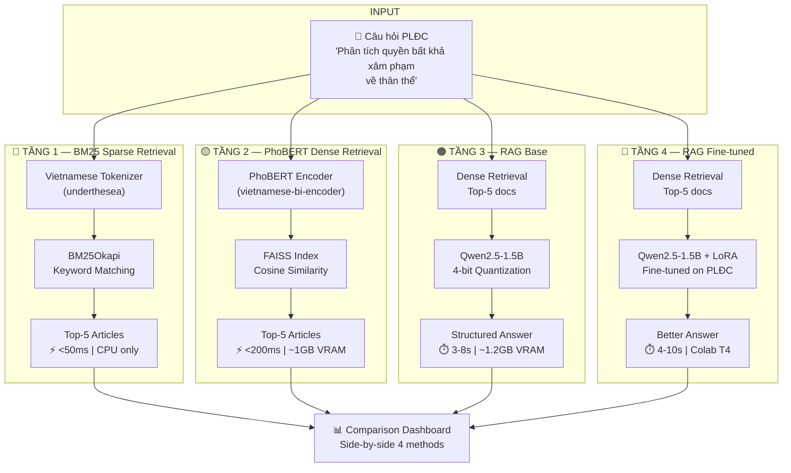
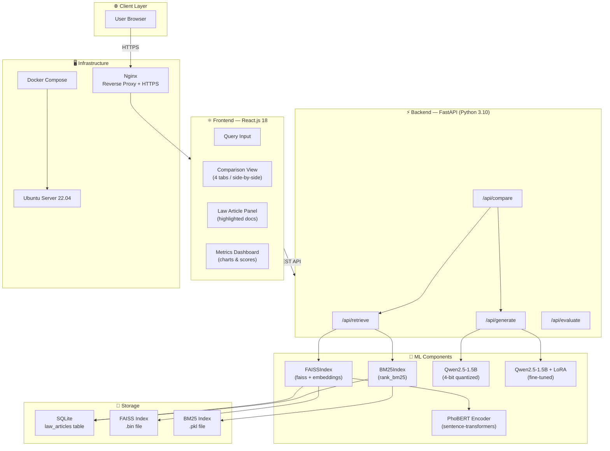
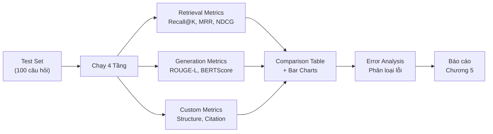
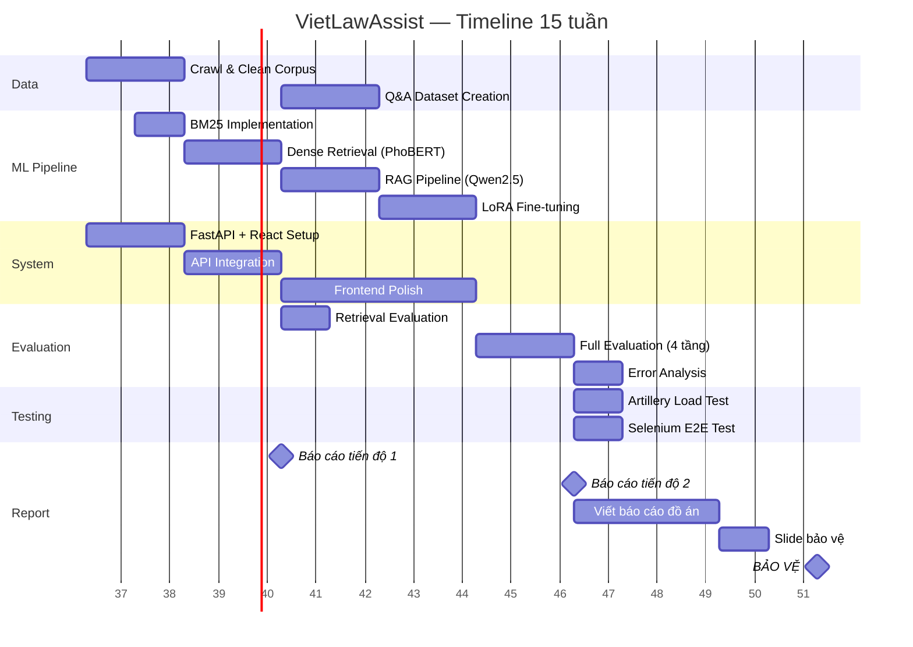
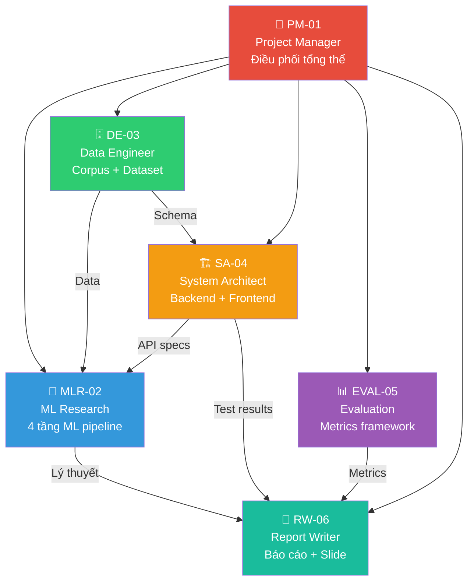

# 🏛️ GRAND DESIGN OVERVIEW — VietLawAssist

> **Dự án:** VietLawAssist — Hệ thống Hỗ trợ Tra cứu Luật và Sinh Câu trả lời Chuẩn cấu trúc  
> **Trường:** Đại học Bách Khoa Đà Nẵng (DUT) | **Học phần:** PBL6 Đồ án chuyên ngành  
> **Nhóm:** 2 sinh viên K2023 | **Thời gian:** 15 tuần  
> **Phần cứng:** RTX 3050 4GB + Google Colab T4  
> **Tổng hợp bởi:** Agent Team — Phase 0 Research | **Ngày:** 2026-09-08

---

## I. TUYÊN BỐ VẤN ĐỀ & GIẢI PHÁP

### Vấn đề
Học phần **Pháp luật Đại cương** bắt buộc cho ~100% sinh viên ĐH Việt Nam. Sinh viên gặp khó khăn:
- Không biết điều luật nào áp dụng cho tình huống
- Viết sai cấu trúc bài làm (thiếu khái niệm, ví dụ, trích dẫn)
- Tra cứu thủ công qua hàng trăm điều luật mất thời gian

**→ Hậu quả:** Điểm thấp vì sai cấu trúc, không phải vì thiếu kiến thức.

### Giải pháp
Hệ thống web cho phép sinh viên nhập câu hỏi PLĐC → hệ thống **tự động tìm điều luật + sinh câu trả lời** theo đúng cấu trúc rubric, so sánh **4 phương pháp ML** khác nhau.

### Đối tượng
- **Primary:** Sinh viên năm 1-2 đang học PLĐC (~100 SV DUT K2023)
- **Secondary:** Giáo viên/Trợ giảng PLĐC

---

## II. KIẾN TRÚC CẦU THANG 4 TẦNG (COMPARISON LADDER)

> *Output từ Agent-02 (ML Research) — Trái tim kỹ thuật của dự án*

### Lý thuyết Mỗi Tầng

| Tầng | Phương pháp | Nguyên lý | Ưu điểm | Hạn chế |
|:----:|------------|----------|---------|---------|
| **1** | BM25 (Sparse) | Keyword overlap, TF-IDF scoring | Cực nhanh, không cần GPU | Không hiểu từ đồng nghĩa |
| **2** | PhoBERT + FAISS (Dense) | Semantic embedding → cosine similarity | Hiểu ngữ nghĩa tiếng Việt | Không sinh câu trả lời |
| **3** | RAG = Dense + Qwen2.5 | Retrieve docs → augment prompt → generate | Sinh câu trả lời có cấu trúc | Đôi khi hallucinate |
| **4** | RAG + LoRA Fine-tuned | Domain adaptation cho PLĐC | Cấu trúc chuẩn, trích dẫn đúng | Cần training data |

### Câu chuyện Tiến hóa (Dùng cho Q&A Hội đồng)

> *"BM25 chỉ tìm từ khóa → miss từ đồng nghĩa (Recall@5 ~58%). PhoBERT dense retrieval nắm ngữ nghĩa → Recall@5 ~78%. Dense retrieval không sinh câu trả lời → thêm Qwen2.5 RAG pipeline. LoRA fine-tune giúp model biết cấu trúc đáp án → BERTScore 0.75→0.82, trích dẫn đúng 65%→88%."*

---

## III. DATA STRATEGY

> *Output từ Agent-03 (Data Engineer)*

### A. Corpus Pháp luật (~1.588 điều)

| Bộ luật | Số điều | Nguồn | Effort |
|---------|:------:|-------|:------:|
| Hiến pháp 2013 | 120 | vbpl.vn | 0.5 ngày |
| Bộ luật Dân sự 2015 | 689 | thuvienphapluat.vn | 1 ngày |
| Bộ luật Hình sự 2015 (sửa đổi 2017) | 426 | thuvienphapluat.vn | 1 ngày |
| Luật Hôn nhân & Gia đình 2014 | 133 | vbpl.vn | 0.5 ngày |
| Luật Lao động 2019 | 220 | vbpl.vn | 0.5 ngày |
| **Tổng** | **~1.588** | | **~3.5 ngày** |

**Chunking:** 1 điều luật = 1 document (giữ nguyên ngữ cảnh pháp lý)

### B. Q&A Fine-tuning Dataset (~500 cặp)

| Nguồn | Số cặp | Effort |
|-------|:------:|:------:|
| Đề thi PLĐC các trường ĐH | ~150 | 1 ngày |
| Giáo trình PLĐC (NXB CTQG) | ~100 | 1 ngày |
| Tự tạo từ điều luật quan trọng | ~250 | 2 ngày |
| **Tổng** | **~500** | **~4 ngày** |

**Format:** Alpaca (`instruction` / `input` / `output`)

### C. Evaluation Test Set (100 câu)
- 100 câu hỏi PLĐC điển hình + đáp án chuẩn cấu trúc 4 phần
- Split: 70 train / 30 test (không overlap)
- Ground truth retrieval annotations

---

## IV. KIẾN TRÚC HỆ THỐNG

> *Output từ Agent-04 (System Architect)*

### API Endpoints

| Method | Endpoint | Chức năng | Response Time |
|:------:|----------|----------|:------------:|
| POST | `/api/retrieve` | BM25 + Dense retrieval | <200ms |
| POST | `/api/generate` | RAG text generation | 3-10s |
| POST | `/api/compare` | Chạy cả 4 approaches | 10-30s |
| POST | `/api/evaluate` | Tính ROUGE-L, BERTScore | <2s |
| GET | `/api/health` | Health check | <50ms |

### Tech Stack

| Layer | Technology |
|-------|-----------|
| Frontend | React.js 18, TanStack Query |
| Backend | FastAPI, Python 3.10+ |
| ML | PyTorch, transformers, PEFT, TRL |
| Database | SQLite |
| Search | FAISS, rank_bm25 |
| Server | Ubuntu 22.04, Nginx, Docker |
| Testing | Artillery (load), Selenium (E2E) |

---

## V. EVALUATION FRAMEWORK

> *Output từ Agent-05 (Evaluation)*

### Metrics Matrix

| Metric | Tầng 1 | Tầng 2 | Tầng 3 | Tầng 4 | Loại |
|--------|:------:|:------:|:------:|:------:|:----:|
| **Recall@5** | ~55-60% | ~75-80% | ~75-80% | ~80-85% | Retrieval |
| **MRR** | ~0.42 | ~0.65 | ~0.65 | ~0.70 | Retrieval |
| **ROUGE-L** | N/A | N/A | ~0.40-0.50 | ~0.58-0.68 | Generation |
| **BERTScore** | N/A | N/A | ~0.75 | ~0.82 | Generation |
| **Faithfulness** | N/A | N/A | ~70% | ~85% | Generation |
| **Structure Score** | ❌ | ❌ | ~60% | ~90%+ | Custom |
| **Citation Score** | ❌ | Có ref | ~65% | ~88% | Custom |

### Evaluation Pipeline

---

## VI. RISK MATRIX

| # | Rủi ro | Xác suất | Impact | Giải pháp |
|:-:|--------|:--------:|:------:|-----------|
| 1 | Qwen2.5 hallucinate điều luật | 🔴 Cao | 🔴 Cao | Faithfulness check + warning UI |
| 2 | Colab T4 hết quota fine-tune | 🟡 TB | 🟡 TB | Backup: Kaggle GPU (30h/tuần) |
| 3 | Crawl bị block | 🟢 Thấp | 🟡 TB | PDF từ website Chính phủ |
| 4 | Dataset 500 cặp chất lượng kém | 🟡 TB | 🔴 Cao | Peer review + GPT validate format |
| 5 | LoRA không cải thiện đáng kể | 🟢 Thấp | 🟡 TB | Nhấn mạnh citation + structure score |
| 6 | `/api/compare` timeout (30s+) | 🟡 TB | 🟡 TB | Async processing + loading UI |

---

## VII. TIMELINE 15 TUẦN

---

## VIII. RUBRIC ALIGNMENT — ĐẢM BẢO 9-10/10

| Tiêu chí DUT | Điểm | Cách đáp ứng | Agent phụ trách |
|-------------|:----:|-------------|:--------------:|
| **Tính cấp thiết (1đ)** | 1/1 | PLĐC bắt buộc cho 100% SV VN, nhu cầu rõ ràng | PM-01 |
| **Kết quả nhiệm vụ (3đ)** | 2.5-3 | End-to-end system, demo live, 4 tầng hoạt động | SA-04, MLR-02 |
| **Am hiểu giải pháp (2đ)** | 1.8-2 | Bảng so sánh 4 phương pháp + lý thuyết từng tầng | MLR-02, EVAL-05 |
| **Chất lượng báo cáo (2đ)** | 1.8-2 | Lý thuyết + bảng metric + đồ thị + trích dẫn | RW-06 |
| **Thuyết trình & Demo (2đ)** | 1.8-2 | Chat live PLĐC, side-by-side comparison | RW-06, SA-04 |

---

## IX. AGENT TEAM — PHÂN CÔNG & TRÁCH NHIỆM

| Agent | Tương ứng Người | Chuyên trách |
|-------|:--------------:|-------------|
| PM-01 | Cả 2 | Điều phối timeline, milestone tracking |
| MLR-02 | Người A (ML) | BM25 → Dense → RAG → LoRA |
| DE-03 | Người A (ML) | Crawl corpus, tạo dataset |
| SA-04 | Người B (System) | FastAPI, React, Docker, Nginx |
| EVAL-05 | Người A (ML) | ROUGE, BERTScore, Faithfulness |
| RW-06 | Cả 2 | Báo cáo, slide bảo vệ |

---

## X. ĐIỂM ĐỘC ĐÁO — TẠI SAO ĐỀ TÀI NÀY KHÁC BIỆT

| Đề tài RAG thông thường | VietLawAssist |
|------------------------|---------------|
| 1 phương pháp duy nhất | **4 tầng so sánh có hệ thống** |
| Không metric rõ ràng | **7 metrics: Recall@K + MRR + ROUGE-L + BERTScore + Faithfulness + Structure + Citation** |
| Domain chung | **Domain cực hẹp: PLĐC cho SV Việt Nam** |
| Chỉ retrieve hoặc chỉ generate | **Retrieve + Generate + Evaluate + Compare** |
| Prompt engineering | **LoRA Fine-tune + Evaluation framework đầy đủ** |
| Không ground truth | **Test set 100 câu với đáp án chuẩn** |

---

> **📌 Tài liệu này là bản đại thiết kế tổng quan (Grand Design Overview) được tổng hợp từ Phase 0 Research của toàn bộ đội ngũ 6 AI Agents. Mọi thay đổi lớn trong quá trình triển khai sẽ được cập nhật tại đây.**

*VietLawAssist Grand Design | Agent Team Output | 2026-09-08 | PBL6 DUT K2023*
