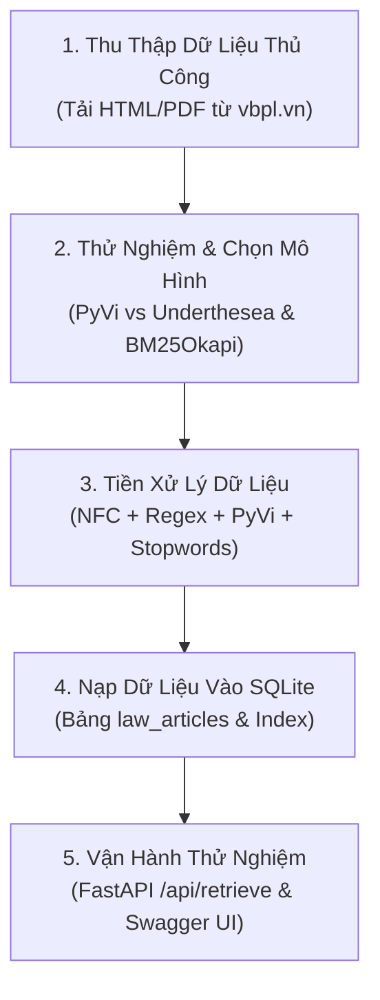

# 📖 Hướng Dẫn Thực Hành Thủ Công Phase 1 (Hands-on Lab Guide)

> **Mã Vai Trò:** `HM-00` / `HANDMADE`  
> **Người thực hiện:** Bạn (Chủ dự án / Kỹ sư thực thi)  
> **Hội đồng cố vấn:** 6 AI Agents (PM, MLR, DE, SA, EVAL, RW)  
> **Tài liệu gốc tại:** [.agents/team/handmade/MANUAL_GUIDE.md](file:///d:/User/7th/School/06_Venture_PBL6_VietLawAssist_LegalAI/)

---

## TỔNG QUAN LỘ TRÌNH THỰC HÀNH THỦ CÔNG



---

## I. THU THẬP DỮ LIỆU THỦ CÔNG (DATA COLLECTION)

### 1. Nguồn Tải Chính Thống Của 3 Bộ Luật
- **Hiến pháp 2013 (120 điều):** `https://vbpl.vn/TW/Pages/vbpq-toanvan.aspx?ItemID=32801`
- **Bộ luật Dân sự 2015 (689 điều):** `https://vbpl.vn/TW/Pages/vbpq-toanvan.aspx?ItemID=96404`
- **Bộ luật Hình sự 2015 (426 điều):** `https://vbpl.vn/TW/Pages/vbpq-toanvan.aspx?ItemID=96405`

### 2. Thao Tác Tải & Lưu Trữ
- Tạo thư mục: `Project\data\raw\`
- Mở trình duyệt vào từng link $\rightarrow$ nhấn `Ctrl + S` $\rightarrow$ lưu với tên `HP2013.html`, `BLDS2015.html`, `BLHS2015.html`.
- Kiểm tra số điều (Hiến pháp có 120 điều; kiểm tra Điều 1 và Điều 120).

---

## II. CHỌN MÔ HÌNH & KIỂM CHỨNG LÝ THUYẾT (MODEL SELECTION)

### 1. Thử Nghiệm Tokenizer Tiếng Việt Trong Terminal
Mở PowerShell và gõ:
```powershell
.\.venv\Scripts\python.exe
```
Gõ code thử nghiệm:
```python
from pyvi import ViTokenizer
cau_luat = "Người nào giết người trong tình thế phòng vệ chính đáng thì không phải chịu trách nhiệm hình sự."
print(ViTokenizer.tokenize(cau_luat))
```
*Kết quả:* PyVi tự động nối từ ghép: `tình_thế`, `phòng_vệ`, `chính_đáng`, `trách_nhiệm`, `hình_sự`.

### 2. Thử Nghiệm Thuật Toán BM25Okapi
```python
from rank_bm25 import BM25Okapi
from pyvi import ViTokenizer

corpus = [
    "Điều 19. Quyền sống. Mọi người có quyền sống.",
    "Điều 20. Quyền bất khả xâm phạm về thân thể, được pháp luật bảo hộ về sức khỏe.",
    "Điều 21. Quyền bất khả xâm phạm về đời sống riêng tư."
]
tokenized_corpus = [ViTokenizer.tokenize(doc).lower().split() for doc in corpus]
bm25 = BM25Okapi(tokenized_corpus, k1=1.5, b=0.75)

query = "Quyền bảo vệ thân thể và sức khỏe"
scores = bm25.get_scores(ViTokenizer.tokenize(query).lower().split())
print("Điểm BM25:", scores)
```
*Kết quả:* Điều 20 nhận điểm cao nhất vì trùng khớp từ khóa đắt giá `thân_thể` và `sức_khỏe`.

---

## III. TIỀN XỬ LÝ DỮ LIỆU THỦ CÔNG (DATA PREPROCESSING)

Quy trình 5 bước:
1. **Chuẩn hóa Unicode NFC:** Dùng `unicodedata.normalize('NFC', text)` để triệt tiêu lỗi font tổ hợp.
2. **Bóc tách theo Điều (1 điều = 1 doc):** Dùng Regex `r'^(?:Điều|Điều)\s+(\d+)[\.:\-\–]\s*(.*?)$'`.
3. **Tách từ tiếng Việt:** Dùng `ViTokenizer.tokenize()`.
4. **Lọc từ dừng pháp lý:** Dùng danh sách từ dừng trong `.agents/outputs/phase1/mlr-02_stopwords_vi_legal.txt`.
5. **Đóng gói vào SQLite:** Nạp các điều luật vào bảng `law_articles`.

### Lệnh Nạp & Kiểm Tra Dữ Liệu SQLite Tự Động:
```powershell
.\.venv\Scripts\python.exe -c "
import json, sys
sys.path.insert(0, 'Project')
from app.core.database import init_database, get_db_connection
from app.repositories.article_repo import ArticleRepository
from app.models.law_article import LawArticleCreate

init_database()
with open('Project/data/sample/sample_articles.json', 'r', encoding='utf-8') as f:
    raw = json.load(f)

repo = ArticleRepository()
for item in raw:
    repo.save(LawArticleCreate.model_validate(item))

print('[✓] Đã nạp thành công 30 điều luật mẫu vào SQLite!')
"
```

---

## IV. KHỞI ĐỘNG VÀ THỬ NGHIỆM TRỰC QUAN

1. Khởi động server:
   ```powershell
   .\manage_venv.ps1 run-server
   ```
2. Mở trình duyệt vào Swagger UI: `http://127.0.0.1:8000/docs`
3. Thử nghiệm gọi API `POST /api/retrieve` với câu hỏi: *"Quyền bất khả xâm phạm về thân thể"* và kiểm tra kết quả trả về.
