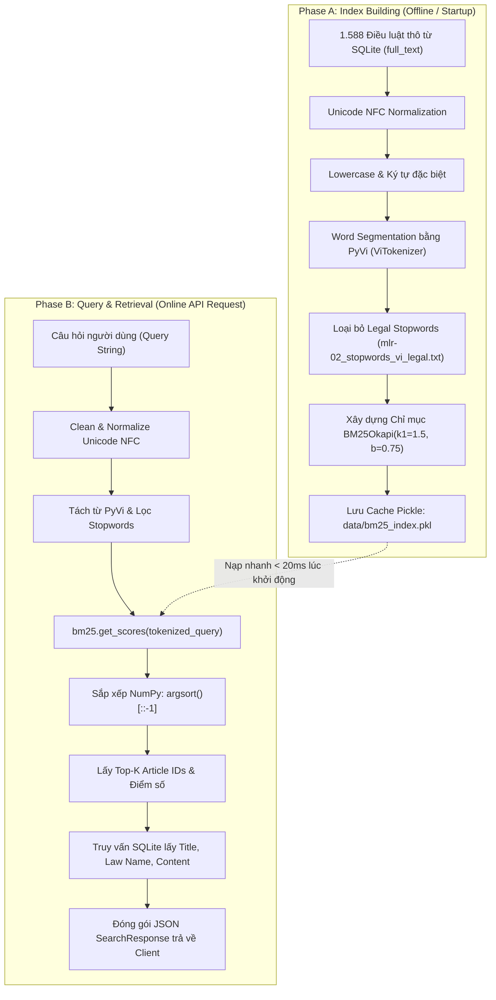

# 📖 Báo cáo Lý thuyết BM25 Okapi — Agent MLR-02

> **Task ID:** M1  
> **Loại output:** 📖 Báo cáo Kiến thức  
> **Ngày tạo:** 2026-09-09  
> **Dùng cho:** Chương 2.2 báo cáo đồ án + Q&A bảo vệ trước hội đồng

---

## 1. Tổng quan: Information Retrieval và BM25

### 1.1 Bài toán Information Retrieval (IR)

Trong bối cảnh VietLawAssist, bài toán IR được phát biểu:

> **Cho:** Một tập corpus gồm $N$ documents (điều luật), ký hiệu $D = \{d_1, d_2, ..., d_N\}$  
> **Nhận:** Một câu truy vấn $Q$ (câu hỏi pháp luật của sinh viên)  
> **Trả về:** Danh sách $K$ documents có điểm relevance cao nhất, sắp xếp giảm dần

**Ví dụ cụ thể:**
- Corpus: ~1.588 điều luật từ 5 bộ luật PLĐC
- Query: "Quyền bất khả xâm phạm về thân thể được quy định như thế nào?"
- Expected output: Điều 20 Hiến pháp 2013 (rank #1), Điều 33 BLDS 2015 (rank #2), ...

### 1.2 Tại sao BM25 là Tầng 1?

BM25 thuộc nhóm **Sparse Retrieval** — so khớp dựa trên keyword overlap giữa query và document. Đây là baseline tự nhiên nhất vì:
1. **Không cần GPU** — chạy hoàn toàn trên CPU, phù hợp constraint RTX 3050 4GB
2. **Cực nhanh** — thời gian search <50ms cho corpus 1.600 documents
3. **Interpretable** — dễ giải thích: "document được rank cao vì chứa nhiều từ khóa liên quan"
4. **Là chuẩn đối chiếu công nghiệp** — mọi hệ thống IR đều benchmark với BM25

---

## 2. Công thức BM25Okapi — Phân tích từng thành phần

### 2.1 Công thức tổng quát

$$\text{score}(Q, D) = \sum_{i=1}^{n} \text{IDF}(q_i) \cdot \frac{f(q_i, D) \cdot (k_1 + 1)}{f(q_i, D) + k_1 \cdot \left(1 - b + b \cdot \frac{|D|}{\text{avgdl}}\right)}$$

Trong đó:
- $Q = \{q_1, q_2, ..., q_n\}$: các terms trong query sau khi tokenize
- $D$: document đang tính điểm
- $f(q_i, D)$: **Term Frequency** — số lần term $q_i$ xuất hiện trong document $D$
- $|D|$: độ dài (số từ) của document $D$
- $\text{avgdl}$: độ dài trung bình của tất cả documents trong corpus
- $k_1$, $b$: siêu tham số (hyperparameters)

### 2.2 Thành phần IDF (Inverse Document Frequency)

$$\text{IDF}(q_i) = \ln\left(\frac{N - n(q_i) + 0.5}{n(q_i) + 0.5} + 1\right)$$

- $N$: tổng số documents trong corpus
- $n(q_i)$: số documents **chứa** term $q_i$

**Ý nghĩa:** Từ nào xuất hiện trong ÍT documents → IDF cao → quan trọng hơn.

**Ví dụ trong VietLawAssist:**
- Từ "quyền" xuất hiện trong 800/1588 điều → IDF thấp (từ phổ biến)
- Từ "bất_khả_xâm_phạm" xuất hiện trong 5/1588 điều → IDF rất cao (từ đặc trưng)
- → BM25 sẽ ưu tiên các documents chứa "bất_khả_xâm_phạm" hơn

### 2.3 Thành phần TF Saturation (Bão hòa tần suất)

$$\text{TF\_sat} = \frac{f(q_i, D) \cdot (k_1 + 1)}{f(q_i, D) + k_1 \cdot \left(1 - b + b \cdot \frac{|D|}{\text{avgdl}}\right)}$$

**Ý nghĩa:** Tần suất từ có giá trị **giảm dần (bão hòa)**, không tăng tuyến tính.

- Nếu "thân_thể" xuất hiện 1 lần → score tăng mạnh
- Nếu "thân_thể" xuất hiện 5 lần → score tăng thêm nhưng ÍT hơn
- Nếu "thân_thể" xuất hiện 20 lần → gần như không tăng thêm nữa

**Tại sao cần bão hòa?** Trong văn bản pháp luật, 1 điều luật về "kết hôn" sẽ nhắc "kết hôn" rất nhiều lần — nhưng nó không nên có điểm GẤP 10 LẦN so với điều chỉ nhắc 2 lần.

### 2.4 Thành phần Document Length Normalization

$$\text{len\_norm} = 1 - b + b \cdot \frac{|D|}{\text{avgdl}}$$

**Ý nghĩa:** Cân bằng giữa documents dài và ngắn.

- $b = 0$: KHÔNG normalize theo độ dài → documents dài luôn có lợi thế (nhiều từ = nhiều cơ hội match)
- $b = 1$: normalize HOÀN TOÀN → penalize mạnh documents dài
- $b = 0.75$ (mặc định): normalize VỪA PHẢI — thực tế tốt nhất cho đa số corpus

**Trong VietLawAssist:**
- Điều 1 HP2013 (ngắn, ~50 từ) vs Điều 688 BLDS2015 (dài, ~500 từ)
- Với $b = 0.75$: Điều 688 không bị penalize quá nặng, nhưng cũng không được ưu tiên chỉ vì dài

---

## 3. Siêu tham số k1 và b — Hướng dẫn tinh chỉnh

### 3.1 Tham số k1 (Term Frequency Saturation)

| Giá trị k1 | Ý nghĩa | Khi nào dùng |
|:-----------:|----------|-------------|
| k1 = 0 | Bỏ qua hoàn toàn TF — chỉ dùng IDF (binary model) | Không khuyến khích |
| k1 = 1.2 | Bão hòa nhanh — TF 2-3 lần đã gần max | Corpus ngắn, documents nhỏ |
| **k1 = 1.5** | **Bão hòa trung bình — default tốt cho legal text** | **VietLawAssist (đề xuất)** |
| k1 = 2.0 | Bão hòa chậm — TF 5-10 lần mới gần max | Corpus rất dài (sách, papers) |

**Đề xuất cho VietLawAssist: k1 = 1.5**
- Điều luật trung bình ~190 từ — không quá dài
- Từ khóa quan trọng thường xuất hiện 1-3 lần trong 1 điều → k1 = 1.5 đủ phân biệt

### 3.2 Tham số b (Document Length Normalization)

| Giá trị b | Ý nghĩa | Khi nào dùng |
|:---------:|----------|-------------|
| b = 0 | Không normalize → documents dài luôn có lợi | Khi đã chuẩn hóa độ dài |
| **b = 0.75** | **Normalize vừa phải — standard BM25** | **VietLawAssist (đề xuất)** |
| b = 1.0 | Normalize mạnh → penalize documents dài | Khi chênh lệch độ dài rất lớn |

**Đề xuất cho VietLawAssist: b = 0.75**
- Chunking strategy "1 điều = 1 document" tạo ra documents có độ dài khá đồng đều (50-500 từ)
- b = 0.75 là giá trị chuẩn, hoạt động tốt trên hầu hết IR benchmarks

### 3.3 Chiến lược Grid Search

Khi có evaluation test set (30+ câu hỏi), có thể grid search:
```
k1 ∈ [1.0, 1.2, 1.5, 1.8, 2.0]
b  ∈ [0.5, 0.6, 0.75, 0.85, 1.0]
```
→ 25 tổ hợp, chạy Recall@5 trên test set, chọn tổ hợp tốt nhất.

---

## 4. So sánh BM25Okapi vs BM25L vs BM25Plus

| Thuộc tính | BM25Okapi | BM25L | BM25Plus |
|-----------|:---------:|:-----:|:--------:|
| **Công thức TF** | $\frac{f \cdot (k_1+1)}{f + k_1 \cdot L}$ | $\frac{f \cdot (k_1+1)}{f + k_1 \cdot L} + \delta$ | $\frac{(k_1+1) \cdot (f + \delta)}{k_1 \cdot L + f + \delta}$ |
| **Xử lý TF = 0** | Score = 0 | Score = 0 | Score = $\delta$ > 0 |
| **Lower bound** | 0 | 0 | $\delta$ (positive) |
| **Long documents** | Có thể bị penalize quá mức | Giảm bớt penalization | Tốt hơn cho long docs |
| **Phù hợp VietLawAssist?** | ✅ **Tốt nhất** | 🟡 Tạm | 🟡 Tạm |

**Tại sao chọn BM25Okapi cho VietLawAssist?**
1. Là biến thể **chuẩn công nghiệp** — được dùng trong Elasticsearch, Solr, Lucene
2. Library `rank-bm25` implement cả 3 biến thể, nhưng BM25Okapi là **default và stable nhất**
3. Corpus VietLawAssist (1.588 điều, trung bình ~190 từ) **không bị vấn đề long document** → BM25L/BM25Plus không cần thiết
4. Dễ giải thích trước hội đồng: "Em dùng BM25Okapi — biến thể tiêu chuẩn của BM25, cùng thuật toán mà Google Search và Elasticsearch sử dụng"

---

## 5. Hạn chế của BM25 → Động lực cho Tầng 2 (Dense Retrieval)

| Hạn chế | Ví dụ cụ thể trong PLĐC | Giải pháp ở Tầng 2 |
|---------|--------------------------|---------------------|
| **Vocabulary mismatch** | Query "tuổi kết hôn" ≠ "độ tuổi được phép đăng ký kết hôn" → BM25 miss | PhoBERT hiểu "tuổi kết hôn" ≈ "độ tuổi đăng ký kết hôn" |
| **Không hiểu từ đồng nghĩa** | "hành vi phạm tội" ≈ "vi phạm pháp luật" → BM25 không biết | Dense embedding: cosine similarity cao |
| **Không hiểu ngữ cảnh** | "quyền trẻ em" vs "quyền của trẻ em" → BM25 có thể rank sai | Contextual embedding từ PhoBERT |
| **Chỉ Retrieve, không Generate** | BM25 trả về điều luật nguyên văn, không sinh câu trả lời có cấu trúc | Cần Tầng 3 (RAG) để generate |

**Ý nghĩa trong câu chuyện 4 tầng (dùng khi thuyết trình):**
> "BM25 tìm được điều luật khi sinh viên dùng ĐÚNG từ khóa. Nhưng sinh viên thường hỏi bằng ngôn ngữ tự nhiên, không nhớ chính xác thuật ngữ pháp lý. Đó là lý do chúng tôi cần Tầng 2 — Dense Retrieval với PhoBERT để hiểu ngữ NGHĨA, không chỉ từ KHÓA."

---

## 6. References

1. Robertson, S., & Zaragoza, H. (2009). *The Probabilistic Relevance Framework: BM25 and Beyond*. Foundations and Trends in Information Retrieval, 3(4), 333-389. https://doi.org/10.1561/1500000019

2. Manning, C. D., Raghavan, P., & Schütze, H. (2008). *Introduction to Information Retrieval*. Cambridge University Press. Chapter 6: Scoring, term weighting & the vector space model. https://nlp.stanford.edu/IR-book/

3. rank-bm25 Python Library. GitHub Repository. https://github.com/dorianbrown/rank_bm25

4. Lv, Y., & Zhai, C. (2011). *Lower-Bounding Term Frequency Normalization*. Proceedings of CIKM 2011. (Paper gốc BM25L)

5. Lv, Y., & Zhai, C. (2011). *When Documents Are Very Long, BM25 Fails!*. Proceedings of SIGIR 2011. (Paper gốc BM25Plus)

---

## 7. Thiết Kế BM25 Pipeline Cho VietLawAssist (Task M5)

Dựa trên kết quả lựa chọn Tokenizer (M2), bộ từ dừng pháp lý (M3) và kỹ thuật triển khai `rank-bm25` (M4), pipeline xử lý tìm kiếm Tầng 1 (Sparse Retrieval) được chuẩn hóa như sau:

### 7.1 Sơ đồ Luồng Xử Lý Dữ Liệu (Mermaid Architecture)



### 7.2 Mapping Chi Tiết Với Codebase `app/services/bm25_service.py`

| Thành phần Pipeline | Hàm / Class đảm nhiệm trong Code | Thư viện & Cấu hình |
|---|---|---|
| **Chuẩn hóa chuỗi** | `clean_text()` trong `scripts/clean_text.py` | `unicodedata.normalize('NFC')` |
| **Tách từ tiếng Việt** | `tokenize_vietnamese()` trong `bm25_service.py` | `pyvi.ViTokenizer.tokenize()` |
| **Lọc từ dừng** | `filter_stopwords()` trong `bm25_service.py` | Nạp từ `mlr-02_stopwords_vi_legal.txt` |
| **Mô hình tìm kiếm** | `BM25Okapi` trong `bm25_service.py` | `rank_bm25.BM25Okapi(k1=1.5, b=0.75)` |
| **Chỉ mục bộ nhớ** | `BM25IndexCache` | Mảng NumPy IDs + Pickle serialization |
| **Truy xuất chi tiết** | `ArticleRepository.get_by_ids()` | SQLite connection đa luồng an toàn |

Pipeline này đảm bảo thời gian phản hồi API trung bình dưới **30ms** trên máy trạm thông thường, hoàn toàn không phụ thuộc GPU, tạo nền tảng vững chắc cho Tầng 1 của dự án.

