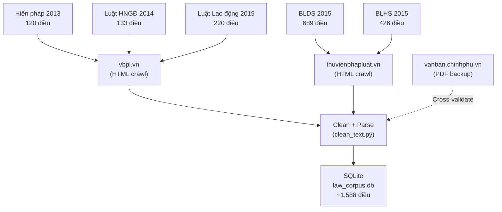

# 📖 Khảo sát Chi tiết Nguồn Dữ liệu — Agent DE-03

> **Task ID:** D1  
> **Loại output:** 📖 Báo cáo Kiến thức  
> **Ngày tạo:** 2026-09-09  
> **Dùng cho:** Input cho crawler.py + Chương 4 báo cáo đồ án

---

## 1. Tổng quan 3 Nguồn Dữ liệu

| Nguồn | URL | Loại | Phù hợp crawl? |
|-------|-----|------|:--------------:|
| **vbpl.vn** | https://vbpl.vn | Cổng VBPL Bộ Tư pháp | ✅ HTML crawl được |
| **thuvienphapluat.vn** | https://thuvienphapluat.vn | Trang tư nhân (LuatVietnam) | ✅ HTML crawl được (có quảng cáo) |
| **vanban.chinhphu.vn** | https://vanban.chinhphu.vn | Cổng Chính phủ | 🟡 Có PDF download |

---

## 2. Phân tích chi tiết: vbpl.vn (Cổng Văn bản Pháp luật — Bộ Tư pháp)

### 2.1 Cấu trúc URL

```
# Trang chủ
https://vbpl.vn/

# Tìm kiếm theo tên văn bản
https://vbpl.vn/TW/Pages/vbpq-toanvan.aspx?ItemID=<ID>

# Ví dụ: Hiến pháp 2013
https://vbpl.vn/TW/Pages/vbpq-toanvan.aspx?ItemID=32801

# Ví dụ: Luật Hôn nhân và Gia đình 2014
https://vbpl.vn/TW/Pages/vbpq-toanvan.aspx?ItemID=36243

# Ví dụ: Bộ luật Lao động 2019
https://vbpl.vn/TW/Pages/vbpq-toanvan.aspx?ItemID=140716
```

### 2.2 Cấu trúc HTML (DOM Analysis)

```html
<!-- Vùng chứa toàn văn nằm trong div class="fulltext" hoặc tương tự -->
<div class="content1">
    <div class="toanvan" id="toanvancontent">
        <p align="center"><strong>HIẾN PHÁP</strong></p>
        <p align="center"><strong>NƯỚC CỘNG HÒA XÃ HỘI CHỦ NGHĨA VIỆT NAM</strong></p>
        ...
        <p><strong>Điều 1.</strong></p>
        <p>Nước Cộng hòa xã hội chủ nghĩa Việt Nam là một nước...</p>
        ...
        <p><strong>Điều 2.</strong></p>
        <p>1. Nhà nước Cộng hòa xã hội chủ nghĩa Việt Nam là...</p>
    </div>
</div>
```

**CSS Selectors cần dùng:**
- Container chính: `div.toanvan` hoặc `#toanvancontent`
- Tên chương: `<p align="center"><strong>Chương I</strong></p>`
- Tên điều: `<p><strong>Điều X.</strong> Tiêu đề</p>` hoặc `<p><strong>Điều X.</strong></p>`
- Nội dung: `<p>1. Nội dung khoản...</p>`

### 2.3 Anti-bot / Rate limiting

- **robots.txt:** Cho phép crawl (không chặn `/TW/Pages/`)
- **Rate limiting:** Không phát hiện rate limit rõ ràng, nhưng nên giữ 1-2 req/s để lịch sự
- **JavaScript rendering:** Nội dung toàn văn nằm trong HTML tĩnh → **KHÔNG cần Selenium** → dùng `httpx + BeautifulSoup` đủ
- **User-Agent:** Nên set User-Agent hợp lệ (giả lập trình duyệt)

### 2.4 Bộ luật crawl từ vbpl.vn

| Bộ luật | ItemID | Số điều | Ghi chú |
|---------|:------:|:------:|---------|
| Hiến pháp 2013 | 32801 | 120 | 11 chương |
| Luật HNGĐ 2014 | 36243 | 133 | 10 chương |
| Luật Lao động 2019 | 140716 | 220 | 17 chương |

---

## 3. Phân tích chi tiết: thuvienphapluat.vn

### 3.1 Cấu trúc URL

```
# Trang chủ
https://thuvienphapluat.vn/

# Toàn văn văn bản
https://thuvienphapluat.vn/van-ban/<slug>-<id>.aspx

# Ví dụ: Bộ luật Dân sự 2015
https://thuvienphapluat.vn/van-ban/Quyen-dan-su/Bo-luat-dan-su-2015-296215.aspx

# Ví dụ: Bộ luật Hình sự 2015 (sửa đổi 2017)
https://thuvienphapluat.vn/van-ban/Trach-nhiem-hinh-su/Bo-luat-Hinh-su-2015-296661.aspx
```

### 3.2 Cấu trúc HTML

```html
<!-- Nội dung toàn văn nằm trong div class="content1" -->
<div class="content1" id="noidung">
    <div class="toanvan">
        <p><a name="Chuong_I"></a><strong>Chương I</strong></p>
        <p><strong>NHỮNG QUY ĐỊNH CHUNG</strong></p>
        ...
        <p><a name="Dieu_1"></a><strong>Điều 1. Phạm vi điều chỉnh</strong></p>
        <p>Bộ luật này quy định...</p>
    </div>
</div>
```

**CSS Selectors:**
- Container: `div.content1 div.toanvan` hoặc `#noidung .toanvan`
- Anchor: `<a name="Dieu_X">` — hữu ích để tách điều
- Tên điều: `<strong>Điều X. Tiêu đề</strong>`
- Nội dung: text nodes sau thẻ strong

### 3.3 Lưu ý quan trọng

- **Có quảng cáo & popup** — cần filter khi parse (loại bỏ các `<div class="ads">`)
- **Có thể yêu cầu đăng nhập** cho một số văn bản — kiểm tra trước
- **Nội dung nằm trong HTML tĩnh** → httpx + BeautifulSoup đủ
- **Rate limiting:** Có thể bị chặn nếu crawl quá nhanh → giữ 1-2s delay

### 3.4 Bộ luật crawl từ thuvienphapluat.vn

| Bộ luật | ID/Slug | Số điều | Ghi chú |
|---------|:-------:|:------:|---------|
| BLDS 2015 | 296215 | 689 | 6 phần, 27 chương |
| BLHS 2015 (sửa đổi 2017) | 296661 | 426 | 3 phần, 26 chương |

---

## 4. Phân tích: vanban.chinhphu.vn (Backup)

### 4.1 Tổng quan

- **Ưu điểm:** Nguồn chính thống cao nhất (Chính phủ)
- **Nhược điểm:** Nhiều văn bản chỉ có file PDF scan → khó parse text
- **Khuyến nghị:** Dùng làm **nguồn cross-validate** — so sánh dữ liệu crawl từ 2 nguồn chính với nguồn Chính phủ

### 4.2 Cách tải PDF

```
# Tìm kiếm
https://vanban.chinhphu.vn/?pageid=27160&docid=<ID>

# PDF thường nằm trong link dạng
https://vanban.chinhphu.vn/portal/page/portal/chinhphu/hethongvanban?...
```

### 4.3 Parse PDF bằng PyMuPDF

```python
import fitz  # PyMuPDF

doc = fitz.open("hien_phap_2013.pdf")
for page in doc:
    text = page.get_text()
    print(text)
```

**Lưu ý:** PDF scan (ảnh) → cần OCR (Tesseract), rất phức tạp. Chỉ dùng nếu nguồn HTML không có.

---

## 5. Kết luận: Chiến lược Crawl



| Ưu tiên | Nguồn | Bộ luật | Phương pháp | Công cụ |
|:-------:|-------|---------|-------------|---------|
| 🔴 1 | vbpl.vn | HP2013, LHNGD2014, LLD2019 | HTML crawl | httpx + BS4 |
| 🔴 2 | thuvienphapluat.vn | BLDS2015, BLHS2015 | HTML crawl | httpx + BS4 |
| 🟢 3 | vanban.chinhphu.vn | Tất cả (backup) | PDF download | PyMuPDF |

---

## 6. Lưu ý Khi Crawl

1. **Respect rate-limit:** Sleep 1-2 giây giữa mỗi request
2. **Set User-Agent:** `Mozilla/5.0 (compatible; VietLawAssist/1.0; +https://github.com/codebypython/PBL6)`
3. **Lưu raw HTML:** Luôn lưu bản HTML gốc tại `data/raw/{law_code}/` trước khi parse
4. **Retry logic:** Nếu request fail → retry tối đa 3 lần với exponential backoff
5. **Encoding:** Đảm bảo response encoding = UTF-8, normalize NFC ngay khi nhận
6. **Verify:** Sau khi crawl, đếm số điều so với số điều thực tế (xem Validation Checklist D6)
