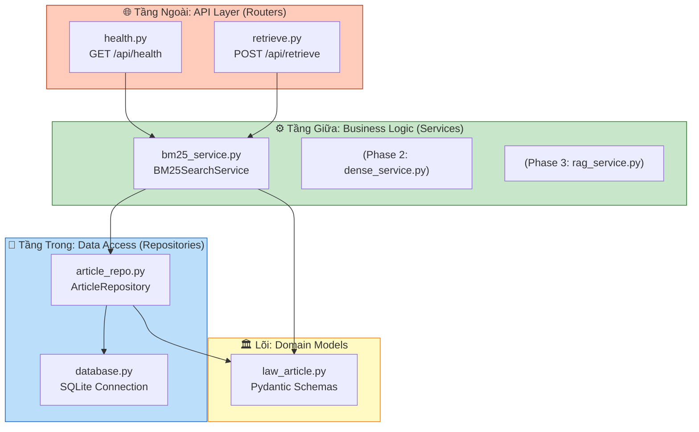
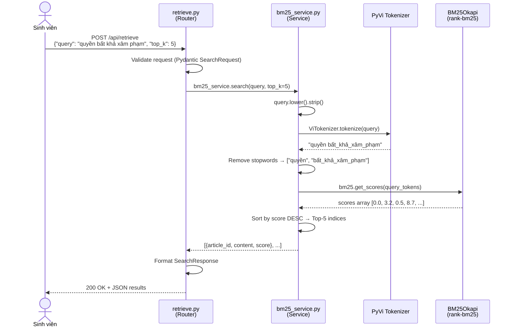

# 📖 Báo cáo Kiến trúc Clean Architecture — Agent SA-04

> **Task ID:** S1  
> **Loại output:** 📖 Báo cáo Kiến thức  
> **Ngày tạo:** 2026-09-09  
> **Dùng cho:** Chương 3.1 báo cáo + Q&A bảo vệ "giải thích kiến trúc hệ thống"

---

## 1. Clean Architecture là gì?

Clean Architecture là mô hình kiến trúc phần mềm do **Robert C. Martin ("Uncle Bob")** đề xuất trong cuốn *"Clean Architecture: A Craftsman's Guide to Software Structure and Design"* (2017).

**Nguyên tắc cốt lõi:** Tách biệt concerns (Separation of Concerns) — mỗi tầng chỉ biết về tầng bên trong nó, KHÔNG biết tầng bên ngoài.

### Lợi ích cho VietLawAssist:

| Lợi ích | Giải thích | Ví dụ cụ thể |
|---------|------------|--------------|
| **Testable** | Mỗi tầng test độc lập | Test BM25 service mà không cần FastAPI server |
| **Flexible** | Thay đổi 1 tầng không ảnh hưởng tầng khác | Đổi từ SQLite sang PostgreSQL → chỉ sửa Repository |
| **ML-friendly** | Tách ML logic khỏi HTTP logic | Thêm Tầng 2 (Dense) → thêm service mới, không sửa router |
| **Maintainable** | 2 thành viên phân chia code rõ ràng | Người A làm Service/ML, Người B làm Router/Frontend |

---

## 2. Áp dụng trong VietLawAssist — 3 Tầng



### Quy tắc phụ thuộc (Dependency Rule):

```
Router (ngoài) → Service (giữa) → Repository (trong) → Models (lõi)
    ❌ KHÔNG BAO GIỜ đi ngược chiều ❌
```

- `health.py` import `bm25_service` ✅
- `bm25_service.py` import `article_repo` ✅
- `article_repo.py` import `law_article` (models) ✅
- `article_repo.py` import `health.py` ❌ **CẤM** — Repository không được biết Router

---

## 3. Mapping Files trong VietLawAssist

| Tầng | File | Trách nhiệm | Import dependencies |
|------|------|-------------|-------------------|
| **Config** | [config.py](file:///d:/User/7th/School/06_Venture_PBL6_VietLawAssist_LegalAI/) | Load .env, Pydantic Settings | pydantic_settings |
| **Entry** | [main.py](file:///d:/User/7th/School/06_Venture_PBL6_VietLawAssist_LegalAI/) | FastAPI app, lifespan, router registration | config, database, routers |
| **Router** | [health.py](file:///d:/User/7th/School/06_Venture_PBL6_VietLawAssist_LegalAI/) | HTTP endpoint GET /api/health | config, database, models |
| **Router** | [retrieve.py](file:///d:/User/7th/School/06_Venture_PBL6_VietLawAssist_LegalAI/) | HTTP endpoint POST /api/retrieve | models, bm25_service |
| **Service** | [bm25_service.py](file:///d:/User/7th/School/06_Venture_PBL6_VietLawAssist_LegalAI/) | BM25Okapi search engine | config, article_repo |
| **Repository** | [article_repo.py](file:///d:/User/7th/School/06_Venture_PBL6_VietLawAssist_LegalAI/) | CRUD database operations | database, models |
| **Infrastructure** | [database.py](file:///d:/User/7th/School/06_Venture_PBL6_VietLawAssist_LegalAI/) | SQLite connection manager | config |
| **Domain** | [law_article.py](file:///d:/User/7th/School/06_Venture_PBL6_VietLawAssist_LegalAI/) | Pydantic schemas (entity definitions) | pydantic (external only) |

---

## 4. Luồng xử lý Request: POST /api/retrieve



**Thời gian xử lý dự kiến:** < 50ms (BM25 trên ~1.600 docs rất nhanh)

---

## 5. Dependency Injection trong FastAPI

FastAPI sử dụng `Depends()` để inject dependencies vào endpoints:

```python
# Trong health.py
@router.get("/health")
async def health_check(settings: Settings = Depends(get_settings)):
    # settings được inject tự động bởi FastAPI
    # get_settings() chỉ gọi 1 lần (lru_cache)
    return {"version": settings.app_version}
```

**Tại sao dùng DI?**
- Dễ mock trong testing: thay `get_settings` bằng mock settings
- Tách biệt configuration khỏi business logic
- Tuân thủ SOLID — Dependency Inversion Principle

---

## 6. Tại sao Clean Architecture phù hợp cho dự án ML?

| Vấn đề thường gặp trong ML projects | Cách Clean Architecture giải quyết |
|--------------------------------------|-------------------------------------|
| Code ML trộn lẫn code HTTP → khó debug | ML logic nằm riêng trong `services/` |
| Đổi model → phải sửa endpoint | Chỉ sửa Service, Router không đổi |
| Test ML code cần chạy server | Test Service trực tiếp (unit test) |
| 2 người code conflict | Phân chia rõ: Router vs Service vs Repository |
| Thêm tầng mới (Dense, RAG) | Thêm file service mới, register route mới → không sửa code cũ |

---

## 7. References

1. Martin, R. C. (2017). *Clean Architecture: A Craftsman's Guide to Software Structure and Design*. Prentice Hall.

2. FastAPI Documentation. *Dependency Injection*. https://fastapi.tiangolo.com/tutorial/dependencies/

3. FastAPI Documentation. *Lifespan Events*. https://fastapi.tiangolo.com/advanced/events/
