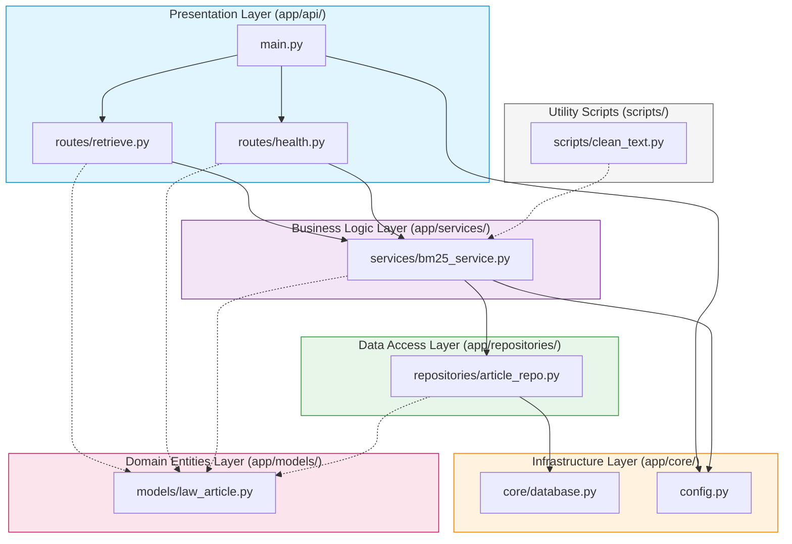

# 📖 Bản Đồ Mã Nguồn Dự Án (Code Map) — Agent SA-04

> **Task ID:** S3  
> **Loại output:** 📖 Báo cáo Kiến trúc & Quản lý Mã nguồn  
> **Ngày tạo:** 2026-09-09  
> **Dùng cho:** Quản trị dự án, Onboarding thành viên & Thuyết minh đồ án

---

## 1. Cấu Trúc Cây Thư Mục Toàn Dự Án (`Project/`)

```text
Project/
├── .env.example                     # Mẫu biến môi trường cấu hình ứng dụng
├── .gitignore                       # Danh sách loại trừ tệp rác / cache cho Git
├── START.md                         # Hướng dẫn tổng quan ban đầu của dự án
├── requirements.txt                 # Khai báo các gói thư viện Python và phiên bản
├── app/                             # Mã nguồn chính của ứng dụng backend (Clean Architecture)
│   ├── __init__.py                  # Đánh dấu package Python
│   ├── config.py                    # Quản lý cấu hình tập trung (Pydantic BaseSettings)
│   ├── main.py                      # FastAPI App entrypoint, lifespan startup/shutdown, CORS
│   ├── api/                         # Tầng Presentation / Web API
│   │   ├── __init__.py
│   │   └── routes/                  # Định nghĩa endpoints RESTful
│   │       ├── __init__.py
│   │       ├── health.py            # GET /api/health (Giám sát trạng thái hệ thống)
│   │       └── retrieve.py          # POST /api/retrieve (Tra cứu BM25 Tầng 1)
│   ├── core/                        # Tầng Hạ tầng cốt lõi (Infrastructure Core)
│   │   ├── __init__.py
│   │   └── database.py              # Kết nối SQLite, WAL mode, tạo bảng tự động
│   ├── models/                      # Tầng Thực thể nghiệp vụ (Domain Entities & Schemas)
│   │   ├── __init__.py
│   │   └── law_article.py           # Pydantic schemas (LawArticle, SearchRequest, SearchResponse)
│   ├── repositories/                # Tầng Truy xuất Dữ liệu (Data Access Layer)
│   │   ├── __init__.py
│   │   └── article_repo.py          # CRUD SQLite, tìm kiếm theo mã luật, phân trang
│   └── services/                    # Tầng Nghiệp vụ cốt lõi (Domain Business Services)
│       ├── __init__.py
│       └── bm25_service.py          # Xây dựng chỉ mục BM25, PyVi tokenize, xếp hạng Top-K
├── data/                            # Thư mục lưu trữ dữ liệu cục bộ
│   └── sample/                      # Dữ liệu chuẩn bị kiểm thử & mẫu
│       ├── sample_articles.json     # 30 điều luật mẫu chuẩn bị sẵn (HP, BLDS, BLHS)
│       └── eval_queries.json        # 30 câu hỏi thực nghiệm kèm ground truth
└── scripts/                         # Các kịch bản tiện ích dòng lệnh (CLI Scripts)
    ├── __init__.py
    └── clean_text.py                # Xử lý văn bản, chuẩn hóa Unicode NFC, xóa ký tự rác
```

---

## 2. Bảng Danh Mục Chi Tiết Mọi Tệp Tin Mã Nguồn

| Tệp Tin | Agent Tạo | Mục Đích & Trách Nhiệm | Thư Viện Phụ Thuộc | Dòng Code (Ước tính) |
|---|:---:|---|---|:---:|
| `Project/requirements.txt` | SA-04 | Khai báo toàn bộ dependencies của hệ thống (fastapi, uvicorn, rank-bm25, pyvi, pydantic...) | — | ~35 |
| `Project/.env.example` | SA-04 | Mẫu cấu hình môi trường chuẩn (port, db_path, bm25 params) | — | ~30 |
| `Project/app/config.py` | SA-04 | Đọc file `.env`, validate kiểu dữ liệu qua `pydantic-settings` | `pydantic`, `pydantic-settings` | ~70 |
| `Project/app/main.py` | SA-04 | Khởi tạo FastAPI app, nạp lifespan context, gắn middleware CORS, gom routers | `fastapi`, `uvicorn` | ~90 |
| `Project/app/core/database.py` | SA-04 | Quản lý kết nối SQLite, chế độ WAL, khởi tạo bảng `law_articles` | `sqlite3` | ~120 |
| `Project/app/models/law_article.py` | SA-04 | Khai báo tất cả Request/Response schemas và Database Entity models | `pydantic` | ~160 |
| `Project/app/repositories/article_repo.py` | SA-04 | Thao tác truy vấn cơ sở dữ liệu SQLite an toàn (CRUD, filter, pagination) | `sqlite3`, `models.law_article` | ~180 |
| `Project/app/services/bm25_service.py` | SA-04 / MLR-02 | Xử lý logic nghiệp vụ BM25: tách từ PyVi, nạp chỉ mục, tính điểm, cache RAM | `rank_bm25`, `pyvi`, `numpy`, `pickle` | ~270 |
| `Project/app/api/routes/health.py` | SA-04 | API Endpoint kiểm tra sức khỏe hệ thống và trạng thái chỉ mục | `fastapi`, `models` | ~50 |
| `Project/app/api/routes/retrieve.py` | SA-04 | API Endpoint nhận truy vấn tìm kiếm BM25 và trả về danh sách tài liệu | `fastapi`, `models`, `services` | ~80 |
| `Project/scripts/clean_text.py` | DE-03 | Tiện ích chuẩn hóa Unicode NFC, xóa ký tự điều khiển và thẻ HTML | `unicodedata`, `re` | ~140 |
| `Project/data/sample/sample_articles.json` | DE-03 | 30 bản ghi điều luật thật đầy đủ metadata | `json` | ~450 |
| `Project/data/sample/eval_queries.json` | EVAL-05 | 30 câu hỏi đánh giá kèm Ground Truth relevance | `json` | ~300 |

---

## 3. Sơ Đồ Đồ Thị Phụ Thuộc (Dependency & Import Graph)



### Nguyên Tắc Bất Biến Về Kiến Trúc:
1. **Dependency Inversion:** Các tầng ngoài phụ thuộc vào tầng trong; tầng trong không bao giờ phụ thuộc ngược ra ngoài.
2. **Loosely Coupled:** Route chỉ gọi qua Service; không bao giờ Route gọi trực tiếp vào Database Cursor.
3. **Domain Purity:** Thư mục `models/` hoàn toàn độc lập, không chứa logic cơ sở dữ liệu hay framework bên ngoài.
