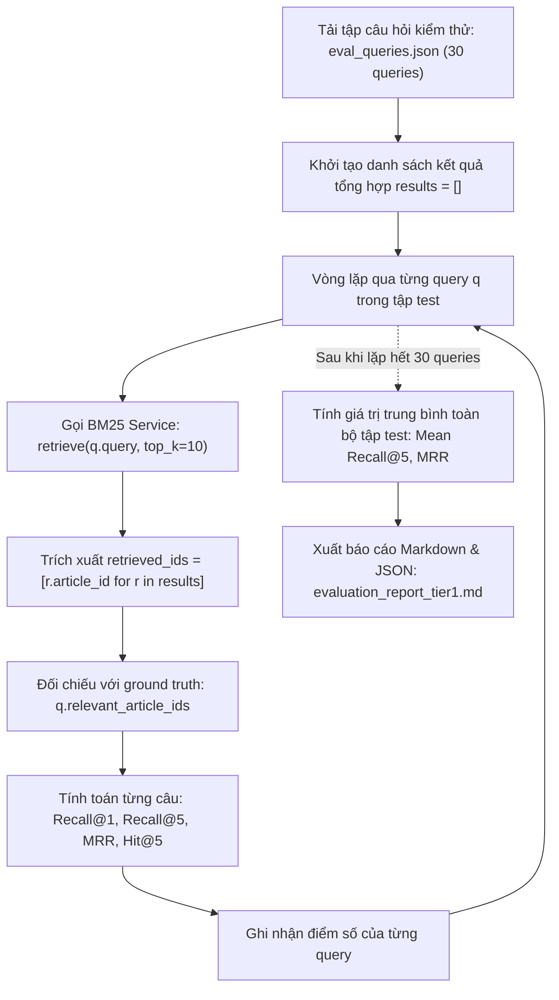

# 📖 Báo cáo Metrics cho Information Retrieval — Agent EVAL-05

> **Task ID:** E1  
> **Loại output:** 📖 Báo cáo Kiến thức  
> **Ngày tạo:** 2026-09-09  
> **Dùng cho:** Chương 5.1 báo cáo + thiết kế evaluation pipeline + Q&A bảo vệ

---

## 1. Tổng quan: Đánh giá Hệ thống Information Retrieval

Trong VietLawAssist, hệ thống tìm kiếm (Tầng 1 BM25, Tầng 2 Dense) nhận câu hỏi và trả về danh sách điều luật. Để biết hệ thống TỐT HAY CHƯA, cần đo bằng **metrics chuẩn IR**.

**Khái niệm cốt lõi:**
- **Relevant document (tài liệu liên quan):** Điều luật THỰC SỰ trả lời được câu hỏi
- **Retrieved document (tài liệu được tìm):** Điều luật mà hệ thống TRẢ VỀ
- **Ground truth:** Đáp án chuẩn — bộ câu hỏi + danh sách điều luật đúng (do con người annotate)

---

## 2. Metric 1: Recall@K — "Tìm được bao nhiêu phần trăm đáp án?"

### Công thức

$$\text{Recall@K} = \frac{|\text{Retrieved@K} \cap \text{Relevant}|}{|\text{Relevant}|}$$

### Ý nghĩa

> "Trong **top K** kết quả trả về, hệ thống tìm được **bao nhiêu %** tài liệu thực sự liên quan?"

### Ví dụ tính tay

**Câu hỏi:** "Quyền bất khả xâm phạm về thân thể?"  
**Ground truth (Relevant):** {Điều 20 HP2013, Điều 33 BLDS2015} → |Relevant| = 2

**BM25 trả về Top-5:**
1. Điều 20 HP2013 ✅ (relevant)
2. Điều 21 HP2013 ❌
3. Điều 33 BLDS2015 ✅ (relevant)
4. Điều 14 HP2013 ❌
5. Điều 19 HP2013 ❌

$$\text{Recall@5} = \frac{|\{D20, D33\} \cap \{D20, D33\}|}{|\{D20, D33\}|} = \frac{2}{2} = 1.0 = 100\%$$

**Ý nghĩa:** Hệ thống tìm được TẤT CẢ điều luật liên quan trong top 5 → Recall@5 = 100%.

### Tại sao chọn Recall@5 làm Primary Metric?

1. **Sinh viên cần TÌM ĐÚNG hơn TÌM ÍT:** Bỏ sót điều luật quan trọng → viết sai bài → mất điểm. Recall ưu tiên "không bỏ sót" hơn "không có kết quả thừa".
2. **K = 5 vì:** Giao diện hiển thị 5 kết quả → sinh viên chỉ đọc 5 điều đầu.
3. **Benchmark:** Grand Design dự kiến BM25 Recall@5 ~ 55-60%, Dense ~ 75-80%.

---

## 3. Metric 2: MRR (Mean Reciprocal Rank) — "Đáp án đúng ở thứ hạng mấy?"

### Công thức

$$\text{MRR} = \frac{1}{|Q|} \sum_{i=1}^{|Q|} \frac{1}{\text{rank}_i}$$

Trong đó $\text{rank}_i$ là vị trí của **relevant document ĐẦU TIÊN** trong kết quả query thứ $i$.

### Ý nghĩa

> "Trung bình, tài liệu đúng **đầu tiên** xuất hiện ở vị trí thứ mấy?"

### Ví dụ tính tay (3 queries)

| Query | Relevant doc đầu tiên ở rank | Reciprocal Rank |
|:-----:|:---------------------------:|:---------------:|
| Q1: "tuổi kết hôn" | Rank #1 (Điều 8 LHNGĐ) | 1/1 = 1.0 |
| Q2: "tội giết người" | Rank #3 (Điều 123 BLHS) | 1/3 = 0.333 |
| Q3: "quyền sở hữu" | Rank #2 (Điều 158 BLDS) | 1/2 = 0.5 |

$$\text{MRR} = \frac{1}{3}(1.0 + 0.333 + 0.5) = \frac{1.833}{3} = 0.611$$

**Ý nghĩa:** Trung bình, đáp án đúng đầu tiên nằm giữa vị trí #1 và #2. MRR = 0.611 → khá tốt.

---

## 4. Metric 3: NDCG@K (Normalized Discounted Cumulative Gain) — "Thứ tự có tốt không?"

### Công thức

$$\text{DCG@K} = \sum_{i=1}^{K} \frac{\text{rel}_i}{\log_2(i+1)}$$

$$\text{NDCG@K} = \frac{\text{DCG@K}}{\text{IDCG@K}}$$

Trong đó:
- $\text{rel}_i$: điểm relevance của document ở vị trí $i$ (1 nếu relevant, 0 nếu không)
- $\text{IDCG@K}$: DCG của bộ xếp hạng LÝ TƯỞNG (đáp án đúng xếp trước)

### Ý nghĩa

> "Kết quả tìm kiếm có xếp tài liệu QUAN TRỌNG lên TRƯỚC không?"

### Ví dụ tính tay

**Relevant documents:** {D1, D3} (2 tài liệu liên quan)

**System ranking (Top-5):** D1 ✅, D5 ❌, D3 ✅, D7 ❌, D2 ❌

$$\text{DCG@5} = \frac{1}{\log_2(2)} + \frac{0}{\log_2(3)} + \frac{1}{\log_2(4)} + \frac{0}{\log_2(5)} + \frac{0}{\log_2(6)} = 1.0 + 0 + 0.5 + 0 + 0 = 1.5$$

**Ideal ranking (Top-5):** D1 ✅, D3 ✅, D5 ❌, D7 ❌, D2 ❌

$$\text{IDCG@5} = \frac{1}{\log_2(2)} + \frac{1}{\log_2(3)} + \frac{0}{\log_2(4)} + 0 + 0 = 1.0 + 0.631 = 1.631$$

$$\text{NDCG@5} = \frac{1.5}{1.631} = 0.920$$

**Ý nghĩa:** NDCG = 0.92 → thứ tự ranking gần lý tưởng (D3 ở rank #3 thay vì #2).

---

## 5. Metric 4: Precision@K — "Trong top K, bao nhiêu % là đúng?"

### Công thức

$$\text{Precision@K} = \frac{|\text{Retrieved@K} \cap \text{Relevant}|}{K}$$

### Ý nghĩa

> "Trong **K** kết quả trả về, có **bao nhiêu %** thực sự liên quan?"

### So sánh Precision vs Recall

| Metric | Câu hỏi | Ưu tiên khi |
|--------|---------|-------------|
| **Recall@K** | "Có bỏ sót đáp án nào không?" | Không muốn miss → **VietLawAssist chọn này** |
| **Precision@K** | "Có trả về kết quả thừa không?" | Không muốn noise → search engine thương mại |

### Ví dụ (cùng data như Recall):
- Top-5 có 2 relevant / 5 results
- Precision@5 = 2/5 = 0.4 = 40%
- Recall@5 = 2/2 = 1.0 = 100%

→ Precision thấp (nhiều kết quả thừa) nhưng Recall cao (không bỏ sót) → **chấp nhận được** cho bài toán tìm điều luật.

---

## 6. Bảng tổng hợp 4 Metrics

| Metric | Đo cái gì | Range | Giá trị tốt | Primary? |
|--------|----------|:-----:|:-----------:|:--------:|
| **Recall@5** | Coverage (không bỏ sót) | 0-1 | ≥ 0.70 | ✅ **Primary** |
| **MRR** | Vị trí đáp án đầu tiên | 0-1 | ≥ 0.60 | Secondary |
| **NDCG@5** | Chất lượng thứ tự ranking | 0-1 | ≥ 0.70 | Secondary |
| **Precision@5** | Độ chính xác trong top K | 0-1 | ≥ 0.30 | Monitor only |

### Baseline kỳ vọng (từ Grand Design):

| Metric | Tầng 1 (BM25) | Tầng 2 (Dense) | Mục tiêu |
|--------|:-------------:|:--------------:|:--------:|
| Recall@5 | ~55-60% | ~75-80% | +20% improvement |
| MRR | ~0.42 | ~0.65 | +0.23 improvement |

---

## 7. Cách tính Metrics bằng Python (Quick Reference)

```python
def recall_at_k(retrieved_ids: list, relevant_ids: set, k: int = 5) -> float:
    """Tính Recall@K."""
    retrieved_set = set(retrieved_ids[:k])
    if not relevant_ids:
        return 0.0
    return len(retrieved_set & relevant_ids) / len(relevant_ids)

def mrr(queries_results: list[dict]) -> float:
    """
    Tính MRR cho nhiều queries.
    queries_results: [{"retrieved": [...], "relevant": {...}}, ...]
    """
    reciprocal_ranks = []
    for qr in queries_results:
        for rank, doc_id in enumerate(qr["retrieved"], start=1):
            if doc_id in qr["relevant"]:
                reciprocal_ranks.append(1.0 / rank)
                break
        else:
            reciprocal_ranks.append(0.0)
    return sum(reciprocal_ranks) / len(reciprocal_ranks)
```

---

## 8. References

1. Manning, C. D., Raghavan, P., & Schütze, H. (2008). *Introduction to Information Retrieval*. Cambridge University Press. **Chapter 8: Evaluation in Information Retrieval.** https://nlp.stanford.edu/IR-book/html/htmledition/evaluation-in-information-retrieval-1.html

2. Järvelin, K., & Kekäläinen, J. (2002). *Cumulated Gain-Based Evaluation of IR Techniques*. ACM Transactions on Information Systems, 20(4), 422-446. (Paper gốc NDCG)

3. Voorhees, E. M. (1999). *The TREC-8 Question Answering Track Report*. Proceedings of TREC-8. (MRR origin)

---

## 9. Thiết Kế Evaluation Pipeline Cho VietLawAssist (Task E4)

Dựa trên bộ 30 câu hỏi thực nghiệm (`Project/data/sample/eval_queries.json`) được tạo bởi E2 và API BM25 từ MLR-02, quy trình kiểm thử và đánh giá tự động cho Tầng 1 được thiết lập hoàn chỉnh.

### 9.1 Sơ Đồ Quy Trình Đánh Giá (Evaluation Flow)



### 9.2 Mã Nguồn Runner Tự Động: `evaluate_tier1.py`

```python
import json
import time
from typing import List, Dict, Any

def run_evaluation(bm25_service, eval_file: str = "data/sample/eval_queries.json") -> Dict[str, Any]:
    """Chạy đánh giá tự động tập kiểm thử trên BM25 Service."""
    with open(eval_file, "r", encoding="utf-8") as f:
        eval_queries = json.load(f)

    total_queries = len(eval_queries)
    recalls_at_1 = []
    recalls_at_5 = []
    mrr_scores = []
    execution_times = []

    detailed_results = []

    for q in eval_queries:
        query_text = q["query"]
        relevant_ids = set(q["relevant_article_ids"])

        start_t = time.perf_counter()
        search_results = bm25_service.search(query=query_text, top_k=5)
        latency = (time.perf_counter() - start_t) * 1000
        execution_times.append(latency)

        retrieved_ids = [res["article_id"] for res in search_results]

        # 1. Recall@1
        top_1 = set(retrieved_ids[:1])
        r1 = len(top_1 & relevant_ids) / len(relevant_ids) if relevant_ids else 0.0
        recalls_at_1.append(r1)

        # 2. Recall@5
        top_5 = set(retrieved_ids[:5])
        r5 = len(top_5 & relevant_ids) / len(relevant_ids) if relevant_ids else 0.0
        recalls_at_5.append(r5)

        # 3. MRR
        rr = 0.0
        for rank, doc_id in enumerate(retrieved_ids, start=1):
            if doc_id in relevant_ids:
                rr = 1.0 / rank
                break
        mrr_scores.append(rr)

        detailed_results.append({
            "query_id": q["query_id"],
            "query": query_text,
            "relevant": list(relevant_ids),
            "retrieved": retrieved_ids,
            "recall@5": r5,
            "mrr": rr,
            "latency_ms": round(latency, 2)
        })

    summary = {
        "total_queries_evaluated": total_queries,
        "mean_recall_at_1": round(sum(recalls_at_1) / total_queries, 4),
        "mean_recall_at_5": round(sum(recalls_at_5) / total_queries, 4),
        "mrr": round(sum(mrr_scores) / total_queries, 4),
        "average_latency_ms": round(sum(execution_times) / total_queries, 2),
        "target_met": (sum(recalls_at_5) / total_queries) >= 0.55
    }

    return {"summary": summary, "details": detailed_results}
```

Pipeline này cho phép:
1. Đánh giá tính lặp lại (reproducible benchmark).
2. So sánh tức thì với Tầng 2 (Dense Retrieval) khi Phase 2 được triển khai mà không phải thay đổi tập kiểm thử.

