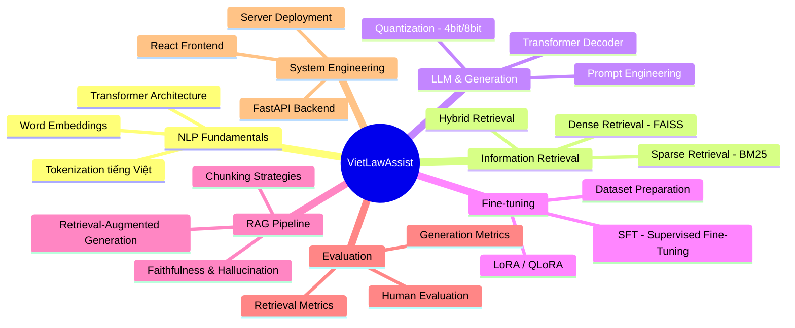

# 🗺️ Lộ trình Học tập & Nguồn tài liệu cho VietLawAssist (PBL6)

> Tài liệu này mô hình hóa **toàn bộ kiến thức** cần nắm, từ lúc lên kế hoạch → thu thập dữ liệu → xây dựng model → triển khai → đánh giá, kèm theo **nguồn tham khảo cụ thể** và **giá trị từng nguồn** mang lại.

---

## I. TỔNG QUAN — BẢN ĐỒ KIẾN THỨC



---

## II. NHÓM KIẾN THỨC NỀN TẢNG (Foundation)

### 1. NLP & Xử lý Ngôn ngữ Tự nhiên Tiếng Việt

| Nguồn | Link | Giá trị mang lại |
|--------|------|-------------------|
| **Stanford CS224N: NLP with Deep Learning** | [cs224n.stanford.edu](https://web.stanford.edu/class/cs224n/) | Nền tảng lý thuyết vững chắc: word embeddings, attention, transformer. Hiểu **tại sao** dense retrieval hoạt động tốt hơn BM25 |
| **Speech and Language Processing (Jurafsky & Martin)** | [web.stanford.edu/~jurafsky/slp3](https://web.stanford.edu/~jurafsky/slp3/) | Sách giáo khoa miễn phí, chương 14 (Vector Semantics) và chương 23 (QA Systems) **trực tiếp liên quan** đến pipeline của bạn |
| **Underthesea Documentation** | [github.com/undertheseanlp/underthesea](https://github.com/undertheseanlp/underthesea) | Thư viện NLP tiếng Việt: word segmentation, POS tagging. **Bắt buộc** cho Tầng 1 BM25 (tokenizer tiếng Việt) |
| **PhoBERT Paper (VinAI)** | [arxiv.org/abs/2003.00744](https://arxiv.org/abs/2003.00744) | Hiểu kiến trúc embedding model tiếng Việt mà bạn dùng ở Tầng 2. Giải thích được cho hội đồng **tại sao chọn PhoBERT** thay vì mBERT |

> [!TIP]
> **Ưu tiên đọc**: CS224N Lecture 1-5 (Word Vectors → Attention) + Jurafsky Chapter 14, 23. Đủ nền tảng lý thuyết cho toàn bộ phần Retrieval.

---

### 2. Transformer Architecture & LLM

| Nguồn | Link | Giá trị mang lại |
|--------|------|-------------------|
| **"Attention Is All You Need" (Vaswani et al., 2017)** | [arxiv.org/abs/1706.03762](https://arxiv.org/abs/1706.03762) | Paper gốc của Transformer. **Bắt buộc hiểu** self-attention, multi-head attention — nền tảng của mọi thứ trong project |
| **The Illustrated Transformer (Jay Alammar)** | [jalammar.github.io/illustrated-transformer](https://jalammar.github.io/illustrated-transformer/) | Trực quan hóa Transformer bằng hình ảnh. **Nguồn #1 để hiểu nhanh** mà không cần đọc toán nặng |
| **The Illustrated GPT-2** | [jalammar.github.io/illustrated-gpt2](https://jalammar.github.io/illustrated-gpt2/) | Hiểu decoder-only architecture — kiến trúc của **Qwen2.5** mà bạn sử dụng ở Tầng 3-4 |
| **Hugging Face NLP Course** | [huggingface.co/learn/nlp-course](https://huggingface.co/learn/nlp-course) | Khóa học thực hành: pipeline, tokenizer, model loading, fine-tuning. **Giá trị thực tiễn cực cao** — áp dụng ngay vào code |
| **Qwen2.5 Technical Report** | [arxiv.org/abs/2412.15115](https://arxiv.org/abs/2412.15115) | Hiểu rõ model mà bạn deploy: kiến trúc, training data, capabilities. **Trả lời câu hỏi hội đồng** "Tại sao chọn Qwen?" |

> [!IMPORTANT]
> **Jay Alammar's Illustrated Series** là nguồn đọc đầu tiên trước khi đọc paper. Tiết kiệm hàng chục giờ so với đọc paper thô.

---

## III. NHÓM KIẾN THỨC CỐT LÕI (Core — Trực tiếp vào Project)

### 3. Information Retrieval — Tầng 1 & 2

| Nguồn | Link | Giá trị mang lại |
|--------|------|-------------------|
| **Introduction to Information Retrieval (Manning et al.)** | [nlp.stanford.edu/IR-book](https://nlp.stanford.edu/IR-book/information-retrieval-book.html) | Sách giáo khoa IR kinh điển. Chương 6 (Scoring/TF-IDF), chương 11 (Probabilistic IR = **BM25**). Hiểu sâu để **giải thích lý thuyết BM25 trong báo cáo** |
| **BM25 — The Original Paper (Robertson & Zaragoza)** | [DOI: 10.1561/1500000019](https://www.nowpublishers.com/article/Details/INR-019) | Hiểu công thức BM25: term frequency saturation, document length normalization. **Viết được phần lý thuyết Tầng 1** |
| **rank_bm25 Library** | [github.com/dorianbrown/rank_bm25](https://github.com/dorianbrown/rank_bm25) | Thư viện BM25 bạn sẽ dùng. Đọc source code (~200 dòng) để hiểu implementation |
| **Sentence-BERT Paper (Reimers & Gurevych, 2019)** | [arxiv.org/abs/1908.10084](https://arxiv.org/abs/1908.10084) | Nền tảng lý thuyết của **sentence embeddings** — cách PhoBERT biến câu thành vector. Giải thích tại sao cosine similarity hoạt động |
| **FAISS Documentation (Meta)** | [github.com/facebookresearch/faiss/wiki](https://github.com/facebookresearch/faiss/wiki) | Thư viện vector search bạn dùng ở Tầng 2. Hiểu `IndexFlatIP` vs `IndexIVFFlat` vs `IndexHNSW` để chọn đúng index |
| **vietnamese-bi-encoder (BKAI)** | [huggingface.co/bkai-foundation-models/vietnamese-bi-encoder](https://huggingface.co/bkai-foundation-models/vietnamese-bi-encoder) | Model embedding tiếng Việt bạn sẽ dùng. Đọc model card để hiểu training data, limitations |

> [!NOTE]
> **Thứ tự đọc**: Manning IR-book Ch.6 → BM25 paper (skim) → Sentence-BERT → FAISS wiki Getting Started. Mỗi nguồn tương ứng 1 tầng trong hệ thống.

---

### 4. RAG (Retrieval-Augmented Generation) — Tầng 3

| Nguồn | Link | Giá trị mang lại |
|--------|------|-------------------|
| **RAG Original Paper (Lewis et al., 2020)** | [arxiv.org/abs/2005.11401](https://arxiv.org/abs/2005.11401) | Paper gốc từ Meta AI. Hiểu **triết lý RAG**: tại sao kết hợp retrieval + generation giải quyết hallucination. **Viết phần lý thuyết Tầng 3** |
| **"Retrieval-Augmented Generation for Knowledge-Intensive NLP Tasks"** | [huggingface.co/docs/transformers/model_doc/rag](https://huggingface.co/docs/transformers/model_doc/rag) | HuggingFace implementation reference. Hiểu API và cách kết nối retriever ↔ generator |
| **LangChain RAG Tutorial** | [python.langchain.com/docs/tutorials/rag](https://python.langchain.com/docs/tutorials/rag/) | Tutorial thực hành RAG end-to-end. Dù bạn không dùng LangChain, **concept chunking, retrieval chain, prompt template** áp dụng trực tiếp |
| **LlamaIndex Documentation** | [docs.llamaindex.ai](https://docs.llamaindex.ai/en/stable/) | Framework RAG thay thế. Đọc phần **Evaluation** để hiểu faithfulness, relevancy metrics |
| **Chunking Strategies Guide** | [pinecone.io/learn/chunking-strategies](https://www.pinecone.io/learn/chunking-strategies/) | Hướng dẫn chia document thành chunks. Trong project, bạn dùng 1 điều luật = 1 chunk — bài viết này giải thích **tại sao đó là lựa chọn đúng** cho legal domain |

> [!WARNING]
> RAG paper gốc dùng kiến trúc khác (DPR + BART). Pipeline của bạn dùng PhoBERT + Qwen2.5 nên **không copy nguyên kiến trúc**, mà lấy **concept** và adjust.

---

### 5. Fine-tuning & LoRA — Tầng 4

| Nguồn | Link | Giá trị mang lại |
|--------|------|-------------------|
| **LoRA Paper (Hu et al., 2021)** | [arxiv.org/abs/2106.09685](https://arxiv.org/abs/2106.09685) | Paper gốc. Hiểu **low-rank decomposition**: tại sao chỉ train 0.15% params mà vẫn hiệu quả. **Bắt buộc cho câu hỏi hội đồng** |
| **QLoRA Paper (Dettmers et al., 2023)** | [arxiv.org/abs/2305.14314](https://arxiv.org/abs/2305.14314) | 4-bit quantization + LoRA. Đây chính xác là kỹ thuật bạn dùng (load_in_4bit + LoRA). **Giải thích tại sao chạy được trên RTX 3050** |
| **PEFT Library Documentation** | [huggingface.co/docs/peft](https://huggingface.co/docs/peft) | Thư viện LoRA bạn dùng trong code. Đọc kỹ `LoraConfig` parameters: `r`, `lora_alpha`, `target_modules` |
| **TRL Library (Transformer Reinforcement Learning)** | [huggingface.co/docs/trl](https://huggingface.co/docs/trl) | `SFTTrainer` — trainer bạn dùng cho fine-tuning. Đọc SFT (Supervised Fine-Tuning) guide |
| **Alpaca Dataset Format** | [github.com/tatsu-lab/stanford_alpaca](https://github.com/tatsu-lab/stanford_alpaca) | Format `instruction/input/output` bạn dùng cho dataset fine-tuning. Hiểu conventions để tạo dataset đúng chuẩn |
| **BitsAndBytes Documentation** | [github.com/TimDettmers/bitsandbytes](https://github.com/TimDettmers/bitsandbytes) | Thư viện quantization (4-bit, 8-bit). Hiểu `load_in_4bit`, `bnb_4bit_compute_dtype` để tối ưu VRAM |

> [!TIP]
> **Đọc LoRA paper Section 4 (Empirical Results)** trước — thấy ngay bảng so sánh LoRA vs Full Fine-tune. Dùng bảng này trong slide bảo vệ rất thuyết phục.

---

### 6. Evaluation Metrics — Đánh giá Hệ thống

| Nguồn | Link | Giá trị mang lại |
|--------|------|-------------------|
| **RAGAS Framework** | [docs.ragas.io](https://docs.ragas.io/) | Framework đánh giá RAG. Cung cấp sẵn metrics: **Faithfulness, Answer Relevancy, Context Precision**. Có thể dùng trực tiếp hoặc lấy concept |
| **ROUGE Paper (Lin, 2004)** | [aclanthology.org/W04-1013](https://aclanthology.org/W04-1013/) | Paper gốc ROUGE metric. Hiểu ROUGE-1, ROUGE-2, **ROUGE-L** (bạn dùng). Viết phần lý thuyết evaluation |
| **BERTScore Paper (Zhang et al., 2020)** | [arxiv.org/abs/1904.09675](https://arxiv.org/abs/1904.09675) | Metric đánh giá semantic similarity. Hiểu tại sao **BERTScore > ROUGE** cho tiếng Việt (ngôn ngữ agglutinative) |
| **rouge-score Library** | [pypi.org/project/rouge-score](https://pypi.org/project/rouge-score/) | Implementation ROUGE bạn dùng trong code |
| **bert-score Library** | [github.com/Tiiiger/bert_score](https://github.com/Tiiiger/bert_score) | Implementation BERTScore. Đọc phần **chọn model** — bạn dùng `vinai/phobert-base-v2` thay vì default |

---

## IV. NHÓM KIẾN THỨC DỮ LIỆU (Data Sources & Preparation)

### 7. Nguồn Corpus Pháp luật Việt Nam

| Nguồn | Link | Giá trị mang lại |
|--------|------|-------------------|
| **Cổng Thông tin Điện tử Chính phủ** | [vanban.chinhphu.vn](https://vanban.chinhphu.vn/) | Nguồn **chính thống nhất**, văn bản pháp luật gốc. Dùng để cross-validate dữ liệu crawl |
| **Thư viện Pháp luật** | [thuvienphapluat.vn](https://thuvienphapluat.vn/) | Cơ sở dữ liệu luật lớn nhất VN. **Cấu trúc HTML tốt** cho crawling, có phân chia điều/khoản rõ ràng |
| **Hệ thống VBPL** | [vbpl.vn](https://vbpl.vn/) | Văn bản pháp luật database. Backup source nếu thuvienphapluat bị block |
| **Cơ sở dữ liệu Quốc gia về VBPL** | [vbpl.vn/TW/Pages/Home.aspx](https://vbpl.vn/TW/Pages/Home.aspx) | Nguồn chính thức từ Bộ Tư pháp, **đáng tin cậy nhất** cho trích dẫn trong báo cáo |

> [!IMPORTANT]
> Khi crawl, **luôn lưu metadata**: tên bộ luật, số hiệu văn bản, ngày ban hành, ngày hiệu lực. Metadata này cần cho citation accuracy.

### 8. Nguồn Q&A Dataset cho Fine-tuning

| Nguồn | Link/Cách lấy | Giá trị mang lại |
|--------|---------------|-------------------|
| **Đề thi PLĐC các trường ĐH** | Google: "đề thi pháp luật đại cương" + tên trường | ~150 cặp Q&A thực tế. **Ground truth mạnh nhất** vì đúng format đề thi |
| **Giáo trình PLĐC (NXB Chính trị Quốc gia)** | Thư viện DUT / mua online | Câu hỏi ôn tập cuối chương → ~100 cặp Q&A. **Đảm bảo coverage** tất cả chủ đề |
| **Câu hỏi tự tạo từ điều luật quan trọng** | Viết thủ công dựa trên corpus | ~250 cặp, kiểm soát chất lượng cao. Đảm bảo **mỗi bộ luật đều có representation** |
| **Vietnamese QA Datasets (UIT-ViQuAD)** | [huggingface.co/datasets/uitnlp/UIT-ViQuAD](https://huggingface.co/datasets/uitnlp/UIT-ViQuAD) | Dataset QA tiếng Việt lớn. Không dùng trực tiếp nhưng **tham khảo format** và annotation guidelines |

---

## V. NHÓM KIẾN THỨC HỆ THỐNG (System Engineering)

### 9. Backend & API

| Nguồn | Link | Giá trị mang lại |
|--------|------|-------------------|
| **FastAPI Official Tutorial** | [fastapi.tiangolo.com/tutorial](https://fastapi.tiangolo.com/tutorial/) | Framework web bạn dùng. Tutorial rất tốt, **đọc hết trong 1 ngày**. Async support quan trọng cho ML inference |
| **FastAPI + ML Model Serving** | [testdriven.io/blog/fastapi-machine-learning](https://testdriven.io/blog/fastapi-machine-learning/) | Cách serve ML model qua API. **Trực tiếp áp dụng** cho `/api/retrieve`, `/api/generate` |
| **Docker Documentation** | [docs.docker.com/get-started](https://docs.docker.com/get-started/) | Container hóa ứng dụng. Đảm bảo **reproducibility** khi deploy lên server Ubuntu |

### 10. Frontend

| Nguồn | Link | Giá trị mang lại |
|--------|------|-------------------|
| **React Official Tutorial** | [react.dev/learn](https://react.dev/learn) | React 18+ fundamentals. Đủ để build UI cho comparison view |
| **React Query (TanStack Query)** | [tanstack.com/query](https://tanstack.com/query/latest) | Data fetching library. Xử lý loading states khi gọi API ML (3-10s response time) |

### 11. Server & Deployment

| Nguồn | Link | Giá trị mang lại |
|--------|------|-------------------|
| **Ubuntu Server Guide** | [ubuntu.com/server/docs](https://ubuntu.com/server/docs) | Cài đặt, cấu hình Ubuntu Server — **yêu cầu bắt buộc** của PBL6 |
| **Nginx Documentation** | [nginx.org/en/docs](https://nginx.org/en/docs/) | Reverse proxy cho FastAPI. Xử lý HTTPS, load balancing |
| **Artillery.io** | [artillery.io/docs](https://www.artillery.io/docs) | Load testing tool — **yêu cầu bắt buộc** cho kiểm thử. Đo throughput, latency |
| **Selenium Documentation** | [selenium.dev/documentation](https://www.selenium.dev/documentation/) | E2E testing tool — **yêu cầu bắt buộc** cho kiểm thử UI |

---

## VI. NHÓM MODELS & TOOLS CẦN BIẾT

### Bảng tổng hợp Models

| Model/Tool | Vai trò trong Project | HuggingFace Link | VRAM cần |
|------------|----------------------|-------------------|----------|
| **underthesea** | Vietnamese tokenizer cho BM25 | N/A (pip install) | CPU |
| **bkai-foundation-models/vietnamese-bi-encoder** | Sentence embedding cho Dense Retrieval | [Link](https://huggingface.co/bkai-foundation-models/vietnamese-bi-encoder) | ~1GB |
| **vinai/phobert-base-v2** | BERTScore evaluation | [Link](https://huggingface.co/vinai/phobert-base-v2) | ~500MB |
| **Qwen/Qwen2.5-1.5B-Instruct** | Text generation (Tầng 3-4) | [Link](https://huggingface.co/Qwen/Qwen2.5-1.5B-Instruct) | ~1.2GB (4-bit) |
| **FAISS** | Vector similarity search | N/A (pip install) | CPU/GPU |
| **rank_bm25** | BM25 sparse retrieval | N/A (pip install) | CPU |

### Bảng tổng hợp Libraries

| Library | Mục đích | Cần học gì |
|---------|----------|------------|
| `transformers` | Load & run models | `AutoModelForCausalLM`, `AutoTokenizer`, `pipeline` |
| `sentence-transformers` | Sentence embeddings | `SentenceTransformer.encode()` |
| `peft` | LoRA fine-tuning | `LoraConfig`, `get_peft_model` |
| `trl` | SFT training | `SFTTrainer`, `SFTConfig` |
| `bitsandbytes` | Quantization | `load_in_4bit`, `BnbQuantizationConfig` |
| `datasets` | Dataset loading | `Dataset.from_dict()`, `load_dataset()` |
| `rouge-score` | ROUGE evaluation | `RougeScorer` |
| `bert-score` | BERTScore evaluation | `score()` function |
| `faiss-cpu` / `faiss-gpu` | Vector indexing | `IndexFlatIP`, `normalize_L2`, `search` |
| `beautifulsoup4` | Web crawling | `BeautifulSoup`, CSS selectors |
| `PyMuPDF` | PDF extraction | `fitz.open()`, page extraction |

---

## VII. LỘ TRÌNH ĐỌC THEO THỜI GIAN (Khuyến nghị)

### 📅 Tuần 1-2: Foundation & Data Collection

```
Đọc:
├── Jay Alammar — Illustrated Transformer (2h)
├── Jay Alammar — Illustrated GPT-2 (1h)
├── HuggingFace NLP Course — Chapter 1-3 (4h)
├── Manning IR-book — Chapter 6: Scoring (2h)
├── FastAPI Tutorial — Getting Started (3h)
└── BeautifulSoup Tutorial (1h)

Thực hành:
├── Crawl corpus từ thuvienphapluat.vn
├── Clean & chunk thành 1 điều = 1 document
└── Setup FastAPI skeleton
```

### 📅 Tuần 3-4: Retrieval (Tầng 1 & 2)

```
Đọc:
├── BM25 lý thuyết — Manning IR-book Chapter 11 (2h)
├── Sentence-BERT paper — Section 3 (Method) (1h)
├── FAISS wiki — Getting Started + IndexFlatIP (2h)
├── vietnamese-bi-encoder model card (30min)
└── Underthesea documentation (1h)

Thực hành:
├── Implement BM25 pipeline
├── Implement Dense Retrieval pipeline
├── Build evaluation test set (30 câu)
└── So sánh Recall@5, MRR giữa 2 tầng
```

### 📅 Tuần 5-6: RAG Pipeline (Tầng 3)

```
Đọc:
├── RAG Paper (Lewis et al.) — Abstract + Section 3 (1h)
├── Qwen2.5 Technical Report — Section 2 (Architecture) (1h)
├── QLoRA paper — Section 3 (Method) (1h)
├── Pinecone Chunking Guide (30min)
└── BitsAndBytes — 4-bit quantization usage (30min)

Thực hành:
├── Load Qwen2.5-1.5B với 4-bit quantization
├── Build RAG pipeline: retrieve → prompt → generate
├── Test với câu hỏi PLĐC thật
└── Đo ROUGE-L, BERTScore
```

### 📅 Tuần 7-8: Fine-tuning (Tầng 4)

```
Đọc:
├── LoRA Paper — Section 4 (Experiments) (1h)
├── PEFT Library docs — LoRA tutorial (1h)
├── TRL Library docs — SFT guide (1h)
├── Alpaca dataset format (30min)
└── RAGAS docs — Faithfulness metric (1h)

Thực hành:
├── Tạo dataset 500 cặp Q&A (Alpaca format)
├── LoRA fine-tune trên Colab T4
├── Evaluate: so sánh Tầng 3 vs Tầng 4
└── Viết bảng so sánh 4 tầng
```

### 📅 Tuần 9-10: Evaluation & Optimization

```
Đọc:
├── ROUGE paper — hiểu ROUGE-L formula (30min)
├── BERTScore paper — Section 3 (30min)
├── Artillery.io documentation (1h)
└── Selenium documentation (1h)

Thực hành:
├── Full evaluation pipeline cho cả 4 tầng
├── Error analysis: phân loại lỗi từng tầng
├── Load testing với Artillery
└── E2E testing với Selenium
```

---

## VIII. NGUỒN BỔ SUNG — NÂNG CAO

### Papers nâng cao (đọc nếu có thời gian)

| Paper | Giá trị |
|-------|---------|
| **"Lost in the Middle" (Liu et al., 2023)** — [arxiv.org/abs/2307.03172](https://arxiv.org/abs/2307.03172) | Hiểu vấn đề LLM không đọc tốt context ở giữa prompt. Optimize vị trí đặt retrieved docs |
| **"Self-RAG" (Asai et al., 2023)** — [arxiv.org/abs/2310.11511](https://arxiv.org/abs/2310.11511) | RAG cải tiến: model tự đánh giá cần retrieve hay không. Ý tưởng mở rộng cho project |
| **"REALM" (Guu et al., 2020)** — [arxiv.org/abs/2002.08909](https://arxiv.org/abs/2002.08909) | Pre-training with retrieval. Nền tảng lý thuyết sâu hơn cho RAG |

### YouTube Channels

| Channel | Giá trị |
|---------|---------|
| **3Blue1Brown — Neural Networks series** | Trực quan hóa toán học neural network. Xem trước khi đọc paper |
| **Andrej Karpathy — Let's build GPT** | Build GPT từ scratch. Hiểu cực sâu decoder architecture |
| **StatQuest — ML fundamentals** | Giải thích TF-IDF, attention, embedding cực dễ hiểu |
| **AI Vietnam Community** | Cộng đồng AI Việt Nam, chia sẻ kinh nghiệm thực chiến với models tiếng Việt |

### Cộng đồng & Forum

| Nguồn | Giá trị |
|-------|---------|
| **HuggingFace Forums** | Hỏi đáp về model loading, fine-tuning, lỗi CUDA |
| **r/LocalLLaMA (Reddit)** | Cộng đồng chạy LLM local. Tips về quantization, VRAM optimization |
| **BKAI NLP Group** | Nhóm nghiên cứu NLP tiếng Việt tại BKHN. Models và datasets tiếng Việt |

---

## IX. CHECKLIST KIẾN THỨC — TỰ ĐÁNH GIÁ

Sử dụng checklist này để tự kiểm tra mức độ sẵn sàng:

### Retrieval (Tầng 1 & 2)
- [ ] Giải thích được TF-IDF và BM25 khác nhau thế nào
- [ ] Giải thích được tại sao BM25 không bắt được từ đồng nghĩa
- [ ] Hiểu word embedding là gì, cosine similarity hoạt động thế nào
- [ ] Biết Recall@K, MRR, NDCG@K đo cái gì
- [ ] Giải thích được FAISS IndexFlatIP vs IndexIVFFlat

### Generation (Tầng 3)
- [ ] Giải thích được Transformer self-attention mechanism
- [ ] Hiểu decoder-only vs encoder-decoder architecture
- [ ] Biết quantization (4-bit, 8-bit) hoạt động thế nào
- [ ] Giải thích được RAG pipeline: retrieve → augment → generate
- [ ] Hiểu hallucination trong LLM là gì và tại sao RAG giảm được

### Fine-tuning (Tầng 4)
- [ ] Giải thích được LoRA: low-rank decomposition
- [ ] Biết r, lora_alpha, target_modules ảnh hưởng thế nào
- [ ] Hiểu SFT (Supervised Fine-Tuning) khác Instruction Tuning thế nào
- [ ] Biết tại sao QLoRA (4-bit + LoRA) giúp chạy được trên GPU nhỏ
- [ ] Giải thích được Alpaca format dataset

### Evaluation
- [ ] Giải thích ROUGE-L: Longest Common Subsequence
- [ ] Giải thích BERTScore: token-level matching bằng contextual embeddings
- [ ] Hiểu Faithfulness metric: câu trả lời có "trung thành" với retrieved docs không
- [ ] Biết cách thiết kế test set không bị data leakage

---

> [!CAUTION]
> **Đừng cố đọc hết mọi thứ trước khi bắt tay làm.** Lộ trình này thiết kế theo nguyên tắc **"Learn Just-In-Time"** — đọc kiến thức của tuần nào vào tuần đó, rồi áp dụng ngay. Đọc trước quá nhiều sẽ quên và lãng phí thời gian.

