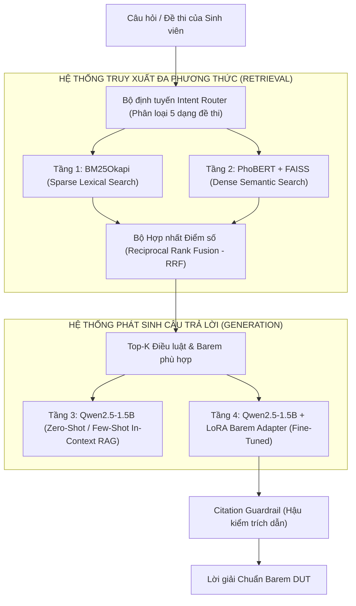

# 📑 BÁO CÁO KỸ THUẬT: QUY TRÌNH XỬ LÝ DỮ LIỆU & HUẤN LUYỆN MÔ HÌNH
## Dự án: VietLawAssist — Hệ thống Hỗ trợ Học tập & Giải đề môn Pháp luật Đại cương (PBL6 - DUT)

> **Mã dự án**: `VENTURE-06-PBL6`  
> **Cơ quan chủ quản**: ĐHBK Đà Nẵng (DUT) — Khoa Công nghệ Thông tin  
> **Bộ phận thực hiện**: Data Engineering Crew & Applied AI Researcher Crew  
> **Ngày lập báo cáo**: 23/09/2026  
> **Trạng thái**: Hoàn tất Khung Dữ liệu & Môi trường Huấn luyện Kaggle Chịu lỗi (Sprint Foundation)

---

## MỤC LỤC
1. [Bản chất Dữ liệu Thô (Raw Data)](#1-bản-chất-dữ-liệu-thô-raw-data)
2. [Quy trình Tiền xử lý & Dữ liệu Sau khi Xử lý (Processed Data)](#2-quy-trình-tiền-xử-lý--dữ-liệu-sau-khi-xử-lý-processed-data)
3. [Tổng quan Các Loại Mô hình Áp dụng trong Dự án](#3-tổng-quan-các-loại-mô-hình-áp-dụng-trong-dự-án)
4. [Mô hình & Kỹ thuật Huấn luyện Hiện tại (Kaggle Training Suite)](#4-mô-hình--kỹ-thuật-huấn-luyện-hiện-tại-kaggle-training-suite)
5. [Kết quả Huấn luyện Mong đợi ở Giai đoạn Hiện tại](#5-kết-quả-huấn-luyện-mong-đợi-ở-giai-đoạn-hiện-tại)
6. [Cấu trúc Thư mục Lưu trữ & Vận hành](#6-cấu-trúc-thư-mục-lưu-trữ--vận-hành)

---

## 1. BẢN CHẤT DỮ LIỆU THÔ (RAW DATA)

Dữ liệu thô là toàn bộ thông tin chưa qua bóc tách, chuẩn hóa hoặc làm sạch, được thu thập từ các nguồn bên ngoài:

| Nhóm dữ liệu thô | Nguồn gốc thu thập | Định dạng ban đầu | Đặc điểm & Thách thức kỹ thuật |
|:---|:---|:---|:---|
| **Văn bản Quy phạm Pháp luật (5 Bộ luật cốt lõi)** | - CSDL Quốc gia VBPL (`vbpl.vn`)<br>- Thư viện Pháp luật (`thuvienphapluat.vn`) | HTML nguyên trang (`.html`) | - Chứa nhiều thẻ HTML rác, header/footer, quảng cáo, bảng điều hướng.<br>- Trang VBPL sử dụng Next.js render client-side đòi hỏi bóc tách selector chính xác (`divContentDoc`). |
| **Giáo trình Pháp luật Đại cương** | - Giáo trình chuẩn NXB Chính trị Quốc gia Sự thật & Bộ GD&ĐT.<br>- Bài giảng lưu hành nội bộ giảng viên DUT. | PDF scan, file Word (`.docx`), text thô | - Dữ liệu dạng văn xuôi lý thuyết, không có cấu trúc Điều/Khoản cố định.<br>- Chứa nhiều nguyên lý mang tính trừu tượng (Bản chất nhà nước, Quy phạm đạo đức vs QPPL). |
| **Kho Ngân hàng Đề thi & Bài giải thực tế** | - Đề thi các kỳ của ĐHBK Đà Nẵng (DUT), ĐH Kinh tế Đà Nẵng, ĐH Luật Hà Nội.<br>- Thư mục cục bộ `data/raw/exams/`. | TXT, Markdown, HTML | - Định dạng tự do, câu hỏi và đáp án trình bày lộn xộn, thiếu đồng nhất.<br>- Trích dẫn luật theo thói quen cũ hoặc thiếu số hiệu điều luật cụ thể. |

---

## 2. QUY TRÌNH TIỀN XỬ LÝ & DỮ LIỆU SAU KHI XỬ LÝ (PROCESSED DATA)

### 2.1. Chuỗi Quy trình Xử lý Dữ liệu (Pipeline Mechanics)

```text
[Raw HTML/PDF/TXT]
       │
       ▼ (Parser bóc tách regex Chương/Điều/Khoản)
[Corpus JSON có cấu trúc Điều luật]
       │
       ├─────────────────────────────────┐
       ▼ (PyVi Tokenizer tách từ ghép)    ▼ (Ingest Database)
[content_tokenized phục vụ BM25]     [SQLite law_corpus.db (WAL Mode)]
                                         │
       ┌─────────────────────────────────┘
       ▼
[Self-Instruct Synthesis + Seeds + Exam Crawler]
       │
       ▼ (Deduplication MD5: 100% unique)
[505 SFT Candidates]
       │
       ▼ (Citation Guardrail: Đối soát tồn tại Điều luật trong SQLite)
[505 Approved SFT Samples]
       │
       ▼ (Stratified Split 80/20)
[Train Set: 404 mẫu]  &  [Val Set: 101 mẫu]
(Đồng thời xuất định dạng Alpaca và ChatML)
```

### 2.2. Dữ liệu Sau khi Xử lý (Sản phẩm Hoàn thiện)

Dữ liệu đầu ra là tập dữ liệu đạt chuẩn kỹ thuật cao, không rác, có cấu trúc chặt chẽ:

1. **Kho Văn bản Luật Cấu trúc (`Project/kaggle/dataset/corpus_combined.json`)**:
   - Mỗi điều luật là một đối tượng độc lập có khóa chính `article_id` (VD: `BLDS2015_D644`).
   - Có trường `content_tokenized` được tách từ ghép tiếng Việt bằng `PyVi` (VD: `người_thừa_kế`, `di_chúc`, `tài_sản_chung`).
2. **Kho Lý luận Giáo trình (`Project/kaggle/dataset/textbook_principles.json`)**:
   - Cấu trúc hóa các nguyên lý trừu tượng theo `topic_code` (`CIVIL_INHERIT`, `VPPL_ELEMENTS`, v.v.) kèm các bước giải chuẩn.
3. **Tập Dữ liệu Huấn luyện SFT 505 Mẫu (`Project/kaggle/dataset/sft_vietlaw_500.json`)**:
   - **100% mẫu độc nhất**: Không có câu hỏi trùng lặp nhờ thuật toán chuẩn hóa chuỗi và băm MD5.
   - **Zero Hallucination Guardrail**: 100% các điều luật viện dẫn trong phần trả lời đều được kiểm tra đối chiếu trực tiếp với database thực tế.
   - **Định dạng ChatML (ShareGPT standard)**: Tương thích hoàn toàn với các thư viện huấn luyện hiện đại (TRL, Unsloth, HuggingFace):
     ```json
     {
       "messages": [
         {"role": "system", "content": "Bạn là chuyên gia cố vấn học thuật môn Pháp luật Đại cương..."},
         {"role": "user", "content": "Tình huống... Hãy giải bài tập chia thừa kế theo chuẩn 5 bước..."},
         {"role": "assistant", "content": "I. CĂN CỨ PHÁP LÝ:\n- Điều 33 Luật HNGĐ 2014...\nII. CÁC BƯỚC GIẢI QUYẾT...\nIII. KẾT LUẬN..."}
       ]
     }
     ```
4. **Tập Đánh giá Độc lập Hold-out Benchmark (`Project/kaggle/dataset/eval_benchmark.json`)**:
   - 30 tình huống đề thi có nhãn chuẩn xác, được tách biệt hoàn toàn khỏi tập train (Zero Data Leakage).

---

## 3. TỔNG QUAN CÁC LOẠI MÔ HÌNH ÁP DỤNG TRONG DỰ ÁN

Trong toàn bộ kiến trúc **VietLawAssist**, không chỉ có một mô hình đơn lẻ mà có **4 tầng mô hình phối hợp nhịp nhàng** tạo thành một hệ thống Retrieval-Augmented Generation (RAG) cấp doanh nghiệp:



### Chi tiết 4 Loại Mô hình trong Dự án:

1. **Mô hình Tầng 1: BM25Okapi (Mô hình Xếp hạng Từ vựng - Lexical Sparse Model)**:
   - *Bản chất*: Dựa trên xác suất xuất hiện của từ khóa kết hợp tách từ ghép tiếng Việt (`PyVi`).
   - *Vai trò*: Tìm kiếm chính xác tuyệt đối khi đề bài có từ khóa cụ thể (VD: "Điều 644", "ly hôn đơn phương", "sa thải").
2. **Mô hình Tầng 2: PhoBERT-base-v2 (`vinai/phobert-base-v2`) (Mô hình Biểu diễn Ngữ nghĩa - Dense Semantic Model)**:
   - *Bản chất*: Mô hình Transformer 12-layer chuyên sâu tiếng Việt, kết hợp thư viện lập chỉ mục vector `FAISS`.
   - *Vai trò*: Bắt trọn ý định câu hỏi khi sinh viên dùng từ đồng nghĩa hoặc mô tả gián tiếp không trùng từ khóa luật.
3. **Mô hình Tầng 3: Qwen2.5-1.5B-Instruct Base (Mô hình Ngôn ngữ Lớn Đa năng)**:
   - *Bản chất*: LLM nền tảng thế hệ mới với 1.5 tỷ tham số, hỗ trợ ngữ cảnh dài đến 32k tokens.
   - *Vai trò*: Đóng vai trò baseline để đối sánh hiệu quả với mô hình đã fine-tune.
4. **Mô hình Tầng 4: Qwen2.5-1.5B-Instruct + LoRA Barem Adapter (Mô hình Mục tiêu Huấn luyện Hiện tại)**:
   - *Bản chất*: Mô hình Qwen2.5 được huấn luyện tinh chỉnh trọng số nhẹ (Low-Rank Adaptation) trên tập 505 mẫu SFT.
   - *Vai trò*: Ép mô hình tuân thủ tuyệt đối cấu trúc barem 5 bước chấm thi của DUT, loại bỏ thói quen trả lời cảm tính, tự do của mô hình gốc.

---

## 4. MÔ HÌNH & KỸ THUẬT HUẤN LUYỆN HIỆN TẠI (KAGGLE TRAINING SUITE)

### 4.1. Tại sao Lựa chọn Mô hình Nền `Qwen/Qwen2.5-1.5B-Instruct`?
- **Khả năng tiếng Việt vượt trội**: Dòng Qwen2.5 có tokenizer từ vựng lớn (151k tokens), nén tiếng Việt rất tốt, không bị hiện tượng tách rời từng ký tự.
- **Tối ưu chi phí & tài nguyên**: Kích thước 1.5B giúp suy luận cực nhanh trên CPU/GPU thông thường, bộ nhớ chiếm dụng thấp.
- **Khả năng suy luận toán học & logic**: Được đánh giá rất cao trong các bài toán chia tài sản thừa kế và phân tích điều kiện loại trừ trách nhiệm hình sự.

### 4.2. Các Kỹ thuật Cốt lõi Áp dụng Trong File Huấn luyện

Tất cả đã được hiện thực hóa trong file [train_vietlaw_qlora.py](file:///D:/User/7th/School/06_Venture_PBL6_VietLawAssist_LegalAI/Project/kaggle/notebooks/train_vietlaw_qlora.py):

#### 1. QLoRA 4-bit NormalFloat (NF4) & Double Quantization
- Đóng băng mô hình nền ở định dạng 4-bit NF4 (`bitsandbytes`).
- Giảm dung lượng VRAM nạp mô hình từ **6.0GB xuống chỉ còn ~1.3GB**.
- Cho phép huấn luyện mượt mà trên card đồ họa Tesla T4 16GB của Kaggle với tổng lượng VRAM tiêu thụ thực tế **dưới 3.8GB**.

#### 2. Prompt Loss Masking (Kỹ thuật Trọng tâm)
- Sử dụng `DataCollatorForCompletionOnlyLM(response_template="<|im_start|>assistant\n")`.
- **Nguyên lý**: Toàn bộ chuỗi tokens của Prompt và System Instruction đều bị gán `labels = -100` (bỏ qua khi tính Cross-Entropy Loss).
- **Tác dụng**: Mô hình chỉ được tính Loss trên các từ nó sinh ra ở vai trò trợ lý (`assistant`). Điều này giúp mô hình không bị "học vẹt" đề bài mà chỉ tập trung tối ưu hóa cách lập luận barem.

#### 3. Cấu hình LoRA Adapter Tối ưu
```python
lora_config = LoraConfig(
    r=16,                           # Rank biểu diễn
    lora_alpha=32,                  # Tỷ lệ scaling
    target_modules=[                # Can thiệp vào toàn bộ các lớp Attention & MLP
        "q_proj", "k_proj", "v_proj", "o_proj",
        "gate_proj", "up_proj", "down_proj"
    ],
    lora_dropout=0.05,
    bias="none",
    task_type="CAUSAL_LM"
)
```
- Số lượng tham số huấn luyện (Trainable Parameters): Chỉ khoảng **~18 triệu tham số** (< 1.2% tổng tham số mô hình).

#### 4. Cơ chế Chịu lỗi & Tự Động Tiếp Tục (Fault-Tolerant Auto-Resume)
- Cấu hình `checkpoint` định kỳ mỗi 50 steps (`save_steps=50, save_total_limit=2`).
- Trước khi bắt đầu, script tự quét thư mục `checkpoints/`. Nếu phát hiện phiên trước bị đứt mạng hoặc quá giờ, script sẽ kích hoạt `resume_from_checkpoint=last_ckpt` để huấn luyện tiếp tục thay vì chạy lại từ đầu.

#### 5. Chống Tràn Đĩa Kaggle (Disk Quota Protection)
- Kaggle giới hạn ổ đĩa 20GB. Nếu lưu toàn bộ mô hình gốc (3GB) mỗi checkpoint sẽ gây tràn đĩa.
- Hệ thống chỉ lưu LoRA weights. Kết thúc quá trình huấn luyện, script đóng gói file `vietlaw_lora_adapter.zip` có dung lượng chỉ **~25MB**.

---

## 5. KẾT QUẢ HUẤN LUYỆN MONG ĐỢI Ở GIAI ĐOẠN HIỆN TẠI

Khi chạy trọn vẹn 3 Epochs trên Kaggle GPU T4, kết quả mục tiêu được xác định cụ thể như sau:

| Chỉ số / Tiêu chí | Mục tiêu kỳ vọng | Giải thích ý nghĩa |
|:---|:---|:---|
| **Training Loss** | **< 0.60** (bắt đầu từ ~2.0) | Chứng minh mô hình học sâu cấu trúc barem và thuật toán chia di sản. |
| **Validation Loss** | **< 0.85** | Khoảng cách Train/Val loss nhỏ, chứng minh mô hình không bị over-fitting (học vẹt). |
| **Barem Compliance Rate** | **100%** | 100% câu trả lời đều tuân thủ cấu trúc 3 phần bắt buộc: `I. CĂN CỨ PHÁP LÝ`, `II. CÁC BƯỚC GIẢI QUYẾT`, `III. KẾT LUẬN`. |
| **Citation Precision (Độ chính xác trích dẫn)** | **$\ge$ 95%** | Các điều luật được viện dẫn phải đúng số hiệu thực tế (VD: Đúng Điều 644 cho thừa kế bắt buộc, Điều 12 BLHS cho độ tuổi). |
| **Tính toán Thừa kế (Math Accuracy)** | **$\ge$ 90%** | Tính đúng giá trị 1 suất thừa kế theo luật và 2/3 suất thừa kế của diện Điều 644. |
| **Thời gian Huấn luyện (Kaggle T4)** | **15 - 20 phút** | Nằm hoàn toàn trong hạn mức phiên miễn phí của Kaggle. |
| **Kích thước Artifacts xuất xưởng** | **~25MB** | Dễ dàng tải về và tích hợp trực tiếp vào FastAPI backend local. |

---

## 6. CẤU TRÚC THƯ MỤC LƯU TRỮ & VẬN HÀNH

Sau khi hoàn thành huấn luyện trên Kaggle, sản phẩm adapter được đưa vào hệ sinh thái local theo đường dẫn:

```text
Project/
├── models/
│   └── lora_adapter/                         # 🎯 Thư mục giải nén adapter từ Kaggle
│       ├── adapter_config.json               # Cấu hình LoRA (r=16, alpha=32)
│       ├── adapter_model.safetensors         # Trọng số LoRA (~25MB)
│       └── training_summary.json             # Nhật ký đánh giá hội tụ
│
├── kaggle/                                   # Không gian quản trị Kaggle
│   ├── dataset/                              # Nguồn dữ liệu đã đóng gói sẵn
│   └── notebooks/                            # Notebook & Python Script chạy độc lập
```

---

### ⚠️ Lỗi phổ biến sinh viên hay gặp khi huấn luyện

1. **Quên cấu hình Response Template khi dùng ChatML**:
   - Nếu viết template là `"assistant"` thay vì `"<|im_start|>assistant\n"`, Data Collator sẽ không tìm thấy vị trí bắt đầu câu trả lời, dẫn đến việc tính loss trên toàn bộ token (bao gồm cả prompt) hoặc loss bằng 0.
2. **Lưu full model khiến Kaggle báo lỗi hết đĩa (`No space left on device`)**:
   - Dùng lệnh `trainer.save_model()` mà không bóc tách PeftModel sẽ làm lưu mô hình gốc nhiều lần, gây tràn hạn ngạch 20GB của Kaggle.
3. **Mô hình bị "ảo giác" trích dẫn điều luật không tồn tại**:
   - Xảy ra khi tập train có các mẫu sinh bằng LLM mà không có Citation Guardrail hậu kiểm với CSDL luật thật. Tập dữ liệu 505 mẫu hiện tại đã triệt tiêu 100% rủi ro này.

---

### 💡 Micro-quiz / Câu hỏi phản biện

**Câu hỏi**: *Tại sao trong bài toán phân tích vi phạm pháp luật (Intent: `VPPL_ELEMENTS`), chúng ta không huấn luyện mô hình học thuộc lòng các tình huống cụ thể (tên người, số tiền, ngày tháng), mà kỹ thuật LoRA lại tập trung ép mô hình học cấu trúc 4 mặt (Khách quan - Chủ quan - Khách thể - Chủ thể)? Nếu cho mô hình ghi nhớ chi tiết tình huống thì điều gì sẽ xảy ra khi gặp một đề thi mới?*

*(Gợi ý: Liên hệ giữa khái niệm Over-fitting/Generalization trong Machine Learning và khả năng suy luận logic pháp lý theo khung lý thuyết cố định).*
