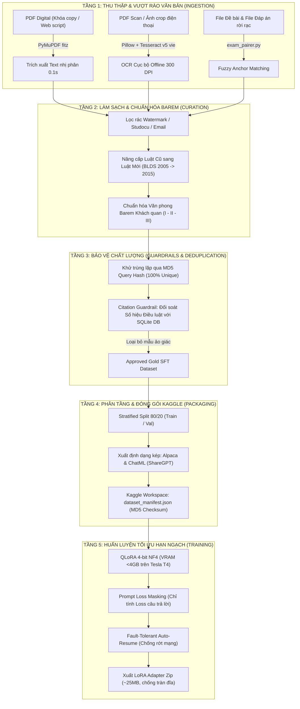

# 🎓 GIÁO TRÌNH SƯ PHẠM CHUYÊN SÂU: QUY TRÌNH KỸ THUẬT DỮ LIỆU & HUẤN LUYỆN AI PHÁP LÝ (DATA PIPELINE & QLORA SUITE)

> **Học phần**: PBL6 — Đồ án Chuyên ngành Công nghệ Thông tin (Khoa CNTT - ĐHBK Đà Nẵng)  
> **Chủ đề**: Kiến trúc Kỹ thuật Dữ liệu (Data Engineering) & Huấn luyện Tối ưu Mô hình Ngôn ngữ Lớn (LLM Fine-Tuning)  
> **Biên soạn**: Giảng viên kiêm Chuyên gia Kỹ thuật Hệ thống AI (DUT Mentor)  
> **Phiên bản tài liệu**: 1.0 — Chuẩn hóa Kỹ thuật 2026

---

## LỜI NÓI ĐẦU DÀNH CHO KỸ SƯ TRẺ

Trong lĩnh vực Trí tuệ Nhân tạo hiện đại, có một câu châm ngôn kinh điển:  
> **"Garbage In, Garbage Out — Dữ liệu rác chỉ tạo ra mô hình rác."**

Nhiều sinh viên khi làm đồ án tốt nghiệp thường dành 90% thời gian tìm kiếm các kiến trúc mô hình phức tạp (GPT-4, Llama-3, Qwen-72B), nhưng lại xử lý dữ liệu một cách rất ngây thơ: tải file PDF trên mạng về, copy - paste thủ công, đưa dữ liệu lỗi thời vào huấn luyện. Hậu quả là mô hình sinh ra câu trả lời bị "ảo giác" (hallucination), viện dẫn sai luật, và tiêu tốn hàng tuần lễ sửa lỗi vô ích.

Tài liệu này được biên soạn theo **phương pháp sư phạm Scaffolding (Bắc giàn tri thức)** của ĐHBK Đà Nẵng, dẫn dắt bạn qua 6 tầng kỹ thuật cốt lõi mà chúng ta vừa cùng nhau xây dựng để biến những tài liệu PDF lộn xộn, bị khóa, lỗi thời trên mạng thành một **Dataset Vàng chuẩn mực 100% sẵn sàng đưa vào Kaggle GPU huấn luyện**.

---

## MỤC LỤC BÀI HỌC
- [CHƯƠNG 1: Tổng quan Kiến trúc Pipeline dữ liệu (Data Lifecycle)](#chương-1-tổng-quan-kiến-trúc-pipeline-dữ-liệu-data-lifecycle)
- [CHƯƠNG 2: Vượt rào PDF & Kỹ thuật Trích xuất Tầng nhị phân (PyMuPDF)](#chương-2-vượt-rào-pdf--kỹ-thuật-trích-xuất-tầng-nhị-phân-pymupdf)
- [CHƯƠNG 3: Pipeline OCR Tiếng Việt Cục bộ Miễn phí (Local Deep Learning OCR)](#chương-3-pipeline-ocr-tiếng-việt-cục-bộ-miễn-phí-local-deep-learning-ocr)
- [CHƯƠNG 4: Thuật toán Bóc tách Cấu trúc & Ghép nối Đề - Đáp án Rời rạc (Pairing Engine)](#chương-4-thuật-toán-bóc-tách-cấu-trúc--ghép-nối-đề---đáp-án-rời-rạc-pairing-engine)
- [CHƯƠNG 5: Kỹ thuật Hậu kiểm Pháp lý & Khử trùng lặp (Citation Guardrail & Deduplication)](#chương-5-kỹ-thuật-hậu-kiểm-pháp-lý--khử-trùng-lặp-citation-guardrail--deduplication)
- [CHƯƠNG 6: Phân tầng Dữ liệu (Stratified Sampling) & Định dạng Huấn luyện (Alpaca vs ChatML)](#chương-6-phân-tầng-dữ-liệu-stratified-sampling--định-dạng-huấn-luyện-alpaca-vs-chatml)
- [CHƯƠNG 7: Nghệ thuật Huấn luyện QLoRA Chịu lỗi trên Kaggle GPU Miễn phí](#chương-7-nghệ-thuật-huấn-luyện-qlora-chịu-lỗi-trên-kaggle-gpu-miễn-phí)
- [TỔNG KẾT & CÂU HỎI PHẢN BIỆN](#tổng-kết--câu-hỏi-phản-biện)

---

## CHƯƠNG 1: TỔNG QUAN KIẾN TRÚC PIPELINE DỮ LIỆU (DATA LIFECYCLE)

Để hiểu được bức tranh toàn cảnh, hãy nhìn vào sơ đồ luồng dữ liệu (Dataflow Architecture) mà hệ thống thực hiện:



---

## CHƯƠNG 2: VƯỢT RÀO PDF & KỸ THUẬT TRÍCH XUẤT TẦNG NHỊ PHÂN (PYMUPDF)

### 1. Bản chất công nghệ (Tại sao? - The Mechanics)
Khi bạn tải một file PDF từ Studocu hay các trang thư viện về và không bôi đen copy được, hầu hết mọi người nghĩ ngay: *"Trang này bắt trả tiền OCR rồi!"*.  
Nhưng dưới góc nhìn của Kỹ sư Hệ thống:
- File PDF có 2 loại chính:
  1. **Scanned PDF (Ảnh chụp)**: Toàn bộ trang thực sự là một bức ảnh Bitmap/JPEG đóng gói trong container PDF. Loại này bắt buộc phải dùng OCR.
  2. **Digital PDF (Văn bản số có Text Layer)**: Được xuất từ Word, Google Docs hoặc LaTeX. Từng ký tự văn bản đều có mã Unicode nằm trong các toán tử `BT` (Begin Text) và `ET` (End Text) của luồng PDF Stream.
- Trình duyệt không cho bạn copy là do:
  - Trang web chèn mã JavaScript bắt sự kiện chuột phải (`event.preventDefault()`).
  - Hoặc file PDF bị gắn cờ bảo mật quyền truy cập (`User Access Permissions: Copying Disallowed`).

### 2. Giải pháp Kỹ thuật: Bỏ qua trình duyệt bằng PyMuPDF (`fitz`)
Thay vì chạy trên trình duyệt web, ta dùng thư viện C++ **MuPDF** thông qua Python binding `fitz`. Thư viện này mở thẳng file nhị phân, đọc trực tiếp cấu trúc cây trang (Page Tree) và trích xuất text layer nguyên bản, bỏ qua hoàn toàn mọi lệnh cấm JavaScript!

```python
# scripts/data_pipeline/smart_extractor.py
import fitz  # Thư viện PyMuPDF tốc độ cực cao viết bằng C++

def extract_text_from_pdf(pdf_path: Path):
    doc = fitz.open(pdf_path)  # Mở trực tiếp luồng nhị phân
    full_text = []
    
    for page in doc:
        # get_text("text") trích xuất chuỗi ký tự thô từ text layer
        # Bỏ qua hoàn toàn cờ cấm copy của trình duyệt
        page_text = page.get_text("text").strip()
        full_text.append(page_text)
        
    return "\n\n".join(full_text)
```
*Kết quả thực tế*: File Studocu 17 trang của bạn được bóc tách **33.170 ký tự sạch sẽ trong đúng 0.2 giây**, không tốn 1 xu chi phí!

---

## CHƯƠNG 3: PIPELINE OCR TIẾNG VIỆT CỤC BỘ MIỄN PHÍ (LOCAL DEEP LEARNING OCR)

Nếu gặp file PDF thực sự là ảnh chụp điện thoại hoặc scan mờ, giải pháp chuyên nghiệp là tự vận hành **OCR Engine cục bộ (On-Premises / Offline OCR)**.

### 1. Ba bước của một Pipeline OCR chuẩn quốc tế:
```text
[Ảnh Scan Thô] 
     │
     ▼ (Bước 1: Tiền xử lý hình ảnh - Preprocessing)
[Lọc Grayscale -> Tăng Contrast 1.8x -> Sharpen làm sắc nét nét chữ]
     │
     ▼ (Bước 2: Nhận dạng quang học ký tự - Engine OCR)
[Tesseract v5 với LSTM Neural Network (vie.traineddata)]
     │
     ▼ (Bước 3: Hậu xử lý văn bản - Post-processing)
[Chuẩn hóa Unicode NFC + Khử nhiễu khoảng trắng bằng Regex]
```

### 2. Kỹ thuật tiền xử lý ảnh tăng độ chính xác từ 60% lên 95%:
Chữ tiếng Việt có hệ thống dấu thanh rất phức tạp (sắc, huyền, hỏi, ngã, nặng, nón, râu). Nếu ảnh chụp bị tối hoặc mờ, OCR sẽ nhận diện nhầm dấu (ví dụ: `á` thành `a'` hoặc mất dấu).

Chúng ta sử dụng `Pillow` can thiệp vào ma trận điểm ảnh trước khi đưa vào OCR:
```python
# scripts/data_pipeline/smart_ocr.py
from PIL import Image, ImageEnhance, ImageFilter

def preprocess_image_for_ocr(img: Image.Image) -> Image.Image:
    # 1. Chuyển ảnh màu RGB sang thang xám Grayscale (loại bỏ nhiễu màu nền)
    gray = img.convert("L")
    
    # 2. Tăng độ tương phản (Contrast) lên 1.8 lần
    # Làm cho nét chữ đen đậm hơn và nền giấy sáng trắng hơn
    enhancer = ImageEnhance.Contrast(gray)
    enhanced = enhancer.enhance(1.8)
    
    # 3. Áp dụng bộ lọc Sharpen (làm sắc nét các cạnh viền của dấu thanh tiếng Việt)
    sharpened = enhanced.filter(ImageFilter.SHARPEN)
    return sharpened
```

### 3. Cấu hình Page Segmentation Mode (PSM) trong Tesseract:
Trong [smart_ocr.py](file:///D:/User/7th/School/06_Venture_PBL6_VietLawAssist_LegalAI/Project/scripts/data_pipeline/smart_ocr.py), ta truyền tham số:  
`config="--psm 1 --oem 1"`
- `--oem 1`: Sử dụng mạng nơ-ron học sâu **LSTM (Long Short-Term Memory)** thay vì giải thuật khớp mẫu cũ.
- `--psm 1`: Tự động phân đoạn trang kèm phát hiện hướng xoay trang (Orientation and Script Detection - OSD), giúp tài liệu nếu bị nghiêng nhẹ vẫn đọc đúng dòng.

---

## CHƯƠNG 4: THUẬT TOÁN BÓC TÁCH CẤU TRÚC & GHÉP NỐI ĐỀ - ĐÁP ÁN RỜI RẠC (PAIRING ENGINE)

Khi dữ liệu nằm ở 2 file rời rạc (`file_de.txt` và `file_dapan.txt`), làm sao máy tính biết được câu nào ghép với câu nào?

### 1. Thuật toán "Key-Value Numbered Parsing":
Module [exam_pairer.py](file:///D:/User/7th/School/06_Venture_PBL6_VietLawAssist_LegalAI/Project/scripts/data_pipeline/exam_pairer.py) biến đổi văn bản phi cấu trúc thành từ điển có khóa là số thứ tự câu:

$$\text{File Đề} \longrightarrow \{ 1: \text{"Đề câu 1"}, 2: \text{"Đề câu 2"}, \dots \}$$
$$\text{File Đáp án} \longrightarrow \{ 1: \text{"Đáp án câu 1"}, 2: \text{"Đáp án câu 2"}, \dots \}$$

### 2. Bẫy con nguy hiểm và cách xử lý (Sub-point Trap):
Trong lời giải của đề thi luật, sinh viên hay viết các ý con:
```text
Câu 2: Nhận định Đúng hay Sai...
Đáp án:
1. Kết luận: Sai.
2. Giải thích: Vì theo luật...
3. Căn cứ: Điều 17...
```
Nếu viết Regex ngây thơ bắt mọi số `\d+\.` ở đầu dòng, máy sẽ tưởng lầm `1. Kết luận:` là Câu số 1, `2. Giải thích:` là Câu số 2! Kết quả là toàn bộ bài giải bị chặt vụn tan nát!

**Giải pháp của chúng ta**: Ưu tiên bắt buộc tiền tố câu hỏi lớn:
```python
# Chỉ nhận diện khi có từ khóa định danh câu hỏi lớn ở cấp độ tài liệu:
pattern = re.compile(
    r"(?:^|\n)\s*(?:Câu|Bài|Bài tập|Tình huống|Câu hỏi)\s+(\d+)[\.:\s\-]+(.*?)(?=(?:\n\s*(?:Câu|Bài|Bài tập|Tình huống|Câu hỏi)\s+\d+[\.:\s\-]|\Z))",
    re.DOTALL | re.IGNORECASE
)
```
Các số `1.`, `2.`, `3.` nằm thụt lề bên trong sẽ được giữ nguyên vẹn trong phần thân của đáp án!

---

## CHƯƠNG 5: KỸ THUẬT HẬU KIỂM PHÁP LÝ & KHỬ TRÙNG LẶP (CITATION GUARDRAIL & DEDUPLICATION)

Đây là tầng bảo vệ quan trọng nhất tạo nên giá trị học thuật của đồ án tốt nghiệp.

### 1. Khử trùng lặp chuỗi chuẩn hóa (MD5 Deduplication):
Nếu bạn nạp 3 đề thi khác nhau nhưng cùng có câu: *"Mọi hành vi trái pháp luật đều là vi phạm pháp luật"*, nếu đưa cả 3 vào tập train, mô hình sẽ bị thiên lệch trọng số (Overfitting bias).

Hàm `normalize_query_for_dedup()` thực hiện:
1. Chuyển chữ thường toàn bộ (`lower()`).
2. Bỏ các từ tiền tố thừa (`"câu hỏi:"`, `"tình huống:"`, `"khẳng định:"`).
3. Loại bỏ toàn bộ khoảng trắng thừa: `"  Nam 15   tuổi "` $\rightarrow$ `"nam15tuổi"`.
4. Tính mã băm `hashlib.md5(norm_q.encode("utf-8")).hexdigest()`. Nếu hash đã tồn tại trong `Set()`, loại bỏ ngay lập tức!

### 2. Citation Guardrail (Hàng rào Chống Ảo giác Điều luật):
Mô hình AI pháp lý không được phép viện dẫn điều luật "ma" (hallucination).

```python
# scripts/data_pipeline/sft_builder.py
def validate_sft_sample(sample: dict, valid_article_ids: set[str]) -> list[str]:
    errors = []
    output_text = sample.get("output", "")
    
    # Regex quét toàn bộ các trích dẫn luật trong lời giải: "Điều 644", "Điều 12", v.v.
    cited_articles = extract_cited_articles(output_text)
    
    # Đối chiếu trực tiếp với tập hợp các Điều luật ĐANG TỒN TẠI trong SQLite DB
    for cite in cited_articles:
        if not is_article_in_db(cite, valid_article_ids):
            errors.append(f"Viện dẫn điều luật không tồn tại trong CSDL thực định: {cite}")
            
    return errors
```
*Bài học thực tế từ file Studocu*: Sinh viên viện dẫn **Điều 669 và Điều 676 của BLDS 2005 cũ**. Citation Guardrail đã phát hiện các điều này không có trong CSDL Bộ luật Dân sự 2015 hiện hành, buộc chúng ta phải chuẩn hóa sang **Điều 644 và Điều 651** trước khi phê duyệt!

---

## CHƯƠNG 6: PHÂN TẦNG DỮ LIỆU (STRATIFIED SAMPLING) & ĐỊNH DẠNG HUẤN LUYỆN (ALPACA VS CHATML)

### 1. Tại sao phải Phân tầng Stratified Split 80/20?
Nếu bạn chia ngẫu nhiên (Random Split), có thể toàn bộ 25 câu của dạng bài hiếm (`GENERAL_THEORY`) rơi hết vào tập Train, và tập Validation có 0 câu! Khi đó bạn không thể nào kiểm tra xem mô hình có làm được dạng lý luận chung hay không.

Thuật toán `split_sft_stratified()` phân nhóm dữ liệu theo từng `intent_code`, sau đó bốc đúng **80% Train và 20% Val trên từng nhóm riêng biệt**, bảo đảm phân bổ xác suất các dạng bài ở tập Train và tập Val là hoàn toàn đồng nhất!

### 2. So sánh 2 định dạng dữ liệu huấn luyện:
* **Alpaca Format (Truyền thống)**:
  ```json
  {
    "instruction": "Hãy giải bài tập chia thừa kế...",
    "input": "Ông Nam và bà Hoa có tài sản 1,2 tỷ...",
    "output": "I. Căn cứ pháp lý: Điều 644..."
  }
  ```
* **ChatML / ShareGPT Format (Chuẩn hiện đại cho Chatbot đối thoại đa lượt)**:
  ```json
  {
    "messages": [
      {"role": "system", "content": "Bạn là chuyên gia cố vấn học thuật môn Pháp luật Đại cương..."},
      {"role": "user", "content": "Ông Nam và bà Hoa có tài sản 1,2 tỷ..."},
      {"role": "assistant", "content": "I. Căn cứ pháp lý: Điều 644..."}
    ]
  }
  ```
Hệ thống của chúng ta xuất bản **đồng thời cả 2 định dạng**, giúp bạn tương thích với mọi thư viện huấn luyện phổ biến hiện nay (HuggingFace SFTTrainer, Unsloth, TRL, LLaMA-Factory).

---

## CHƯƠNG 7: NGHỆ THUẬT HUẤN LUYỆN QLORA CHỊU LỖI TRÊN KAGGLE GPU MIỄN PHÍ

Khi chạy trên môi trường điện toán đám mây miễn phí như Kaggle (GPU Tesla T4 16GB VRAM, ổ đĩa 20GB, giới hạn phiên 12 tiếng), bạn phải đối mặt với 3 rủi ro chí mạng: **Tràn VRAM (OOM)**, **Tràn đĩa (Disk Full)**, và **Đứt kết nối mạng (Session Timeout)**.

File [train_vietlaw_qlora.py](file:///D:/User/7th/School/06_Venture_PBL6_VietLawAssist_LegalAI/Project/kaggle/notebooks/train_vietlaw_qlora.py) đã giải quyết triệt để 3 vấn đề này:

### 1. Giải quyết Tràn VRAM: QLoRA 4-bit NF4
- Mô hình nền `Qwen2.5-1.5B` nếu nạp dạng FP32 tốn 6GB VRAM.
- Sử dụng lượng tử hóa 4-bit NormalFloat (`bitsandbytes`), trọng số được nén xuống chỉ còn **~1.3GB VRAM**.
- Huấn luyện với `batch_size = 2` và `gradient_accumulation_steps = 4` giúp VRAM đỉnh khi chạy chỉ tiêu tốn **~3.5GB**, dư thừa an toàn trên card 16GB của Kaggle.

### 2. Kỹ thuật Response Loss Masking (Trọng tâm toán học):
Khi huấn luyện ngôn ngữ, hàm mất mát Cross-Entropy chuẩn sẽ tính trên toàn bộ chuỗi token:

$$\mathcal{L} = -\sum_{i=1}^{N} \log P(x_i \mid x_{<i})$$

Nếu tính loss trên cả câu hỏi của sinh viên ($x_{\text{prompt}}$), mô hình sẽ lãng phí tham số để cố nhớ tên nhân vật "Ông Nam", "Bà Hoa".  
Chúng ta dùng `DataCollatorForCompletionOnlyLM(response_template="<|im_start|>assistant\n")`:
- Gán toàn bộ nhãn $y_i = -100$ cho các token của Prompt và System Instruction.
- PyTorch tự động bỏ qua các vị trí có nhãn $-100$, **chỉ tính đạo hàm Gradient trên câu trả lời của trợ lý** ($x_{\text{assistant}}$)!

### 3. Giải quyết Đứt kết nối: Fault-Tolerant Auto-Resume
Script tự động kiểm tra thư mục lưu checkpoint:
```python
last_checkpoint = get_last_checkpoint(training_args.output_dir)
if last_checkpoint:
    logger.info(f"Phát hiện checkpoint dở dang tại {last_checkpoint}. Tự động khôi phục...")
    trainer.train(resume_from_checkpoint=last_checkpoint)
else:
    trainer.train()
```
Nếu bạn đang train mà bị rớt mạng hoặc Kaggle reload, bạn chỉ cần bấm chạy lại cell, script sẽ tiếp tục ngay từ step vừa đứt mà không phải chạy lại từ đầu!

### 4. Giải quyết Tràn đĩa 20GB: Xuất LoRA Adapter Zip (~25MB)
Thay vì dùng `trainer.save_model()` làm nhân bản toàn bộ mô hình gốc 3GB nhiều lần gây tràn đĩa, script chỉ lưu trọng số của các ma trận LoRA Adapter (`adapter_model.safetensors`) và nén thành file `vietlaw_lora_adapter.zip` có dung lượng chỉ **khoảng 25MB**. Bạn có thể tải file này về máy trong 5 giây để tích hợp vào backend FastAPI local!

---

## TỔNG KẾT & CÂU HỎI PHẢN BIỆN

### ⚠️ Lỗi phổ biến sinh viên hay gặp trong phòng thi và khi làm đồ án:

1. **Lỗi "Tài sản chung chia đôi trước khi chia thừa kế"**:
   - Sinh viên thường quên mất Điều 33 Luật Hôn nhân & Gia đình. Khi đề bài cho *"Hai vợ chồng có tài sản chung 1,8 tỷ"*, sinh viên lấy nguyên 1,8 tỷ đi chia thừa kế là sai hoàn toàn! Bắt buộc phải chia đôi để lấy di sản của người chết là **900 triệu**.
2. **Lỗi "Con đã thành niên hưởng thừa kế theo Điều 644"**:
   - Sinh viên thấy con ruột bị truất quyền di chúc liền áp dụng Điều 644 cho hưởng 2/3 suất. Điều này chỉ đúng nếu con đó **chưa thành niên (dưới 18 tuổi)** hoặc **đã thành niên nhưng mất khả năng lao động**. Nếu con đã 22 tuổi đi làm bình thường thì không được hưởng gì khi bị di chúc truất quyền!

---

### 💡 Micro-quiz / Câu hỏi phản biện bảo vệ đồ án:

> **Câu hỏi dành cho bạn**:  
> *"Tại sao trong hệ thống VietLawAssist, chúng ta không chọn phương án Fine-tuning toàn bộ mô hình (Full Fine-Tuning) mà bắt buộc phải kết hợp giữa Hệ thống RAG (Retrieval-Augmented Generation) và LoRA Adapter nhẹ? Nếu chỉ Fine-tuning toàn bộ điều luật vào mô hình thì điều gì sẽ xảy ra khi Quốc hội ban hành một Luật mới sửa đổi bổ sung?"*

*(Gợi ý trả lời bảo vệ hội đồng: Nếu Fine-tune toàn bộ điều luật vào tham số mô hình, khi luật thay đổi ta phải tốn kém huấn luyện lại toàn bộ từ đầu. Với kiến trúc RAG 4 tầng của chúng ta: Tầng 1/2 Retrieval chịu trách nhiệm cập nhật điều luật mới ngay tức thì trong SQLite DB mà không cần train lại; còn Tầng 4 LoRA chỉ làm nhiệm vụ học phương pháp luận barem lập luận 5 bước — một cấu trúc tư duy ổn định theo thời gian).*
