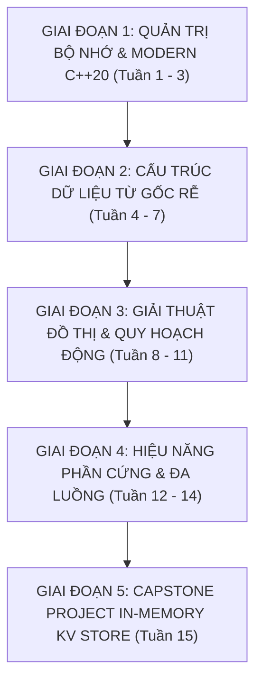

# 🧭 KHUNG GIÁO TRÌNH 15 TUẦN CHUẨN: C++20, THUẬT TOÁN & LẬP TRÌNH HỆ THỐNG
## AlgoCore Systems Corp — Mã môn học: `ALGO-DUT`

> **Đơn vị bảo trợ học thuật:** Khoa Công nghệ Thông tin, Đại học Bách khoa – ĐH Đà Nẵng (DUT)  
> **Tài liệu tham chiếu Tier A+:** CLRS (4th ed, 2022), The Algorithm Design Manual (Skiena 2020), A Tour of C++ (Stroustrup C++20), CS:APP (Bryant & O'Hallaron)  
> **Phương pháp sư phạm:** 4 Tầng Sư Phạm (Lý thuyết kinh điển $\rightarrow$ Cú pháp C++20 hiện đại $\rightarrow$ Bẫy lỗi thời $\rightarrow$ Thực hành Lab TDD)

---

## 📅 PHÂN KỲ LỘ TRÌNH 15 TUẦN

---

### 🔷 GIAI ĐOẠN 1: QUẢN TRỊ BỘ NHỚ & MODERN C++20 (TUẦN 1 - 3)

#### Tuần 1: Kiến Trúc Bộ Nhớ Máy Tính & Con Trỏ (Memory Layout & Pointer Mechanics)
- **Tầng 1 (Lý thuyết kinh điển - CS:APP Ch.1 & 3)**:
  - Cấu trúc không gian địa chỉ tiến trình (Virtual Address Space): Text, Data, BSS, Heap, Stack.
  - Bản chất biến con trỏ: Kích thước địa chỉ (64-bit = 8 bytes), toán tử dereference `*`, toán tử lấy địa chỉ `&`.
  - Con trỏ số học (Pointer Arithmetic), Mảng 1 chiều và Mối liên hệ với con trỏ.
- **Tầng 2 (Cú pháp hiện đại C++20)**:
  - Sử dụng `std::byte`, `std::span` và `std::string_view` thay vì con trỏ chuỗi kiểu C (`char*`).
  - Phân bổ bộ nhớ động an toàn và kiểm tra cấp phát thất bại.
- **Tầng 3 (⚠️ Bẫy lỗi thời & Anti-patterns)**:
  - Cảnh báo: Sử dụng `malloc`/`free` trong C++ làm bỏ qua Constructor và Destructor.
  - Cảnh báo: Trả về địa chỉ của một biến cục bộ trên Stack (Dangling Pointer trap).
- **Tầng 4 (Lab Thực hành)**:
  - `Lab 1.1`: Viết chương trình in địa chỉ bộ nhớ và kích thước của các biến trên Stack vs Heap để vẽ sơ đồ bộ nhớ tiến trình.
  - Bật cờ AddressSanitizer: `g++ -std=c++20 -fsanitize=address -g lab1.cpp`.

#### Tuần 2: Quản Lý Vòng Đời Tài Nguyên (RAII) & Smart Pointers
- **Tầng 1 (Lý thuyết kinh điển - Stroustrup)**:
  - Triết lý RAII (Resource Acquisition Is Initialization): Ràng buộc vòng đời của tài nguyên với vòng đời của đối tượng.
  - Quyền sở hữu (Ownership semantics): Quyền sở hữu duy nhất (Exclusive) vs Chia sẻ (Shared).
- **Tầng 2 (Cú pháp hiện đại C++20)**:
  - `std::unique_ptr<T>` với `std::make_unique<T>()`.
  - `std::shared_ptr<T>` với `std::make_shared<T>()` và cơ chế Reference Counting.
  - `std::weak_ptr<T>` để phá vỡ chu trình tham chiếu vòng (Circular Reference).
- **Tầng 3 (⚠️ Bẫy lỗi thời)**:
  - Không bao giờ dùng `std::auto_ptr` (đã bị xóa bỏ khỏi chuẩn C++17).
  - Không khởi tạo `std::shared_ptr` bằng con trỏ thô 2 lần gây ra Double Free.
- **Tầng 4 (Lab Thực hành)**:
  - `Lab 1.2`: Cài đặt một lớp quản lý File Descriptor tự động đóng file khi ra khỏi scope bằng RAII và Smart Pointers.

#### Tuần 3: Move Semantics, Rvalue References & Rule of 5
- **Tầng 1 (Lý thuyết)**:
  - Lvalue (đối tượng có tên, có địa chỉ) vs Rvalue (giá trị tạm thời).
  - Chi phí sao chép dữ liệu sâu (Deep Copy) và giải pháp chuyển giao quyền sở hữu (Move).
- **Tầng 2 (Cú pháp C++20)**:
  - Rvalue References (`T&&`), `std::move` và `std::forward`.
  - Quy tắc 5 (Rule of 5): Destructor, Copy Constructor, Copy Assignment, Move Constructor, Move Assignment.
- **Tầng 3 (⚠️ Bẫy lỗi thời)**:
  - Sử dụng đối tượng sau khi đã `std::move` (Use-after-move bug).
- **Tầng 4 (Lab Thực hành)**:
  - `Lab 1.3`: Xây dựng lớp `DynamicBuffer` hỗ trợ Move Semantics hoàn chỉnh, đo đạc tốc độ so sánh giữa Deep Copy vs Move khi truyền $10^7$ phần tử.

---

### 🔷 GIAI ĐOẠN 2: CẤU TRÚC DỮ LIỆU TỰ CÀI ĐẶT TỪ GỐC RỄ (TUẦN 4 - 7)

#### Tuần 4: Mảng Động & Danh Sách Liên Kết An Toàn Bộ Nhớ
- **Tầng 1 (CLRS Ch.10)**:
  - Dynamic Array: Chiến lược tái cấp phát bộ nhớ (Geometric resizing $\times 2$), phân tích chi phí khấu hao (Amortized Analysis $O(1)$).
  - Singly Linked List vs Doubly Linked List: Thêm, xóa nút tại đầu/cuối/vị trí bất kỳ.
- **Tầng 2 (C++20)**:
  - Tự cài đặt `CustomVector<T>` template với bộ cấp phát (Custom Allocator cơ bản).
  - Cài đặt `DoublyLinkedList<T>` sử dụng `std::unique_ptr` hoặc raw pointers có destructor giải phóng triệt để.
- **Tầng 4 (Lab Thực hành)**:
  - `Lab 2.1`: Viết bộ kiểm thử tự động Catch2 chứng minh `CustomVector` không rò rỉ bộ nhớ qua 100,000 lần thêm xóa.

#### Tuần 5: Hàng Đợi (Queue), Ngăn Xếp (Stack) & Monotonic Stack
- **Tầng 1 (CLRS Ch.10 & Skiena Ch.3)**:
  - Ngăn xếp (LIFO), Hàng đợi (FIFO), Hàng đợi vòng (Circular Queue/Buffer).
  - Kỹ thuật Monotonic Stack & Monotonic Queue: Tối ưu bài toán cửa sổ trượt (Sliding Window Maximum) từ $O(N \cdot K)$ xuống $O(N)$.
- **Tầng 4 (Lab Thực hành)**:
  - `Lab 2.2 (Production Log Engine)`: Viết CLI tool `log-analyzer` đọc stream HTTP access logs của Nginx/Envoy, tính toán Sliding Window Maximum của độ trễ (Latency) trong cửa sổ trượt 60 giây sử dụng Monotonic Deque với độ phức tạp thời gian $O(N)$ và bộ nhớ $O(K)$. Tích hợp cờ cảnh báo P99 Alerting khi latency vượt ngưỡng SLA 500ms.

#### Tuần 6: Cây Nhị Phân Tìm Kiếm (BST) & Hàng Đợi Ưu Tiên (Binary Heap)
- **Tầng 1 (CLRS Ch.6 & 12)**:
  - Min Heap & Max Heap: Thuật toán `Heapify` ($O(N)$) vs Thêm từng phần tử ($O(N \log N)$).
  - Binary Search Tree: Tính chất BST, Duyệt In-order, Pre-order, Post-order, Xóa nút có 2 con.
- **Tầng 4 (Lab Thực hành)**:
  - `Lab 2.3`: Tự xây dựng `PriorityQueue<T, Compare>` tương thích giao diện `std::priority_queue`.

#### Tuần 7: Cây Cân Bằng (AVL / Red-Black Tree) & Trie (Cây Tiền Tố)
- **Tầng 1 (CLRS Ch.13 & Skiena Ch.3)**:
  - Vấn đề suy biến của BST thành danh sách liên kết $O(N)$.
  - Phép xoay cây (Left Rotate, Right Rotate) và điều kiện cân bằng cây AVL/Red-Black Tree.
  - Cấu trúc Trie: Tìm kiếm từ khóa theo tiền tố trong thời gian $O(L)$ với $L$ là độ dài từ.
  - **🔎 Bối cảnh Kỹ thuật Thực tế & Nguyên nhân Lựa chọn (Why?)**:
    - AVL Tree (1962, Adelson-Velsky & Landis) cân bằng nghiêm ngặt hơn (hệ số chênh lệch chiều cao $\le 1$, chiều cao tối đa $\approx 1.44 \log_2 N$), do đó tìm kiếm nhanh hơn một chút, nhưng đòi hỏi nhiều phép xoay khi chèn/xóa.
    - Red-Black Tree (1978, Rudolf Bayer) giảm thiểu chi phí tái cân bằng (chi phí xoay khấu hao $O(1)$ mỗi thao tác), đánh đổi bằng chiều cao lỏng hơn ($\le 2 \log_2(N+1)$).
    - Các thư viện chuẩn như `std::map`, `std::set` trong C++ STL và Java `TreeMap` đều chọn Red-Black Tree vì trong thực tế tải ghi/xóa thường cao tương đương tải đọc.
- **Tầng 4 (Lab Thực hành)**:
  - `Lab 2.4`: Cài đặt Trie Engine hỗ trợ chức năng gợi ý tìm kiếm (Autocomplete) và tìm kiếm ký tự đại diện (Wildcard search).

---

### 🔷 GIAI ĐOẠN 3: GIẢI THUẬT ĐỒ THỊ & QUY HOẠCH ĐỘNG (TUẦN 8 - 11)

#### Tuần 8: Biểu Diễn Đồ Thị & Duyệt Đồ Thị (BFS / DFS)
- **Tầng 1 (CLRS Ch.22)**:
  - Ma trận kề (Adjacency Matrix) vs Danh sách kề (Adjacency List): So sánh bộ nhớ và thời gian truy vấn.
  - Breadth-First Search (BFS): Tìm đường đi ngắn nhất trên đồ thị không trọng số.
  - Depth-First Search (DFS): Phát hiện chu trình, Sắp xếp tô-pô (Topological Sort).
- **Tầng 4 (Lab Thực hành)**:
  - `Lab 3.1`: Giải bài toán lập lịch tiến trình phụ thuộc (Course Schedule / Build Dependency Graph) bằng Topological Sort.

#### Tuần 9: Đường Đi Ngắn Nhất & Cây Khung Nhỏ Nhất (Shortest Paths & MST)
- **Tầng 1 (CLRS Ch.23 & 24)**:
  - Dijkstra Algorithm: Sử dụng Min-Heap, độ phức tạp $O((V + E) \log V)$.
  - Bellman-Ford: Xử lý cạnh trọng số âm, phát hiện chu trình âm.
  - Cây khung nhỏ nhất (MST): Thuật toán Kruskal với Disjoint Set Union (DSU / Union-Find).
  - **🔎 Bối cảnh Kỹ thuật Thực tế: Tại sao Internet dùng Dijkstra?**:
    - Dijkstra trên Min-Heap $O((V+E)\log V)$ là linh hồn của giao thức định tuyến nội miền OSPF (Open Shortest Path First) và IS-IS. Mỗi router chạy Link-State tự tính đường ngắn nhất đến mọi mạng con.
    - Bellman-Ford tuy $O(V \cdot E)$ nhưng lại là nền tảng của RIP và BGP vì khả năng tính toán phân tán (Distance-Vector) mà không đòi hỏi mỗi nút phải biết toàn bộ bản đồ mạng toàn cầu.
- **Tầng 4 (Lab Thực hành)**:
  - `Lab 3.2`: Mô phỏng thuật toán dẫn đường mạng (OSPF Routing Simulation) tính toán bảng định tuyến ngắn nhất qua Dijkstra.

#### Tuần 10: Quy Hoạch Động 1D & 2D (Dynamic Programming Foundations)
- **Tầng 1 (CLRS Ch.15 & Skiena Ch.8)**:
  - Bản chất DP: Bài toán con gối nhau (Overlapping Subproblems) và Cấu trúc con tối ưu (Optimal Substructure).
  - Top-down (Đệ quy có nhớ - Memoization) vs Bottom-up (Bảng phương án - Tabulation).
  - Bài toán kinh điển: Longest Common Subsequence (LCS), 0/1 Knapsack, Coin Change.
- **Tầng 4 (Lab Thực hành)**:
  - `Lab 3.3`: Tối ưu hóa không gian bộ nhớ của bài toán Knapsack từ ma trận $O(N \times W)$ về mảng 1 chiều $O(W)$.

#### Tuần 11: Quy Hoạch Động Nâng Cao & Bitmask DP
- **Tầng 1 (CLRS & Competitive Programming)**:
  - Bitwise operations: `&`, `|`, `^`, `~`, `<<`, `>>`.
  - Sử dụng số nguyên làm tập hợp trạng thái (Bitmasking).
  - Bài toán Người du lịch (Traveling Salesperson Problem - TSP) từ $O(N!)$ xuống $O(N^2 \cdot 2^N)$.
  - **🔎 Ứng dụng Thực chiến: Bài toán NP-Hard trong Hệ thống**:
    - Bitmask DP chuyển đổi độ phức tạp từ giai thừa không tưởng $O(N!)$ xuống $O(N^2 \cdot 2^N)$.
    - Kỹ thuật này được áp dụng trực tiếp trong lập lịch tiến trình vi xử lý (Core Scheduling $N \le 20$), định tuyến vi mạch bán dẫn VLSI, và bộ tối ưu truy vấn cơ sở dữ liệu (Join Order Optimization trong PostgreSQL Query Planner).
- **Tầng 4 (Lab Thực hành)**:
  - `Lab 3.4`: Cài đặt thuật toán giải bài toán phân công công việc tối ưu với Bitmask DP.

---

### 🔷 GIAI ĐOẠN 4: HIỆU NĂNG PHẦN CỨNG & ĐA LUỒNG HỆ THỐNG (TUẦN 12 - 14)

#### Tuần 12: Kiến Trúc Bộ Nhớ Cache & Cache Locality
- **Tầng 1 (CS:APP Ch.6)**:
  - Hệ thống phân cấp bộ nhớ (Memory Hierarchy): Registers, L1, L2, L3 Cache, RAM, SSD.
  - Cache Line (thường là 64 bytes), Cache Hit vs Cache Miss.
  - Spatial Locality (Tính cục bộ không gian) vs Temporal Locality (Tính cục bộ thời gian).
- **Tầng 4 (Lab Thực hành)**:
  - `Lab 4.1`: Viết benchmark đo đạc thời gian nhân 2 ma trận lớn $N \times N$: Phương pháp ngây thơ (Duyệt theo cột) vs Phương pháp Tiling / Blocked Matrix Multiplication (Tối ưu hóa Cache).

#### Tuần 13: C++ Concurrency: Luồng, Khóa & Điều Kiện Tranh Chấp (Race Condition)
- **Tầng 1 (CS:APP Ch.12 & Stroustrup Ch.15)**:
  - Quá trình chuyển đổi ngữ cảnh (Context Switching), Phân biệt Process vs Thread.
  - Hiện tượng Data Race và Critical Section.
- **Tầng 2 (C++20)**:
  - `std::thread`, `std::jthread` (C++20 tự động join khi hủy).
  - `std::mutex`, `std::lock_guard`, `std::unique_lock`.
  - Tránh Deadlock bằng `std::scoped_lock` (khóa nhiều mutex cùng lúc theo thứ tự an toàn).
- **Tầng 4 (Lab Thực hành)**:
  - `Lab 4.2`: Xây dựng một Thread-Safe Queue đa luồng sử dụng `std::mutex` và `std::condition_variable`.

#### Tuần 14: Atomic Operations & Mô Hình Bộ Nhớ (Memory Model)
- **Tầng 1 (CS:APP & C++ Standard)**:
  - Khái niệm tính nguyên tử (Atomicity).
  - Hướng dẫn cơ bản về `std::atomic<T>`, các thao tác Compare-and-Swap (CAS).
  - Hiện tượng False Sharing giữa các luồng trên cùng một Cache Line và cách dùng `alignas(64)`.
- **Tầng 3 (⚠️ CẢNH BÁO AN TOÀN ĐẶC BIỆT: Hiểu lầm chết người về std::atomic)**:
  - Sử dụng `std::atomic<T>` **KHÔNG tự động đảm bảo Thread-Safety cho toàn bộ logic** nếu lập trình viên chọn sai mô hình bộ nhớ (Memory Order):
    - `std::memory_order_relaxed`: Chỉ đảm bảo tính nguyên tử tại đúng biến đó, **HOÀN TOÀN KHÔNG** đảm bảo thứ tự quan sát giữa các biến khác giữa các CPU Cores (Instruction Reordering).
    - `std::memory_order_acquire / release`: Đảm bảo đồng bộ hóa một chiều theo mô hình Producer-Consumer (Release ghi xong thì Acquire mới đọc được dữ liệu trước đó).
    - `std::memory_order_seq_cst` (Mặc định): Tuân thủ Sequential Consistency, an toàn nhất nhưng có chi phí rào chắn bộ nhớ (Memory Fence) cao nhất.
  - **Quy tắc sinh tồn:** Luôn sử dụng mặc định `seq_cst`. Tuyệt đối không tối ưu xuống `relaxed` trừ khi có profiling chứng minh memory fence là bottleneck thực sự.
- **Tầng 4 (Lab Thực hành)**:
  - `Lab 4.3`: Xây dựng bộ đếm hiệu năng cao Atomic Counter không dính False Sharing, đo tốc độ so với Mutex thông thường.

---

### 🔷 GIAI ĐOẠN 5: ĐỒ ÁN CAPSTONE TỐT NGHIỆP HỌC PHẦN (TUẦN 15)

#### Tuần 15: Capstone Project — In-Memory Key-Value Storage Engine
- **Mô tả bài toán**:
  - Xây dựng một Mini In-Memory Database (tương tự Redis core) bằng **C++20** thuần túy.
- **Yêu cầu kỹ thuật khắt khe**:
  1. Sử dụng Custom Hash Table hoặc SkipList / Radix Tree tự cài đặt.
  2. Quản lý bộ nhớ hoàn toàn bằng RAII và Smart Pointers (AddressSanitizer trả về 0 leaks).
  3. Hỗ trợ đa luồng an toàn (Thread-safe Concurrent Reads & Synchronized Writes).
  4. Bộ kiểm thử đơn vị tự động viết bằng Catch2 hoặc Google Test đạt độ bao phủ (Coverage) $\ge 90\%$.
- **Đánh giá & Nghiệm thu (DoD)**:
  - Chạy benchmark đạt tối thiểu 100,000 QPS (Queries Per Second) trên máy tính cá nhân.
