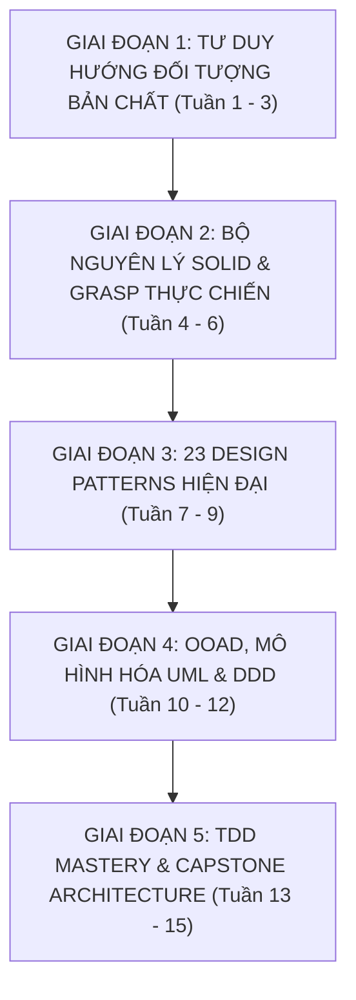

# 🧭 KHUNG GIÁO TRÌNH 15 TUẦN CHUẨN: KIẾN TRÚC PHẦN MỀM, OOAD, SOLID & TDD
## SoftwareCraft Architecture Corp — Mã môn học: `CRAFT-DUT`

> **Đơn vị bảo trợ học thuật:** Khoa Công nghệ Thông tin, Đại học Bách khoa – ĐH Đà Nẵng (DUT)  
> **Tài liệu tham chiếu Tier A+:** Dive Into Design Patterns (Shvets 2020), GoF (1994), Unit Testing (Khorikov 2020), Refactoring 2nd ed (Fowler 2018), Applying UML and Patterns (Larman)  
> **Phương pháp sư phạm:** 4 Tầng Sư Phạm (Nguyên lý kinh điển $\rightarrow$ Cài đặt hiện đại đa ngôn ngữ $\rightarrow$ Cảnh báo Code Smells $\rightarrow$ Thực hành Lab TDD)

---

## 📅 PHÂN KỲ LỘ TRÌNH 15 TUẦN

---

### 🔷 GIAI ĐOẠN 1: TƯ DUY HƯỚNG ĐỐI TƯỢNG BẢN CHẤT (TUẦN 1 - 3)

#### Tuần 1: Tính Đóng Gói (Encapsulation) & Bảo Toàn Trạng Thái (Invariants)
- **Tầng 1 (Lý thuyết kinh điển)**:
  - Bản chất của Encapsulation: Không chỉ là ẩn giấu dữ liệu (`private/public`), mà là **Bảo vệ tính bất biến của đối tượng (Maintaining Invariants)**.
  - Nguyên lý *Tell, Don't Ask*: Yêu cầu đối tượng thực hiện hành động thay vì lấy dữ liệu ra ngoài rồi tự tính toán.
- **Tầng 2 (Cài đặt hiện đại)**:
  - Triệt tiêu các hàm Setter vô tội vạ. Sử dụng Value Objects bất biến (Immutable Value Objects: Python `@dataclass(frozen=True)`, TypeScript `readonly`).
- **Tầng 3 (⚠️ Bẫy Code Smell)**:
  - *Anemic Domain Model*: Đối tượng chỉ chứa dữ liệu như struct C, biến code OOP thành lập trình thủ tục tuần tự.
- **Tầng 4 (Lab Thực hành)**:
  - `Lab 1.1`: Refactor hệ thống `BankAccount` và `Money`: Ngăn chặn nạp tiền âm, rút tiền vượt số dư mà không dùng bất kỳ public setter nào.

#### Tuần 2: Kế Thừa vs Kết Hợp (Composition over Inheritance)
- **Tầng 1 (GoF Principle)**:
  - *"Favor object composition over class inheritance"*.
  - Nhược điểm của Kế thừa: Vi phạm tính đóng gói (Lớp con biết quá rõ cấu trúc nội bộ của lớp cha - White-box reuse).
  - Ưu điểm của Kết hợp (Black-box reuse): Thay đổi hành vi linh hoạt lúc chạy (Runtime flexibility).
- **Tầng 2 (Cài đặt hiện đại)**:
  - Mô hình hóa bài toán Vũ khí nhân vật Game: Thay vì `WarriorWithBowAndSword`, sử dụng `Character` chứa thuộc tính `Weapon` có thể thay đổi lúc chạy.
- **Tầng 4 (Lab Thực hành)**:
  - `Lab 1.2`: Chuyển đổi một cây kế thừa phức tạp (5 tầng) thành mô hình Composition tinh gọn.

#### Tuần 3: Tính Đa Hình & Cơ Chế Hoạt Động (Polymorphism & Dynamic Dispatch)
- **Tầng 1 (Lý thuyết)**:
  - Đa hình lúc biên dịch (Compile-time / Ad-hoc / Templates / Overloading) vs Đa hình lúc chạy (Runtime Subtyping / Dynamic Dispatch).
  - Bản chất VTable (Virtual Method Table) và VPointer trong C++.
- **Tầng 2 (Cài đặt hiện đại)**:
  - Lập trình dựa trên Hợp đồng (Interface/Abstract Class). Structural Subtyping trong TypeScript vs Nominal Subtyping trong C++.
- **Tầng 4 (Lab Thực hành)**:
  - `Lab 1.3`: Xây dựng hệ thống Render định dạng dữ liệu (JSON, XML, CSV, YAML) hỗ trợ thêm định dạng mới mà không sửa mã nguồn cũ.

---

### 🔷 GIAI ĐOẠN 2: BỘ NGUYÊN LÝ SOLID & GRASP THỰC CHIẾN (TUẦN 4 - 6)

#### Tuần 4: Nguyên Lý Trách Nhiệm Đơn Nhất (SRP) & Đóng/Mở (OCP)
- **Tầng 1 (Uncle Bob)**:
  - **Single Responsibility Principle (SRP)**: "Một lớp chỉ nên có một lý do duy nhất để thay đổi" (Đo lường theo Actor / Stakeholder).
  - **Open/Closed Principle (OCP)**: "Mở cho việc mở rộng (Open for extension), đóng cho việc sửa đổi (Closed for modification)".
- **Tầng 3 (⚠️ Bẫy lỗi thời)**:
  - Không hiểu cực đoan biến mỗi hàm thành 1 class. SRP là về trách nhiệm nghiệp vụ, không phải số lượng dòng code.
- **Tầng 4 (Lab Thực hành)**:
  - `Lab 2.1`: Mổ xẻ lớp `InvoiceManager` (vừa tính thuế, vừa kết nối database, vừa in PDF), refactor thành 3 lớp độc lập tuân thủ SRP và OCP.

#### Tuần 5: Thay Thế Liskov (LSP) & Phân Tách Giao Diện (ISP)
- **Tầng 1 (Barbara Liskov)**:
  - **Liskov Substitution Principle (LSP)**: Đối tượng của lớp con phải có khả năng thay thế lớp cha mà không làm thay đổi tính đúng đắn của chương trình.
  - **Interface Segregation Principle (ISP)**: "Client không nên bị ép buộc phụ thuộc vào các phương thức mà họ không sử dụng".
- **Tầng 3 (⚠️ Bẫy kinh điển)**:
  - Bẫy Hình Vuông là Hình Chữ Nhật (`Square extends Rectangle`): Phá vỡ điều kiện hậu nghiệm khi thay đổi chiều rộng và chiều cao độc lập.
  - Interface đồ sộ "Fat Interface" có 20 phương thức khiến lớp con phải ném lỗi `NotImplementedException`.
- **Tầng 4 (Lab Thực hành)**:
  - `Lab 2.2`: Phân rã `MultiFunctionPrinter` Interface thành `Printer`, `Scanner`, `Fax` Interfaces tinh gọn.

#### Tuần 6: Đảo Ngược Phụ Thuộc (DIP) & Bộ Nguyên Lý GRASP
- **Tầng 1**:
  - **Dependency Inversion Principle (DIP)**: Các module cấp cao không nên phụ thuộc vào các module cấp thấp. Cả hai nên phụ thuộc vào Abstraction.
  - Nguyên lý GRASP: High Cohesion, Low Coupling, Information Expert, Creator, Controller.
- **Tầng 2 (Cài đặt hiện đại)**:
  - Kỹ thuật Dependency Injection (Constructor Injection) không phụ thuộc framework.
- **Tầng 4 (Lab Thực hành)**:
  - `Lab 2.3`: Xây dựng IoC Container mini tự viết bằng Python/TypeScript để tự động inject dependencies qua constructor.

---

### 🔷 GIAI ĐOẠN 3: 23 DESIGN PATTERNS HIỆN ĐẠI (TUẦN 7 - 9)

#### Tuần 7: Nhóm Khởi Tạo (Creational Patterns)
- **Nội dung**: Factory Method, Abstract Factory, Builder, Prototype.
- **Thanh lọc**: Loại bỏ Singleton cổ điển; thay bằng Dependency Injection quản lý vòng đời đối tượng.
- **Lab 3.1**: Xây dựng `SQLQueryBuilder` hỗ trợ sinh câu truy vấn SQL phức tạp với cú pháp Fluent API an toàn.

#### Tuần 8: Nhóm Cấu Trúc (Structural Patterns)
- **Nội dung**: Adapter, Decorator, Facade, Composite, Proxy.
- **Lab 3.2**: Xây dựng hệ thống Logger hỗ trợ thêm tính năng mã hóa dữ liệu (Encryption) và nén dữ liệu (Compression) thông qua Decorator Pattern.

#### Tuần 9: Nhóm Hành Vi (Behavioral Patterns)
- **Nội dung**: Strategy, Observer, Command, State, Template Method.
- **Hiện đại hóa**: So sánh Strategy Pattern cổ điển vs First-class functions / Lambdas trong ngôn ngữ hiện đại.
- **Lab 3.3**: Xây dựng Event Bus nội bộ sử dụng Observer Pattern xử lý sự kiện bất đồng bộ.

---

### 🔷 GIAI ĐOẠN 4: OOAD, MÔ HÌNH HÓA UML & DDD (TUẦN 10 - 12)

#### Tuần 10: Phân Tích Yêu Cầu & Mô Hình Hóa Miền Nghiệp Vụ (Domain Modeling)
- Phân tích User Stories, xác định Danh từ (Thực thể - Entities) và Động từ (Hành vi - Behaviors).
- Vẽ Lightweight Class Diagram bằng Mermaid / PlantUML.
- Lab 4.1: Mô hình hóa hệ thống Đặt phòng Khách sạn (Hotel Reservation Domain Model).

#### Tuần 11: Mô Hình Hóa Luồng Nghiệp Vụ Tương Tác (Sequence & State Diagrams)
- Vẽ Sequence Diagram mô tả chính xác tương tác giữa các đối tượng qua lời gọi hàm.
- State Machine Diagram cho vòng đời của một Đơn hàng (`Created` $\rightarrow$ `Paid` $\rightarrow$ `Shipping` $\rightarrow$ `Delivered` $\rightarrow$ `Cancelled`).
- Lab 4.2: Cài đặt State Pattern quản lý chuyển trạng thái đơn hàng ngăn chặn nhảy cóc trạng thái bất hợp lệ.

#### Tuần 12: Nền Tảng Domain-Driven Design (DDD) Tinh Gọn
- Khái niệm Ubiquitous Language, Bounded Contexts.
- Phân biệt Entity (có định danh ID) vs Value Object (so sánh theo giá trị, bất biến).
- Aggregates và Aggregate Roots: Ranh giới bảo vệ toàn vẹn dữ liệu giao dịch.

---

### 🔷 GIAI ĐOẠN 5: TDD MASTERY & CAPSTONE ARCHITECTURE (TUẦN 13 - 15)

#### Tuần 13: Vòng Lặp TDD & Kim Tự Tháp Kiểm Thử (Testing Pyramid)
- Chu trình **Red $\rightarrow$ Green $\rightarrow$ Refactor**.
- 4 Trụ cột của Unit Test chất lượng: Bảo vệ chống hồi quy (Protection against regressions), Kháng cự tái cấu trúc (Resistance to refactoring), Phản hồi nhanh (Fast feedback), Khả năng bảo trì (Maintainability).
- Phân biệt Classicist (Detroit style) vs Mockist (London style).

#### Tuần 14: Kỹ Thuật Test Doubles & Code Coverage Thực Chất
- Phân loại: Dummies, Stubs, Spies, Mocks, Fakes.
- Đo đạc Code Coverage và Mutation Testing (Kiểm tra xem test suite có thực sự bắt được lỗi khi đột biến code không).
- Lab 5.1: Viết test cho hệ thống Giỏ hàng với Fake Repository thay vì Mock bừa bãi.

#### Tuần 15: Capstone Project — Payment Processing Engine
- **Đặc tả**: Thiết kế hệ thống Xử lý Thanh toán Đa cổng (hỗ trợ VNPay, Momo, Stripe, ZaloPay).
- **Yêu cầu**:
  1. Tuân thủ 100% nguyên lý SOLID và Clean Architecture.
  2. Toàn bộ mã nguồn được phát triển theo quy trình **TDD (Test-First)**.
  3. Sử dụng Strategy Pattern cho cổng thanh toán, Factory cho khởi tạo, Adapter cho chuyển đổi API bên thứ ba.
  4. Test Coverage đạt $\ge 90\%$, mutation score $\ge 80\%$.
