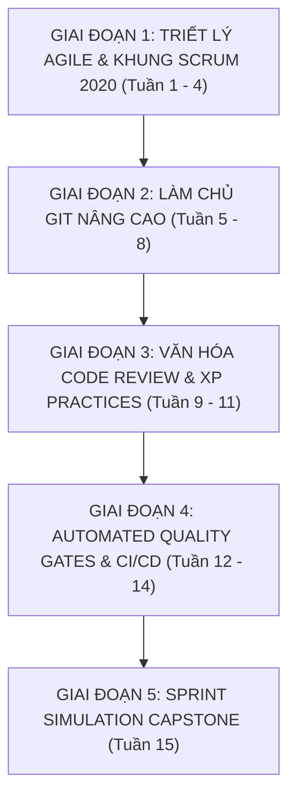

# 🧭 KHUNG GIÁO TRÌNH 15 TUẦN CHUẨN: QUY TRÌNH SCRUM, GITFLOW & CI/CD
## AgileOps Engineering Corp — Mã môn học: `AGILE-DUT`

> **Đơn vị bảo trợ học thuật:** Khoa Công nghệ Thông tin, Đại học Bách khoa – ĐH Đà Nẵng (DUT)  
> **Tài liệu tham chiếu Tier A+:** The 2020 Scrum Guide (Scrum.org), Pro Git (Chacon & Straub), User Stories Applied (Cohn), Accelerate (Forsgren et al.)  
> **Phương pháp sư phạm:** 4 Tầng Sư Phạm (Nguyên lý Agile $\rightarrow$ Cài đặt công cụ hiện đại $\rightarrow$ Cảnh báo Zombie Scrum $\rightarrow$ Thực hành Sprint giả lập)

---

## 📅 PHÂN KỲ LỘ TRÌNH 15 TUẦN

---

### 🔷 GIAI ĐOẠN 1: TRIẾT LÝ AGILE & KHUNG SCRUM 2020 (TUẦN 1 - 4)

#### Tuần 1: Agile Manifesto & Tư Duy Linh Hoạt (Agile Mindset)
- **Tầng 1 (Lý thuyết kinh điển)**:
  - 4 Giá trị cốt lõi & 12 Nguyên lý của Tuyên ngôn Agile (Agile Manifesto 2001).
  - So sánh mô hình Thác nước (Waterfall) vs Mô hình Lặp & Tăng dần (Iterative & Incremental).
- **Tầng 2 (Thực tế công nghiệp)**:
  - Tại sao Agile không đồng nghĩa với "không có tài liệu" hay "làm việc tùy tiện".
- **Tầng 4 (Lab Thực hành)**:
  - `Lab 1.1`: Phân tích một dự án thất bại do mô hình Thác nước truyền thống và đề xuất phương án chuyển dịch sang Agile.

#### Tuần 2: Bộ Khung Scrum 2020: 3 Vai Trò & 3 Hiện Vật
- **Tầng 1 (The 2020 Scrum Guide)**:
  - 3 Vai trò (Accountabilities): Product Owner (Tối đa hóa giá trị sản phẩm), Scrum Master (Thúc đẩy hiệu quả nhóm), Developers (Cam kết chất lượng kỹ thuật).
  - 3 Hiện vật (Artifacts): Product Backlog (cam kết Product Goal), Sprint Backlog (cam kết Sprint Goal), Increment (cam kết Definition of Done - DoD).
- **Tầng 3 (⚠️ Bẫy lỗi thời)**:
  - Cảnh báo: Scrum Guide 2020 đã loại bỏ thuật ngữ "Development Team" và "Daily Standup questions cứng nhắc" để tránh chia rẽ nội bộ và tăng tính tự chủ.
- **Tầng 4 (Lab Thực hành)**:
  - `Lab 1.2`: Thiết lập Definition of Done (DoD) cụ thể gồm 5 tiêu chí bắt buộc (Code clean, Tests pass, Coverage $\ge 80\%$, Review approved, Docs updated).

#### Tuần 3: 5 Sự Kiện Scrum (Scrum Events) & Nhịp Điệu Làm Việc
- **Tầng 1**:
  - The Sprint (Khung thời gian cố định 1-4 tuần), Sprint Planning, Daily Scrum (15 phút), Sprint Review, Sprint Retrospective.
- **Tầng 3 (⚠️ Zombie Scrum Trap)**:
  - Biến Daily Scrum thành báo cáo trạng thái cho sếp; bỏ qua Sprint Retrospective hoặc họp chiếu lệ không có Action Items.
- **Tầng 4 (Lab Thực hành)**:
  - `Lab 1.3`: Thực hành một phiên Retrospective theo phương pháp *Mad - Sad - Glad* và đề xuất 2 cải tiến cụ thể cho Sprint tiếp theo.

#### Tuần 4: Kỹ Thuật Viết User Story (INVEST) & Ước Lượng Planning Poker
- **Tầng 1 (Mike Cohn)**:
  - Cấu trúc User Story: *Là [vai trò], tôi muốn [hành động] để [lợi ích]*.
  - Tiêu chuẩn **INVEST**: Independent, Negotiable, Valuable, Estimable, Small, Testable.
  - Ước lượng tương đối qua Story Points (Dãy số Fibonacci: 1, 2, 3, 5, 8, 13) và Planning Poker.
- **Tầng 4 (Lab Thực hành)**:
  - `Lab 1.4`: Phân rã một Epics lớn (Hệ thống xác thực người dùng) thành 6 User Stories đạt chuẩn INVEST và tổ chức Planning Poker.

---

### 🔷 GIAI ĐOẠN 2: LÀM CHỦ GIT NÂNG CAO (TUẦN 5 - 8)

#### Tuần 5: Kiến Trúc Bên Trong Của Git (Git Internals)
- **Tầng 1 (Pro Git Ch.10)**:
  - Cấu trúc thư mục `.git/`: `HEAD`, `config`, `refs/`, `objects/`.
  - 4 Loại đối tượng trong Git: **Blob** (Nội dung tệp), **Tree** (Cấu trúc thư mục), **Commit** (Ảnh chụp trạng thái và metadata), **Annotated Tag**.
  - Cơ chế băm SHA-1/SHA-256 và tính toàn vẹn dữ liệu (Merkle Tree).
- **Tầng 4 (Lab Thực hành)**:
  - `Lab 2.1`: Dùng lệnh cấp thấp (Plumbing commands: `git cat-file -p`, `git hash-object`) để tự dựng một commit bằng tay không cần lệnh `git commit`.

#### Tuần 6: Chiến Lược Phân Nhánh (Branching Strategies)
- **Tầng 1**:
  - So sánh **GitFlow** (nhánh `master`, `develop`, `feature/*`, `release/*`, `hotfix/*`) vs **GitHub Flow** vs **Trunk-Based Development** (TBD).
- **Tầng 2 (Hiện đại)**:
  - Xu hướng hiện đại của các công ty CI/CD: Trunk-Based Development kết hợp **Feature Flags (Feature Toggles)**.
- **Tầng 4 (Lab Thực hành)**:
  - `Lab 2.2`: Thiết lập quy trình Trunk-Based Development trên GitHub repo với Branch Protection Rules chặn push trực tiếp vào `main`.

#### Tuần 7: Tái Cấu Trúc Lịch Sử: Git Rebase Interactive & Squashing
- **Tầng 1**:
  - Phân biệt `git merge` (giữ nguyên lịch sử, tạo merge commit) vs `git rebase` (viết lại lịch sử, tạo chuỗi commit tuyến tính).
- **Tầng 2**:
  - `git rebase -i`: Sắp xếp, gộp commit (`squash`/`fixup`), chỉnh sửa thông điệp commit (`reword`), xóa commit thừa.
- **Tầng 3 (⚠️ Quy tắc vàng của Rebase)**:
  - *Tuyệt đối không rebase trên các nhánh công khai đã push lên remote và có người khác đang làm việc chung.*
- **Tầng 4 (Lab Thực hành)**:
  - `Lab 2.3`: Dọn dẹp một nhánh có 8 commits lộn xộn thành 2 commits sạch sẽ theo chuẩn trước khi tạo PR.

#### Tuần 8: Giải Quyết Xung Đột Mã Nguồn (Merge Conflict Mastery)
- **Tầng 1**:
  - Cơ chế 3-way merge của Git (Common Ancestor, Ours, Theirs).
- **Tầng 4 (Lab Thực hành)**:
  - `Lab 2.4`: Tự tạo xung đột code phức tạp trên 2 nhánh song song và giải quyết dứt điểm bằng `git merge-tool` / VS Code Merge Editor mà không làm mất code của nhau.

---

### 🔷 GIAI ĐOẠN 3: VĂN HÓA CODE REVIEW & XP PRACTICES (TUẦN 9 - 11)

#### Tuần 9: Quy Chuẩn Thông Điệp Commit & Pull Request
- **Tầng 2 (Công nghiệp)**:
  - Quy chuẩn **Conventional Commits 1.0.0**: `feat:`, `fix:`, `refactor:`, `test:`, `docs:`, `chore:`.
  - Tạo PR Template: Mô tả thay đổi, danh sách kiểm tra (Checklist), ảnh chụp minh chứng giao diện (Screenshots).
- **Tầng 4 (Lab Thực hành)**:
  - `Lab 3.1`: Cài đặt `commitlint` và `husky` để tự động từ chối các commit không đúng quy chuẩn Conventional Commits ngay trên máy lập trình viên.

#### Tuần 10: Nghệ Thuật & Quy Trình Code Review Chuyên Nghiệp
- **Tầng 1 (Software Engineering at Google)**:
  - Mục đích của Code Review: Đảm bảo khả năng bảo trì, chia sẻ tri thức, phát hiện lỗi sớm.
  - Tác phong review văn minh: Nhận xét trên code, không công kích cá nhân; gắn nhãn rõ ràng (`[Nit]`, `[Blocking]`, `[Question]`).
- **Tầng 4 (Lab Thực hành)**:
  - `Lab 3.2`: Thực hiện review chéo một PR cố tình cài 3 lỗi kiến trúc và 2 lỗ hổng bảo mật, viết phản hồi chuẩn mực.

#### Tuần 11: Extreme Programming (XP): Lập Trình Theo Cặp & Tích Hợp Liên Tục
- **Tầng 1 (Kent Beck)**:
  - Pair Programming: Mô hình Driver (Người gõ code) & Navigator (Người định hướng chiến lược).
  - Continuous Refactoring: Dọn dẹp mã nguồn liên tục theo nguyên tắc Boy Scout.
- **Tầng 4 (Lab Thực hành)**:
  - `Lab 3.3`: Thực hành 1 ca Pair Programming giải quyết bài toán thuật toán với công cụ Live Share.

---

### 🔷 GIAI ĐOẠN 4: AUTOMATED QUALITY GATES & CI/CD (TUẦN 12 - 14)

#### Tuần 12: Kiểm Tra Mã Tự Động Tại Local (Pre-commit Quality Gates)
- **Tầng 2**:
  - Cấu hình công cụ Pre-commit framework: Tự động chạy Black/Ruff (Python), ESLint/Prettier (JS/TS), Clang-Format (C++).
- **Tầng 4 (Lab Thực hành)**:
  - `Lab 4.1`: Thiết lập file `.pre-commit-config.yaml` ngăn chặn commit các file thừa, trailing whitespace và code chưa format.

#### Tuần 13: Xây Dựng CI Pipeline Với GitHub Actions
- **Tầng 1 & 2**:
  - Kiến trúc GitHub Actions: Workflows, Events, Jobs, Steps, Runners, Actions.
  - Xây dựng pipeline tự động: Checkout code $\rightarrow$ Setup runtime $\rightarrow$ Install dependencies $\rightarrow$ Run Linters $\rightarrow$ Run Tests.
- **Tầng 4 (Lab Thực hành)**:
  - `Lab 4.2`: Viết file `.github/workflows/ci.yml` tự động chạy bộ test suite và chặn không cho merge PR nếu test thất bại hoặc coverage $< 80\%$.

#### Tuần 14: Đo Lường Hiệu Năng Đội Nhóm Với DORA Metrics
- **Tầng 1 (Accelerate)**:
  - 4 Chỉ số vàng DORA: Deployment Frequency, Lead Time for Changes, Mean Time to Recovery (MTTR), Change Failure Rate.
- **Tầng 4 (Lab Thực hành)**:
  - `Lab 4.3`: Thiết lập công cụ theo dõi thời gian từ lúc mở PR đến khi merge và deploy tự động.

---

### 🔷 GIAI ĐOẠN 5: SPRINT SIMULATION CAPSTONE (TUẦN 15)

#### Tuần 15: Capstone Project — Vận Hành Sprint Thực Chiến Đa Vai Trò
- **Mô phỏng thực tế**:
  - Chia nhóm 3-4 sinh viên, vận hành một Sprint kéo dài 1 tuần để phát triển tính năng mới cho một hệ thống sẵn có.
- **Yêu cầu nghiệm thu**:
  1. Tổ chức đầy đủ các sự kiện Scrum: Sprint Planning, Daily Scrum tóm tắt, Sprint Review và Sprint Retrospective.
  2. Toàn bộ tính năng được quản lý qua GitHub Projects / Kanban Board.
  3. 100% mã nguồn chuyển giao qua Pull Request với tối thiểu 2 approvals và pass CI pipeline tự động.
  4. Đóng gói sản phẩm với release tag theo chuẩn Semantic Versioning (`v1.0.0`).
