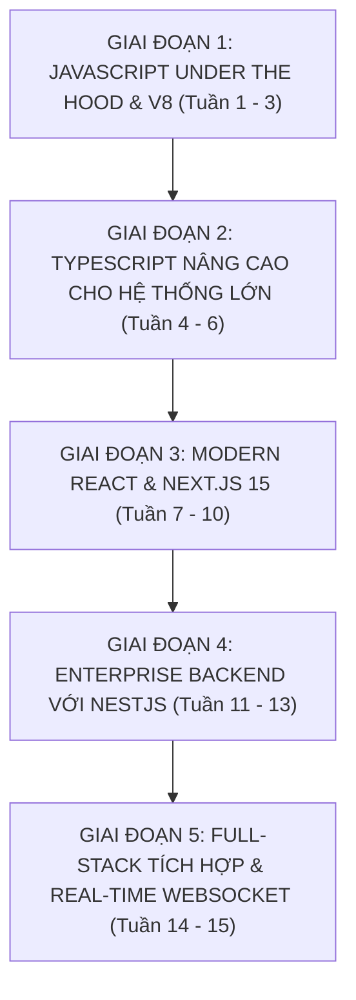

# 🧭 KHUNG GIÁO TRÌNH 15 TUẦN CHUẨN: JAVASCRIPT/TYPESCRIPT & WEBSCALE FULL-STACK
## WebScale Technologies Corp — Mã môn học: `WEB-DUT`

> **Đơn vị bảo trợ học thuật:** Khoa Công nghệ Thông tin, Đại học Bách khoa – ĐH Đà Nẵng (DUT)  
> **Tài liệu tham chiếu Tier A+:** You Don't Know JS Yet (Simpson), TypeScript Handbook (Microsoft), React.dev, Next.js 15 Docs, NestJS Official Guide  
> **Phương pháp sư phạm:** 4 Tầng Sư Phạm (Bản chất V8 Runtime $\rightarrow$ Cú pháp TypeScript Strict $\rightarrow$ Cảnh báo Lỗi Hydration/Memory Leak $\rightarrow$ Thực hành Lab Full-Stack)

---

## 📅 PHÂN KỲ LỘ TRÌNH 15 TUẦN

---

### 🔷 GIAI ĐOẠN 1: JAVASCRIPT UNDER THE HOOD & V8 (TUẦN 1 - 3)

#### Tuần 1: Kiến Trúc V8 Engine, Execution Context & Closures
- **Tầng 1 (YDKJSY)**:
  - V8 Pipeline: Parser $\rightarrow$ AST $\rightarrow$ Ignition Interpreter (Bytecode) $\rightarrow$ TurboFan JIT Compiler (Machine Code).
  - Global Execution Context vs Function Execution Context, Call Stack, Lexical Environment.
  - Bản chất của **Closures**: Hàm ghi nhớ phạm vi bao quanh nó ngay cả khi được gọi ở phạm vi khác.
- **Tầng 3 (⚠️ Bẫy Memory Leak)**:
  - Closures vô tình giữ lại tham chiếu tới các biến DOM lớn hoặc các mảng khổng lồ gây tràn bộ nhớ trình duyệt.
- **Tầng 4 (Lab Thực hành)**:
  - `Lab 1.1`: Sử dụng Chrome DevTools Memory Profiler chụp Heap Snapshot để phát hiện và cô lập rò rỉ bộ nhớ do Closures gây ra.

#### Tuần 2: Mô Hình Bất Đồng Bộ (Event Loop, Microtasks vs Macrotasks)
- **Tầng 1**:
  - Kiến trúc Event Loop của trình duyệt và Node.js (Libuv).
  - Call Stack, Web APIs, Task Queue (Macrotasks: `setTimeout`, `setInterval`, I/O).
  - Microtask Queue (`Promise.then/catch/finally`, `queueMicrotask`, `process.nextTick`).
- **Tầng 4 (Lab Thực hành)**:
  - `Lab 1.2`: Giải mã và dự đoán chính xác luồng in của 10 bài toán bẫy Event Loop phức tạp kết hợp Promise, async/await và timer.

#### Tuần 3: Con Trỏ `this`, Prototypal Inheritance & Garbage Collection
- **Tầng 1**:
  - 4 Quy tắc xác định con trỏ `this`: Default binding, Implicit binding, Explicit binding (`call`, `apply`, `bind`), và `new` binding.
  - Prototype Chain: `__proto__` vs `prototype`.
  - Cơ chế thu gom rác: Mark-and-Sweep Algorithm trong V8.
- **Tầng 4 (Lab Thực hành)**:
  - `Lab 1.3`: Tự viết lại hàm `myBind`, `myCall`, `myApply` và hàm khởi tạo `new` từ đầu bằng prototype thuần.

---

### 🔷 GIAI ĐOẠN 2: TYPESCRIPT NÂNG CAO CHO HỆ THỐNG LỚN (TUẦN 4 - 6)

#### Tuần 4: Hệ Thống Kiểu Tĩnh & Generics Nâng Cao
- **Tầng 2 (TypeScript Handbook)**:
  - Cấu hình `tsconfig.json` chuẩn Strict Mode (`strict: true`, `noImplicitAny: true`).
  - Phân biệt Structural Typing (TypeScript) vs Nominal Typing (Java/C++).
  - Generics, Generic Constraints (`<T extends { id: string }>`, `<T, K extends keyof T>`).
- **Tầng 4 (Lab Thực hành)**:
  - `Lab 2.1`: Xây dựng một Type-Safe In-Memory Repository sử dụng Generics hỗ trợ CRUD có kiểm tra kiểu khóa chính tự động.

#### Tuần 5: Advanced Types: Conditional Types, Mapped Types & Template Literals
- **Tầng 2**:
  - Conditional Types (`T extends U ? X : Y`), từ khóa `infer`.
  - Mapped Types (`{ [P in keyof T]?: T[P] }`).
  - Template Literal Types (ví dụ: `type Event = `${'user' | 'order'}_${'created' | 'updated'}``).
  - Utility Types tích hợp sẵn: `Partial`, `Required`, `Readonly`, `Pick`, `Omit`, `Record`.
- **Tầng 4 (Lab Thực hành)**:
  - `Lab 2.2`: Tự cài đặt lại 6 Utility Types kinh điển (`MyPartial`, `MyPick`, `MyOmit`, `DeepReadonly`) bằng cú pháp nâng cao.

#### Tuần 6: Type Narrowing, Discriminated Unions & Type Guards
- **Tầng 2**:
  - Discriminated Unions (Tagged Unions): Kỹ thuật xử lý trạng thái API (Loading, Success, Error) không bao giờ bị dính trạng thái bất hợp lệ.
  - Custom Type Guards với từ khóa `is`.
- **Tầng 4 (Lab Thực hành)**:
  - `Lab 2.3`: Xây dựng máy trạng thái hữu hạn (FSM) kiểm tra đơn hàng bằng TypeScript Discriminated Unions đảm bảo tính đầy đủ (Exhaustive Check với `never`).

---

### 🔷 GIAI ĐOẠN 3: MODERN REACT & NEXT.JS 15 (TUẦN 7 - 10)

#### Tuần 7: Kiến Trúc React Fiber & Reconciliation
- **Tầng 1 (React Core)**:
  - Virtual DOM vs Real DOM.
  - Thuật toán Reconciliation và kiến trúc React Fiber: Cho phép tạm dừng, hủy và ưu tiên các tác vụ render.
  - Vòng đời Render Phase (thuần túy, không side-effects) vs Commit Phase.
- **Tầng 4 (Lab Thực hành)**:
  - `Lab 3.1`: Dùng React Profiler đo đạc và tối ưu một danh sách 10,000 phần tử sử dụng Virtualization (`@tanstack/react-virtual`).

#### Tuần 8: Custom Hooks & Quản Lý Trạng Thái Toàn Cục Với Zustand
- **Tầng 2**:
  - Bản chất của Hooks: Danh sách liên kết nội bộ lưu trữ state theo thứ tự gọi.
  - Xây dựng Custom Hooks tái sử dụng: `useDebounce`, `useLocalStorage`, `useFetch`.
  - Quản lý trạng thái hiện đại với **Zustand**: Không boilerplates cồng kềnh, tối ưu re-render qua selector.
- **Tầng 4 (Lab Thực hành)**:
  - `Lab 3.2`: Xây dựng hệ thống Quản lý Giỏ hàng và Bộ lọc sản phẩm đa tiêu chí với Zustand.

#### Tuần 9: Next.js 15 App Router & Server Components (RSC)
- **Tầng 2 (Next.js 15)**:
  - Kiến trúc App Router (`app/` directory).
  - Phân định rõ ràng: **React Server Components (RSC)** (mặc định, chạy trên server, 0 byte JS client) vs **Client Components** (`'use client'`).
  - Kỹ thuật Streaming với Suspense và `loading.tsx`.
- **Tầng 3 (⚠️ Bẫy Hydration)**:
  - Tránh dùng các API trình duyệt (`window`, `localStorage`) trong SSR dẫn đến lỗi Hydration Mismatch.
- **Tầng 4 (Lab Thực hành)**:
  - `Lab 3.3`: Xây dựng trang Blog hiển thị tin tức với Server Components tải dữ liệu trực tiếp từ Database với tốc độ First Contentful Paint $< 0.8s$.

#### Tuần 10: Server Actions, Caching & Revalidation
- **Tầng 2**:
  - Server Actions (`'use server'`): Xử lý Mutation dữ liệu trực tiếp từ Form không cần viết REST endpoint thủ công.
  - Hệ thống Caching 4 tầng của Next.js: Request Memoization, Data Cache, Full Route Cache, Router Cache.
  - `revalidatePath` và `revalidateTag`.
- **Tầng 4 (Lab Thực hành)**:
  - `Lab 3.4`: Xây dựng Form tạo bài viết với Server Actions kết hợp Zod validation và revalidation tự động.

---

### 🔷 GIAI ĐOẠN 4: ENTERPRISE BACKEND VỚI NESTJS (TUẦN 11 - 13)

#### Tuần 11: Kiến Trúc Phân Lớp NestJS & Dependency Injection
- **Tầng 2 (NestJS)**:
  - Cấu trúc Modular Architecture: Modules, Controllers (đón request), Providers/Services (xử lý nghiệp vụ).
  - Inversion of Control (IoC) Container và cơ chế Dependency Injection của NestJS.
- **Tầng 4 (Lab Thực hành)**:
  - `Lab 4.1`: Khởi tạo NestJS service quản lý người dùng với cấu trúc phân lớp Controller-Service-Repository tách bạch.

#### Tuần 12: DTO Validation, Pipes, Guards & Xác Thực JWT
- **Tầng 2**:
  - Xác thực dữ liệu đầu vào qua Data Transfer Object (DTO) với `class-validator` và `ValidationPipe`.
  - Bảo vệ Endpoint bằng **Guards**: Xác thực Access Token JWT và Refresh Token.
  - Phân quyền người dùng (Role-based Access Control - RBAC).
- **Tầng 4 (Lab Thực hành)**:
  - `Lab 4.2`: Xây dựng hệ thống Authentication & Authorization hoàn chỉnh với Passport JWT và Roles Guard.

#### Tuần 13: Tương Tác Cơ Sở Dữ Liệu Với Prisma ORM & PostgreSQL
- **Tầng 2**:
  - Thiết kế Schema với Prisma: Relationships (1-1, 1-N, N-N), Indexes.
  - Database Migrations tự động.
  - Tối ưu hóa truy vấn, tránh lỗi N+1 Query.
- **Tầng 4 (Lab Thực hành)**:
  - `Lab 4.3`: Kết nối NestJS với PostgreSQL qua Prisma, viết truy vấn Transaction xử lý đơn hàng an toàn.

---

### 🔷 GIAI ĐOẠN 5: FULL-STACK TÍCH HỢP & REAL-TIME WEBSOCKET (TUẦN 14 - 15)

#### Tuần 14: Giao Tiếp Thời Gian Thực Với WebSockets (Socket.IO)
- **Tầng 2**:
  - NestJS WebSocket Gateways: Rooms, Namespaces, Handshake, Acknowledgments.
  - Next.js Client kết nối WebSocket lắng nghe sự kiện realtime.
- **Tầng 4 (Lab Thực hành)**:
  - `Lab 5.1`: Xây dựng hệ thống Chat Realtime hoặc Thông báo Đơn hàng trực tiếp qua WebSocket.

#### Tuần 15: Capstone Project — E-Commerce Enterprise Platform
- **Đặc tả sản phẩm**:
  - Xây dựng một nền tảng Thương mại Điện tử hoàn chỉnh:
  - **Backend**: NestJS + PostgreSQL + Prisma + Redis Caching + JWT Auth.
  - **Frontend**: Next.js 15 App Router + TailwindCSS + Zustand + Server Components.
- **Yêu cầu kỹ thuật**:
  1. 100% Strict TypeScript không có bất kỳ dòng `any` nào.
  2. Tốc độ tải trang Lighthouse Score $\ge 90$.
  3. Bộ kiểm thử Unit & Integration Tests viết bằng Vitest đạt độ bao phủ $\ge 80\%$.
  4. Kiểm thử E2E kịch bản mua hàng và thanh toán bằng Playwright.
