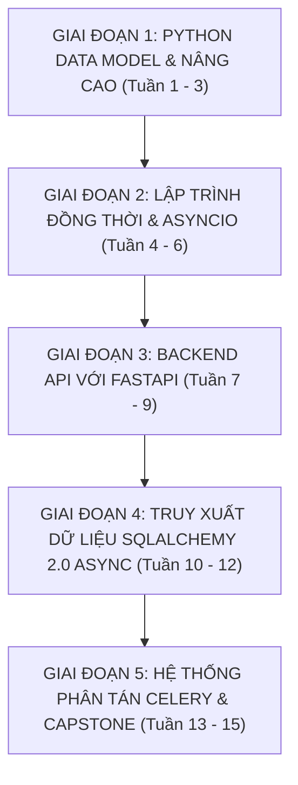

# 🧭 KHUNG GIÁO TRÌNH 15 TUẦN CHUẨN: PYTHON CHUYÊN SÂU & HỆ THỐNG PHÂN TÁN
## PyScale Backend & Distributed Corp — Mã môn học: `PY-DUT`

> **Đơn vị bảo trợ học thuật:** Khoa Công nghệ Thông tin, Đại học Bách khoa – ĐH Đà Nẵng (DUT)  
> **Tài liệu tham chiếu Tier A+:** Fluent Python 2nd ed (Ramalho 2022), Robust Python (Viafore 2021), FastAPI Docs, SQLAlchemy 2.0 Guide  
> **Phương pháp sư phạm:** 4 Tầng Sư Phạm (Bản chất CPython Data Model $\rightarrow$ Cú pháp AsyncIO & FastAPI $\rightarrow$ Cảnh báo Bẫy GIL / N+1 $\rightarrow$ Thực hành Microservice Lab)

---

## 📅 PHÂN KỲ LỘ TRÌNH 15 TUẦN

---

### 🔷 GIAI ĐOẠN 1: PYTHON DATA MODEL & NÂNG CAO (TUẦN 1 - 3)

#### Tuần 1: Python Data Model & Giao Thức Dunder Methods
- **Tầng 1 (Fluent Python Ch.1 & 2)**:
  - Bản chất Python Data Model: Các phương thức đặc biệt (`__dunder__`).
  - Sequence Protocol: `__getitem__`, `__len__`, Slice objects.
  - String Representation: `__repr__` (dành cho lập trình viên/debug) vs `__str__` (dành cho người dùng).
- **Tầng 4 (Lab Thực hành)**:
  - `Lab 1.1`: Xây dựng lớp `FrenchDeck` (Bộ bài tây) và `Vector2D` hỗ trợ đầy đủ các phép toán `+`, `-`, `*`, `abs()` và toán tử `in` thông qua Dunder Methods.

#### Tuần 2: Iterators, Generators & Luồng Dữ Liệu Tối Ưu Bộ Nhớ
- **Tầng 1 (Fluent Python Ch.17)**:
  - Sự khác biệt giữa Iterable và Iterator (Giao thức `__iter__` và `__next__`).
  - Hàm Generator và từ khóa `yield`: Tạo luồng xử lý lười biếng (Lazy Evaluation).
  - Cú pháp `yield from` để ủy quyền lồng nhau.
- **Tầng 4 (Lab Thực hành)**:
  - `Lab 1.2`: Xây dựng một file streamer đọc file log 10GB từng dòng mà chỉ tiêu tốn dưới 20MB RAM sử dụng Generators.

#### Tuần 3: Decorators, Closures & Type Hints PEP 484
- **Tầng 1 & 2 (Fluent Python Ch.9 & Robust Python)**:
  - Closures trong Python: `__closure__` attribute và từ khóa `nonlocal`.
  - Decorators có tham số, giữ nguyên metadata với `functools.wraps`.
  - Hệ thống kiểm tra kiểu tĩnh (Type Annotations): Generics, `Union`, `Optional`, `Callable`, TypedDict.
- **Tầng 4 (Lab Thực hành)**:
  - `Lab 1.3`: Xây dựng các Custom Decorators: `@retry(max_attempts=3, delay=1.0)` và `@timed_cache(ttl=60)` kiểm thử tự động với Pytest.

---

### 🔷 GIAI ĐOẠN 2: LẬP TRÌNH ĐỒNG THỜI & ASYNCIO (TUẦN 4 - 6)

#### Tuần 4: Kiến Trúc CPython: GIL, Threads & Multiprocessing
- **Tầng 1 (Fluent Python Ch.19)**:
  - Khóa thông dịch toàn cục (GIL - Global Interpreter Lock): Cơ chế bảo vệ bộ nhớ CPython và hệ quả đến tính đa luồng.
  - Khi nào dùng `threading` (I/O-bound truyền thống), khi nào dùng `multiprocessing` (CPU-bound song song thực sự qua Process Pool).
- **Tầng 4 (Lab Thực hành)**:
  - `Lab 2.1`: Đo đạc thời gian tính toán số nguyên tố lớn ($10^8$ số): So sánh Single-thread vs Multithreading vs ProcessPoolExecutor.

#### Tuần 5: Lập Trình Bất Đồng Bộ Với AsyncIO (Coroutines & Event Loop)
- **Tầng 1 (Fluent Python Ch.20 & 21)**:
  - Bản chất AsyncIO: Mô hình cộng tác đa nhiệm (Cooperative Multitasking) trên một luồng đơn.
  - Coroutines (`async def`), toán tử `await`.
  - Event Loop, Tasks, `asyncio.create_task`, `asyncio.gather`.
  - Cú pháp mới Python 3.11: `asyncio.TaskGroup` quản lý lỗi có cấu trúc (Structured Concurrency).
- **Tầng 3 (⚠️ Bẫy Blocking)**:
  - Gọi các hàm blocking I/O trong coroutine làm tê liệt toàn bộ Event Loop.
- **Tầng 4 (Lab Thực hành)**:
  - `Lab 2.2`: Xây dựng Async Web Crawler thu thập thông tin từ 100 trang web đồng thời sử dụng `httpx.AsyncClient` và `asyncio.Semaphore(10)` để giới hạn số kết nối.

#### Tuần 6: Async Context Managers & Async Generators
- **Tầng 2**:
  - Giao thức Async Context Manager: `__aenter__` và `__aexit__` (`contextlib.asynccontextmanager`).
  - Async Generators và vòng lặp `async for`.
- **Tầng 4 (Lab Thực hành)**:
  - `Lab 2.3`: Xây dựng Connection Pool bất đồng bộ tự động cấp phát và tái thu hồi kết nối cơ sở dữ liệu qua Async Context Manager.

---

### 🔷 GIAI ĐOẠN 3: BACKEND API VỚI FASTAPI (TUẦN 7 - 9)

#### Tuần 7: Kiến Trúc FastAPI & Xác Thực Dữ Liệu Pydantic v2
- **Tầng 2 (FastAPI Official)**:
  - Nguyên lý hoạt động của FastAPI trên Starlette (ASGI) và Pydantic v2 (Rust Core).
  - Tự động sinh tài liệu chuẩn OpenAPI (Swagger UI / ReDoc).
  - Định nghĩa Schemas DTO: Phân tách `UserCreateSchema`, `UserResponseSchema`, `UserUpdateSchema`.
- **Tầng 4 (Lab Thực hành)**:
  - `Lab 3.1`: Xây dựng CRUD API quản lý sản phẩm với Pydantic v2 validation nghiêm ngặt (kiểm tra định dạng email, giá tiền $> 0$, slug tự động).

#### Tuần 8: Hệ Thống Dependency Injection Mạnh Mẽ Của FastAPI
- **Tầng 2**:
  - Hệ thống `Depends()`: Quản lý vòng đời tài nguyên, tái sử dụng logic phân trang, lọc dữ liệu và mở transaction database.
  - Sub-dependencies và Dependency Overrides phục vụ Unit Testing.
- **Tầng 4 (Lab Thực hành)**:
  - `Lab 3.2`: Xây dựng Dependency phân trang chuẩn hóa và Dependency xác thực quyền Admin.

#### Tuần 9: Xác Thực Người Dùng (Authentication) & Bảo Mật JWT
- **Tầng 2**:
  - Mã hóa mật khẩu bằng `bcrypt` / `passlib`.
  - Cơ chế sinh và kiểm tra JSON Web Token (Access Token + Refresh Token).
  - Xử lý phân quyền theo vai trò (Role-Based Access Control).
- **Tầng 4 (Lab Thực hành)**:
  - `Lab 3.3`: Xây dựng module đăng ký, đăng nhập, cấp phát token và bảo vệ các routes bí mật.

---

### 🔷 GIAI ĐOẠN 4: TRUY XUẤT DỮ LIỆU SQLALCHEMY 2.0 ASYNC (TUẦN 10 - 12)

#### Tuần 10: SQLAlchemy 2.0 Core & AsyncSession
- **Tầng 2 (SQLAlchemy 2.0)**:
  - Kiến trúc hiện đại 2.0: Cú pháp `select()` mới thay thế cho cú pháp `query` cũ.
  - Khởi tạo Async Engine (`postgresql+asyncpg://`) và quản lý `AsyncSession`.
  - Định nghĩa Models kế thừa từ `DeclarativeBase` và `Mapped[]`.
- **Tầng 4 (Lab Thực hành)**:
  - `Lab 4.1`: Thiết kế Database Schema quan hệ 1-N và N-N bằng SQLAlchemy 2.0, kết nối cơ sở dữ liệu PostgreSQL.

#### Tuần 11: Database Migrations Với Alembic & Triệt Tiêu Lỗi N+1
- **Tầng 2 & 3**:
  - Quản lý phiên bản CSDL bằng Alembic: `alembic revision --autogenerate`, `alembic upgrade head`.
  - Mổ xẻ và xử lý triệt để bài toán **N+1 Query Problem**: Phân biệt chiến lược `selectinload()` vs `joinedload()`.
- **Tầng 4 (Lab Thực hành)**:
  - `Lab 4.2`: Tối ưu một câu truy vấn danh sách 1,000 đơn hàng kèm danh sách sản phẩm từ 1,001 câu SQL xuống còn chính xác 2 câu SQL.

#### Tuần 12: Mô Hình Repository & Unit of Work (Clean Architecture)
- **Tầng 1 & 2**:
  - Tách tầng truy xuất dữ liệu khỏi route handlers thông qua Generic Repository Pattern.
  - Quản lý giao dịch nguyên tử (Atomic Transactions) bằng Unit of Work Pattern.
- **Tầng 4 (Lab Thực hành)**:
  - `Lab 4.3`: Tái cấu trúc toàn bộ API đặt hàng áp dụng Repository Pattern và kiểm thử bằng Mock Session.

---

### 🔷 GIAI ĐOẠN 5: HỆ THỐNG PHÂN TÁN CELERY & CAPSTONE (TUẦN 13 - 15)

#### Tuần 13: Hàng Đợi Tác Vụ Phân Tán Với Celery & Redis
- **Tầng 2 (Celery)**:
  - Kiến trúc hàng đợi thông điệp (Message Broker: Redis) và Celery Workers.
  - Tách các tác vụ tốn thời gian (Gửi email hàng loạt, xuất file Excel lớn, xử lý hình ảnh) ra chạy ngầm (Background Tasks).
  - Cơ chế thử lại tác vụ khi lỗi (Exponential Backoff Retries).
- **Tầng 4 (Lab Thực hành)**:
  - `Lab 5.1`: Xây dựng API tiếp nhận đơn hàng trả về kết quả tức thì trong 20ms, đẩy tác vụ xuất hóa đơn và gửi email sang Celery Worker xử lý ngầm.

#### Tuần 14: Caching Phân Tán & Rate Limiting Với Redis
- **Tầng 2**:
  - Caching strategies: Cache-Aside, Write-Through.
  - Ngăn ngừa bẫy Cache Stampede và Cache Penetration.
  - Giới hạn tần suất gọi API (Rate Limiting) qua Redis Sliding Window Counter.
- **Tầng 4 (Lab Thực hành)**:
  - `Lab 5.2`: Thiết lập cache Redis cho các truy vấn bảng xếp hạng và giới hạn 100 requests/phút cho mỗi IP người dùng.

#### Tuần 15: Capstone Project — Production-Ready Microservice
- **Đặc tả sản phẩm**:
  - Xây dựng một Microservice hoàn chỉnh xử lý **Notification & Job Scheduling Engine**:
  - **Công nghệ**: FastAPI + SQLAlchemy 2.0 Async + PostgreSQL + Celery + Redis.
- **Yêu cầu kỹ thuật**:
  1. 100% Type Annotations, kiểm tra Mypy không có cảnh báo nào.
  2. Toàn bộ endpoints có bộ kiểm thử tự động viết bằng `pytest` và `pytest-asyncio` đạt độ bao phủ $\ge 85\%$.
  3. Đóng gói đa dịch vụ bằng `docker-compose.yml` (Web app, Worker, Postgres, Redis).
  4. Chạy kiểm thử tải bằng Locust đạt tối thiểu 2,000 requests/giây với độ trễ p95 $< 50ms$.
